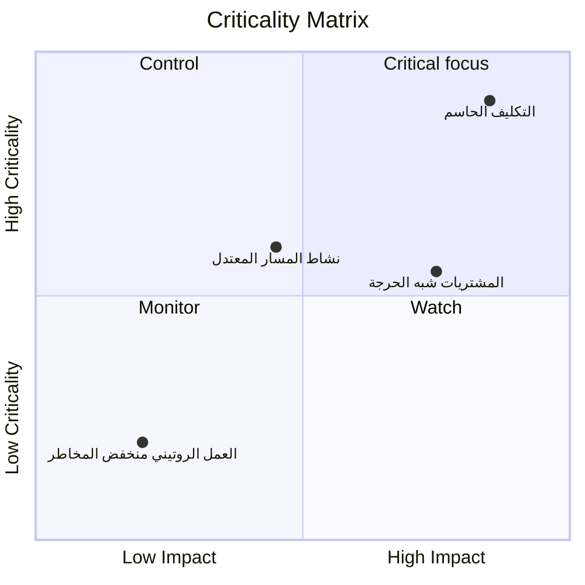

مصفوفة الأهمية هي طريقة مرئية أو تحليلية تستخدم لتصنيف أنشطة المشروع وتحديد أولوياتها بناءً على مدى أهميتها لإنجاز المشروع. في سياق Primavera P6، فهو يساعد مديري المشاريع والمخططين ومراجعي مكتب إدارة المشاريع (PMO) على تحديد الأنشطة التي تسبب أكبر مخاطر الجدول الزمني.

يحكي المسار الحرج القصة الحتمية الحالية للجدول الزمني. مصفوفة الأهمية تذهب إلى أبعد من ذلك. فهو يساعد الفريق على فهم الأنشطة التي تعتبر حرجة بالفعل، والتي تقترب من أن تصبح حرجة، والتي من شأنها أن تسبب تأثيرًا خطيرًا إذا أخطأت.

وهذا مهم لأن النشاط المهم اليوم ليس دائمًا النشاط الوحيد الذي يستحق الاهتمام. قد يصبح النشاط شبه الحرج ذو التأثير المتأخر الكبير مشكلة الغد. قد لا يكون نشاط المشتريات طويل الأجل على المسار الحرج الحالي، ولكنه قد يحمل ما يكفي من المخاطر لتبرير المراقبة الدقيقة.

## ماذا تعني الأهمية في P6

في Primavera P6، تشير الأهمية عادةً إلى ما إذا كان النشاط يمكن أن يؤثر على تاريخ انتهاء المشروع إذا تأخر. تقليديًا، يحدد P6 الأنشطة المهمة باستخدام إعدادات السماحية الزمنية الإجمالي أو المسار الأطول.

التعريف الحتمي المشترك بسيط:

- الأنشطة الحرجة هي الأنشطة ذات السماحية الزمنية الصفري أو السلبي.
- تقع هذه الأنشطة على المسار الحرج أو ترتبط به بشكل وثيق.
- إذا تأخرت، فمن المحتمل أن يتأخر تاريخ انتهاء المشروع.

وهذا التعريف مفيد، ولكنه ليس كاملا. يعتمد على شرط جدول محسوب واحد. وهو لا يفسر بشكل كامل عدم اليقين أو الاحتمالية أو حجم التأثير في حالة انزلاق النشاط.

تعمل مصفوفة الأهمية على توسيع المناقشة من "هل هذا النشاط بالغ الأهمية اليوم؟" إلى "ما مدى احتمالية أن يصبح هذا النشاط حرجًا، وما حجم الضرر الذي يمكن أن يسببه؟"

## ما تجمعه مصفوفة الأهمية

تجمع مصفوفة الأهمية عادة بين بعدين.

البعد الأول هو حساسية الجدول الزمني أو الاحتمالية. يمكن قياس ذلك من خلال عدد المرات التي يصبح فيها النشاط حرجًا أثناء محاكاة مونت كارلو، أو من خلال مدى قربه من المستوى الحرج بناءً على إجمالي السماحية الزمنية أو العتبات القريبة من الحرجة.

البعد الثاني هو التأثير. وهذا يعني شدة التأخير في حالة انزلاق النشاط. قد يعتمد التأثير على مدة النشاط، أو تأثير التأخير على إنهاء المشروع، أو مؤشر الحساسية، أو التعرض للتكلفة، أو تأثير المعالم التعاقدية، أو حكم الإدارة.

تساعد هذه الأبعاد معًا الفريق على تحديد أولويات الأنشطة.

يعتبر هذا النوع من العرض مفيدًا لأنه يفصل الأنشطة التي تظهر فقط في عامل التصفية الحرج عن الأنشطة التي تستحق اهتمام الإدارة النشط.

## بنية مصفوفة بسيطة

يمكن عرض مصفوفة الأهمية الأساسية على شكل شبكة:

| الأهمية / التأثير | تأثير منخفض | تأثير متوسط | تأثير عالي |
| --- | --- | --- | --- |
| حرجة منخفضة | شاشة | شاشة | يشاهد |
| متوسطة الأهمية | مراجعة | يتحكم | أولوية عالية |
| حرجة عالية | يتحكم | أولوية عالية | التركيز النقدي |

يمكن أن تتغير التسميات الدقيقة حسب المؤسسة، ولكن الفكرة تظل كما هي. ويمكن رصد الأنشطة ذات الأهمية المنخفضة والتأثير المنخفض. تتطلب الأنشطة ذات الأهمية العالية والتأثير العالي تحكمًا مركزًا.

## بيانات P6 المستخدمة في المصفوفة

لا يوفر Primavera P6 عادةً طريقة عرض مصفوفة الأهمية المضمنة بشكل افتراضي. يتم إنشاء المصفوفة عادة باستخدام بيانات نشاط P6 مع التحليل الخارجي.

تتضمن حقول P6 المفيدة ما يلي:

- إجمالي السماحية الزمنية.
- السماحية الزمنية مجاني.
- مدة النشاط.
- المدة المتبقية.
- حالة النشاط.
- تواريخ البدء والانتهاء.
- قيود.
- منطق العلاقة.
- تقويم.
- WBS أو رموز النشاط.
- مؤشرات المسار الحرجة أو الأطول.

تعطي هذه البيانات عرض الجدول الزمني الحتمي. فهو يُظهر المسار المحسوب الحالي، والعمل شبه الحرج، والأنشطة المقيدة، والأنشطة ذات التعرض الطويل المتبقي.

## مدخلات تحليل المخاطر

ولجعل المصفوفة أكثر قوة، يمكن للفريق إضافة بيانات مخاطر الجدول الزمني الاحتمالية من تحليل مونت كارلو. قد يأتي هذا من خلال أدوات مثل تحليل المخاطر Primavera أو منصات محاكاة المخاطر الأخرى.

تتضمن مقاييس المخاطر المهمة مؤشر الأهمية، وإجمالي السماحية الزمنية، ومؤشر حساسية الجدول الزمني، والمدة أو قيمة التأثير.

يُظهر مؤشر الأهمية، والذي يطلق عليه غالبًا CI، النسبة المئوية لعمليات المحاكاة التي يظهر فيها النشاط على المسار الحرج. على سبيل المثال، إذا كان نشاط ما CI = 80%، فقد كان حرجًا في 80% من السيناريوهات التي تمت محاكاتها.

يُظهر إجمالي السماحية الزمنية مدى قرب النشاط من التأثير على إنهاء المشروع في الجدول الزمني المحدد. السماحية الزمنية بالقرب من الصفر هو علامة تحذير.

يجمع مؤشر حساسية الجدول الزمني بين الأهمية والتأثير. فهو يساعد في إظهار ليس فقط ما إذا كان النشاط يصبح بالغ الأهمية، ولكن أيضًا ما إذا كان يؤثر بشكل مفيد على النتيجة.

تساعد المدة أو قيمة التأثير في تقدير مدى الخطورة. قد يكون للنشاط الأطول، أو حزمة المشتريات عالية المخاطر، أو المهمة المرتبطة بمرحلة تعاقدية تأثير أكبر إذا تأخرت.

## مثال

خذ بعين الاعتبار مجموعة الأنشطة المبسطة التالية:

| نشاط | يطفو | مؤشر الأهمية | مدة | نتيجة المصفوفة |
| --- | ---: | ---: | ---: | --- |
| أ | 0 أيام | 95% | 20 يوما | التركيز النقدي |
| ب | 5 أيام | 60% | 15 يوما | أولوية عالية |
| ج | 20 يوما | 15% | 10 أيام | شاشة |

النشاط (أ) ينتمي إلى منطقة الأهمية العالية والتأثير العالي. ليس له عوامة، ويبدو حرجًا في معظم عمليات المحاكاة، وله مدة طويلة. إنه يستحق السيطرة المركزة.

قد لا يكون النشاط (ب) عاجلاً مثل النشاط (أ)، لكنه لا يزال يستحق الاهتمام. لديها السماحية الزمنية محدود واحتمال كبير أن تصبح حرجة.

يحتوي النشاط C على نسبة السماحية الزمنية أكبر وأهمية أقل. ولا ينبغي تجاهله، ولكنه لا يتطلب نفس المستوى من التركيز الإداري.

## لماذا هو مفيد

تساعد مصفوفة الأهمية فريق المشروع على تجنب الاعتماد فقط على المسار الحرج الحتمي الفردي. المسار الحتمي مهم، لكنه مجرد وجهة نظر واحدة للجدول الزمني.

المصفوفة تساعد الفرق:

- إعطاء الأولوية لما يجب مراقبته عن كثب.
- تركيز التخفيف على أنشطة المخاطر الرئيسية.
- حدد الأنشطة شبه الحرجة قبل أن تصبح حرجة.
- فهم مخاطر الجدول الزمني الاحتمالي.
- قارن الاحتمالية والتأثير في وجهة نظر واحدة.
- قم بتوصيل مخاطر الجدول الزمني إلى الإدارة بشكل أكثر وضوحًا.

بالنسبة لتقارير مكتب إدارة المشاريع، يعد هذا مفيدًا بشكل خاص لأنه يترجم تعقيد الجدول الزمني إلى إطار عمل للقرار. بدلاً من تقديم مئات الأنشطة، يمكن للفريق إظهار الأنشطة الموجودة في مناطق "التركيز الحاسم" أو "الأولوية العالية" أو "المراقبة" أو "المراقبة".

## طريقة بسيطة لبناء واحدة

ابدأ بتصدير بيانات النشاط من P6. قم بتضمين معرف النشاط، واسم النشاط، وWBS، وإجمالي السماحية الزمنية، والمدة المتبقية، والبدء، والانتهاء، والتقويم، والقيود، ومؤشرات المسار الحرج أو الأطول.

ثم قم بإضافة حقول تحليل المخاطر الاختيارية، مثل مؤشر الأهمية ومؤشر حساسية الجدول. إذا لم تكن بيانات المحاكاة متوفرة، استخدم الحدود العملية بناءً على السماحية الزمنية والمدة. على سبيل المثال، قد تعني الأهمية العالية إجمالي السماحية الزمنية أقل من أو يساوي 0 يومًا، أو CI أعلى من 70%. قد تعني الحرجية المتوسطة السماحية الزمنية شبه الحرج أو CI بين 40% و70%.

تحديد عتبات التأثير. قد يكون النشاط عالي التأثير طويل الأمد، أو مرتبطًا بمرحلة تعاقدية، أو جزءًا من حزمة عالية المخاطر، أو يظهر من خلال المحاكاة للتأثير على إنهاء المشروع.

وأخيرًا، قم بتخطيط الأنشطة في Excel أو Power BI أو أي أداة أخرى لإعداد التقارير. النتيجة لا تحتاج إلى أن تكون معقدة. القيمة تأتي من جعل الأولوية مرئية.

## استخدم الحوكمة

مصفوفة الأهمية هي أداة لدعم القرار، وليست إجابة تلقائية. يجب مراجعة الحدود من قبل فريق ضوابط المشروع وتعديلها وفقًا لنوع المشروع وحساسية العقد والجدول الزمني للنضج.

تذكر أيضًا أن المصفوفة تعتمد على جودة الجدول الزمني. إذا كان جدول P6 يفتقر إلى المنطق، أو فترات غير واقعية، أو قيود صارمة، أو تقويمات سيئة، أو تحديثات حالة ضعيفة، فسوف ترث المصفوفة نقاط الضعف هذه.

أفضل استخدام للمصفوفة هو الجمع بين المخرجات التحليلية وحكم الجدولة الاحترافي.

## خاتمة

تقوم مصفوفة الأهمية بتصنيف أنشطة المشروع حسب مدى احتمال أن تصبح حرجة ومدى التأثير الذي ستحدثه إذا تأخرت. ويستخدم بيانات P6 مثل إجمالي السماحية الزمنية والمدة والقيود والمنطق، ويمكن تعزيزه بنتائج مونت كارلو مثل مؤشر الأهمية ومؤشر حساسية الجدول.

بالنسبة لمديري المشاريع ومراجعي مكتب إدارة المشاريع، تعمل المصفوفة على تحويل مخاطر الجدول الزمني إلى محادثة إدارية أكثر وضوحًا. فهو يساعد الفريق على التركيز على الأنشطة الأكثر أهمية، وليس فقط الأنشطة التي تظهر في عامل التصفية المهم اليوم.

عند استخدامها بشكل جيد، تساعد مصفوفة الأهمية فريق المشروع على الانتقال من إعداد التقارير التفاعلية إلى التحكم الاستباقي في الجدول الزمني.
## محتوى ذو صلة
- [المسار الحرج أو مسار السماحية الزمنية الذي يبدأ بقيد - نظرة عامة](../../metrics/09_cp_or_السماحية الزمنية_path_starting_with_constraint/02_guide_template.md)
- [المسار الحرج](../03_CRITICAL%20PATH/03_CRITICAL%20PATH.md)
- [أنواع الأنشطة في ص6](../05_ACTIVITY%20TYPES%20IN%20P6/05_ACTIVITY%20TYPES%20IN%20P6.md)
