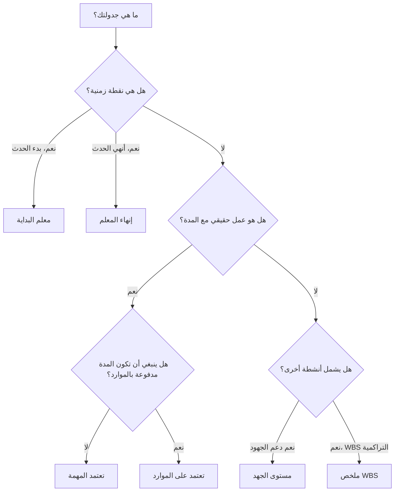

# أنواع الأنشطة في ص6

يعد نوع النشاط أحد أهم مجالات الإعداد في Primavera P6. ويخبر P6 بنوع النشاط الذي يحسبه وكيف يجب أن يتصرف هذا النشاط في الجدول.

يركز العديد من المجدولين أولاً على أسماء الأنشطة ومددها وتواريخها وعلاقاتها. هذه الأمور ضرورية، ولكن نوع النشاط مهم أيضًا. نشاط المهمة، والحدث الرئيسي، ونشاط مستوى الجهد، ونشاط ملخص هيكل تنظيم العمل لا يتصرفون بنفس الطريقة. يمكن أن يؤدي اختيار النوع الخاطئ إلى تشويه التواريخ والتقدم وتحميل الموارد والسماحية الزمنية وإعداد التقارير.

الغرض من هذه المدونة هو شرح أنواع الأنشطة الرئيسية المتوفرة في P6، والغرض من استخدام كل منها، وكيفية تحديد النوع الذي يناسب العمل الذي يتم التخطيط له.

## لماذا يهم نوع النشاط

يجب أن يتطابق نوع النشاط مع غرض جدولة العنصر. هل هو عمل حقيقي مع مدة؟ هل هي نقطة زمنية؟ هل هو ملخص للعمل الذي يمتد إلى أنشطة أخرى؟ هل يعتمد الجهد على الموارد بدلاً من مدة المهمة الثابتة؟

إذا كان نوع النشاط لا يتطابق مع الغرض، فقد يصبح الجدول مربكًا. المعلم ذو المدة ليس علامة فارقة. قد تؤدي المهمة العادية المستخدمة كملخص إلى إخفاء المنطق. يمكن لمستوى نشاط الجهد المستخدم لدفع العمل أن يشوه المسار الحرج. قد يتم حساب النشاط التابع للمورد بشكل غير صحيح بشكل مختلف عن المتوقع.

في P6، يساعد نوع النشاط في الإجابة على سؤال عملي: كيف يجب أن يتصرف هذا العنصر عند حساب الجدول؟

## أنواع الأنشطة الرئيسية في ص6

أنواع أنشطة بريمافيرا P6 الأكثر شيوعًا هي:

- تعتمد المهمة.
- تعتمد على الموارد.
- مستوى الجهد.
- معلم البداية.
- إنهاء المعلم.
- ملخص WBS.

لكل منها غرض مختلف.

## الأنشطة التابعة للمهمة

المهمة التابعة هي نوع النشاط الأكثر شيوعًا في P6. استخدمه للعمل العادي المخطط حيث يتم التحكم في مدة النشاط من خلال التقويم المعين للنشاط، وليس من خلال تقويمات الموارد الفردية.

تشمل الأمثلة ما يلي:

- حفر الأساس.
- قم بتثبيت علبة الكابلات.
- صب بلاطة خرسانية.
- إعداد حزمة التصميم.
- إجراء اختبار الضغط.

عادةً ما تكون الأنشطة التابعة للمهمة هي الخيار الأفضل لمعظم مهام البناء والهندسة والمشتريات والاختبار والتشغيل. فهي واضحة ومستقرة وسهلة الفهم. يحدد المجدول المدة، ويعين تقويم النشاط، ويربط المنطق، ويحسب P6 التواريخ.

استخدم المهمة التابعة عندما يمثل النشاط نطاقًا منفصلاً للعمل ويجب ألا تتغير مدة العمل بناءً على تقويمات الموارد.

## الأنشطة المعتمدة على الموارد

يتم استخدام الأنشطة المعتمدة على الموارد عندما تتأثر المدة وسلوك الجدولة بالموارد المخصصة للنشاط. في هذه الحالة، يمكن لـ P6 استخدام تقويمات الموارد وتوافر الموارد لحساب كيفية جدولة النشاط.

يمكن أن يكون هذا مفيدًا عندما يكون توفر الموارد هو المحرك الحقيقي للعمل. على سبيل المثال، قد يتوفر طاقم متخصص أو مفتش أو مورد معدات فقط في أيام أو مناوبات معينة.

قد تشمل الأمثلة ما يلي:

- التفتيش المتخصص من قبل مفتش محدود.
- الدعم الفني للموردين.
- معايرة المعدات باستخدام مورد نادر.
- أعمال الصيانة المعتمدة على الموارد.

يجب استخدام الأنشطة المعتمدة على الموارد بحذر. إذا لم يكن المشروع محملاً بالموارد بشكل نشط أو على مستوى الموارد، فإن استخدام الموارد المعتمد حسب العادة يمكن أن يؤدي إلى حدوث ارتباك. تستخدم العديد من الجداول الزمنية المهمة التابعة كإعداد افتراضي لأن تقويم النشاط هو أساس الجدولة الرئيسي.

استخدم الموارد المعتمد عندما يكون المقصود من الموارد والتقويمات الخاصة بها التأثير على حساب الجدول.

## معلم البداية

إن حدث البداية هو نشاط ذو مدة صفرية يمثل بداية حدث أو مرحلة أو نافذة وصول أو ترخيص أو حالة عمل رئيسية.

تشمل الأمثلة ما يلي:

- تم تلقي إشعار بالمتابعة.
- تم منح الوصول إلى المنطقة.
- بداية البناء.
- تم إصدار حزمة التصميم للتنفيذ.
- بدء تشغيل النافذة.

لا تمثل معالم البداية العمل الذي يتم تنفيذه. إنها تمثل نقطة زمنية تسمح ببدء العمل أو تشير إلى حدث بداية مهم.

استخدم نقطة البداية عندما يحتاج الجدول إلى تحديد بداية شيء مهم. ويجب أن تكون مرتبطة عادةً بالمنطق الذي يشرح ما الذي يحرك الحدث الرئيسي وما هو العمل الذي يصدره.

## إنهاء المعلم

إنجاز مهم هو نشاط ذو مدة صفرية يمثل إكمال حدث أو مرحلة أو تسليم أو نقطة تعاقدية.

تشمل الأمثلة ما يلي:

- تم تحقيق الانتهاء الميكانيكي.
- اكتمال دوران النظام.
- تم الحصول على الموافقة على التصريح.
- إنجاز كبير.
- الانتهاء النهائي.

تعتبر معالم النهاية مفيدة لإعداد التقارير لأنها تشير إلى الإنجاز. ولا ينبغي استخدامها كأنشطة عمل عادية. إذا كان الجهد مطلوبًا للوصول إلى الحدث الرئيسي، فيجب صياغة هذا الجهد على أنه مهام تؤدي إلى الحدث الرئيسي.

استخدم معلم النهاية عندما يحتاج الجدول إلى الإشارة إلى أن شيئًا ما قد اكتمل أو تم تحقيقه.

## مستوى الجهد

يتم استخدام مستوى الجهد، والذي يطلق عليه غالبًا LOE، للأنشطة التي تمتد إلى أعمال أخرى بدلاً من قيادة المشروع مباشرة. تُستخدم أنشطة LOE بشكل شائع للإدارة أو الإشراف أو دعم التفتيش أو ضوابط المشروع أو التنسيق المستمر.

تشمل الأمثلة ما يلي:

- دعم إدارة المشروع.
- الإشراف على الموقع.
- الإدارة الهندسية.
- إدارة البناء.
- دعم فحص الجودة.

عادةً ما يستمد نشاط LOE تواريخه من أنشطة أخرى. يجب أن يمثل جهد الدعم الذي يستمر أثناء تنفيذ أعمال أخرى. ليس المقصود منه عادةً أن يكون محركًا لمهام البناء أو الهندسة المنفصلة.

استخدم LOE عندما يمثل النشاط الدعم المستمر أو الإشراف أو الإدارة التي يجب أن تشمل مجموعة من الأنشطة.

كن حذرا مع منطق LOE. إذا تم ربط LOE بشكل غير صحيح، فقد يبدو أنه يؤدي إلى تغيير التواريخ أو تشويه السماحية الزمنية. يجب مراجعة أنشطة LOE أثناء فحوصات جودة الجدول الزمني، خاصة عندما تظهر على المسار الحرج أو عندما تكون لها علاقات FS أو SF غير عادية.

## ملخص WBS

تلخص أنشطة ملخص WBS مجموعة من الأنشطة ضمن عنصر WBS. تواريخها مستمدة من الأنشطة ضمن هيكل تقسيم العمل، وليس من المنطق التفصيلي الخاص بها.

تشمل الأمثلة ما يلي:

- ملخص هندسي .
- ملخص المشتريات.
- المنطقة ملخص البناء.
- ملخص تشغيل النظام 01

يمكن أن تكون أنشطة ملخص WBS مفيدة لإعداد التقارير عالية المستوى، ولكن لا ينبغي أن تحل محل الأنشطة الحقيقية أو المنطق. إنها أدوات تراكمية، وليست مهام تنفيذ.

استخدم أنشطة ملخص WBS عندما تحتاج إلى طريقة عرض على مستوى الملخص لقسم WBS، وفقط عندما تدعم طريقة إعداد تقارير المشروع استخدامها.

## اختيار النوع المناسب

قاعدة بسيطة تساعد:

- إذا كان العمل حقيقيًا بمدة، فاستخدم المهمة التابعة ما لم تكن تقويمات الموارد هي التي تدفعه.
- إذا كان توفر الموارد هو الذي يدفعها، فاستخدم "الاعتماد على الموارد".
- إذا كان حدث بداية، فاستخدم معلم البداية.
- إذا كان حدث إكمال، فاستخدم إنهاء الحدث.
- إذا كان الدعم مستمرًا ويمتد إلى أعمال أخرى، فاستخدم "مستوى الجهد".
- إذا كان عبارة عن مجموعة تقارير، فاستخدم ملخص WBS.

يجب أن يجعل نوع النشاط الجدول الزمني أسهل في الفهم. إذا احتاج المراجعون إلى التساؤل عن سبب وجود مدة للحدث الرئيسي، أو لماذا يقود LOE العمل، أو لماذا يظهر ملخص WBS في منطق تفصيلي، فقد يكون نوع النشاط خاطئًا.

## الأخطاء الشائعة

أحد الأخطاء الشائعة هو استخدام المعالم كبديل للعمل. يجب أن يمثل المعلم نقطة زمنية. إذا كان العمل مطلوبًا، قم بإنشاء أنشطة للعمل.

خطأ آخر هو استخدام أنشطة LOE للتحكم في العمل المنفصل. ينبغي أن يدعم LOE العمل أو يمتد إليه، وليس أن يحل محل المنطق بين الأنشطة الحقيقية.

الخطأ الثالث هو استخدام الموارد المعتمد دون عملية جدولة تعتمد على الموارد. إذا لم تتم صيانة تقاويم الموارد، فقد يؤدي نوع النشاط إلى حدوث ارتباك أكثر من القيمة.

وأخيرًا، تجنب استخدام أنشطة ملخص هيكل تنظيم العمل (WBS) كبديل لهيكل تقسيم العمل (WBS) جيد البناء والمنطق التفصيلي. تعتبر الملخصات مفيدة لإعداد التقارير، لكن الجدول لا يزال يحتاج إلى أنشطة حقيقية أسفله.

## خاتمة

تحدد أنواع الأنشطة في P6 كيفية تصرف الأنشطة. فهي ليست مجرد تسميات. يساعد نوع النشاط الصحيح الجدول على الحساب بشكل صحيح والتواصل بوضوح.

تمثل الأنشطة التابعة للمهمة معظم الأعمال العادية. تكون الأنشطة المعتمدة على الموارد مفيدة عندما يجب أن تتحكم تقويمات الموارد في الجدولة. تحدد معالم البداية والنهاية النقاط الرئيسية في الوقت المناسب. تمثل أنشطة مستوى الجهد الدعم الذي يمتد إلى أعمال أخرى. تدعم أنشطة ملخص WBS إعداد التقارير المجمعة.

إن اختيار نوع النشاط المناسب يجعل الجدول الزمني أسهل في المراجعة والشرح وأكثر موثوقية بالنسبة لضوابط المشروع. الجدول الزمني القوي لا يحتوي فقط على تواريخ ومنطق جيدين. كما أنه يستخدم النوع المناسب من النشاط للعمل الذي يتم تمثيله.
## محتوى ذو صلة
- [الأنشطة التي تبدأ في تاريخ البيانات بدون المنطق المحرك: لماذا يهم مقياس الجدول هذا - نظرة عامة](../../metrics/01_activities_starting_in_dd_with_no_logic_driving/02_guide_template.md)
- [مصفوفة الأهمية](../04_CRITICALITY%20MATRIX/04_CRITICALITY%20MATRIX.md)
- [أنواع المدة في P6](../06_DURATION%20TYPES%20IN%20P6/06_DURATION%20TYPES%20IN%20P6.md)
