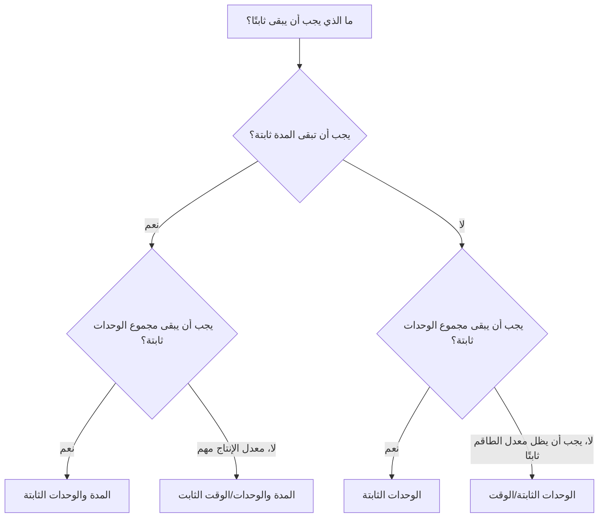

# أنواع المدة في P6

نوع المدة هو أحد الحقول في Primavera P6 الذي يتحكم في كيفية تصرف النشاط عندما تتغير المدة والوحدات وإنتاجية الموارد. من السهل التغاضي عن ذلك، ولكن يمكن أن يؤثر على تواريخ الجدولة وتحميل الموارد والتنبؤات بالتكلفة والقيمة المكتسبة وسلوك التحديث.

يفكر العديد من المجدولين في المدة كعدد من الأيام فقط. في P6، المدة هي أكثر من رقم. يمكن أن يحتوي النشاط أيضًا على وحدات عمل، ووحدات غير عمالية، ووحدات لكل وقت، وتقويمات الموارد، وتقويمات النشاط، والعمل المتبقي. يخبر نوع المدة P6 بما يجب أن يظل ثابتًا عند إعادة حساب الجدول أو عندما يقوم المجدول بتغيير الموارد والمدد.

تشرح هذه المدونة أنواع المدة الرئيسية المتاحة للأنشطة في P6، وكيفية اختلافها، والغرض من استخدام كل منها، ومتى يتم استخدام واحدة بدلاً من الأخرى.

## نوع المدة ليس هو نفسه حقل المدة

قبل النظر إلى الأنواع، من المفيد الفصل بين فكرتين.

حقول المدة هي قيم مثل المدة الأصلية، المدة المتبقية، المدة الفعلية، ومدة الإكمال. هذه تصف الوقت.

نوع المدة هو إعداد حسابي. ويخبر P6 كيفية الموازنة بين المدة وإجمالي الوحدات والوحدات في كل مرة عندما يتغير شيء ما.

على سبيل المثال، إذا قمت بإضافة المزيد من الموارد إلى نشاط ما، فهل يجب أن ينتهي النشاط مبكرًا؟ أم يجب أن تبقى المدة كما هي ويزداد إجمالي الجهد؟ الجواب يعتمد على نوع المدة.

## أنواع المدة الرئيسية

أنواع مدة P6 الشائعة هي:

- المدة والوحدات الثابتة.
- المدة والوحدات/الوقت الثابت.
- الوحدات الثابتة.
- الوحدات الثابتة/الوقت.

يمكن أن تبدو الأسماء تقنية في البداية، ولكن كل واحد منها يجيب على سؤال عملي: أي جزء من النشاط يجب أن يحميه P6 عندما يتغير شيء ما؟

## المدة والوحدات الثابتة

المدة والوحدات الثابتة تحافظ على مدة النشاط وإجمالي الوحدات ثابتة. إذا تغيرت الوحدات لكل وقت، يقوم P6 بضبط المعدل بدلاً من تغيير المدة أو الجهد الإجمالي.

يكون هذا النوع مفيدًا عندما يكون المقصود من النافذة الزمنية المخططة والجهد الإجمالي أن يظلا مستقرين.

مثال:

يتم التخطيط للنشاط لمدة 10 أيام بـ 400 ساعة عمل. يريد فريق الجدول أن تظل المدة 10 أيام وأن يظل إجمالي الجهد المدرج في الموازنة 400 ساعة. إذا تغيرت تفاصيل تعيين الموارد، فيجب ألا يتم نقل المدة المخططة وإجمالي الوحدات تلقائيًا.

استخدم المدة والوحدات الثابتة عندما:

- النشاط له نافذة عمل ثابتة.
- تم الاتفاق بالفعل على إجمالي الجهد.
- يجب ألا تؤدي تغييرات معدل الموارد إلى تغيير مدة النشاط تلقائيًا.
- يتم استخدام الجدول الزمني للتكلفة الثابتة أو التحكم في القيمة المكتسبة.

غالبًا ما يكون هذا مفيدًا لحزم العمل المُدارة حيث يتم التحكم في كل من مدة الجدول الزمني والجهد المدرج في الميزانية.

## المدة والوحدات/الوقت الثابت

المدة الثابتة والوحدات/الوقت تحافظ على المدة ومعدل الموارد ثابتًا. إذا تمت إضافة الموارد أو إزالتها، فيمكن لـ P6 تعديل إجمالي الوحدات.

يكون هذا النوع مفيدًا عندما يجب أن يحدث النشاط خلال فترة زمنية محددة ويجب أن يظل معدل تحميل الموارد ثابتًا.

مثال:

يستمر نشاط دعم إدارة المشروع لمدة 20 يومًا. يقوم الفريق بتعيين مهندس مشروع واحد بمعدل 8 ساعات يوميًا. يجب أن تظل المدة 20 يومًا، ويجب أن يظل المعدل اليومي 8 ساعات يوميًا. إجمالي الوحدات هو نتيجة النافذة الزمنية والمعدل.

استخدم المدة والوحدات/الوقت الثابت عندما:

- مدة النشاط ثابتة.
- معدل الموارد اليومي أو بالساعة مهم.
- ينبغي حساب إجمالي الوحدات من المدة والمعدل.
- يمثل النشاط دعمًا مستمرًا أو فترة عمل ثابتة.

يمكن أن يكون ذلك مفيدًا للإشراف أو الإدارة أو دعم التفتيش أو أنشطة الدعم المستندة إلى الوقت.

## الوحدات الثابتة

الوحدات الثابتة تحافظ على إجمالي الوحدات ثابتة. إذا تغير معدل الموارد، فيمكن لـ P6 ضبط المدة.

يكون هذا النوع مفيدًا عندما يكون حجم العمل ثابتًا، لكن المدة تعتمد على الإنتاجية أو توفر الموارد.

مثال:

يتطلب النشاط 800 ساعة عمل. إذا قام الفريق بتعيين سعة أكبر للطاقم، فقد ينتهي النشاط عاجلاً. إذا كانت سعة الطاقم أقل، فقد يستغرق النشاط وقتًا أطول. يبقى إجمالي العمل 800 ساعة.

استخدم الوحدات الثابتة عندما:

- كمية العمل أو الجهد الإجمالي ثابتة.
- يجب أن تستجيب المدة لتوافر الموارد أو الإنتاجية.
- يمكن أن يغير حجم الطاقم الوقت اللازم لإكمال النشاط.
- تخطيط الموارد نشط ويتم الحفاظ عليه.

يمكن أن يكون هذا مفيدًا للعمل بأسلوب الإنتاج حيث يكون إجمالي الجهد معروفًا ومن المتوقع أن تستجيب المدة لتحميل الطاقم.

## الوحدات الثابتة/الوقت

الوحدات الثابتة/الوقت يحافظ على معدل الموارد ثابتًا. إذا تغيرت المدة، يتغير معها إجمالي الوحدات.

يكون هذا النوع مفيدًا عندما يعمل الطاقم أو الموارد بمعدل ثابت طوال مدة استمرار النشاط.

مثال:

يستخدم نشاط الإشراف على الموقع مشرفًا واحدًا بمعدل 8 ساعات يوميًا. إذا زادت مدة النشاط من 10 أيام إلى 15 يوما يجب زيادة إجمالي الوحدات لأن المشرف يحتاج إلى أيام أكثر. يبقى المعدل اليومي ثابتا.

استخدم الوحدات الثابتة/الوقت عندما:

- تم إصلاح معدل الطاقم أو الموارد.
- يجب أن يزيد إجمالي الوحدات أو ينقص عندما تتغير المدة.
- يمثل النشاط جهدًا يعتمد على الوقت.
- يتم تعيين الموارد لمدة النشاط الكاملة.

غالبًا ما يكون هذا مفيدًا لأنشطة الدعم والإشراف والتفتيش والإدارة حيث يحرك الوقت الجهد الإجمالي.

## كيفية اختيار نوع المدة المناسبة

يعتمد أفضل نوع مدة على ما يمثله النشاط وكيف يتوقع فريق التحكم في المشروع أن يقوم P6 بحساب التغييرات.

طريقة بسيطة للاختيار هي أن تسأل:

- هل المدة محددة بالخطة أو العقد أو النافذة أو الوصول؟
- هل الجهد الإجمالي ثابت بالكمية أو الميزانية أو التقدير؟
- هل يتم تحديد معدل الموارد من خلال خطة الطاقم أو خطة التوظيف؟
- هل يجب أن يؤدي إضافة الموارد إلى تقصير النشاط؟
- هل يجب أن يؤدي توسيع النشاط إلى زيادة إجمالي الوحدات؟

إذا كان يجب أن تظل المدة وإجمالي الوحدات ثابتة، فاستخدم المدة والوحدات الثابتة.

إذا ظلت المدة ومعدل الإنتاج ثابتين، فاستخدم المدة الثابتة والوحدات/الوقت.

إذا كان يجب أن يظل إجمالي العمل ثابتًا ويجب أن تستجيب المدة لتحميل الموارد، فاستخدم الوحدات الثابتة.

إذا كان يجب أن يظل معدل الموارد ثابتًا ويجب أن تتغير الوحدات مع المدة، فاستخدم الوحدات/الوقت الثابت.

## أمثلة عملية

بالنسبة لصب الخرسانة المخطط له كعملية ثابتة مدتها يوم واحد مع طاقم محدد وميزانية تكلفة، قد تكون المدة والوحدات الثابتة مناسبة.

بالنسبة لدعم إدارة المشروع المعين بمعدل يومي ثابت عبر فترة إعداد تقارير ثابتة، قد تكون المدة الثابتة والوحدات/الوقت أو الوحدات الثابتة/الوقت مناسبة اعتمادًا على ما إذا كان إجمالي الوحدات أو تغييرات المدة يجب أن تقود التوقعات.

بالنسبة لنشاط التثبيت مع كمية إجمالية معروفة من العمل حيث يؤثر حجم الطاقم على وقت الانتهاء، قد تكون الوحدات الثابتة مناسبة.

بالنسبة للإشراف على الموقع الذي يستمر طالما امتدت فترة البناء، قد تكون الوحدات / الوقت الثابت مناسبة.

النقطة المهمة هي أن الاختيار يجب أن يعكس طريقة التحكم في المشروع، وليس العادة.

## الأخطاء الشائعة

أحد الأخطاء الشائعة هو ترك نوع المدة الافتراضي في كل نشاط دون التحقق مما إذا كان يطابق غرض النشاط.

هناك خطأ آخر يتمثل في استخدام سلوك المدة المستند إلى الموارد عندما لا يحتفظ المشروع بتعيينات الموارد بعناية. إذا كانت بيانات الموارد ضعيفة، فقد تؤدي الحسابات المستندة إلى الموارد إلى نتائج غير موثوقة.

الخطأ الثالث هو تغيير الفترات أثناء التحديثات دون فهم كيفية قيام P6 بإعادة حساب الوحدات أو المعدلات. يمكن أن يؤثر ذلك على تحميل التكاليف، والقيمة المكتسبة، والمخططات التكرارية للموارد.

وأخيرًا، تجنب التعامل مع نوع المدة كإعداد تقني بحت. إنه يؤثر على كيفية تصرف الجدول عندما تتغير الخطة.

## نوع المدة ونوعية الجدول الزمني

يعد نوع المدة جزءًا من جودة الجدول الزمني لأنه يؤثر على ما إذا كانت التوقعات قابلة للتصديق أم لا. إذا لم تتصرف مدة النشاط ووحداته ومعدل الموارد كما هو متوقع، فقد يعرض الجدول تواريخ مضللة أو طلبًا على الموارد.

بالنسبة لمراجعات مكتب إدارة المشاريع، من المفيد التحقق مما إذا كانت أنواع المدة متسقة عبر مجموعات الأنشطة المماثلة. قد تتطلب الأنشطة الهندسية وأنشطة الشراء وأنشطة البناء وأنشطة LOE وأنشطة الدعم قواعد مختلفة، ولكن يجب أن تكون الاختيارات مقصودة.

إذا كان الجدول محملاً بالموارد، يصبح نوع المدة أكثر أهمية. فهو يساعد في تحديد ما إذا كانت تغييرات الموارد تؤثر على المدة أو إجمالي الوحدات أو الوحدات في كل مرة.

## خاتمة

تحدد أنواع المدة في P6 كيفية استجابة الأنشطة عندما تتغير المدة وإجمالي الوحدات ومعدلات الموارد. فهي ليست مجرد إعدادات الخلفية.

المدة والوحدات الثابتة تحمي الوقت والجهد الإجمالي. المدة الثابتة والوحدات/الوقت تحمي الوقت والمعدل. الوحدات الثابتة تحمي الجهد الإجمالي. الوحدات الثابتة/الوقت يحمي معدل الموارد.

يساعد اختيار نوع المدة المناسب في حساب الجدول بطريقة تتوافق مع خطة المشروع. كما أنه يجعل تحميل الموارد وتحديثات التقدم وتوقعات التكلفة وتقارير الجدول الزمني أسهل للفهم والدفاع عنها.
## محتوى ذو صلة
- [الأنشطة التي تبدأ في تاريخ البيانات بدون المنطق المحرك: لماذا يهم مقياس الجدول هذا - نظرة عامة](../../metrics/01_activities_starting_in_dd_with_no_logic_driving/02_guide_template.md)
- [أنواع الأنشطة في ص6](../05_ACTIVITY%20TYPES%20IN%20P6/05_ACTIVITY%20TYPES%20IN%20P6.md)
- [التواريخ في ص6](../07_DATES%20IN%20P6/07_DATES%20IN%20P6.md)
