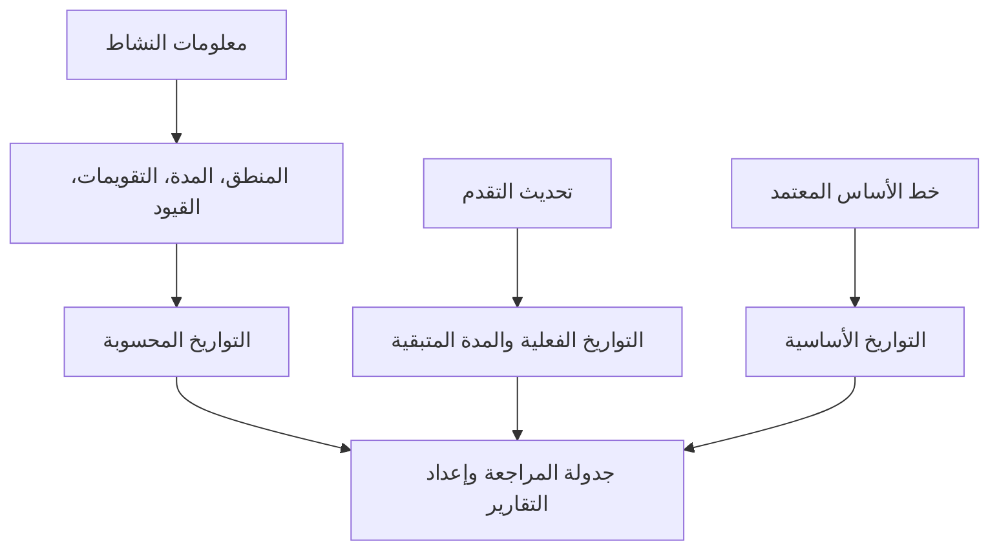

# التواريخ في ص6

يمكن أن تكون التواريخ في Primavera P6 مربكة لأن النشاط لا يحتوي على تاريخ بدء واحد وتاريخ انتهاء واحد فقط. يمكن أن تحتوي على تواريخ مخططة، وتواريخ جدولة حالية، وتواريخ مبكرة، وتواريخ متأخرة، وتواريخ فعلية، وتواريخ أساسية، وتواريخ قيد، وتواريخ متوقعة، وأحيانًا تواريخ خارجية أو تواريخ مرتبطة بالتنبؤ اعتمادًا على التخطيط وإعدادات المشروع.

هذه التواريخ لا تعني جميعها نفس الشيء. يتم حساب بعضها بواسطة منطق CPM. يتم إدخال بعضها أثناء تحديثات التقدم. يتم استخدام بعضها للمقارنة. يتم استخدام بعضها للتحكم في الجدول الزمني أو الحد منه. يعد فهم الفرق أمرًا ضروريًا لجودة الجدول الزمني، وإعداد تقارير مكتب إدارة المشاريع، والاستعداد لتحليل التأخير، والتحكم الأساسي في المشروع.

السؤال الأهم بسيط: ما الذي يخبرني به هذا التاريخ، ومن أين أتى؟

## لماذا يحتوي P6 على الكثير من التواريخ

P6 ليست مجرد قائمة تاريخ. إنه نموذج حسابي. يقوم البرنامج بحساب التواريخ من فترات النشاط والتقويمات والعلاقات والقيود والموارد وحالة التقدم وتاريخ البيانات.

توجد حقول تاريخ مختلفة لأن المخططين بحاجة إلى الإجابة على أسئلة مختلفة:

- ما هي الخطة الأصلية؟
- ما هي التوقعات الحالية؟
- ماذا حدث فعلا؟
- ما هو أقرب وقت يمكن أن يبدأ فيه النشاط أو ينتهي؟
- ما هو آخر ما يمكن البدء به أو الانتهاء منه دون التأثير على المشروع؟
- هل القيد يجبر النشاط؟
- كيف يمكن مقارنة الخطة الحالية مع خط الأساس؟

تبدأ المشكلة عندما يتم خلط أنواع التاريخ هذه معًا دون فهم الغرض منها.

## تاريخ البيانات

تاريخ البيانات ليس تاريخ نشاط، ولكنه يتحكم في كيفية تفسير جميع تواريخ النشاط.

تاريخ البيانات هو الحد الفاصل بين الأداء الفعلي والعمل المتوقع. يجب أن يتم تفعيل العمل قبل تاريخ البيانات أو تحديد حالته. يجب توقع العمل بعد تاريخ البيانات.

إذا كان للنشاط تواريخ فعلية بعد تاريخ البيانات، فهذا عادةً ما يكون خطأ في الحالة. إذا بدأ نشاط مفتوح تمامًا في تاريخ البيانات دون أي منطق قيادة، فقد يشير ذلك إلى فقدان التسلسل. إذا كان الانتهاء المتوقع قبل تاريخ البيانات، فقد يشير ذلك إلى معلومات تحديث قديمة.

قبل مراجعة أي تاريخ للنشاط، قم بتأكيد تاريخ البيانات.

## البدء والانتهاء

البدء والانتهاء هما تواريخ الجدول الرئيسية التي يراها معظم المستخدمين في تخطيطات P6. وهي تمثل التواريخ الحالية المحسوبة أو المجدولة للنشاط بناءً على بيانات الجدول.

بالنسبة للأنشطة التي لم تبدأ، فإن تاريخي البدء والانتهاء هما تاريخان متوقعان. بالنسبة للأنشطة قيد التنفيذ، فقد تجمع بين الحالة الفعلية والتوقعات المتبقية. بالنسبة للأنشطة المكتملة، يجب أن تتماشى مع التواريخ الفعلية.

هذه هي عادةً التواريخ المستخدمة في التقارير وجداول البحث المسبق ومناقشات الإدارة. ومع ذلك، لا ينبغي قبولها دون التحقق من المنطق والحالة الكامنة وراءها.

استخدم البدء والانتهاء للإجابة: متى تتم جدولة النشاط حاليًا لبدء وانتهاء؟

## البداية المبكرة والانتهاء المبكر

البداية المبكرة والانتهاء المبكر هما تواريخ حساب CPM. وهي تعرض التواريخ الأولى التي يمكن أن يبدأ فيها النشاط وينتهي بناءً على المنطق السابق والتقويمات والقيود ومصطلحات الجدول الزمني الحالية.

تعتبر التواريخ المبكرة مهمة لأنها تساعد في شرح التقدم الأمامي لحساب الجدول. وهي توضح كيف يمكن أن يتحرك العمل عبر الشبكة بمجرد أن يسمح المنطق بذلك.

إذا كانت العديد من الأنشطة لها بداية مبكرة في تاريخ البيانات، فيجب على المراجع التحقق مما إذا كانت جاهزة حقًا أو ما إذا كانت بدايات مفتوحة، أو أنشطة مقيدة، أو أنشطة مرتبطة بشكل ضعيف.

استخدم "البدء المبكر" و"الانتهاء المبكر" للإجابة: ما هو أقرب وقت يمكن أن يحدث فيه هذا النشاط وفقًا للشبكة الحالية؟

## البداية المتأخرة والانتهاء المتأخر

يعرض البدء المتأخر والانتهاء المتأخر آخر التواريخ التي يمكن أن يبدأ فيها النشاط أو ينتهي دون تأخير انتهاء المشروع أو نقطة النهاية المتحكمة، اعتمادًا على إعداد الجدول الزمني.

التواريخ المتأخرة هي جزء من الالتمرير الخلفية. يتم استخدامها لحساب السماحية الزمنية. يساعد الفرق بين التواريخ المبكرة والمتأخرة في إظهار مدى مرونة النشاط.

إذا بدت التواريخ المتأخرة غريبة، فابحث عن القيود أو اللاحقات المفقودة أو التشطيبات المفتوحة أو التقويمات أو إعدادات إنهاء المشروع غير العادية.

استخدم البداية المتأخرة والانتهاء المتأخر للإجابة: إلى أي مدى يمكن أن يتحرك هذا النشاط قبل أن يؤثر على تاريخ الانتهاء المتحكم فيه؟

## البداية الفعلية والانتهاء الفعلي

البداية الفعلية والانتهاء الفعلي هما حقائق الحالة. وينبغي أن تمثل ما حدث بالفعل في الميدان أو في تنفيذ المشروع.

البداية الفعلية تعني أن النشاط قد بدأ بالفعل. "الانتهاء الفعلي" يعني أن النشاط قد اكتمل بالفعل. لا ينبغي استخدام هذه التواريخ كأهداف تخطيط أو تواريخ تنبؤ.

يجب أن تكون التواريخ الفعلية في العادة في تاريخ البيانات أو قبله. إذا كانت التواريخ الفعلية بعد تاريخ البيانات، فإن الجدول يقوم بالإبلاغ عن العمل المستقبلي على أنه بدأ أو اكتمل بالفعل، مما يضعف مصداقية التحديث.

استخدم البداية الفعلية والانتهاء الفعلي للإجابة: ما الذي حدث بالفعل؟

## البداية المخططة والانتهاء المخطط لها

غالبًا ما يتم إساءة فهم البداية المخططة والانتهاء المخطط لها. اعتمادًا على كيفية إنشاء الجدول وتحديثه وعرضه، قد لا تعمل هذه الحقول كخط أساس رسمي معتمد.

يتوقع بعض المستخدمين أن تُظهر التواريخ المخططة الخطة الأصلية إلى الأبد. وهذا ليس دائما افتراضا آمنا. بالنسبة لتقارير الانحراف الرسمية، عادةً ما يكون خط الأساس المعين أكثر موثوقية من الاعتماد بشكل عرضي على التواريخ المخططة.

استخدم البداية المخططة والانتهاء المخطط له فقط عندما يحدد إجراء التحكم في مشروعك بوضوح كيفية صيانتهما وما يعنيه.

## بداية خط الأساس ونهاية خط الأساس

تأتي التواريخ الأساسية من جدول أساسي معين. يتم استخدامها لمقارنة الجدول الحالي بالخطة المعتمدة.

على سبيل المثال، قد يُظهر بداية BL1 ونهاية BL1 تواريخ بدء النشاط وانتهائه من خط الأساس المعتمد. تعرض البداية والنهاية الحالية أحدث التوقعات. والفرق بينهما يدل على الانحراف.

تعد التواريخ الأساسية أمرًا أساسيًا في إعداد تقارير الأداء وتباين الجدول الزمني والتحكم في التغيير وإعداد تحليل التأخير.

استخدم بداية خط الأساس ونهاية خط الأساس للإجابة: كيف يمكن مقارنة الجدول الحالي بالخطة المعتمدة؟

## تاريخ القيد

يتم فرض تواريخ القيد على ضوابط التاريخ. وهي متصلة بأنواع القيود مثل البدء عند أو البدء أو بعد أو الانتهاء عند أو الانتهاء عند أو قبل أو البدء الإلزامي أو الانتهاء الإلزامي.

القيود ليست خاطئة تلقائيًا. يمثل بعضها تواريخ العقود الحقيقية، أو قيود الوصول، أو إصدارات التصاريح، أو فترات انقطاع الخدمة، أو متطلبات المالك. ولكن يمكن للقيود أيضًا إخفاء المنطق المفقود أو فرض تواريخ غير واقعية.

القيود الصعبة، وخاصة البداية الإلزامية والانتهاء الإلزامي، يجب أن تكون نادرة وموثقة.

استخدم تاريخ القيد للإجابة: هل التاريخ المفروض يتحكم في هذا النشاط أو يحد منه؟

## تواريخ الانتهاء المتوقعة ونوع التنبؤ

غالبًا ما يتم استخدام "الانتهاء المتوقع" أثناء التحديثات لالتقاط الوقت الذي يتوقع فيه فريق المشروع انتهاء النشاط. اعتمادًا على الإعدادات والإجراءات، يمكن أن تؤثر التواريخ المتوقعة على كيفية قيام P6 بحساب تواريخ النشاط أو عرضها.

يمكن أن يكون الانتهاء المتوقع مفيدًا للعمل الجاري عندما توفر الفرق الميدانية توقعًا واقعيًا للإنهاء. ولكن إذا لم تتم صيانتها، فقد تصبح قديمة. يعد الانتهاء المتوقع قبل تاريخ البيانات علامة تحذير شائعة.

تستخدم بعض المشاريع أيضًا حقول التاريخ المرتبطة بالتنبؤ أو الحقول المعرفة من قبل المستخدم لإعداد التقارير. والمفتاح هو تحديدها بوضوح حتى يعرف الفريق ما إذا كانت محسوبة أو تم إدخالها يدويًا أو تم استيرادها.

استخدم التواريخ المتوقعة أو المتوقعة للإجابة: ما هي أحدث توقعات الفريق، وهل يتم التحكم فيها من خلال إجراء تحديث محدد؟

## تواريخ القيد الابتدائية والثانوية

يمكن أن يحتوي P6 على أكثر من شرط قيد واحد على النشاط، اعتمادًا على حقول القيد المحددة. عادة ما يكون القيد الأساسي هو القيد الرئيسي الموضح في التخطيطات القياسية، ولكن القيد الثانوي يمكن أن يؤثر أيضًا على التفسير.

أثناء مراجعة الجدول الزمني، لا تنظر فقط إلى البداية والنهاية. أضف حقول نوع القيد وتاريخ القيد إلى التخطيط. إذا كانت التواريخ لا تعمل كما هو متوقع، فإن القيود هي أول الأشياء التي يجب التحقق منها.

## ما هي التواريخ التي يجب عليك استخدامها؟

استخدم كل تاريخ لغرضه:

- استخدم البدء والانتهاء لتنبؤ الجدول الزمني الحالي.
- استخدم التواريخ المبكرة والمتأخرة لفهم حساب CPM والسماحية الزمنية.
- استخدم التواريخ الفعلية للعمل المكتمل أو الذي بدأ.
- استخدم تواريخ الأساس للتباين مقابل الخطة المعتمدة.
- استخدم تواريخ القيد لتحديد ضوابط التاريخ المفروضة.
- استخدم حقول "الانتهاء المتوقع" أو "التنبؤ" فقط عندما يحددها إجراء التحديث.
- استخدم تاريخ البيانات لفصل الأداء الفعلي عن العمل المتوقع.

## الأخطاء الشائعة

أحد الأخطاء الشائعة هو مقارنة التواريخ الخاطئة. على سبيل المثال، قد لا تكون مقارنة البداية الحالية بالبدء المخطط لها ذات معنى إذا لم يتم التحكم في التواريخ المخططة بواسطة إجراء المشروع.

خطأ آخر هو التعامل مع البداية الفعلية كتنبؤ. يجب أن تمثل التواريخ الفعلية الأداء الحقيقي، وليس النية.

الخطأ الثالث هو تجاهل الوقت من اليوم. يقوم P6 بتخزين التواريخ مع الوقت، ويمكن أن تؤدي اختلافات التقويم إلى حدوث مناوبات واضحة ليوم واحد أو مفاجآت ذو سماحية زمنيةة.

وأخيرًا، تجنب إخفاء تواريخ القيود. إذا تم فرض تاريخ، يحتاج المراجعون إلى رؤيته.

## خاتمة

تعتبر التواريخ الموجودة في P6 قوية لأنها تحكي أجزاء مختلفة من قصة الجدول الزمني. التواريخ الحالية تظهر التوقعات. توضح التواريخ المبكرة والمتأخرة حساب CPM. التواريخ الفعلية تسجل ما حدث. التواريخ الأساسية تدعم المقارنة. تكشف تواريخ القيد عن الضوابط المفروضة. يمكن أن تدعم التواريخ المتوقعة التحديثات عند صيانتها بشكل صحيح.

المراجعة القوية للجدول الزمني لا تسأل فقط "ما هو التاريخ؟" ويتساءل "ما نوع هذا التاريخ، ومن أين أتى، وهل هو موثوق؟"

عندما يفهم فريق المشروع معنى كل حقل تاريخ، يصبح الجدول أسهل في الشرح، وأسهل في التدقيق، وأكثر موثوقية للتحكم في المشروع.
## محتوى ذو صلة
- [التواريخ الفعلية متأخرة عن تاريخ البيانات في برنامج Primavera P6 - نظرة عامة](../../04_metrics_ar/12_actual_date_greater_than_data_date/01_overview_template.md)
- [أنواع المدة في P6](../06_DURATION%20TYPES%20IN%20P6/06_DURATION%20TYPES%20IN%20P6.md)
- [التقويمات ص6](../08_CALENDARS%20IN%20P6/08_CALENDARS%20IN%20P6.md)
