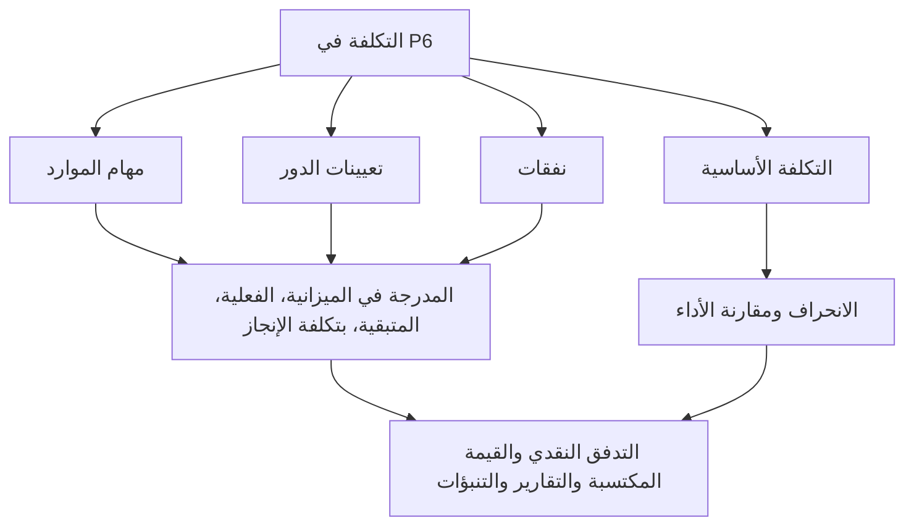

# أين تعيش التكلفة في P6

التكلفة في بريمافيرا P6 يمكن أن تعيش في عدة أماكن. وهذا أمر مفيد، ولكنه قد يكون مربكًا أيضًا. قد يُظهر الجدول التكلفة المدرجة في الموازنة، والتكلفة الفعلية، والتكلفة المتبقية، وتكلفة الإكمال، وتكلفة الموارد، وتكلفة الدور، وتكلفة المصروفات، وحقول القيمة المكتسبة، وتكلفة الأساس. هذه القيم مترابطة، لكنها لا تعني جميعها نفس الشيء.

بالنسبة لفرق مراقبة المشروع، فإن السؤال الرئيسي ليس فقط "ما هي التكلفة؟" والسؤال الأفضل هو: من أين تأتي هذه التكلفة، وماذا تمثل، وكيف ينبغي استخدامها؟

تشرح هذه المدونة الأنواع الرئيسية للتكاليف المتوفرة في P6، والاختلافات بينها، ومتى يكون كل منها مفيدًا.

## لماذا يهم موقع التكلفة

تعد P6 في المقام الأول أداة جدولة، ولكنها يمكنها أيضًا دعم الجداول الزمنية المحمّلة بالتكلفة والقيمة المكتسبة والتدفق النقدي وإعداد التقارير المتوقعة. للقيام بذلك بشكل صحيح، يجب وضع التكلفة في الجزء الصحيح من نموذج الجدول الزمني.

إذا تم إدخال تكلفة العمالة كمصروف، فقد لا تحكي الرسوم البيانية للموارد القصة الصحيحة. إذا تم إدخال التكلفة الفعلية يدويًا ولكن المشروع يتوقع أن تأتي من القيم الفعلية للموارد، فقد تصبح التقارير غير متناسقة. إذا كانت تكلفة الأساس مفقودة، فإن تباين الجدول الزمني وتقارير تباين التكلفة تفقد السياق.

موقع التكلفة مهم لأن مصدر التكلفة يؤثر على كيفية تجميعها وتحديثاتها وتوقعاتها وتقاريرها.

## تكاليف الموارد

تأتي تكاليف الموارد من الموارد المخصصة للأنشطة. قد يمثل الموارد العمالة أو المعدات أو فئة موارد أخرى. يمكن أن يحتوي كل مورد على الأسعار والوحدات وحسابات التكلفة.

على سبيل المثال، إذا كان النشاط يستخدم طاقم تركيب الأنابيب لمدة 80 ساعة بمعدل محدد للساعة، فيمكن لـ P6 حساب تكلفة العمالة من الوحدات والمعدل المعين.

تكون تكاليف الموارد مفيدة عندما يريد المشروع ربط أنشطة الجدول الزمني بالعمالة والمعدات والإنتاجية والمخططات البيانية للموارد.

استخدم تكاليف الموارد عندما:

- الطلب على العمالة أو المعدات أمر مهم.
- هناك حاجة إلى الرسوم البيانية الموارد.
- التكلفة مرتبطة بالساعات أو الوحدات.
- القيمة المكتسبة أو التقدم يعتمد على الموارد.
- يتم استخدام الجدول الزمني لتخطيط الموارد.

الخطر الرئيسي هو الصيانة. تتطلب الجداول الزمنية المحملة بالموارد الانضباط. إذا لم يتم الاحتفاظ بالوحدات أو الأسعار أو التقويمات أو القيم الفعلية، فلن تكون تقارير التكلفة موثوقة.

## تكاليف الدور

الأدوار هي وظائف وظيفية عامة، مثل مهندس أو كهربائي أو مخطط أو مفتش أو مشغل رافعة. في P6، يمكن تعيين الأدوار للأنشطة قبل معرفة الموارد المسماة.

يمكن أن تدعم تكاليف الدور التخطيط المبكر عندما يعرف الفريق نوع الموارد المطلوب ولكن ليس الشخص أو الطاقم المحدد.

على سبيل المثال، أثناء التخطيط الهندسي المبكر، قد يحتاج النشاط إلى 120 ساعة من وقت "المهندس الأول". ربما لم يتم تعيين الشخص المحدد بعد، ولكن يمكن أن يوفر الدور معدل التخطيط وتقدير التكلفة.

استخدم تكاليف الدور عندما:

- الجدول الزمني لا يزال في التخطيط.
- لم يتم تأكيد الموارد المسماة بعد.
- يريد المشروع تقديرًا عالي المستوى للموارد أو التكلفة.
- سيتم استبدال الأدوار لاحقًا بالموارد الفعلية.

تعتبر تكاليف الدور مفيدة للتخطيط في المراحل المبكرة، ولكن يجب مراجعتها مع نضوج المشروع. إذا ظلت الأدوار بعد معرفة الموارد الفعلية، فقد يصبح الجدول عامًا جدًا بحيث لا يمكن التحكم فيه بشكل تفصيلي.

## تكاليف النفقات

النفقات هي تكاليف غير الموارد المخصصة مباشرة للأنشطة. وهي مفيدة للتكاليف التي لا يتم تمثيلها بشكل أفضل من خلال موارد العمالة أو المعدات.

تشمل الأمثلة ما يلي:

- تصاريح.
- يسافر.
- المبالغ المقطوعة للموردين.
- حزم المقاولين من الباطن.
- المواد المشتراة بمبلغ ثابت.
- رسوم الاختبار.
- رسوم التعبئة.

يمكن إدراج تكاليف النفقات في الميزانية، أو الفعلية، أو المتبقية، أو عند الاكتمال اعتمادًا على كيفية تتبع المشروع لها.

استخدم النفقات عندما:

- لا يتم تحديد التكلفة حسب ساعات الموارد.
- التكلفة هي بند ثابت أو مبلغ مقطوع.
- يحتاج النشاط إلى تكلفة مباشرة غير الموارد.
- يريد المشروع التدفق النقدي للعناصر غير العمالية.

ويكمن الخطر في أن النفقات يمكن أن تصبح أرضًا ملقاة. إذا تم إدخال جميع التكاليف كمصروفات، فقد يفقد الجدول القدرة على شرح العمالة والمعدات والإنتاجية بشكل منفصل.

## التكلفة المدرجة في الميزانية

التكلفة المدرجة في الميزانية هي التكلفة المخططة المخصصة للنشاط. وقد يأتي ذلك من تعيينات الموارد، أو تعيينات الأدوار، أو النفقات، أو مزيج من هذه.

تعتبر التكلفة المدرجة في الميزانية مهمة لأنها تمثل خطة التكلفة قبل التنفيذ. وهو يدعم التدفق النقدي وتكلفة الأساس وإعداد القيمة المكتسبة وإعداد تقارير التحكم في المشروع.

استخدم التكلفة المدرجة في الميزانية للإجابة: ما هي التكلفة المخططة لهذا النشاط؟

إذا كانت التكلفة المدرجة في الموازنة مفقودة أو غير متسقة، فقد يستمر الجدول في حساب التواريخ، لكنه لا يمكنه دعم التقارير المحمّلة بالتكلفة ذات المغزى.

## التكلفة الفعلية

تمثل التكلفة الفعلية التكلفة المتكبدة بالفعل. اعتمادًا على إعداد المشروع، يمكن حساب التكلفة الفعلية من وحدات الموارد الفعلية وأسعارها، أو إدخالها يدويًا، أو استيرادها من الجداول الزمنية، أو تحميلها من نظام تكلفة خارجي.

التكلفة الفعلية مهمة لإعداد التقارير المرحلية والقيمة المكتسبة. ويبين ما تم إنفاقه أو تسجيله حتى الآن.

استخدم التكلفة الفعلية للإجابة: ما هي التكلفة التي تم تكبدها أو تسجيلها بالفعل؟

الخطر هو خلط المصادر. إذا تم استيراد بعض التكاليف الفعلية من المحاسبة وتم إدخال البعض الآخر يدويًا في P6، فسيحتاج الفريق إلى قاعدة واضحة لتجنب الازدواجية أو الثغرات.

## التكلفة المتبقية

التكلفة المتبقية هي التكلفة المتوقعة التي لا تزال مطلوبة لإكمال النشاط. ويرتبط بالوحدات المتبقية ومعدلات الموارد والنفقات المتبقية وافتراضات التحديث.

التكلفة المتبقية هي أحد أهم مجالات التنبؤ. فهو يخبر فريق المشروع بمقدار التكلفة المتبقية من تاريخ البيانات الحالي فصاعدًا.

استخدم التكلفة المتبقية للإجابة: ما هي التكلفة المتوقعة؟

إذا تم تحديث المدة المتبقية ولكن لم يتم تحديث التكلفة المتبقية، فقد تصبح التوقعات غير متسقة. وينطبق الشيء نفسه عندما لا يتم الاحتفاظ بوحدات الموارد أو القيم المتبقية للمصروفات.

## بتكلفة الإنجاز

بتكلفة الإنجاز هي التكلفة الإجمالية المتوقعة للنشاط بعد دمج التكلفة الفعلية والمتبقية.

بعبارات بسيطة:

التكلفة الفعلية + التكلفة المتبقية = تكلفة الإنجاز

عند تكلفة الإكمال يساعد على إظهار ما إذا كان من المتوقع أن ينتهي النشاط بما يتجاوز الميزانية المحددة أو أقل منها أو وفقًا لها.

استخدم عند تكلفة الإكمال للإجابة: ما هي أحدث تكلفة إجمالية متوقعة؟

## التكلفة الأساسية

تأتي تكلفة الأساس من جدول أساسي معين. يتم استخدامه لمقارنة قيم التكلفة الحالية مقابل الخطة المعتمدة.

التكلفة الأساسية مهمة لتقارير الانحراف. بدون خط الأساس، قد يعرف المشروع تكلفة التنبؤ الحالية ولكن ليس ما إذا كان هذا التنبؤ أفضل أو أسوأ من الخطة المعتمدة.

استخدم التكلفة الأساسية للإجابة: كيف يمكن مقارنة التكلفة الحالية بخطة التكلفة المعتمدة؟

تعتبر التكلفة الأساسية مهمة بشكل خاص عند استخدام P6 للقيمة المكتسبة أو تقارير مكتب إدارة المشاريع الرسمية.

## حقول تكلفة القيمة المكتسبة

يمكن أن يدعم P6 حقول القيمة المكتسبة مثل القيمة المخططة، والقيمة المكتسبة، والتكلفة الفعلية، وتباين التكلفة، وتباين الجدول الزمني، اعتمادًا على إعداد المشروع.

تستخدم القيمة المكتسبة معلومات الجدول المحمّلة بالتكلفة لمقارنة العمل المخطط والعمل المكتسب والتكلفة الفعلية.

تكون هذه الحقول مفيدة عندما يكون للمشروع عملية رسمية للقيمة المكتسبة. وهي تتطلب خطوط أساس متسقة، وقواعد التقدم، وطرق نسبة الاكتمال، وتحميل التكاليف.

استخدم حقول تكلفة القيمة المكتسبة عندما:

- يتطلب المشروع إعداد تقارير EV.
- يتم تحديد قواعد التقدم.
- تمت الموافقة على التكلفة الأساسية.
- يتم التحكم في مصدر التكلفة الفعلية.
- يتم الحفاظ على تقدم النشاط باستمرار.

وبدون هذه الضوابط، يمكن أن تبدو مخرجات القيمة المكتسبة دقيقة في حين أنها غير موثوقة.

## ما هو نوع التكلفة الذي يجب عليك استخدامه؟

استخدم تكاليف الموارد للعمالة والمعدات التي ينبغي أن تدعم تخطيط الموارد والإنتاجية والرسوم البيانية.

استخدم تكاليف الدور للتخطيط المبكر عندما تكون الموارد المسماة غير معروفة بعد.

استخدم تكاليف المصروفات للتكاليف المباشرة غير المتعلقة بالموارد، أو المبالغ المقطوعة، أو عناصر البائعين، أو التصاريح، أو السفر، أو حزم العقود من الباطن.

استخدم حقول تكلفة الموازنة، الفعلية، المتبقية، وتكلفة الاكتمال لفهم دورة حياة التكلفة الموزعة على الوقت.

استخدم التكلفة الأساسية للمقارنة بالخطة المعتمدة.

استخدم حقول القيمة المكتسبة عندما يتمتع المشروع بالحوكمة اللازمة لدعم إعداد تقارير EV.

## المشاكل الشائعة

إحدى المشاكل الشائعة هي ازدواجية التكلفة. يمكن إدخال نفس تكلفة المقاول من الباطن كتكلفة مورد ومرة ​​أخرى كمصروف.

مشكلة أخرى هي فقدان التكلفة الفعلية. قد يحتوي الجدول على ميزانية وتكلفة متبقية، ولكن التكلفة الفعلية قد تعيش في نظام محاسبي منفصل ولا تصل أبدًا إلى P6.

المشكلة الثالثة هي استخدام النفقات في كل شيء. يمكن أن ينتج عن ذلك تكلفة إجمالية ولكن رؤية ضعيفة للموارد.

وهناك مشكلة أخرى وهي التقدم غير المتسق. إذا لم تتم محاذاة النسبة المئوية للاكتمال والمدة المتبقية والتكلفة المتبقية، تصبح تكلفة الاكتمال غير موثوقة.

## الممارسة الجيدة

حدد استراتيجية التكلفة قبل تحميل الجدول. قرر أين ستعيش العمالة والمعدات والمواد والمقاولين من الباطن والتكاليف غير المباشرة.

استخدم حسابات التكلفة وأكواد الأنشطة والموارد والأدوار وفئات النفقات المتسقة.

قم بتوثيق ما إذا كان سيتم إدخال التكاليف الفعلية في P6 أو استيرادها أو الإبلاغ عنها من نظام آخر.

قم بمراجعة حقول التكلفة أثناء كل دورة تحديث. يجب أن تحكي الميزانية، والتكلفة الفعلية، والمتبقية، وتكلفة الإنجاز قصة متماسكة.

## خاتمة

يمكن أن توجد التكلفة في P6 في حقول الموارد والأدوار والنفقات والأساسات والقيمة المكتسبة. كل مكان له غرض مختلف.

تربط تكاليف الموارد التكلفة بالعمالة والمعدات. تكاليف الدور تدعم التخطيط المبكر. تلتقط تكاليف النفقات العناصر المباشرة غير المتعلقة بالموارد. تُظهِر تكاليف الموازنة والفعلية والمتبقية وتكاليف الإكمال دورة حياة التكلفة. تدعم حقول القيمة الأساسية والمكتسبة تقارير المقارنة والأداء.

لا يتم إنشاء جدول زمني قوي ومحمّل بالتكلفة عن طريق وضع الأرقام في أي مكان يناسبها. تم تصميمه من خلال تحديد مكان كل نوع من التكلفة والحفاظ على هذا الهيكل خلال كل دورة تحديث.
## محتوى ذو صلة
- [الأنشطة التي تبدأ في تاريخ البيانات بدون المنطق المحرك: لماذا يهم مقياس الجدول هذا - نظرة عامة](../../04_metrics_ar/01_activities_starting_in_dd_with_no_logic_driving/01_overview_template.md)
- [النسبة المئوية للأنواع الكاملة في P6](../10_PERCENT%20COMPLETION%20TYPES%20IN%20P6/10_PERCENT%20COMPLETION%20TYPES%20IN%20P6.md)
- [أنواع الموارد في ص6](../12_RESOURCE%20TYPES%20IN%20P6/12_RESOURCE%20TYPES%20IN%20P6.md)
