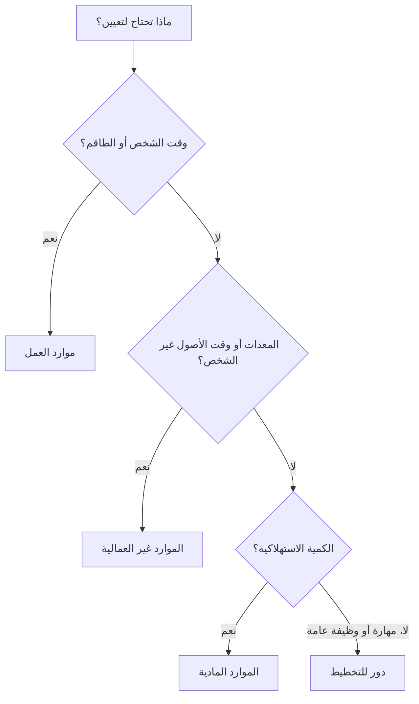

تمثل الموارد في Primavera P6 الأشخاص والمعدات والمواد اللازمة لتنفيذ العمل. إنهم يربطون الجدول الزمني بالقدرة والإنتاجية والتكلفة والطلب على الموارد بمرور الوقت.

يمكن أن يوجد الجدول الزمني بدون موارد، ولكن الجدول الزمني المحمل بالموارد يمنح فريق المشروع رؤية أعمق. يمكنه إظهار الرسوم البيانية للعمالة، والطلب على المعدات، واستخدام المواد، ومنحنيات التكلفة، وقيود الموارد، والأحمال الزائدة المحتملة. لجعل هذه المعلومات مفيدة، يجب على المجدول فهم أنواع الموارد المختلفة المتوفرة في P6 ومتى يتم استخدام كل منها.

أنواع الموارد الرئيسية في P6 هي:

- تَعَب.
- غير العمل.
- مادة.

يستخدم P6 أيضًا الأدوار، التي ليست تمامًا مثل الموارد ولكنها مرتبطة ارتباطًا وثيقًا ومفيدة جدًا أثناء التخطيط.

## لماذا يهم نوع الموارد؟

يؤثر نوع الموارد على كيفية تعامل P6 مع الوحدات والأسعار والتكاليف والتقويمات والتقارير.

يتصرف مورد العمل بشكل مختلف عن الموارد المادي. لا ينبغي التعامل مع الرافعة بنفس طريقة التعامل مع حجم الخرسانة. إن دور المهندس العام ليس هو نفسه دور مورد مهندس مسمى. إذا تم خلط أنواع الموارد بشكل غير صحيح، فقد تصبح الرسوم البيانية وتقارير التكلفة ومراجعات الإنتاجية ومخرجات القيمة المكتسبة مضللة.

يجيب نوع الموارد على سؤال عملي: ما نوع الشيء الذي تم تخصيصه للنشاط؟

## موارد العمل

تمثل موارد العمل الأشخاص أو أطقم العمل. يتم قياسها عادةً بالساعات أو الأيام أو وحدات أخرى تعتمد على الوقت. يمكن أن تحتوي موارد العمل على الأسعار والتقويمات وحدود التوفر وقيم التكلفة.

تشمل الأمثلة ما يلي:

- مخطط.
- طاقم مدني.
- كهربائي.
- طاقم اللحام.
- مهندس.
- مفتش.
- فني التكليف.

استخدم موارد العمل عندما يحتاج الجدول إلى إظهار الجهد البشري أو طلب الطاقم. تعتبر موارد العمل مفيدة للرسوم البيانية للقوى العاملة، وخطط التوظيف، وتحليل الإنتاجية، والتنبؤ بتكلفة العمالة.

على سبيل المثال، قد يتطلب نشاط يسمى "تثبيت علبة الكابلات" 4 كهربائيين لمدة 5 أيام. يتيح تعيين موارد العمل للجدول إظهار الطلب على الكهربائيين خلال تلك الفترة.

تعتبر موارد العمل مفيدة أيضًا عندما يحتاج المشروع إلى مقارنة ساعات العمل المخططة مقابل ساعات العمل الفعلية.

## الموارد غير العمالية

تمثل الموارد غير المتعلقة بالعمل المعدات أو الأصول غير الشخصية الأخرى القابلة لإعادة الاستخدام. وعادة ما تعتمد على الوقت، مثل العمل، ولكنها ليست موارد بشرية.

تشمل الأمثلة ما يلي:

- رافعة.
- حفارة.
- ماكينة لحام .
- معدات الاختبار.
- معدات طاقم السقالات.
- مجموعة أدوات متخصصة.
- مولد.

استخدم الموارد غير المتعلقة بالعمل عندما يكون توفر المعدات مهمًا أو عندما يجب تتبع تكلفة المعدات بمرور الوقت.

على سبيل المثال، إذا كانت عملية رفع ثقيلة تتطلب رافعة لمدة يومين، فإن تعيين مورد رافعة غير عمالية يساعد فريق المشروع على رؤية الطلب على الرافعة، وتجنب التعارضات، والتنبؤ بتكلفة المعدات.

تعد الموارد غير المتعلقة بالعمل مهمة عندما تكون المعدات نادرة، أو باهظة الثمن، أو مشتركة بين مناطق العمل، أو عندما تكون محركًا لتسلسل العمل.

## الموارد المادية

تمثل الموارد المادية العناصر الاستهلاكية. وعادة ما يتم قياسها بالكميات وليس بالوقت.

تشمل الأمثلة ما يلي:

- متر مكعب من الخرسانة.
- طن الصلب .
- عدادات الكابلات.
- مكبات الأنابيب.
- الصمامات.
- لتر طلاء.
- لوحات.

استخدم موارد المواد عندما يحتاج الجدول إلى تعقب الاستهلاك المستند إلى الكمية أو التكلفة المتعلقة بالمواد.

يمكن أن تدعم موارد المواد منحنيات المواد وتتبع الكمية وتحميل التكاليف. وهي مفيدة بشكل خاص عندما يكون الجدول متصلاً بالكميات المثبتة أو القيمة المكتسبة بناءً على الكميات.

على سبيل المثال، قد يتضمن النشاط تركيب كابل بطول 500 متر. يساعد تعيين الكابل كمورد مادي الفريق على تتبع الكمية المثبتة المخطط لها والفعلية بمرور الوقت.

لا ينبغي استخدام الموارد المادية لتمثيل ساعات العمل أو وقت المعدات. أنها تخدم غرضا مختلفا.

## الأدوار

الأدوار هي وظائف وظيفية عامة أو فئات مهارات. وهي ليست مثل الموارد، ولكنها تساعد أثناء التخطيط قبل معرفة الموارد المسماة.

تشمل الأمثلة ما يلي:

- مهندس كبير.
- مشرف كهرباء.
- مفتش مدني.
- مجدول.
- التقديم الزمني التكليف.
- مشغل رافعة.

تعتبر الأدوار مفيدة في التخطيط المبكر لأن المشروع قد يعرف نوع المهارة المطلوبة دون معرفة من سيقوم بالعمل بالضبط.

على سبيل المثال، قد يحتاج النشاط الهندسي إلى 80 ساعة من جهد "مهندس كهربائي أول". وفي وقت لاحق، يمكن استبدال هذا الدور أو استكماله بمورد مسمى.

استخدم الأدوار عندما:

- التخطيط لا يزال على مستوى عال.
- لم يتم تأكيد الموارد المسماة.
- هناك حاجة إلى الطلب على الموارد حسب نوع المهارة.
- تريد المنظمة توقعات التوظيف المبكرة.

يجب مراجعة الأدوار مع نضوج المشروع. إذا كان الجدول يتطلب تحكمًا تفصيليًا، فقد يلزم استبدال الأدوار بموارد فعلية.

## تقاويم الموارد

يمكن أن تحتوي الموارد على تقويمات. وهذا مهم لأن توفر الموارد قد يختلف عن توفر النشاط.

على سبيل المثال، قد يستخدم نشاط البناء تقويم نشاط مدته 6 أيام، ولكن قد يكون متخصص البائع المعين متاحًا فقط من الاثنين إلى الجمعة. إذا كان النشاط يعتمد على الموارد أو تم استخدام تسوية الموارد، فيمكن أن يؤثر تقويم الموارد على الجدول.

غالبًا ما تحتاج الموارد العمالية وغير العمالية إلى تقويمات لأن الأشخاص والمعدات متوفرة فقط في أوقات معينة. عادة ما تتصرف الموارد المادية بشكل مختلف لأنها تمثل الكميات وليس وقت العمل.

عندما تبدو تواريخ الموارد غريبة، تحقق من تقويم النشاط وتقويم الموارد.

## تكاليف الموارد

يمكن أن تحمل الموارد معدلات التكلفة. غالبًا ما تستخدم موارد العمل والموارد غير العمالية المعدلات المستندة إلى الوقت. غالبًا ما تستخدم الموارد المادية معدلات الوحدة.

على سبيل المثال:

- كهربائي: التكلفة في الساعة.
- الرافعة: التكلفة لكل ساعة أو يوم.
- الخرسانة: تكلفة المتر المكعب.

عندما يتم تعيين الموارد للأنشطة، يمكن لـ P6 حساب تكلفة الميزانية والفعلية والمتبقية وتكلفة الإكمال.

يعد هذا مفيدًا للجداول المحمّلة بالتكلفة وتقارير القيمة المكتسبة وتنبؤات الموارد وتحليل التدفق النقدي. ولكنها تعمل بشكل جيد فقط عند الحفاظ على الوحدات والأسعار والتقويمات وتحديثات التقدم.

## اختيار نوع الموارد المناسب

استخدم العمالة عندما يكون الموارد شخصًا أو طاقمًا أو جهدًا بشريًا.

استخدم مورد غير عمالي عندما يكون الموارد عبارة عن معدات أو أصل قابل لإعادة الاستخدام ويكون وقته مهمًا.

استخدم المادة عندما يكون الموارد كمية قابلة للاستهلاك.

استخدم الأدوار عند التخطيط حسب المهارة أو الوظيفة قبل معرفة الموارد المسماة.

يجب أن يعكس الاختيار كيف يريد المشروع تخطيط العمل وقياسه والإبلاغ عنه.

## الأخطاء الشائعة

أحد الأخطاء الشائعة هو استخدام موارد العمل في كل شيء. وهذا يمكن أن يجعل تحميل التكاليف أسهل في البداية، ولكنه يقلل من الوضوح عندما تكون المعدات أو كميات المواد مهمة.

هناك خطأ آخر يتمثل في استخدام الموارد المادية لعناصر تمثل في الواقع نفقات أو مبالغ مقطوعة للتعاقد من الباطن. إذا كان المشروع لا يحتاج إلى تتبع الكمية، فقد تكون النفقات أكثر ملاءمة.

الخطأ الثالث هو تخصيص الموارد دون الحفاظ على الوحدات الفعلية. يكون الجدول المحمل بالموارد مفيدًا فقط إذا كانت تحديثات التقدم تحافظ على تحديث بيانات الموارد.

هناك مشكلة أخرى وهي الخلط بين الأدوار والموارد. تعد الأدوار مفيدة للتخطيط، لكن الموارد المسماة تكون أفضل عندما تكون المهام التفصيلية والتقويمات والحقائق الفعلية مهمة.

## الممارسة الجيدة

حدد استراتيجية الموارد قبل تحميل الجدول.

حدد العمل الذي سيستخدم موارد العمل، والعمل الذي سيستخدم موارد غير العمالة، والمواد التي تحتاج إلى تعقب الكمية، وأين يجب استخدام النفقات بدلاً من ذلك.

استخدم اصطلاحات التسمية ورموز الموارد المتسقة. حافظ على قاموس الموارد نظيفًا. تجنب الموارد المكررة بأسماء مختلفة قليلاً.

قم بمراجعة تعيينات الموارد أثناء كل دورة تحديث. يجب أن تظل الوحدات والتكاليف والتقويمات والقيم الفعلية متوافقة مع عملية التحكم في المشروع.

## خاتمة

تساعد أنواع الموارد في P6 في تحديد ما هو مطلوب لأداء العمل. تمثل موارد العمل الأشخاص والطواقم. تمثل الموارد غير المتعلقة بالعمل المعدات والأصول القابلة لإعادة الاستخدام. تمثل الموارد المادية الكميات القابلة للاستهلاك. تدعم الأدوار التخطيط حسب المهارة أو الوظيفة قبل معرفة الموارد المحددة.

يؤدي اختيار نوع الموارد المناسب إلى تسهيل تحليل الجدول الزمني. فهو يعمل على تحسين الرسوم البيانية للعمالة، وتخطيط المعدات، وتتبع المواد، وتحميل التكاليف، والقيمة المكتسبة، وإعداد التقارير المتوقعة.

إن الجدول الزمني الجيد المحمّل بالموارد ليس مجرد جدول يتضمن موارد مرفقة. إنه جدول يتم فيه استخدام كل نوع من أنواع الموارد بشكل مقصود ويتم الحفاظ عليه طوال عمر المشروع.
## محتوى ذو صلة
- [بدأت الأنشطة بتقدم 0% في برنامج بريمافيرا P6 - نظرة عامة](../../metrics/13_activity_started_progress_zero/02_guide_template.md)
- [أين تعيش التكلفة في P6](../11_WHERE%20THE%20COST%20LIVE%20IN%20P6/11_WHERE%20THE%20COST%20LIVE%20IN%20P6.md)
- [حدود الموارد في P6](../13_RESOURCES%20LIMITS%20IN%20P6/13_RESOURCES%20LIMITS%20IN%20P6.md)
