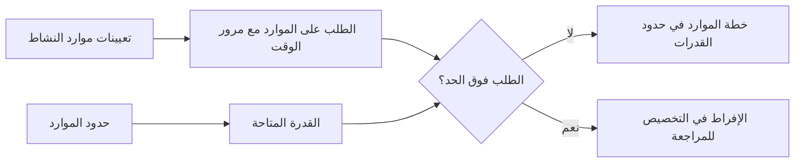

# حدود الموارد في P6

تحدد حدود الموارد في Primavera P6 مقدار الموارد المتاح خلال فترة زمنية ما. يتم استخدامها لمقارنة الطلب على الموارد الناتج عن تعيينات النشاط مع القدرة التي يتمتع بها المشروع بالفعل.

بعبارات بسيطة، يجيب حد الموارد على السؤال: ما مقدار هذا الموارد الذي يمكن للمشروع استخدامه؟

إذا كان الجدول ينص على أن طاقمًا واحدًا يجب أن يعمل على خمسة أنشطة في نفس الوقت، فيمكن لـ P6 إظهار الطلب. ولكن بدون حد للموارد، لا يمكن للجدول الزمني أن يوضح بوضوح ما إذا كان هذا الطلب واقعيًا. الحد هو ما يسمح للمخطط برؤية الأحمال الزائدة، ومشكلات السعة، ومشكلات الجدول الزمني المحتملة المستندة إلى الموارد.

## ما هي حدود الموارد

حد الموارد هو الحد الأقصى لتوافر الموارد. ويمكن تعريفها على أنها وحدات لكل فترة زمنية، مثل الساعات في اليوم، أو الساعات في الأسبوع، أو عدد الوحدات المتاحة خلال فترة العمل.

على سبيل المثال:

- مخطط واحد متاح 8 ساعات يوميا.
- ثلاثة كهربائيين متاحين 24 ساعة عمل يوميا.
- رافعة واحدة متاحة 8 ساعات عمل في اليوم.
- يتوفر مفتشان 16 ساعة عمل يوميًا.

عندما يتم تحميل الأنشطة بالموارد، يقوم P6 بحساب الطلب على الموارد الناتج عن تلك التعيينات. يوفر حد الموارد خط القدرة الذي تتم مقارنة الطلب به.

## لماذا تعتبر حدود الموارد مهمة؟

تعد حدود الموارد مهمة لأن الجداول الزمنية غالبًا ما تكون ممكنة من الناحية الفنية ولكنها مستحيلة من الناحية العملية.

قد تحسب الشبكة المنطقية أن العديد من الأنشطة يمكن أن تحدث بالتوازي. قد تبدو التواريخ مقبولة. قد يبدو المسار الحرج معقولاً. ولكن إذا كانت جميع هذه الأنشطة تتطلب نفس الطاقم أو المتخصص أو المعدات المحدودة، فقد لا تكون الخطة قابلة للتنفيذ.

تساعد حدود الموارد في كشف هذا الاختلاف بين الجدول المحسوب والجدول الزمني للتسليم.

وهي مفيدة ل:

- تحديد طواقم العمل الزائدة.
- التحقق من الطلب على المعدات.
- دعم الرسوم البيانية الموارد.
- مراجعة خطط القوى العاملة.
- إعداد موازنة الموارد.
- شرح سبب عدم إمكانية بدء بعض الأعمال حتى لو كان المنطق يسمح بذلك.
- اختبار ما إذا كانت الخطة تتوافق مع السعة المتاحة.

في ضوابط المشروع، يكون هذا ذا قيمة خاصة عند استخدام الجدول الزمني للتوظيف أو دعم المشتريات أو تخطيط البناء أو إعداد تقارير القيمة المكتسبة.

## حدود موارد العمل

تحدد حدود العمل عدد الأشخاص أو ساعات العمل المتاحة.

على سبيل المثال، إذا كان المشروع به 10 كهربائيين يعملون 8 ساعات يوميًا، فقد يكون حد العمل اليومي 80 ساعة يوميًا. إذا كان الطلب في الجدول الزمني يظهر 120 ساعة عمل للكهربائيين في نفس اليوم، فإن الجدول يطلب عددًا أكبر من الكهربائيين مقارنة بالمشروع.

هذا لا يعني تلقائيا أن الجدول الزمني خاطئ. وهذا يعني أن المخطط يجب أن يراجع الخطة. قد يكون الحل هو إضافة أطقم، أو تغيير التسلسل، أو نقل العمل غير الحرج، أو استخدام العمل الإضافي، أو قبول ذروة مؤقتة إذا كانت واقعية وتمت الموافقة عليها.

تكون حدود موارد العمل مفيدة عندما يكون توفر القوى العاملة عائقًا حقيقيًا. وتكون أقل فائدة عندما لا يتم الحفاظ على الجدول الزمني على مستوى التفاصيل اللازمة لدعم التحكم في الموارد.

## حدود الموارد غير العمالية

تنطبق الحدود غير المتعلقة بالعمالة على المعدات والأصول الأخرى القابلة لإعادة الاستخدام.

تشمل الأمثلة الرافعات أو الحفارات أو معدات الاختبار أو الأدوات المتخصصة أو المولدات أو المرافق المؤقتة. في حالة توفر رافعة واحدة فقط، لا يمكن تنفيذ جميع الأنشطة التي تتطلب نفس الرافعة في نفس الوقت ما لم تتم إضافة رافعة أخرى أو إعادة ترتيب العمل.

هذا هو المكان الذي يمكن أن تكون فيه حدود الموارد عملية للغاية. غالبًا ما تكون المعدات عائقًا حقيقيًا، خاصة عندما تكون باهظة الثمن، أو مشتركة بين المناطق، أو يصعب تعبئتها، أو مطلوبة للعمل الحيوي.

على سبيل المثال، قد يكون كل من المصاعد الثقيلة جاهزًا بشكل منطقي. ولكن إذا كان كلاهما بحاجة إلى نفس الرافعة، فيمكن أن يُظهر حد الموارد أن الخطة تتجاوز السعة المتاحة.

## الموارد المادية والحدود

تتصرف الموارد المادية بشكل مختلف عن الموارد العمالية وغير العمالية. وهي تمثل عادةً الكميات، وليس التوفر اليومي لوقت العمل.

قد يُظهر تعيين المواد حجم الخرسانة المخطط له، أو طول الكابل، أو حمولة الفولاذ، أو الكمية المثبتة. قد لا يزال المشروع يعاني من قيود مادية، ولكن غالبًا ما تتم إدارتها من خلال تواريخ الشراء أو مراحل التسليم أو تتبع المخزون أو القيود في الجدول الزمني بدلاً من نفس النوع من حدود توفر الموارد اليومية المستخدمة للأشخاص أو المعدات.

هذا لا يعني أن المواد غير مهمة. وهذا يعني أن المخطط يجب أن يكون حذرًا بشأن ما يفترض أن يمثله الحد.

إذا كانت المشكلة تتعلق بالقدرة الإنتاجية، مثل الحد الأقصى للمتر المكعب من الخرسانة الذي يمكن وضعه يوميًا، فقد يكون نموذج الموارد أو الإنتاج مفيدًا. إذا كانت المشكلة هي ما إذا كانت المادة قد وصلت، فقد تكون الروابط المنطقية أو معالم الشراء أكثر وضوحًا.

## كيف يستخدم P6 الحدود

يمكن لـ P6 استخدام حدود الموارد في ملفات تعريف الموارد وجداول البيانات والرسوم البيانية وتحليل الموارد. يمكن إظهار الطلب من تعيينات النشاط مقابل الحد المتاح.

عند استخدام موازنة الموارد، قد يستخدم P6 أيضًا توفر الموارد لتأخير الأنشطة بحيث يظل الطلب ضمن الحدود، اعتمادًا على إعدادات التسوية.

وهذا أمر قوي، ولكن يجب التعامل معه بعناية. يمكن لموازنة الموارد تغيير تواريخ التنبؤ. إذا لم يتم الحفاظ على الحدود والتقويمات والأولويات ومنطق النشاط بشكل جيد، فقد تبدو النتيجة المستوية رياضية ولكنها ليست عملية.

ولذلك يجب أن تكون حدود الموارد جزءًا من عملية جدولة يتم التحكم فيها، وليس زرًا يتم الضغط عليه في نهاية التحديث.

## متى يتم استخدام حدود الموارد

استخدم حدود الموارد عندما تكون الموارد محدودة بالفعل ويكون الجدول عبارة عن مورد محمل بجودة كافية لدعم التحليل.

تشمل حالات الاستخدام الجيد ما يلي:

- مشروع ذو عدد محدد من الطواقم.
- الرافعات المشتركة أو المعدات المتخصصة.
- متخصصون محدودون في الهندسة أو التكليف.
- عمليات الإغلاق والتحولات والانقطاعات.
- خطط البناء حيث يجب السيطرة على ذروة القوى العاملة.
- البرامج التي يدعم فيها نفس تجمع الموارد مشاريع متعددة.

تعتبر حدود الموارد مفيدة أيضًا أثناء تحليل ماذا لو. يمكن للمخطط اختبار ما إذا كانت الخطة الحالية تعمل مع السعة المتاحة أو ما إذا كانت هناك حاجة إلى أطقم إضافية أو العمل الإضافي أو إعادة التسلسل.

## متى يجب توخي الحذر

كن حذرًا عندما تكون بيانات الموارد غير كاملة أو رمزية.

إذا تمت إضافة الموارد فقط لتحميل التكاليف، فقد لا تمثل الوحدات التوفر الحقيقي. إذا تم تعيين كل العمل لموارد عامة، فقد يكون الرسم البياني واسعًا جدًا بحيث لا يدعم القرارات الحقيقية. إذا لم يتم تحديث الوحدات الفعلية، فقد تنحرف خطة الموارد بسرعة عن الواقع.

كن حذرًا أيضًا مع الحدود المصطنعة. قد يؤدي الحد المنخفض جدًا إلى حدوث تأخيرات غير ضرورية أثناء التسوية. قد يؤدي الحد المرتفع جدًا إلى إخفاء مشاكل القدرة الحقيقية.

يجب أن يتطابق الحد مع سؤال التخطيط الحقيقي. هل نقوم باختبار التوفر الفعلي للطاقم، أو التوظيف المدرج في الميزانية، أو الوصول إلى المعدات، أو هدف الإدارة؟ قد يتطلب كل واحد إعدادًا مختلفًا.

## الأخطاء الشائعة

من الأخطاء الشائعة تحديد حدود الموارد دون الاتفاق على ما تمثله. قد يُظهر الموارد 80 ساعة يوميًا، ولكن هل هذا هو الطاقم الحالي أم الحد الأقصى للطاقم أم الطاقم المدرج في الميزانية أم الطاقم الموعود من قبل المقاول؟

خطأ آخر هو استخدام تسوية النتائج دون مراجعتها. يمكن لـ P6 نقل الأنشطة بناءً على قواعد الموارد، ولكن لا يزال يتعين على المخطط التحقق مما إذا كانت النتيجة منطقية للبناء.

هناك مشكلة أخرى وهي تجاهل التقويمات. يرتبط حد الموارد بالتوفر، ويعتمد التوفر على وقت العمل. إذا كان تقويم الموارد لا يتطابق مع نمط العمل الحقيقي، فقد ينتج عن الحد أحمال زائدة مضللة أو توفر خاطئ.

ومن الشائع أيضًا زيادة تحميل الموارد وقبول الرسم البياني كما لو كان مجرد تقرير. الزائد هو إشارة التخطيط. وينبغي أن تؤدي إلى المراجعة، وليس مجرد تجاهلها.

## الممارسة الجيدة

ابدأ بالموارد الأكثر أهمية. ليس كل مورد يحتاج إلى حد مفصل. ركز على الأطقم المهمة، والمعدات النادرة، والمتخصصين الرئيسيين، والموارد التي تؤثر على إكمال المشروع أو المعالم الرئيسية.

حدد ما إذا كان الحد يمثل السعة العادية أو السعة القصوى أو السعة القصوى المعتمدة. حافظ على اتساق هذا التعريف.

مراجعة ملفات تعريف الموارد أثناء تحديثات الجدول الزمني. إذا تغيرت التوقعات، يتغير الطلب على الموارد أيضًا. يجب مراجعة الحدود جنبًا إلى جنب مع المنطق والتقويمات والمدد المتبقية والتقدم.

استخدم موازنة الموارد بعناية وقم بتوثيق الإعدادات. قارن النتيجة المستوية بالجدول الزمني غير المستوي حتى يفهم الفريق ما الذي تغير ولماذا.

والأهم من ذلك، التحقق من صحة المخرجات مع الأشخاص الذين ينفذون العمل. يكون الرسم البياني مفيدًا فقط إذا كان يعكس خطة موارد حقيقية.

## خاتمة

تحدد حدود الموارد في P6 السعة المتاحة. فهي تسمح لفريق المشروع بمقارنة ما يتطلبه الجدول الزمني مع ما يمكن أن يقدمه المشروع بشكل واقعي.

عند استخدامها بشكل جيد، تساعد حدود الموارد في تحديد الأحمال الزائدة، ودعم تخطيط القوى العاملة، والتحكم في الطلب على المعدات، وتحسين واقعية الجدول الزمني. إذا تم استخدامها بشكل سيء، فقد تؤدي إلى إنشاء رسوم بيانية مضللة أو نتائج تسوية مصطنعة.

إن أفضل حدود الموارد تكون بسيطة ومتعمدة ومرتبطة بقرارات المشروع الحقيقية. إنها تساعد في الإجابة على سؤال عملي واحد: هل يستطيع المشروع تنفيذ هذه الخطة بالموارد المتوفرة لديه بالفعل؟
## محتوى ذو صلة
- [بدأت الأنشطة بتقدم 0% في برنامج بريمافيرا P6 - نظرة عامة](../../04_metrics_ar/13_activity_started_progress_zero/01_overview_template.md)
- [أنواع الموارد في ص6](../12_RESOURCE%20TYPES%20IN%20P6/12_RESOURCE%20TYPES%20IN%20P6.md)
- [موازنة الموارد في ص6](../14_RESOURCES%20BALANCING%20IN%20P6/14_RESOURCES%20BALANCING%20IN%20P6.md)
