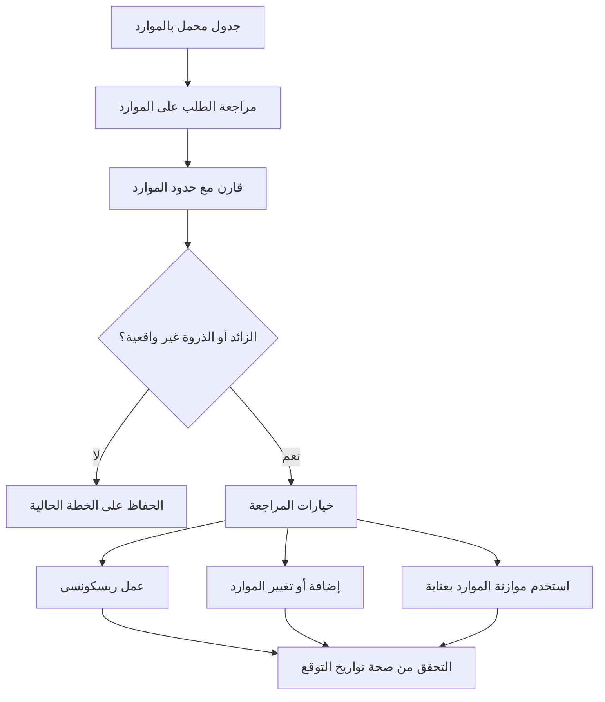

# موازنة الموارد في ص6

موازنة الموارد في Primavera P6 هي عملية مراجعة الطلب على الموارد مقابل القدرات المتاحة وتعديل الخطة بحيث يمكن تنفيذ العمل بالموارد المتاحة. فهو يساعد فريق المشروع على فهم ما إذا كان الجدول الزمني صحيحًا منطقيًا فقط أو عمليًا أيضًا من وجهة نظر الموارد.

في الجدولة اليومية، غالبًا ما يستخدم الأشخاص عبارة "موازنة الموارد" و"موازنة الموارد" كما لو أنها تعني نفس الشيء. إنهما مرتبطان، لكنهما ليسا متماثلين تمامًا.

موازنة الموارد هي مراجعة التخطيط الأوسع. ويتضمن النظر في الرسوم البيانية، وملفات تعريف الموارد، وتوافر الطاقم، والطلب على المعدات، وقمة القوى العاملة، وواقعية الخطة.

تعد موازنة الموارد إحدى ميزات P6 التي يمكنها نقل الأنشطة بناءً على توفر الموارد وإعدادات التسوية.

يمكن أن تكون هذه الميزة مفيدة، ولكن يجب استخدامها مع التحكم. يمكن لـ P6 حساب نتيجة تمت تسويتها، ولكن يجب على المجدول أن يقرر ما إذا كانت هذه النتيجة منطقية بالنسبة للمشروع.

## ما هو موازنة الموارد

تطرح موازنة الموارد سؤالاً عمليًا: هل يمكن للمشروع تنفيذ هذا الجدول الزمني بالموارد المتوفرة لديه بالفعل؟

قد يحتوي الجدول على منطق جيد وتواريخ مقبولة ومسار حرج معقول. ولكن إذا كان الأمر يتطلب نفس الطاقم أو المعدات المحدودة للعمل في أماكن كثيرة في نفس الوقت، فقد لا تكون الخطة واقعية.

إن موازنة الموارد تعني مراجعة هذا الطلب وتحديد كيفية إدارته.

تشمل الإجراءات المحتملة ما يلي:

- نقل العمل غير النقدي.
- إضافة الموارد.
- تقسيم العمل إلى أطقم أو مناطق مختلفة.
- تغيير تسلسل النشاط.
- استخدام العمل الإضافي أو العمل بنظام الورديات.
- ضبط التقويمات.
- تحديث حدود الموارد.
- قبول الذروة المؤقتة إذا كانت واقعية ومعتمدة.

الهدف ليس جعل الرسم البياني مسطحًا تمامًا. المشاريع الحقيقية لها قمم ووديان. الهدف هو التأكد من أن الطلب على الموارد مفهوم وقابل للتحقيق ومتوافق مع خطة التنفيذ.

## لماذا يهم؟

تعتبر موازنة الموارد مهمة لأنه من المفترض أن يدعم الجدول التنفيذ، وليس الحساب فقط.

إذا كانت الخطة تتطلب 50 عامل لحام في الأسبوع المقبل ولكن المقاول يمكنه توفير 30 فقط، فإن الجدول يظهر طلبًا لا يمكن تلبيته. إذا كان هناك نشاطان حاسمان يتطلبان نفس الرافعة في نفس الوقت، فقد يتعين على أحدهما على الأقل التحرك. إذا كانت جميع أنشطة المراجعة الهندسية تتطلب نفس المتخصص، فقد تظهر الاختناقات قبل بدء البناء.

وبدون موازنة الموارد، قد يعتقد المشروع أن لديه قدرة أكبر مما لديه بالفعل.

يمكن أن يؤثر هذا على:

- التخطيط المستقبلي على المدى القريب.
- توقعات القوى العاملة.
- تخطيط المعدات.
- مصداقية المسار الحرج.
- توقعات القيمة المكتسبة.
- منحنيات التكلفة والتدفق النقدي.
- التزامات التقدم.
- خطط التعافي.

تساعد موازنة الموارد على ربط جدول CPM مع القدرات الميدانية والمكتبية الحقيقية.

## موازنة الموارد مقابل موازنة الموارد

موازنة الموارد هي نشاط الإدارة والتخطيط.

موازنة الموارد هي عملية حسابية للجدولة.

وهذا التمييز مهم. يمكن للمخطط موازنة الموارد يدويًا من خلال مراجعة الرسوم البيانية وضبط الجدول الزمني بناءً على معرفة المشروع. يمكن أن تساعد موازنة الموارد P6 أيضًا عن طريق تأخير الأنشطة تلقائيًا عندما يتجاوز الطلب على الموارد مدى التوفر.

كلا النهجين يمكن أن يكونا مفيدين.

يكون التوازن اليدوي أفضل عندما يحتاج المجدول إلى الحوكمة، أو المدخلات الميدانية، أو مراجعة قابلية الإنشاء، أو التحكم الدقيق في الأنشطة التي تتحرك.

تكون موازنة الموارد P6 مفيدة عندما تكون بيانات الموارد موثوقة، ويتم تحديد حدود الموارد، وتكون التقويمات صحيحة، ويريد المجدول اختبار كيفية تغير الجدول عند فرض توفر الموارد.

لا ينبغي أن يحل التسوية محل الحوكمة التخطيطي. وينبغي أن تدعم ذلك.

## ما يحتاجه P6 قبل التسوية

قبل استخدام ميزة موازنة الموارد P6، يجب أن يكون الجدول جاهزًا لتحليل الموارد.

على الأقل، تحقق من:

- تحتوي الأنشطة على تعيينات موارد ذات معنى.
- تعكس وحدات الموارد الطلب الحقيقي.
- تعكس حدود الموارد التوفر الحقيقي.
- تقويمات الموارد صحيحة.
- تقاويم النشاط صحيحة.
- المنطق كامل بما يكفي لدعم قرارات الجدولة.
- القيود مفهومة.
- يتم تحديد الأولويات أو مراجعتها.
- تم حفظ الجدول الحالي حتى يمكن مقارنة النتيجة المستوية.

إذا كانت هذه العناصر ضعيفة، فقد تؤدي التسوية إلى نتيجة تبدو دقيقة ولكنها غير مفيدة.

على سبيل المثال، إذا تم تعيين كل أعمال البناء لمورد "طاقم بناء" عام واحد، فقد يُظهر P6 تحميلًا زائدًا للمورد، ولكن النتيجة قد لا تخبر المشروع ما إذا كانت المشكلة مدنية أم مواسير أم كهربائية أم ميكانيكية. يجب أن يتطابق إعداد الموارد مع قرار التخطيط.

## كيف يستخدم P6 موازنة الموارد

يقوم نظام موازنة الموارد P6 بمراجعة تعيينات الموارد ومدى توفرها. اعتمادًا على الإعدادات، قد يؤدي ذلك إلى تأخير الأنشطة لتقليل التخصيص الزائد للموارد أو إزالته.

يمكن أن يأخذ الحساب في الاعتبار حدود الموارد ومنطق النشاط والسماحية الزمنية والتقويمات والأولويات وخيارات التسوية. تعتمد النتيجة الدقيقة على كيفية تكوين المشروع.

من الناحية العملية، يبحث P6 عن المواقف التي يكون فيها الطلب على الموارد أعلى من توفرها ثم يحاول نقل الأنشطة إلى التواريخ التي تتوفر فيها الموارد.

يمكن أن يؤدي ذلك إلى إنشاء جدول زمني أكثر ملاءمة للموارد، ولكن يمكنه أيضًا تغيير المسار الهام أو تأخير المعالم الرئيسية أو نقل العمل بطرق تحتاج إلى مراجعة.

بعد التسوية، يجب على المجدول مقارنة النتيجة بالتوقعات الأصلية:

- ما هي الأنشطة التي تم نقلها؟
- ما هي المعالم التي تغيرت؟
- هل تغير المسار الحرج؟
- هل استخدمت عملية التسوية العوامة المتوفرة أو أخرت انتهاء المشروع؟
- هل التواريخ الجديدة قابلة للتنفيذ؟
- هل أدت النتيجة إلى حل مشكلة الموارد أم خلقت مشكلة أخرى؟

لا ينبغي قبول الجدول الزمني المستوي بشكل أعمى.

## متى تستخدم موازنة الموارد

استخدم موازنة الموارد عندما يؤثر توفر الموارد على التنفيذ.

وهو مفيد بشكل خاص في:

- جداول البناء مع قيود الطاقم.
- عمليات الإغلاق والتحولات والانقطاعات.
- خطط التكليف مع متخصصين محدودين.
- الجداول الهندسية مع المراجعين المشتركة.
- مشاريع ذات معدات باهظة الثمن أو مشتركة.
- البرامج التي يدعم فيها تجمع موارد واحد مشاريع متعددة.
- خطط التعافي حيث يتم النظر في موارد إضافية.

تعتبر موازنة الموارد مفيدة أيضًا قبل الموافقة على خط الأساس. وقد يصبح من الصعب الدفاع عن خط الأساس الذي يفترض وجود قوة عاملة أو معدات غير واقعية في وقت لاحق.

أثناء التحديثات، تساعد موازنة الموارد على تأكيد ما إذا كان لا يزال من الممكن تسليم العمل المتبقي بالفريق والمعدات الحالية.

## متى يجب توخي الحذر

كن حذرًا عند عدم الاحتفاظ ببيانات الموارد.

إذا لم يتم تحديث الوحدات الفعلية، فقد تنحرف منحنيات الموارد بعيدًا عن الواقع. إذا تم تعيين الموارد فقط لتحميل التكاليف، فقد لا تمثل الوحدات القدرة الحقيقية. إذا كانت التقويمات خاطئة، فقد يكون توفر الموارد خاطئًا أيضًا.

كن حذرًا أيضًا عند استخدام موازنة الموارد وفقًا لجدول تعاقدي أو أساسي. التسوية يمكن أن تحرك التواريخ وتؤثر على السماحية الزمنية. يجب أن يفهم الفريق ما إذا كان الجدول الزمني المستوي هو الخطة الرسمية، أو سيناريو ماذا لو، أو عرض التخطيط الداخلي.

يمكن أن يؤدي التسوية أيضًا إلى إخفاء نقاط الضعف المنطقية. إذا تم نقل النشاط بسبب التسوية، فقد يفوت المراجعون أن المنطق الأصلي كان غير مكتمل أو غير صحيح. قم دائمًا بمراجعة المنطق أولاً، ثم الموارد.

## كيفية استخدامه في الممارسة العملية

ابدأ بتحديد الموارد الأكثر أهمية. لا تحاول موازنة كل مورد ثانوي بنفس المستوى من التفاصيل. ركز على الأطقم الرئيسية، والمتخصصين المهمين، والمعدات المشتركة، والموارد التي يمكن أن تؤثر على المعالم.

ثم قم بمراجعة ملف تعريف الموارد أو الرسم البياني في صفحة 6. ابحث عن القمم والأحمال الزائدة والفجوات والتغيرات المفاجئة في الطلب.

مقارنة الطلب مع حدود الموارد. إذا تجاوز الطلب الحد الأقصى، فناقش المشكلة مع الفريق المسؤول. قد تكون الإجابة عملية، وليس جدولة فقط.

بعد ذلك، حدد طريقة التصحيح:

- إذا كان حد الموارد غير صحيح، فقم بتحديث حد الموارد.
- إذا كان الطلب على الموارد خاطئًا، فقم بتصحيح التعيين.
- إذا كان التسلسل غير واقعي، فاضبط المنطق أو توقيت النشاط.
- إذا كان الحمل الزائد حقيقيًا، فحدد ما إذا كنت تريد إضافة موارد، أو استخدام العمل الإضافي، أو نقل العمل، أو قبول الذروة.
- إذا كانت التسوية التلقائية مناسبة، فقم بتشغيلها كسيناريو متحكم فيه وقارن النتيجة.

احتفظ بنسخة من الجدول غير المستوي قبل تشغيل موازنة الموارد. وهذا يعطي الفريق نقطة مرجعية ويساعد في شرح ما تغير.

## الممارسة الجيدة

استخدم موازنة الموارد كجزء من مراجعة الجدول الزمني، وليس كتمرين تنظيف لمرة واحدة.

قم بمراجعة منحنيات الموارد أثناء تطوير خط الأساس وعمليات إعادة التنبؤ الرئيسية وتخطيط الاسترداد ودورات التحديث المنتظمة.

لا تقم بتسوية جدول زمني رديء الجودة وتتوقع أن تصبح النتيجة موثوقة. قم أولاً بإصلاح المنطق والتقويمات وحالة النشاط والمدد المتبقية وتعيينات الموارد.

إعدادات تسوية المستندات عند استخدام ميزة P6. يمكن أن تؤدي موازنة الموارد إلى نتائج مختلفة اعتمادًا على الخيارات المحددة، وبالتالي تكون الإعدادات جزءًا من سجل الجدول.

والأهم من ذلك، التحقق من صحة خطة الموارد مع الأشخاص الذين يملكون العمل. يجب على فريق المشروع التأكد من إمكانية تحقيق ذروة الموارد، وما إذا كان التسلسل عمليًا، وما إذا كانت الموارد الإضافية متاحة بالفعل.

## خاتمة

تساعد موازنة الموارد في P6 فريق المشروع على اختبار ما إذا كان من الممكن تنفيذ الجدول بالموارد المتاحة. فهو يربط التواريخ والمنطق بالقوى العاملة والمعدات والتوافر المتخصص والقدرة الإنتاجية الحقيقية.

يمكن أن تدعم موازنة الموارد P6 هذه المراجعة عن طريق نقل الأنشطة بناءً على توفر الموارد، ولكن يجب استخدامها بعناية ومراجعتها بعد الحساب.

الجدول الزمني المتوازن ليس بالضرورة جدولًا سلسًا تمامًا. إنه جدول يكون فيه الطلب على الموارد مرئيًا وواقعيًا ومتوافقًا مع الطريقة التي سيتم بها تسليم المشروع فعليًا.
## محتوى ذو صلة
- [بدأت الأنشطة بتقدم 0% في برنامج بريمافيرا P6 - نظرة عامة](../../metrics/13_activity_started_progress_zero/02_guide_template.md)
- [حدود الموارد في P6](../13_RESOURCES%20LIMITS%20IN%20P6/13_RESOURCES%20LIMITS%20IN%20P6.md)
- [علاقات SS و FF](../15_SS%20&%20FF%20RELATIONS/15_SS%20&%20FF%20RELATIONS.md)
