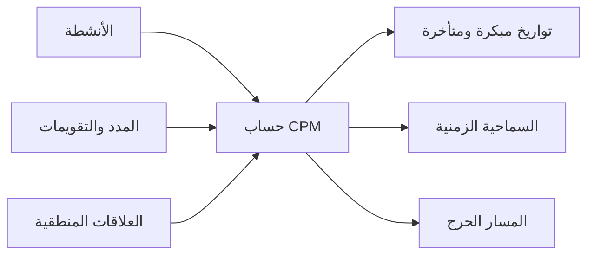

# CPM (طريقة المسار الحرج)

طريقة المسار الحرج، أو CPM، هي طريقة الحساب الأساسية خلف أي جدول مشروع جاد. فهي تحول قائمة الأنشطة إلى نموذج منطقي يستطيع الإجابة عن أسئلة مهمة: متى يمكن أن ينتهي المشروع، ما الأنشطة التي تتحكم في تاريخ النهاية، وأين توجد مرونة في الجدول.

في Primavera P6، تكون CPM غالبا مخفية خلف زر حساب الجدول. البرنامج يحسب التواريخ و السماحية الزمنية والأنشطة الحرجة بسرعة. لكن فهم الطريقة نفسها مهم جدا. إذا لم يفهم المخطط CPM، فقد يحسب الجدول، لكن النتيجة قد لا تعني ما يظنه فريق المشروع.

## ماذا تفعل CPM

تحسب CPM مدة المشروع من شبكة أنشطة، ومدد، وتقويمات، وعلاقات منطقية.

الفكرة الأساسية بسيطة: مدة المشروع ليست مجموع مدد كل الأنشطة. مدة المشروع هي مدة أطول مسار متصل من العمل المعتمد على بعضه داخل الشبكة. هذا المسار هو المسار الحرج.

إذا تأخر نشاط على هذا المسار، فإن نهاية المشروع تتأخر ما لم يسترد الفريق الوقت على نفس المسار.

## المدخلات التي تحتاجها CPM

تعتمد CPM على جودة شبكة الجدول.

أولا، يحتاج الجدول إلى أنشطة تمثل أجزاء واضحة من العمل. يجب أن يكون لكل نشاط نطاق واضح، ومدة منطقية، ومعيار واضح للانتهاء.

ثانيا، يحتاج كل نشاط إلى مدة. في معظم جداول P6، تكون هذه مدة حتمية واحدة مبنية على الإنتاجية والموارد والتقويمات وافتراضات التنفيذ.

ثالثا، تحتاج الأنشطة إلى منطق. العلاقات تحدد ما يجب أن يحدث قبل ماذا، وما الذي يمكن أن يحدث بالتوازي، وما الشرط الذي يسمح لللاحق أن يبدأ أو ينتهي.

CPM لا تعرف إن كان المنطق جيدا. هي تحسب بالمنطق الذي تحصل عليه. إذا كانت الشبكة تحتوي على منطق مفقود، أو قيود ضعيفة، أو تأخر زائد، أو علاقات SS/FF غير مكتملة، فقد تكون النتيجة صحيحة رياضيا لكنها غير موثوقة عمليا.

## التمرير الأمامي و التمرير الخلفي

تحسب CPM الجدول عبر مرورين رئيسيين.

التمرير الأمامي يتحرك من تاريخ البيانات نحو نهاية المشروع. يحسب أقرب تاريخ يمكن أن يبدأ وينتهي فيه كل نشاط، بناء على المنطق والمدد والتقويمات والقيود. هذه هي البدء المبكر و النهاية المبكرة.

التمرير الخلفي يتحرك من نهاية المشروع نحو البداية. يحسب آخر تاريخ يمكن أن يبدأ وينتهي فيه كل نشاط دون تأخير نهاية المشروع أو الهدف المختار. هذه هي البدء المتأخر و النهاية المتأخرة.

بعد حساب التواريخ المبكرة والمتأخرة، يستطيع P6 حساب السماحية الزمنية.

## السماحية الزمنية

السماحية الزمنية هو مقدار الوقت الذي يمكن أن يتحرك فيه النشاط قبل أن يؤثر على هدف محدد في الجدول.

إجمالي السماحية الزمنية هو غالبا القيمة الأساسية التي تتم مراجعتها في P6. يوضح مقدار التأخير الممكن قبل أن يؤثر النشاط على نهاية المشروع أو المسار المسيطر.

السماحية الزمنية الحرة أكثر محلية. يوضح مقدار التأخير الممكن قبل التأثير على البدء المبكر لللاحق المباشر.

السماحية الزمنية ليس وقتا فائضا للاستهلاك العشوائي. هو مرونة في الجدول. عندما يستهلك السماحية الزمنية، تقل حماية المشروع ضد التأخيرات المستقبلية.

## المسار الحرج

المسار الحرج هو أطول مسار متصل من الأنشطة التابعة لبعضها الذي يتحكم في نهاية المشروع. في كثير من الجداول، تعرف الأنشطة الحرجة من خلال إجمالي سماحية زمنية صفرية أو سلبية، لكن المراجعة الأفضل هي فهم أطول مسار والتأكد أنه منطقي.

المسار الحرج الجيد يجب أن يروي قصة تنفيذ قابلة للتصديق. يجب أن يمر عبر الأنشطة التي تتحكم فعلا في النهاية مثل إصدار التصميم، المشتريات، تسلسل البناء، الاختبارات، التشغيل التجريبي، التسليم، أو غيرها من المحركات الحقيقية.

إذا مر المسار الحرج عبر المعالم غريبة، أو قيود غير ضرورية، أو منطق مفقود، فقد يرسل الجدول إشارة خاطئة.

## العمل شبه الحرج

لا يجب أن ينظر فريق المشروع فقط إلى الأنشطة ذات سماحية زمنية صفرية.

الأنشطة شبه حرجة لديها السماحية الزمنية منخفض ويمكن أن تصبح حرجة بتأخير محدود. يعتمد الحد على حجم المشروع وحساسيته. في المشاريع الكبيرة، قد تحتاج الأنشطة التي لديها أقل من 10 أو 20 يوم عمل من السماحية الزمنية إلى متابعة قريبة.

هذه المسارات مهمة لأن المخاطر نادرا ما تبقى في خط واحد. أثناء البناء الكثيف أو التشغيل التجريبي أو الإيقاف، يمكن أن تقترب عدة مسارات من الحالة الحرجة في نفس الوقت.

## CPM وتحليل المخاطر

تعطي CPM إجابة حتمية: إذا أخذ كل نشاط مدته المخططة، فهذا هو تاريخ نهاية المشروع.

تحليل مخاطر الجدول الزمني يذهب أبعد من ذلك. يختبر عدم اليقين باستخدام نطاقات أو توزيعات احتمالية للمدد وتشغيل محاكاة كثيرة. يساعد ذلك في تقدير احتمال الانتهاء في تاريخ مستهدف.

لكن تحليل المخاطر يعتمد على شبكة CPM. إذا كان المنطق ضعيفا، فستكون نتائج المخاطر ضعيفة أيضا. مونت كارلو لا يصلح منطق مفقودا أو مدد غير واقعية أو شبكة سيئة.

## CPM في Primavera P6

يجعل P6 حساب CPM سريعا، لكن هذه السرعة قد تخفي الافتراضات خلف النتيجة.

عند حساب الجدول، يستخدم P6 تاريخ البيانات، والتقويمات، والمدد، والعلاقات، والقيود، والفعليات، والمدد المتبقية، وخيارات الجدولة. تغييرات صغيرة في هذه الإعدادات قد تغير السماحية الزمنية و المسار الحرج وتواريخ التوقع.

لذلك لا يجب على المخطط أن يضغط F9 فقط ثم يقبل النتيجة. يجب مراجعة الحساب والتأكد أنه يطابق خطة التنفيذ الحقيقية.

## ممارسة جيدة

ابن شبكة CPM من منطق تنفيذ حقيقي. لا تضف علاقات فقط لاجتياز مراجعة أو لإنتاج تاريخ مرغوب.

راجع المسار الحرج بعد كل تحديث. تأكد أن بدايته ونهايته منطقيتان بالنسبة لحالة المشروع الحالية.

راقب حركة السماحية الزمنية مع الوقت. قد يبدو المشروع على الخطة بينما يستهلك السماحية الزمنية بهدوء.

راجع المسارات شبه حرجة، فهي غالبا تظهر أين ستظهر المشكلة التالية.

حافظ على نظافة الجدول بما يكفي لدعم CPM. البدايات المفتوحة و النهايات المفتوحة و قيود صارمة و تأخر الزائد والعلاقات غير المكتملة كلها تقلل قيمة الحساب.

## الخلاصة

CPM هي المحرك الذي يحول جدول Primavera P6 إلى أداة ضوابط المشروع. تحسب التواريخ المبكرة والمتأخرة و السماحية الزمنية و المسار الحرج من شبكة الأنشطة.

لكن موثوقية CPM تعتمد على الجدول الذي تحسبه. الأنشطة الجيدة، والمدد الواقعية، والتقويمات الصحيحة، والمنطق القوي هي ما يجعل النتيجة ذات معنى.

قيمة CPM ليست فقط في إظهار تاريخ نهاية المشروع. قيمتها الحقيقية أنها تشرح لماذا هذا التاريخ مسيطر عليه، وأين توجد المرونة، وأين يجب أن يركز الإدارة انتباهه.
## محتوى ذو صلة
- [المسار الحرج أو مسار السماحية الزمنية الذي يبدأ بقيد - نظرة عامة](../../04_metrics_ar/09_cp_or_السماحية الزمنية_path_starting_with_constraint/01_overview_template.md)
- [علاقات SS و FF](../15_SS%20&%20FF%20RELATIONS/15_SS%20&%20FF%20RELATIONS.md)
- [تطوير جدول مشروع](../17_DEVELOPE%20A%20PROJECT%20SCHEDULE/17_DEVELOPE%20A%20PROJECT%20SCHEDULE.md)
