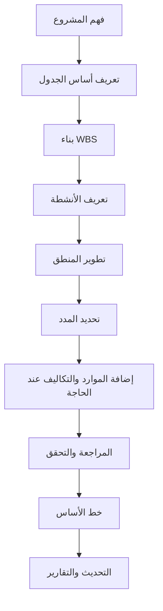

# تطوير جدول مشروع

تطوير جدول مشروع من الصفر ليس مجرد إدخال أنشطة في Primavera P6. إنه تحويل نطاق العمل، واستراتيجية التنفيذ، والقيود، والموارد، والتزامات المشروع إلى نموذج زمني يمكن مراجعته واعتماده وتحديثه واستخدامه في اتخاذ القرار.

الجدول الجيد يتم بناؤه قبل أن يتم حسابه. جودة ملف P6 تعتمد على التفكير الذي يحدث قبل إدخال أول نشاط.

## مسار التطوير

## افهم المشروع أولا

لا تبدأ في P6 قبل فهم المشروع.

راجع العقد، ونطاق العمل، والمواصفات، والمراحل الرئيسية، واستراتيجية التنفيذ، وقيود المشتريات، والتصاريح، وقيود الوصول، ومتطلبات التسليم. ثم تحدث مع مدير المشروع، والهندسة، والمشتريات، والإنشاء، والتشغيل التجريبي، والمقاولين الفرعيين والمواردين عند الحاجة.

الجدول هو نموذج لكيف ينوي الفريق تنفيذ المشروع. إذا لم يفهم المخطط هذه النية، فسيبنى الجدول على افتراضات.

## عرف أساس الجدول

أساس الجدول يشرح كيف سيتم بناء الجدول. يجب أن يحدد WBS، والتقويمات، والأكواد، ومستوى التفصيل، وقواعد العلاقات، وسياسة تأخر، وإعدادات P6، واتفاقية تاريخ البيانات، ومتطلبات التقارير، وطريقة خط الأساس.

هذا المستند مهم لأنه يشرح لماذا تم بناء الجدول بهذه الطريقة، ويعطي المراجعين مرجعا عند تقييم الجودة أو مقارنة التحديثات.

## ابن WBS

WBS هو الإطار التنظيمي للجدول. يجب أن يعكس كيف سيتم إدارة المشروع والتقرير عنه.

يمكن تنظيم WBS حسب المرحلة، أو المنطقة، أو النظام، أو التخصص، أو تسليمية، أو الحزمة التعاقدية. يجب أن يدعم الفلترة، وقياس التقدم، وتوزيع المسؤولية، والتقارير.

إذا لم يتطابق WBS مع طريقة التحكم بالمشروع، سيكون استخدام الجدول صعبا حتى لو كانت الأنشطة صحيحة.

## عرف الأنشطة

يجب أن تمثل الأنشطة أجزاء واضحة وقابلة للقياس من العمل. كل نشاط يجب أن يكون له نطاق واضح، وشرط بداية، وشرط نهاية، ومسؤول واحد.

الأنشطة الكبيرة جدا يصعب تحديثها. والأنشطة الصغيرة جدا تجعل الجدول صعب الصيانة. مستوى التفصيل الصحيح يعتمد على مرحلة المشروع، والعقد، ومتطلبات التقارير، وتوقعات التحكم.

أسماء الأنشطة مهمة. الاسم الجيد يجب أن يوضح ما العمل الذي يتم تنفيذه، وأين يتم تنفيذه، وما العنصر أو النظام أو المخرج الذي يرتبط به.

## طور المنطق

المنطق هو قلب جدول CPM. يحدد ما يجب أن يحدث قبل ماذا، وما يمكن أن يحدث بالتوازي، وما الشرط الذي يسمح لكل نشاط أن يبدأ أو ينتهي.

يجب تطوير المنطق مع الأشخاص الذين يفهمون العمل. في P6، لا تبن المنطق من المكتب فقط. راجع التسلسل مع قادة التخصصات، ومديري الإنشاء، والتشغيل التجريبي، والمشتريات، والمقاولين الفرعيين.

استخدم FS عندما يمثل العمل بشكل صحيح. استخدم SS و FF بحذر عندما يكون التداخل حقيقيا. تجنب تأخر سلبي وتجنب SF إلا بسبب واضح ومعتمد. كل نشاط يجب عادة أن يكون له النشاط السابق و النشاط اللاحق، باستثناء المعالم صحيحة لبداية ونهاية المشروع.

## حدد المدد

يجب أن تكون المدد واقعية، لا طموحة فقط. يجب أن تعتمد على النطاق، والإنتاجية، والموارد، والتقويمات، ومدخلات المواردين والمقاولين، وخبرة أعمال مشابهة.

المدة ليست رقما فقط. هي تفترض فريقا معينا، ومعدل إنتاج، وتقويما، وظروف وصول، وطريقة تنفيذ. إذا تغيرت هذه الافتراضات، فقد تتغير المدة.

وثق افتراضات المدد المهمة. هذا يساعد في المراجعات، والتحديثات، وإدارة التغيير، وتحليل التأخير.

## أضف الموارد والتكاليف عند الحاجة

إذا كان الجدول سيستخدم لتخطيط الموارد، أو تحميل التكاليف، أو القيمة المكتسبة، أو التدفق النقدي، فيجب إضافة الموارد والتكاليف بعناية.

تحميل الموارد يساعد الفريق على رؤية طلب العمالة، والمعدات، والمواد، وأي تحميل زائد. تحميل التكاليف يربط الجدول بالميزانية، والتوقعات، ومنحنيات الدفع أو التقدم.

لا تضف الموارد لمجرد الشكل. إذا كان المشروع سيعتمد على هذه البيانات، فيجب تحديثها خلال دورات التحديث.

## راجع وتحقق

قبل اعتماد خط الأساس، يجب مراجعة الجدول فنيا وتشغيليا.

افحص البدايات المفتوحة، والنهايات المفتوحة، وأنواع العلاقات، وتأخرs، وقيود، والمدد الطويلة، والمنطق المفقود، وتوزيع السماحية الزمنية، ومنطقية المسار الحرج. فحوصات DCMA مفيدة، لكنها تحتاج دائما إلى حكم المشروع.

راجع الجدول مع فريق المشروع. اسأل هل المنطق، والمدد، والموارد، والمعالم تعكس خطة التنفيذ الحقيقية. جدول ينجح في المؤشرات لكنه يفشل أمام فريق التنفيذ ليس جاهزا.

## اعتمد خط الأساس

بعد المراجعة والاعتماد، يصبح الجدول خط الأساس. وهو المرجع لقياس التقدم، والانحراف، والتأخير، وخطط التعافي، والأداء.

يجب أن يكون اعتماد خط الأساس إجراء رسميا. احفظ النسخة المعتمدة، واحمها من التغييرات غير المسيطر عليها، ووثق الموافقات. أي تغيير لاحق يجب أن يتبع ضبط التغيير.

خط الأساس الذي يتغير كلما تأخر المشروع ليس خط الأساس. إنه هدف متحرك.

## أنشئ دورة التحديث

يبقى الجدول مفيدا فقط إذا تم تحديثه بانتظام.

حدد من يقدم بيانات التقدم، ومتى تجمع، وما الدليل المطلوب، وكيف يتم التحقق من التواريخ الفعلية، وكيف تراجع المدد المتبقية، وما التقارير المطلوبة. البناء والتشغيل التجريبي قد يحتاجان تحديثا أسبوعيا أو كل أسبوعين. المراحل المبكرة قد تكون شهرية.

دورة التحديث تحول خط الأساس من وثيقة ثابتة إلى أداة تحكم حية.

## الخلاصة

تطوير جدول مشروع هو عملية منظمة. افهم المشروع، عرف أساس الجدول، ابن WBS، أنشئ الأنشطة، طور المنطق، حدد المدد، أضف الموارد عند الحاجة، تحقق من النتيجة، اعتمد خط الأساس، وحافظ عليه بالتحديثات.

أفضل الجداول لا تأتي من فتح P6 بسرعة. تأتي من فهم العمل، وتحدي الافتراضات، وبناء نموذج يمكن لفريق المشروع الوثوق به.
## محتوى ذو صلة
- [الأنشطة التي تبدأ في تاريخ البيانات بدون المنطق المحرك: لماذا يهم مقياس الجدول هذا - نظرة عامة](../../metrics/01_activities_starting_in_dd_with_no_logic_driving/02_guide_template.md)
- [CPM (طريقة المسار الحرج)](../16_CPM%20(CRITICAL%20PATH%20METHOD)/16_CPM%20(CRITICAL%20PATH%20METHOD).md)
- [رموز النشاط](../18_ACTIVITY%20CODES/18_ACTIVITY%20CODES.md)
