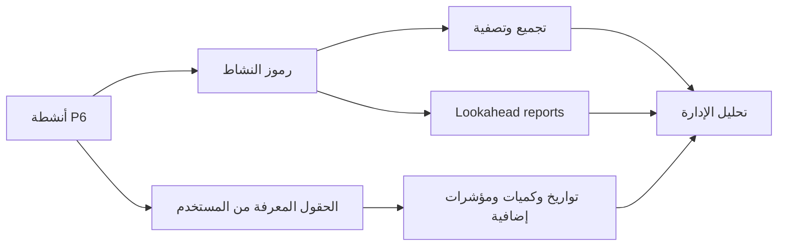

# رموز النشاط

رموز النشاط في Primavera P6 هي من أهم الأدوات التي تحول الجدول من قائمة أنشطة إلى قاعدة بيانات مفيدة لإدارة المشروع. فهي تسمح للفريق بتجميع الجدول، وتصفيته، وترتيبه، وإصدار التقارير، وتحليله من زوايا إدارية مختلفة.

الجدول ليس مخطط شريطي فقط. في P6، كل نشاط هو أيضا سجل يمكن أن يحمل معلومات عن المسؤول، والمرحلة، والمنطقة، والنظام، والتخصص، والعقد، ونوع المعلم، وخصائص أخرى للمشروع. رموز النشاط تنظم هذه المعلومات بطريقة منضبطة.

## ما هي رموز النشاط

رموز النشاط هي حقول تصنيف منظمة تسند إلى الأنشطة. كل نوع الرمز يمثل بعدا للتقرير، وكل قيمة الرمز يمثل خيارا داخل ذلك البعد.

مثال:

- نوع الرمز: المنطقة.
- قيم الرمز: الوحدة 1, الوحدة 2, منطقة الخزانات, المرافق.

أو:

- نوع الرمز: التخصص.
- قيم الرمز: مدني, ميكانيكي, كهربائي, أجهزة القياس والتحكم, التشغيل التجريبي.

WBS يوضح مكان العمل داخل هيكل المشروع. رموز النشاط توضح كيف يمكن النظر إلى هذا العمل للتقرير والتحليل.

## ما ليست عليه

رموز النشاط لا تستبدل WBS. WBS هو هرم نطاق العمل. الرموز هي طرق إضافية لرؤية نفس الأنشطة.

رموز النشاط لا تستبدل المنطق. المنطق يحدد تسلسل العمل.

رموز النشاط لا تستبدل الموارد. الموارد تحدد العمالة، والمعدات، والمواد، والتكاليف.

عندما تختلط هذه المفاهيم، يصبح الجدول صعب الصيانة. جدول P6 الجيد يستخدم WBS، والمنطق، والموارد، ورموز النشاط، وحقول UDF لأغراض مختلفة.

## رموز النشاط العامة والخاصة بالمشروع

في P6 يوجد عام رموز النشاط و المشروع رموز النشاط.

عام رموز النشاط مشتركة بين المشاريع. وهي مفيدة عندما يجب استخدام نفس التصنيف عبر المحفظة، مثل مراحل قياسية، أو مجموعات مسؤولية مؤسسية، أو فئات إعداد التقارير على مستوى البرنامج.

المشروع رموز النشاط تخص مشروعا واحدا. وهي مفيدة للاحتياجات الخاصة بالمشروع، مثل المناطق، والأنظمة، والحزم التعاقدية، وواجهات العمل، وحزم التسليم، وفئات إعداد التقارير المحلية.

استخدم الرموز العامة بحذر لأن التغييرات قد تؤثر على مشاريع أخرى. واستخدم رموز المشروع للخصائص التي لها معنى داخل مشروع واحد فقط.

## أنواع شائعة من رموز النشاط

تعتمد أنواع الرموز المفيدة على المشروع، لكن الأمثلة الشائعة تشمل:

- الجهة المسؤولة.
- التخصص.
- مرحلة المشروع.
- المنطقة أو الموقع.
- النظام أو النظام الفرعي.
- الحزمة التعاقدية.
- حزمة العمل.
- نوع المعلم.
- حزمة التسليم.
- مستوى إعداد التقارير.

أفضل أنواع الرموز تأتي من احتياجات التقارير. قبل إنشاء الرموز، اسأل: ما الأسئلة التي يجب أن يجيب عنها الجدول؟

أمثلة:

- ما العمل المخطط في المنطقة أ الشهر القادم؟
- ما الأنشطة التي تخص المقاول الكهربائي؟
- ما الأنظمة التي تقود التشغيل التجريبي؟
- أي الحزمة التعاقدية يتأخر؟
- أي المعالم يجب تقريرها للعميل؟

## الحقول المعرفة من المستخدم

الحقول المعرفة من المستخدم، أو حقول UDF، تختلف عن رموز النشاط. الرموز تصنف الأنشطة في فئات. حقول UDF تخزن بيانات مخصصة مثل تواريخ، أرقام، نص، تكاليف، كميات، أو مؤشرات نعم/لا.

استخدم حقول UDF عندما لا تكون المعلومة مجرد فئة.

أمثلة:

- تاريخ الانتهاء التعاقدي.
- تاريخ الانتهاء المتوقع.
- علامة الخطر.
- الكمية المخططة.
- الكمية المركبة.
- رقم أمر التغيير.
- مرجع الرسم.
- حالة الفحص.

رموز النشاط أفضل للتجميع والتصفية. حقول UDF أفضل لتخزين معلومات إضافية لا توفرها حقول P6 القياسية.

## لماذا تهم في التقارير

التكويد الجيد يجعل التقارير أسرع وأكثر موثوقية.

مع رموز النشاط متسقة، يستطيع مسؤول الجدولة إصدار تقارير النظرة المستقبلية حسب التخصص، وتقارير حسب المنطقة، وملخصات حسب الحزمة التعاقدية، وتقارير أنظمة التشغيل التجريبي، وتقارير المعالم، ولوحات المعلومات من دون بناء المرشحات من جديد كل مرة.

من دون الرموز، يصبح التقرير يدويا غالبا. يتم تصدير البيانات، وتعديل جداول البيانات، وإضافة تسميات يدويا، وتكرار ذلك في كل دورة تحديث. هذا يخلق أخطاء ويهدر الوقت.

الرموز تجعل الجدول مصدرا قابلا لإعادة الاستخدام.

## الحوكمة

رموز النشاط تحتاج إلى حوكمة. إذا أنشأ الجميع قيما بحرية، يصبح الجدول غير متسق بسرعة.

مثلا، قد يستخدم شخص "كهربائي"، وآخر "كهرباء"، وآخر "E&I". عندها قد يفقد التقرير بعض الأنشطة لأن الفئة نفسها انقسمت إلى عدة تسميات.

عرف أنواع الرموز والقيم المسموحة قبل خط الأساس عندما يكون ذلك ممكنا. وثق معنى كل رمز، ومن يحافظ عليه، وهل هو إلزامية.

يجب مراجعة اكتمال الترميز مثل أي عنصر جودة آخر في الجدول. إذا كانت أنشطة كثيرة تفتقد الرموز إلزامية، فلا يمكن الوثوق بالتقارير المبنية عليها.

## تجنب التعقيد الزائد

المزيد من الرموز لا يعني تلقائيا تحكما أفضل.

كل رمز وUDF يخلق عملا للصيانة. إذا لم يستخدم الرمز في تقرير أو مرشح أو لوحة معلومات أو تحليل، فقد لا يستحق الصيانة.

ابدأ بأسئلة التقرير المهمة. ابن هيكلا كافيا للإجابة عنها، لكن لا تنشئ حقولا فقط لأنها قد تكون مفيدة يوما ما.

## ممارسة جيدة

صمم هيكل الرموز أثناء تطوير الجدول، لا بعد خط الأساس.

اربط الرموز بخطة إعداد التقارير للمشروع. إذا كان المشروع يقرر حسب المنطقة، والتخصص، والعقد، والنظام، فيجب أن توجد هذه الأبعاد في P6.

حافظ على قيم الرمز متسقة ومضبوطة. تجنب التكرار والاختصارات غير الواضحة.

استخدم حقول UDF للتواريخ، والكميات، والمراجع، والمؤشرات المخصصة. لا تجبر المعلومات الرقمية أو التواريخ داخل رموز النشاط.

راجع الترميز في كل دورة تحديث. الأنشطة الجديدة يجب أن تحصل على الرموز المطلوبة قبل إصدار التقارير.

## الخلاصة

رموز النشاط ليست مجرد تسميات إدارية. إنها ما يسمح لجدول Primavera P6 أن يجيب عن أسئلة الإدارة بسرعة واتساق.

عند استخدامها جيدا، تجعل الرموز الجدول أسهل في التصفية، والتجميع، والتقرير، والتحليل. وحقول UDF توسع هذه القدرة بتخزين معلومات خاصة بالمشروع لا تغطيها حقول P6 القياسية.

المخطط الشريطي يظهر الوقت. أما بنية الترميز فيحدد كيف يمكن قراءة الجدول وتقسيمه واستخدامه.
## محتوى ذو صلة
- [التبعيات المفقودة في بريمافيرا P6 - نظرة عامة](../../metrics/21_missing_dependencies/02_guide_template.md)
- [تطوير جدول مشروع](../17_DEVELOPE%20A%20PROJECT%20SCHEDULE/17_DEVELOPE%20A%20PROJECT%20SCHEDULE.md)
- [أساس الجدول الزمني](../19_SCHEDULE%20BASIS/19_SCHEDULE%20BASIS.md)
