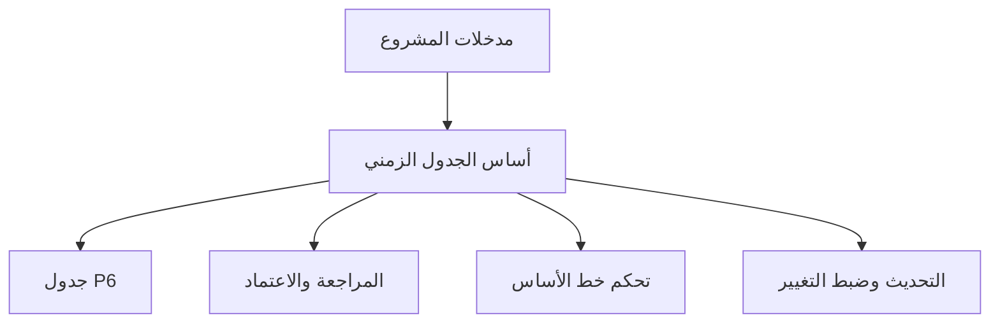

# أساس الجدول الزمني

أساس الجدول الزمني، أو أساس الجدول الزمني، هو المستند الذي يشرح كيف تم بناء جدول المشروع وما الافتراضات التي تدعمه. هو المرافق المكتوب لملف Primavera P6.

الجدول يعرض التواريخ، والمنطق، والسماحية الزمنية، والمعالم، والموارد، والمسار الحرج. أما أساس الجدول الزمني فيشرح لماذا ظهرت هذه العناصر بهذه الطريقة.

## ما استخدامه

يدعم أساس الجدول الزمني المراجعة، والاعتماد، والتحكم في خط الأساس، والتحديثات، وإدارة التغيير، وdelay تحليل. يساعد المراجع على فهم القواعد، والافتراضات، والمدخلات، والحدود خلف الجدول.

بدونه قد يحسب ملف P6 بشكل صحيح، لكن الفريق قد لا يعرف ما الافتراضات المستخدمة أو هل الجدول مناسب لاتخاذ القرار.

## من يكتبه ولمن يوجه

عادة يكتب مسؤول الجدولة أو مهندس التخطيط هذا المستند، مع مدخلات من مدير المشروع، والهندسة، والمشتريات، والإنشاء، والتشغيل التجريبي، وضوابط المشروع، والعقود، والتكاليف.

وهو موجه إلى فريق المشروع، والعميل، وPMO، والمراجعين، ومحللي المطالبات، وكل من يحتاج إلى فهم كيف تم بناء الجدول.

## لماذا هو مهم

الجدول مليء بالقرارات. التقويمات، والمدد، والمنطق، والفرق، والمعالم، ودورات الاعتماد، والتصاريح، وحدود الموارد كلها تؤثر على التواريخ والسماحية الزمنية.

أساس الجدول الزمني يجعل هذه القرارات مرئية. يقلل الغموض، ويدعم التدقيق، ويمنع الخلافات المستقبلية حول ما افترضه الجدول عند خط الأساس.

## ماذا يجب أن يحتوي

أساس الجدول الزمني شامل يجب أن يحتوي على:

- نطاق المشروع والاستثناءات.
- هدف الجدول واستخدامه التعاقدي.
- منهجية تطوير الجدول.
- WBS وهيكل رموز النشاط.
- التقويمات، الورديات، العطلات، الطقس، وفترات عدم العمل.
- الافتراضات وقيود الرئيسية.
- المعالم للبداية، النهاية، الوصول، والموافقات، وتسليم المواد.
- دورات الموافقات والتصاريح.
- افتراضات التسليم وturnover.
- قواعد المنطق، أنواع العلاقات، وسياسة تأخر.
- أساس المدد، معدلات الإنتاجية والمعايير.
- الفرق، توفر الموارد، حدود العمالة وحدود المعدات.
- قواعد التكلفة عند الحاجة.
- شرح المسار الحرج والمسار شبه الحرج.
- افتراضات المخاطر وعدم اليقين.
- دورة التحديث، قواعد الحالة، ومنهج التقارير.

## الافتراضات

يجب أن تكون الافتراضات واضحة وقابلة للتحقق. قد تشمل تواريخ الوصول إلى الموقع، إصدار الهندسة، تواريخ تسليم الموردين، مدد اعتماد التصاريح، مدد مراجعة العميل، توفر الفرق، الاحتياطيات للطقس، وتسلسل التشغيل التجريبي.

إذا أثر افتراض على التواريخ أو السماحية الزمنية أو الموارد أو التسليم، فيجب أن يكون في أساس الجدول الزمني.

## التقويمات وفترات العمل

يجب أن يشرح المستند كل تقويم رئيسي مستخدم في P6. يشمل أيام العمل، الورديات، العطلات، الإيقافs الموسمية، تقويمات الطقس، العمل الليلي، عطلات نهاية الأسبوع، وفترات عدم العمل.

التقويمات تؤثر مباشرة على تواريخ الأنشطة والسماحية الزمنية. إذا استخدمت تقويمات مختلفة للهندسة، المشتريات، الإنشاء، التشغيل التجريبي أو الموارد، يجب شرح السبب.

## الفرق والموارد والحدود

المدد لا تكون مفهومة إلا إذا فهمت الموارد المفترضة. يجب أن يذكر أساس الجدول الزمني افتراضات الفرق، توفر الموارد، حدود العمالة، حدود المعدات، وأي العمل الإضافي أو استراتيجية ورديات.

إذا كان تحميل الموارد موجودا، اشرح هل يستخدم لل تخطيط القوى العاملة أو تحميل التكاليف أو القيمة المكتسبة أو موازنة الموارد.

## المعالم والموافقات والتصاريح والتسليم

يجب سرد وشرح المعالم الرئيسية، مثل بداية المشروع، الإكمال التعاقدي، منح الوصول، موافقات العميل، واجهات الطرف الثالث، تسليم المواد، التصاريح، تسليم الأنظمة والتسليم النهائي.

يجب أن توضح دورات الموافقة والتصاريح المدد المفترضة والمسؤوليات. إذا كان فعل العميل أو طرف ثالث يقود الجدول، يجب أن يظهر ذلك.

## المنهجية والإنتاجية والتكلفة

يجب أن يشرح أساس الجدول الزمني كيف تم تطوير الجدول: المصادر المستخدمة، ورش العمل، منطق التسلسل، طريقة تقدير المدد، معدلات الإنتاجية والمعايير، وعملية التحقق.

إذا كان تحميل التكاليف موجودا، اذكر القواعد. اشرح هل التكاليف موزعة حسب الموارد أو المصروفات أو الأنشطة أو WBS أو الحزمة التعاقدية أو طريقة القيمة المكتسبة.

## المسار الحرج والمخاطر

يجب أن يلخص أساس الجدول الزمني المسار الحرج ويشرح لماذا هو منطقي. يجب أيضا أن يحدد المسارات شبه الحرجة، والمخاطر الكبرى، وحساسيات الجدول، والافتراضات التي قد تتغير أثناء التنفيذ.

هذا يساعد الفريق على فهم ليس فقط تاريخ النهاية، بل ما الذي يتحكم فيه.

## ممارسة جيدة

اكتب أساس الجدول الزمني قبل اعتماد خط الأساس. حافظ على توافقه مع ملف P6. حدثه عندما تغير التغييرات المعتمدة الافتراضات، التقويمات، المعالم، استراتيجية الموارد أو المنهجية.

لا تجعله نصا عاما. يجب أن يكون محددا بما يكفي ليتمكن مسؤول الجدولة آخر من فهم كيف تم بناء الجدول.

## الخلاصة

أساس الجدول الزمني هو التفسير خلف الجدول. يوضح ماذا يفترض الجدول، وكيف بني، وما يتضمنه، وما يستثنيه، وما الالشروط التي يجب أن تبقى صحيحة لتظل التواريخ صالحة.

أساس الجدول الزمني قوي يجعل ملف P6 أسهل في المراجعة، والدفاع، والتحديث، والثقة.
## محتوى ذو صلة
- [الأنشطة التي تبدأ في تاريخ البيانات بدون المنطق المحرك: لماذا يهم مقياس الجدول هذا - نظرة عامة](../../metrics/01_activities_starting_in_dd_with_no_logic_driving/02_guide_template.md)
- [رموز النشاط](../18_ACTIVITY%20CODES/18_ACTIVITY%20CODES.md)
