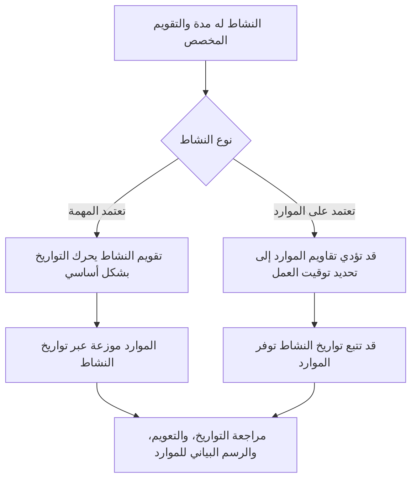

التقويمات هي أحد الأسس الهادئة لجدول بريمافيرا P6. يحددون متى يمكن أن يحدث العمل. يخبرون P6 بالأيام التي تعتبر أيام عمل، والأيام التي تعتبر أيام غير عمل، وعدد الساعات المتاحة في اليوم، وفي أي وقت من اليوم يبدأ العمل وينتهي.

نظرًا لأن التقويمات تعمل خلف الكواليس، فمن السهل الاستهانة بها. قد يكون للجدول منطق قوي ومدد معقولة، ولكن إذا كانت التقويمات خاطئة أو غير متسقة، فقد تظل التواريخ مضللة.

يعد فهم التقويمات أمرًا ضروريًا لجودة الجدول الزمني وتخطيط الموارد ومراجعة المسار الحرج وتحديث الانضباط.

## ماذا يفعل التقويم في ص6

في P6، يقوم التقويم بتحويل المدة إلى تواريخ. إذا كانت مدة النشاط 10 أيام عمل، فيجب على P6 معرفة معنى يوم العمل. هل هو من الاثنين إلى الجمعة؟ هل يوم السبت مشمول؟ هل يوم العمل 8 ساعات أم 10 ساعات أم 12 ساعة؟ هل يبدأ العمل الساعة 7:00 أو 8:00؟ هل العطل مستبعدة؟

التقويم يجيب على هذه الأسئلة.

تأثير التقويمات:

- مواعيد بدء النشاط وانتهاءه.
- التواريخ المبكرة والمتأخرة.
- إجمالي التعويم.
- المسار الحرج والمسار الأطول.
- توقيت استخدام الموارد.
- تفسير تأخر العلاقة.
- يتغير التاريخ أثناء التحديثات.
- نظرة مستقبلية ودقة التقارير.

التقويم ليس مجرد عنصر إعداد إداري. إنه جزء من حساب الجدول الزمني.

## لماذا قد تكون هناك حاجة إلى أكثر من تقويم واحد

تحتاج العديد من المشاريع إلى أكثر من تقويم واحد لأنه ليس كل العمل يتبع نفس نمط العمل.

تشمل الأمثلة ما يلي:

- العمل الهندسي المكتبي وفقًا لتقويم مدته 5 أيام.
- أعمال بناء الموقع وفقًا لتقويم مدته 6 أيام.
- إيقاف أو انقطاع العمل على تقويم 24 ساعة.
- أعمال التكليف بالنوبات الليلية.
- نوافذ وصول المالك.
- القيود البيئية.
- أنشطة الشراء على أساس أيام عمل المورد.
- تقاويم خاصة بالموارد للمفتشين أو البائعين أو أطقم العمل المتخصصة.

قد يبدو استخدام تقويم واحد لكل شيء أمرًا بسيطًا، ولكنه قد يؤدي إلى تواريخ غير واقعية. إذا كان من الممكن أن يتم التشغيل في الليل فقط، فقد يكون التقويم النهاري العادي خاطئًا. إذا كان البائع يعمل خلال أيام الأسبوع فقط، فقد يؤدي تقويم البناء المكون من 7 أيام إلى المبالغة في تقدير مدى التوفر.

الهدف ليس إنشاء العديد من التقاويم. الهدف هو إنشاء تقاويم كافية لنمذجة ظروف العمل الحقيقية دون جعل الجدول الزمني معقدًا بشكل غير ضروري.

## تقاويم النشاط

يتم تعيين تقويم النشاط مباشرةً للنشاط. فهو يحدد وقت العمل المستخدم لحساب مدة هذا النشاط وتواريخه، خاصة للأنشطة التابعة للمهمة.

على سبيل المثال، إذا كان "تثبيت علبة الكابلات" يحتوي على تقويم إنشاء مدته 6 أيام، فسيقوم P6 بحساب عمله بناءً على هذا التقويم. إذا كان يوم السبت هو يوم عمل، فقد ينتهي النشاط في وقت أبكر مما هو عليه في تقويم مكون من 5 أيام.

عادةً ما تكون تقاويم الأنشطة هي أداة التحكم الرئيسية في التقويم لأنشطة الجدول الزمني العادية.

استخدم تقاويم النشاط عندما يتبع العمل نفسه نمط عمل محدد، مثل الوردية النهارية أو الوردية الليلية أو إيقاف العمل أو العمل المكتبي.

## تقاويم الموارد

تحدد تقويمات الموارد متى يكون المورد متاحًا. قد يكون المورد شخصًا أو طاقمًا أو عنصرًا من المعدات أو بائعًا متخصصًا أو أي مورد آخر مخصص.

تصبح تقويمات الموارد ذات أهمية خاصة عندما تعتمد الأنشطة على المورد أو عندما يستخدم المشروع تسوية الموارد أو التخطيط التفصيلي للموارد.

على سبيل المثال، قد يتم تعيين نشاط ما لتقويم البناء لمدة 6 أيام، ولكن قد يكون المفتش المتخصص المعين له متاحًا فقط من الاثنين إلى الأربعاء. إذا كان النشاط يعتمد على الموارد، فقد يقوم P6 بحساب التواريخ بناءً على تقويم المورد بدلاً من تقويم النشاط فقط.

تكون تقويمات الموارد مفيدة عندما يكون توفر الموارد قيدًا حقيقيًا للجدولة. يمكنهم أيضًا خلق ارتباك إذا تم تعيينهم ولكن لم تتم صيانتهم.

## كيفية واجهة النشاط وتقاويم الموارد

تعتمد العلاقة بين تقويمات النشاط وتقويمات الموارد على نوع النشاط وإعدادات المورد وسلوك حساب الجدول الزمني.

بالنسبة للأنشطة التابعة للمهمة، يكون تقويم النشاط عادةً هو الأساس الأساسي لمدة النشاط. قد تظل تقويمات الموارد تؤثر على انتشار الموارد واستخدامها.

بالنسبة للأنشطة المعتمدة على المورد، يمكن أن تؤثر تقويمات الموارد على وقت تنفيذ العمل. وهذا يعني أن تقويم الموارد قد يؤثر على تواريخ النشاط بشكل مباشر أكثر.

النقطة الأساسية هي أنه يجب مراجعة التقويمات معًا. قد يشير تقويم النشاط إلى أن العمل ممكن، بينما يشير تقويم المورد إلى أن المورد المعين غير متوفر. يمكن أن يؤدي عدم التطابق هذا إلى عدم التزامن.

## ماذا يعني إلغاء تزامن التقويم

تحدث إلغاء مزامنة التقويم عندما لا تتماشى التقويمات المختلفة في الجدول مع الطريقة الحقيقية التي يجب أن يعمل بها المشروع.

تشمل الأمثلة الشائعة ما يلي:

- يستخدم النشاط تقويمًا مكونًا من 6 أيام، لكن الموارد المخصصة تستخدم تقويمًا مكونًا من 5 أيام.
- يستخدم النشاط تقويم الوردية النهارية، لكن الموارد تستخدم الوردية الليلية.
- يستخدم نشاطان مرتبطان أوقات بداية وانتهاء مختلفة في اليوم.
- يتم تفسير التأخر من خلال تقويم غير مطابق للعمل.
- يحتفظ النشاط المنسوخ بتقويم قديم من مشروع آخر.
- يحتوي تقويم الموارد على إجازات لا يتضمنها تقويم النشاط.

يمكن أن تكون النتيجة مربكة. قد تتغير التواريخ بشكل غير متوقع. قد تبدو الأنشطة وكأنها تنتهي بعد يوم واحد. قد يتغير التعويم دون سبب منطقي واضح. قد لا تتطابق الرسوم البيانية للمورد مع خطة التنفيذ. قد يتحرك المسار الحرج بسبب سلوك التقويم بدلاً من التسلسل الحقيقي.

## المشاكل الناجمة عن عدم تطابق التقويم

يمكن أن يؤدي عدم تطابق التقويم إلى حدوث العديد من مشكلات جودة الجدول الزمني.

أولاً، يمكن أن يخلق تواريخ مضللة. قد تبدو المهمة وكأنها تستغرق وقتًا أطول لأن التقويم يحتوي على فترات عمل أقل.

ثانيا، يمكن أن تشوه تعويم. قد تقوم الأنشطة التي تتم على تقاويم مختلفة بحساب التواريخ المبكرة والمتأخرة بطرق يصعب تفسيرها.

ثالثا، يمكن أن يؤثر على المسار الحرج. قد يصبح المسار حرجًا لأن التقويم يقيد العمل، وليس لأن التسلسل المنطقي هو المسيطر حقًا.

رابعا، يمكن أن يؤدي ذلك إلى الإضرار بتقارير الموارد. قد يُظهر الرسم البياني للمورد الطلب على الموارد في التواريخ التي لا يكون فيها المورد متاحًا فعليًا، أو قد يفتقد الطلب الذي يجب أن يظهر.

وأخيرًا، يمكن أن يؤدي ذلك إلى حدوث ارتباك في التحديث. عندما يتحرك تاريخ البيانات، قد تستجيب الأنشطة الموجودة في تقويمات مختلفة بشكل مختلف، مما يجعل من الصعب تحديد حالة الجدول ومراجعته.

## كيفية حل إلغاء التزامن

ابدأ بتحديد معيار تقويم المشروع. تحديد أسبوع العمل العادي، وأوقات البدء والانتهاء ليوم العمل، والعطلات، وفترات إيقاف التشغيل، ونوافذ العمل الخاصة.

ثم قم بمراجعة كافة التقويمات الموجودة في الجدول. يفحص:

- اسم التقويم والغرض منه.
- أيام العمل.
- ساعات العمل اليومية.
- أوقات البدء والانتهاء.
- العطل والاستثناءات.
- نوع التقويم.
- الأنشطة المخصصة للتقويم.
- الموارد المخصصة للتقويم.

بعد ذلك، قم بمراجعة الأنشطة التي تبدو فيها التواريخ غريبة. أضف أعمدة لتقويم النشاط، ونوع النشاط، والبدء، والانتهاء، والبدء المبكر، والانتهاء المبكر، وإجمالي التعويم، والموارد، وتقويمات الموارد إذا كانت متوفرة.

إذا كان التقويم خاطئًا، قم بتصحيحه. إذا تم تعيين النشاط إلى تقويم خاطئ، فقم بتغيير التعيين. إذا كان تقويم المورد صالحًا ولكنه يتسبب في نتائج غير متوقعة، فتأكد مما إذا كان النشاط يجب أن يعتمد على المورد أو يعتمد على المهمة.

بعد إجراء التصحيحات، قم بإعادة حساب الجدول ومراجعة التواريخ المتأثرة والتعويم والمسار الحرج والرسم البياني للمورد.

## حسن إدارة التقويم

يجب أن تخضع التقويمات مثل المنطق والقيود. ولا ينبغي لهم أن يتكاثروا دون سيطرة.

تشمل الممارسات الجيدة ما يلي:

- استخدم اصطلاح تسمية واضحًا.
- احتفظ بمجموعة محدودة من تقاويم المشروع المعتمدة.
- قم بتوثيق سبب وجود تقاويم خاصة.
- تجنب نسخ التقويمات غير المستخدمة من الجداول القديمة.
- قم بمراجعة تعيينات تقويم النشاط قبل الموافقة على خط الأساس.
- قم بمراجعة تقويمات الموارد إذا تم استخدام تحميل الموارد.
- تحقق من أوقات البدء والانتهاء في التقويم، وليس أيام العمل فقط.

تعتبر إدارة التقويم مهمة بشكل خاص في الجداول الزمنية الكبيرة حيث يمكن للعديد من المستخدمين إضافة الأنشطة أو نسخها.

## مثال عملي

يستخدم مشروع البناء تقويمًا مدته 6 أيام للعمل في الموقع. تتم معظم أنشطة البناء من الاثنين إلى السبت من الساعة 7:00 إلى الساعة 17:00. يعمل فريق التشغيل ليلاً من الساعة 22:00 إلى الساعة 6:00 لأن الاختبار لا يمكن أن يتم إلا عندما تكون العمليات غير متصلة بالإنترنت.

كلا التقويمين صالحان.

تظهر المشكلة عندما ترث أنشطة البناء المنسوخة عن طريق الخطأ تقويم الوردية الليلية. تبدأ مواعيدهم في التحرك بشكل غريب. يبدو أن بعض العلاقات تدفع الخلفاء إلى اليوم التالي. تعويم التغييرات بطريقة لا يستطيع الفريق تفسيرها.

الإصلاح ليس حذف تقويم الوردية الليلية. الحل هو تصحيح تعيين تقويم النشاط، والتأكد من الأنشطة التي تحتاج حقًا إلى تقويم المناوبة الليلية، وإعادة حساب الجدول.

## خاتمة

تحدد التقويمات في P6 متى يمكن تنفيذ العمل. وهي تؤثر على تواريخ النشاط، والتعويم، والمسار الحرج، وتحميل الموارد، والتأخيرات، وسلوك التحديث.

غالبًا ما يكون من الضروري وجود أكثر من تقويم واحد لأن المشاريع تتضمن أنماط عمل مختلفة: العمل في الموقع، والعمل المكتبي، والنوبات الليلية، وإيقاف التشغيل، وعمل الموردين، وتوافر الموارد. ولكن يجب التحكم في التقاويم المتعددة بعناية.

الخطر الرئيسي هو عدم التزامن. عندما لا تتطابق تقاويم الأنشطة وتقويمات الموارد مع خطة التنفيذ الحقيقية، يمكن أن يعرض الجدول تواريخ مربكة وعوامات مضللة ومعلومات موارد غير موثوقة.

يستخدم الجدول الزمني القوي التقويمات عمدا. كل تقويم له غرض، ويتم توثيق كل تقويم خاص، وتتم مراجعة تعيينات تقويم النشاط والموارد قبل الوثوق بالجدول.
