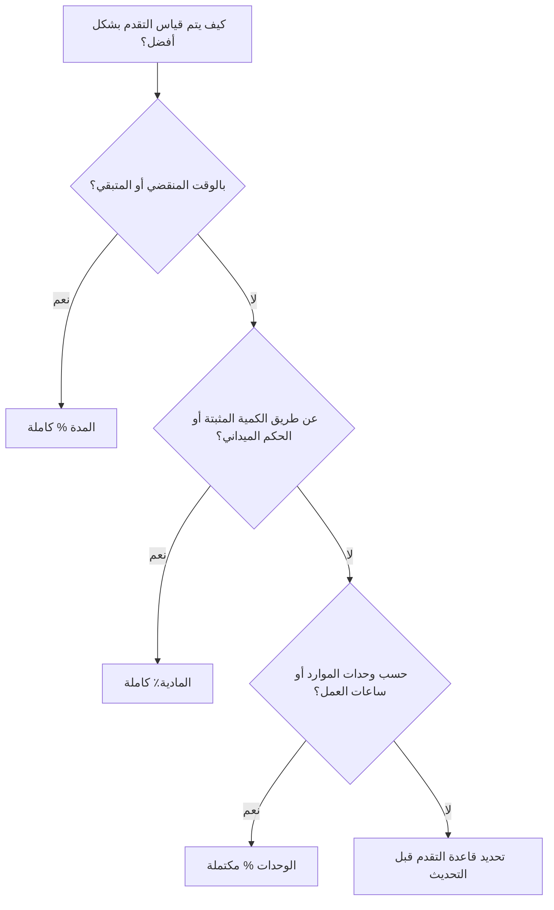

تعد النسبة المئوية للإكمال أحد مجالات التقدم الأكثر وضوحًا في Primavera P6، ولكنها أيضًا واحدة من أكثر المجالات التي يساء فهمها. يمكن أن تعني قيمة اكتمال 50% أشياء مختلفة اعتمادًا على كيفية تكوين النشاط وكيفية قياس تقدم المشروع.

في P6، يتحكم نوع النسبة المئوية للاكتمال في كيفية حساب النسبة المئوية لاكتمال النشاط أو تحديثها. ويخبر P6 ما إذا كان التقدم يجب أن يعتمد على الوقت أو الإنجاز البدني أو وحدات الموارد.

الأنواع الرئيسية للنسبة المئوية الكاملة للأنشطة هي:

- المدة % كاملة.
- المادية٪ كاملة.
- الوحدات % مكتملة.

إن اختيار الخيار الصحيح مهم لأن التقدم ليس مجرد رقم إبلاغ. فهو يؤثر على المدة المتبقية، والقيمة المكتسبة، وتقارير الموارد، ومصداقية الجدول الزمني، وجودة كل دورة تحديث.

## لماذا تعتبر النسبة المئوية للنوع الكامل أمرًا مهمًا

تحتاج الأنشطة المختلفة إلى طرق مختلفة لقياس التقدم.

بالنسبة لبعض الأنشطة، يعد الوقت مؤشرا معقولا. إذا كانت مدة المهمة 10 أيام واكتملت 5 أيام عمل، فقد يكون من المعقول القول أن النشاط قد اكتمل بنسبة 50% تقريبًا.

بالنسبة للأنشطة الأخرى، الوقت ليس كافيا. قد يقضي الطاقم 5 أيام في مهمة مدتها 10 أيام ويكمل 20% فقط من العمل البدني. وقد يكمل طاقم آخر 80% من الكمية في النصف الأول من المدة. في هذه الحالات، قد يؤدي التقدم المعتمد على المدة إلى تضليل فريق المشروع.

بالنسبة للجداول المحملة بالموارد، قد تكون الوحدات هي أفضل أساس للتقدم. إذا تم التخطيط لنشاط ما لمدة 1000 ساعة عمل وتم اكتساب 600 ساعة عمل أو استهلاكها، فقد تعكس نسبة الوحدات المكتملة التقدم بشكل أفضل.

يعتمد نوع النسبة المئوية الصحيحة للاكتمال على ما يمثله النشاط وكيفية قياس التقدم فعليًا.

## النشاط٪ مكتمل

نسبة اكتمال النشاط هي قيمة التقدم العامة المعروضة للنشاط. يعتمد مصدره على نوع النسبة المئوية للإكمال المحدد.

إذا كان النشاط يستخدم المدة % لاكتمال النشاط، فإن النسبة المئوية لاكتمال النشاط تكون مدفوعة بالعلاقة بين المدة الأصلية والفعلية والمتبقية.

إذا كان النشاط يستخدم النسبة المئوية لاكتمال النشاط الفعلي، فإن نسبة اكتمال النشاط تتبع قيمة النسبة المئوية للاكتمال الفعلي التي أدخلها المستخدم.

إذا كان النشاط يستخدم نسبة الوحدات المكتملة، فإن النسبة المئوية لاكتمال النشاط تعتمد على تقدم وحدات الموارد.

ولهذا السبب يمكن لنشاطين أن يظهرا اكتمال 50% من النشاطين ولكنهما يعنيان أشياء مختلفة تمامًا.

## المدة % كاملة

المدة % استكمال قياس التقدم على أساس الوقت. فهو يقارن مقدار المدة التي تم استهلاكها مقابل إجمالي المدة المتوقعة.

بعبارات بسيطة، إذا كان النشاط لديه 10 أيام من المدة المخطط لها أو عند الاكتمال وتم استهلاك 5 أيام، فقد يظهر النشاط حوالي 50% من المدة % مكتمل.

المدة % الاكتمال تكون مفيدة عندما يكون التقدم متناسبًا بشكل معقول مع الوقت.

تشمل الأمثلة ما يلي:

- فترات المراجعة الإدارية.
- فترات الانتظار أو المعالجة.
- مهام الدعم على أساس الوقت.
- بعض الأنشطة البسيطة التي يكون فيها إنتاج العمل ثابتًا.

مدة الاستخدام % مكتمل عندما يكون الوقت مقياسًا عادلاً للتقدم ويتم الحفاظ على المدة المتبقية بعناية.

ويكمن الخطر في أن الوقت المستغرق لا يساوي دائمًا العمل المنجز. يمكن أن تستهلك المهمة نصف المدة المخطط لها وتظل متخلفة فعليًا. إذا كان المجدول يعتمد فقط على المدة، فقد تبدو تقارير التقدم أفضل من الواقع.

## المادية٪ كاملة

يتم إدخال النسبة المئوية للإكمال الفعلي يدويًا أو تحديثها بناءً على التقدم الفعلي الفعلي. وهو يمثل ما تم إنجازه بالفعل في العمل، بغض النظر عن المدة أو وحدات الموارد.

غالبًا ما يكون هذا هو الخيار الأفضل للبناء، أو التسليمات الهندسية، أو أعمال التركيب، أو حزم التشغيل، أو أي نشاط يجب أن يعتمد التقدم فيه على إنجاز قابل للقياس.

تشمل الأمثلة ما يلي:

- تم إصدار 40% من الرسومات.
- تم تركيب 60% من علبة الكابلات.
- 75% من الأنابيب ملحومة.
- اكتمل 30% من حزمة الاختبار.
- تم الانتهاء من 100% من محاذاة المعدات.

استخدم نسبة الاكتمال الفعلي عندما يجب قياس التقدم من خلال الكمية أو حالة التسليم أو التحقق الميداني أو حكم المالك المسؤول.

والفائدة هي أنه يمكن أن يعكس الواقع بشكل أفضل من الوقت المنقضي. الخطر هو أنه يتطلب الانضباط. يجب على فريق المشروع تحديد كيفية قياس التقدم المادي، ومن يوافق عليه، وكيفية جمع الأدلة.

## الوحدات % مكتملة

الوحدات٪ اكتمال قياس التقدم بناءً على وحدات الموارد. ويقارن الوحدات الفعلية مع الوحدات عند الاكتمال.

يكون هذا مفيدًا عندما يكون الجدول محملاً بالموارد ويتم تعقب التقدم من خلال ساعات العمل أو ساعات المعدات أو وحدات الموارد الأخرى القابلة للقياس.

تشمل الأمثلة ما يلي:

- ساعات العمل الفعلية المكتسبة مقابل ساعات العمل المدرجة في الميزانية.
- ساعات المعدات المستخدمة مقابل ساعات المعدات المخططة.
- يرتبط العمل المثبت بتقدم وحدة الموارد.
- سير عمل القيمة المكتسبة على أساس الوحدات.

استخدم الوحدات % مكتملة عندما تكون وحدات الموارد موثوقة ويتم صيانتها وتشكل جزءًا من طريقة تقدم المشروع.

ويكمن الخطر في أن استهلاك الموارد لا يساوي دائمًا التقدم البدني. يمكن للفريق أن يقضي ساعات طويلة دون إكمال العمل المتوقع. لهذا السبب، تعمل النسبة المئوية لاكتمال الوحدات بشكل أفضل عندما يتم التحكم بشكل جيد في تقارير الموارد وقياس التقدم.

## كيفية اختيار النوع المناسب

إحدى الطرق العملية لاختيار نوع النسبة المئوية للاكتمال هي السؤال عن معنى التقدم بالنسبة للنشاط.

إذا كان التقدم يعني مرور الوقت، فاستخدم نسبة اكتمال المدة.

إذا كان التقدم يعني إنجاز العمل البدني، فاستخدم نسبة اكتمال العمل البدني.

إذا كان التقدم يعني أن وحدات الموارد قد تم اكتسابها أو استهلاكها، فاستخدم نسبة الوحدات المكتملة.

يجب أن يكون الاختيار متسقًا عبر مجموعات الأنشطة المماثلة. قد تستخدم التسليمات الهندسية نسبة الإكمال الفعلي. قد يستخدم تركيب البناء نسبة الاكتمال الفعلي بناءً على الكميات. قد يستخدم دعم الإدارة المستندة إلى الوقت نسبة اكتمال المدة. قد تستخدم حزم العمل كثيفة الموارد نسبة الوحدات المكتملة إذا كانت بيانات المورد موثوقة.

## العلاقة مع المدة المتبقية

يجب أن تحكي النسبة المئوية الكاملة والمدة المتبقية قصة متسقة.

يمكن أن يكون النشاط مكتملًا فعليًا بنسبة 80% ولكن لا يزال هناك 10 أيام من المدة المتبقية إذا كان العمل المتبقي صعبًا أو متأخرًا أو يعتمد على حالة أخرى. قد يكون ذلك صحيحا.

يمكن أن يكون النشاط مكتملاً بنسبة 50% من المدة لأن نصف الوقت المخطط له قد انقضى، ولكن إذا تم إنجاز 20% فقط من العمل فعليًا، فمن المحتمل مراجعة المدة المتبقية.

ولهذا السبب تتطلب التحديثات الجيدة مراجعة التقدم والتوقعات. توضح النسبة المئوية للإكمال مقدار ما تم تحقيقه. توضح المدة المتبقية مقدار الوقت الذي لا تزال هناك حاجة إليه.

## الأخطاء الشائعة

أحد الأخطاء الشائعة هو استخدام نسبة اكتمال المدة للأنشطة التي لا يتناسب فيها التقدم البدني مع الوقت. وهذا يمكن أن يجعل التقدم يبدو أفضل أو أسوأ من العمل الحقيقي.

خطأ آخر هو استخدام نسبة اكتمال المادة الفعلية بدون قاعدة قياس. إذا أبلغ أحد التخصصات عن التقدم المادي حسب الكمية المثبتة وقام آخر بالإبلاغ عن الرأي، يصبح الجدول غير متسق.

الخطأ الثالث هو استخدام الوحدات % المكتملة عندما تكون بيانات المورد غير كاملة أو غير موثوقة. إذا لم يتم الحفاظ على الوحدات الفعلية، فلن تكون قيمة التقدم جديرة بالثقة.

هناك مشكلة أخرى وهي تحديث النسبة المئوية للاكتمال مع تجاهل المدة المتبقية. يمكن أن يُظهر النشاط تقدمًا ولا يزال لديه توقعات غير واقعية.

## الممارسة الجيدة

حدد قواعد التقدم قبل بدء دورة التحديث. يجب أن يعرف فريق المشروع مجموعات الأنشطة التي تستخدم المدة أو المادة أو نسبة الوحدات المكتملة.

استخدم التخطيطات التي تعرض النسبة المئوية للنوع المكتمل، ونسبة اكتمال النشاط، ونسبة اكتمال المادة الفعلية، ونسبة اكتمال المدة، ونسبة الوحدات المكتملة، والمدة المتبقية، والبدء الفعلي، والانتهاء الفعلي، وحالة النشاط.

التحقق من عدم الاتساق مثل:

- بدأت الأنشطة بتقدم 0%.
- المدة المتبقية = 0 لكن الحالة لم تكتمل.
- تقدم بنسبة 100% بدون إنهاء فعلي.
- المادية % كاملة لا تتطابق مع الأدلة الميدانية.
- الوحدات % مكتملة بناءً على تحديثات الموارد المفقودة.

وتساعد عمليات التحقق هذه في ضمان عدم إدخال التقدم فحسب، بل أيضًا ضمان مصداقيته.

## خاتمة

يحدد نوع النسبة المئوية للإكمال في P6 كيفية قياس تقدم النشاط. المدة % الاكتمال يقيس التقدم المستند إلى الوقت. المادية ٪ مقاييس كاملة للعمل الفعلي الذي تم إنجازه. الوحدات النسبة المئوية للاكتمال يقيس تقدم وحدة الموارد.

لا يوجد نوع واحد هو الأفضل لكل نشاط. يعتمد الاختيار الصحيح على كيفية تخطيط العمل وقياسه والتحكم فيه.

يستخدم الجدول الزمني القوي أنواع النسبة المئوية الكاملة عن قصد. عندما تتطابق الطريقة مع العمل، تصبح تحديثات التقدم أكثر وضوحًا، وتصبح المدة المتبقية أكثر موثوقية، ويصبح الدفاع عن تقارير المشروع أسهل.
