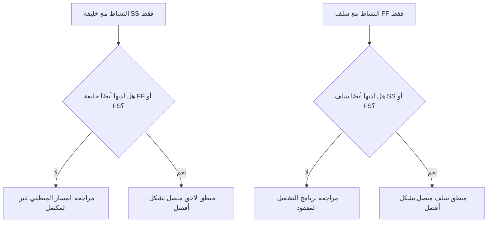

المنطق هو التمثيل الرياضي للتسلسل والتبعيات داخل جدول المشروع. فهو يشرح ما يجب أن يحدث قبل ماذا، وما هي الأنشطة التي يمكن أن تحدث في نفس الوقت، وكيف ينوي فريق المشروع الانتقال من النشاط الأول إلى الإكمال النهائي.

في جدول بريمافيرا P6 الجيد، المنطق ليس زخرفة. وهو المحرك الذي يسمح للجدول بحساب التواريخ والتعويم والمسار الحرج وحركة التنبؤ. إنه يروي قصة التنفيذ بطريقة يمكن مراجعتها وتحديها وتحسينها.

إذا كان الجدول يقول "وضع الأساسات، ثم بناء الجدران، ثم بناء السقف"، فإن المنطق هو ما يحول هذا التسلسل إلى شبكة قابلة للحساب. لا يقوم المخطط برسم جدول زمني فقط. يقوم المخطط بتحديد مسار التسليم.

## المنطق يحكي قصة العمل

كل فريق مشروع لديه طريقة مقصودة لتنفيذ المشروع. قد تطلق الهندسة التصميم حسب المنطقة. يجوز للمشتريات تسليم المعدات عن طريق الطرد. قد يقوم العمل المدني بإعداد الوصول قبل بدء الأعمال الهيكلية. قد يلزم إجراء الإكمال الميكانيكي قبل بدء التشغيل.

الروابط المنطقية هي التعبير الرياضي لتلك الخطة.

هذا الرسم البياني البسيط ليس مجرد تسلسل. إنه نموذج القرار. إذا كانت الأساسات متأخرة، فقد تكون الجدران متأخرة. إذا كانت الجدران متأخرة، فقد يكون السقف متأخرا. إذا تأخر السقف، قد تتأثر الأعمال الداخلية. يمكن أن يُظهر الجدول هذا التأثير فقط في حالة وجود المنطق.

المنطق القوي يعني أن الجدول الزمني يمكن أن يوضح سبب بدء الأنشطة، وسبب انتهائها، وما يحدث عندما يتحرك جزء من الخطة.

## لماذا يهم المنطق القوي في تاريخ البيانات

يعد مقياس "الأنشطة التي تبدأ في تاريخ البيانات بدون منطق القيادة" اختبارًا قويًا لجودة الجدول الزمني.

تاريخ البيانات هو الحد الفاصل بين الأداء الفعلي والعمل المتوقع. عندما يبدأ النشاط بالضبط في تاريخ البيانات، يجب على المراجع أن يطرح سؤالاً بسيطًا: ما الذي يدفع هذه البداية؟

إذا كان للنشاط منطق سابق صالح، فيمكن أن يوضح الجدول البداية. ربما تم إطلاق سراح المنطقة. ربما تم الانتهاء من تسليم المواد. ربما انتهى النشاط السابق وسمح للطاقم التالي بالبدء.

إذا لم يكن للنشاط منطق قيادة، تكون البداية أضعف. قد يكون النشاط موجودًا في "تاريخ البيانات" لأنه ليس له سابق، أو لأن المنطق غير مكتمل، أو لأن هناك قيدًا يفرضه، أو لأن التحديث لم يكن في حالة كاملة.

ولهذا السبب فإن المنطق القوي مهم. يجب ألا يسمح الجدول الزمني بأن يبدو العمل جاهزًا لمجرد نقل تاريخ البيانات. يجب أن تظهر الحالة الحقيقية التي تسمح ببدء العمل.

## الميزان: منطق كافي، وليس منطق زائد عن الحاجة

المنطق الجيد متوازن. يحتاج الجدول إلى علاقات كافية لربط الأنشطة بشكل صحيح بالأسلاف والخلفاء. وفي الوقت نفسه، يجب تجنب المنطق الزائد الذي يكرر نفس التبعية بطرق غير ضرورية.

يؤدي القليل جدًا من المنطق إلى إنشاء بدايات مفتوحة، وتشطيبات مفتوحة، وتعويم غير موثوق، ونتائج مسار حرج ضعيفة. الكثير من المنطق يمكن أن يجعل مراجعة الشبكة صعبة ويمكن أن يخفي المحرك الحقيقي للنشاط.

الهدف ليس تعظيم عدد العلاقات. الهدف هو تمثيل التبعيات الإلزامية والمطلوبة بشكل واضح.

لكل نشاط، يجب أن يكون المجدول قادرًا على الإجابة على ما يلي:

- ما الذي يسمح ببدء هذا النشاط؟
- ما الذي يتيحه هذا النشاط بعد ذلك؟
- ما هي العلاقة التي تقود النشاط حقًا؟
- هل أي علاقة مكررة أو غير ضرورية؟
- هل سيفهم المراجع التسلسل المقصود؟

يعد هذا التوازن أمرًا أساسيًا في مراجعات جدول مكتب إدارة المشاريع. الشبكة الكثيفة لا تعتبر شبكة قوية تلقائيًا. الشبكة الخفيفة ليست شبكة نظيفة تلقائيًا. الشبكة الصحيحة تشرح خطة التنفيذ دون فوضى.

## يحتاج كل نشاط إلى برنامج تشغيل للبدء

المنطق القوي يعني أن كل نشاط له سابقة تسمح ببدايته أو تحفزها، باستثناء الاستثناءات الصالحة لبدء المشروع أو الاستثناءات المصرح بها خارجيًا.

بالنسبة لنشاط البناء، قد يكون محرك البداية هو الوصول إلى المنطقة، أو الإكمال المسبق، أو توفر المواد، أو إصدار التصميم، أو الموافقة على التصريح، أو إكمال التجارة المسبقة. بالنسبة لنشاط الشراء، قد يكون موافقة على التصميم أو إصدار أمر الشراء. بالنسبة للتشغيل، قد يكون الإكمال الميكانيكي، أو جاهزية حزمة الاختبار، أو دوران النظام.

عندما يكون برنامج التشغيل هذا مفقودًا، يمكن أن يطفو النشاط إلى موضع مصطنع في الجدول. أثناء التحديثات، قد يظهر في تاريخ البيانات. وهذا يخلق شعورا زائفا بالاستعداد.

فكر في نشاط يسمى "تركيب المضخات". إذا بدأ في تاريخ البيانات ولكن ليس له سابقة لإكمال الأساس، أو تسليم المضخة، أو تسليم المنطقة، فإن الجدول الزمني لا يوضح سبب بدء التثبيت. قد يكون النشاط مخططًا له، لكن المنطق ليس قويًا.

## SS و FF هما نصف العلاقات

تعتبر العلاقات من البداية إلى البداية ومن النهاية إلى النهاية مفيدة، ولكن يجب استخدامها بعناية. في العديد من مراجعات الجدول الزمني، من الأفضل فهمها على أنها علاقات "نصف" لأنها لا تضع النشاط بشكل كامل في مسار منطقي كامل بمفردها.

يمكن لعلاقة SS أن تشرح متى يمكن أن يبدأ النشاط، ولكنها قد لا تشرح متى يجب أن ينتهي النشاط أو ما يتم تسليمه. يمكن أن تشرح علاقة FF محاذاة النهاية، ولكنها قد لا توضح متى يُسمح ببدء النشاط.

هذا لا يجعل SS أو FF خاطئين. العمل المتداخل أمر شائع وواقعي في كثير من الأحيان. المشكلة هي ما إذا كان النشاط متصلاً بشكل كامل.

على سبيل المثال:

- عادةً ما يجب أن يكون للنشاط الذي يتبعه خليفة SS أيضًا خليفة FF أو FS.
- عادةً ما يكون للنشاط الذي له سلف FF سلف SS أو FS.

يساعد هذا في منع ربط الأنشطة على جانب واحد فقط من مدتها. يجب أن يوضح الجدول كيفية بدء العمل وكيفية اكتماله.

## منطق قوي في الممارسة

يجب أن تبدأ المراجعة المنطقية العملية بالأنشطة القريبة من تاريخ البيانات، والعمل الهام وشبه الحرج، ومسارات التسليم الرئيسية. هذه المجالات لها أكبر الأثر على عملية صنع القرار الحالية.

في P6، تتضمن أعمدة المراجعة المفيدة معرف النشاط، واسم النشاط، وWBS، والبدء، والانتهاء، وحالة النشاط، وإجمالي التعويم، والأسلاف، والخلفاء، ونوع العلاقة، والتأخر، والقيود، والتقويم، ومؤشرات علاقة القيادة إذا كانت متوفرة.

لكل نشاط يبدأ في تاريخ البيانات، اسأل:

- هل النشاط جاهز حقًا للبدء؟
- أي سلف يسمح بالبدء؟
- هل هذا السلف كامل أم قيد التنفيذ أم متوقع؟
- هل العلاقة تقود؟
- هل القيد أو التاريخ المتوقع يحل محل المنطق؟
- هل يحتوي النشاط أيضًا على منطق لاحق صالح؟

إذا كانت الإجابة غير واضحة، فيجب مراجعة النشاط مع المالك المسؤول. قد يكون التصحيح عبارة عن إضافة سابقة مفقودة، أو تغيير نوع العلاقة، أو إزالة قيد، أو تحديث القيم الفعلية، أو توثيق استثناء صالح.

## تجنب المنطق الاصطناعي

أحد الأخطاء هو إضافة العلاقات فقط لتمرير مقياس. وهذا لا يخلق منطقا قويا. إنه يخلق منطقًا مصطنعًا.

يجب أن تمثل العلاقات تبعيات حقيقية. إذا كان الرابط لا يعكس تسلسل البناء، أو الإصدار الهندسي، أو الحاجة إلى الشراء، أو الوصول، أو الموافقة، أو الاختبار، أو التشغيل، أو التسليم، فقد لا ينتمي إلى الشبكة.

خطأ آخر هو ترك المنطق الزائد لأنه يبدو أكثر أمانًا. إذا كانت نفس التبعية ممثلة بالفعل بعلاقة أكثر وضوحًا، فقد تؤدي الروابط الإضافية إلى إرباك المسار الحرج وتجعل تدقيق الشبكة أكثر صعوبة.

المنطق القوي واضح وهادف ويمكن الدفاع عنه.

## خاتمة

المنطق هو القصة الرياضية لكيفية تنفيذ المشروع. فهو يحدد ما يجب أن يحدث أولاً، وما يمكن أن يحدث معًا، وما يليه بعد ذلك.

المنطق القوي لا يعني إضافة أكبر عدد ممكن من الروابط. ويعني إضافة الروابط الصحيحة: وهي كافية لربط كل نشاط بأسلافه وخلفائه الحقيقيين، ولكن ليس كثيرًا بحيث تصبح الشبكة زائدة عن الحاجة أو مضللة.

عندما تبدأ الأنشطة في تاريخ البيانات بدون منطق القيادة، فإن الجدول يكشف عن نقطة ضعف في تلك القصة. قد يظهر النشاط على أنه جاهز، لكن الشبكة لا توضح السبب.

يجب أن يجيب الجدول الزمني الموثوق به على هذا السؤال بوضوح. ما الذي يسمح لهذا العمل بالبدء؟ ما الذي يمكن أن يفعله بعد ذلك؟ إذا كان الجدول الزمني قادرا على الإجابة على كليهما، فإن المنطق يصبح قويا. إذا لم يكن الأمر كذلك، فسيكون لدى فريق المشروع المزيد من العمل التسلسلي للقيام به قبل الوثوق بالتنبؤات.
