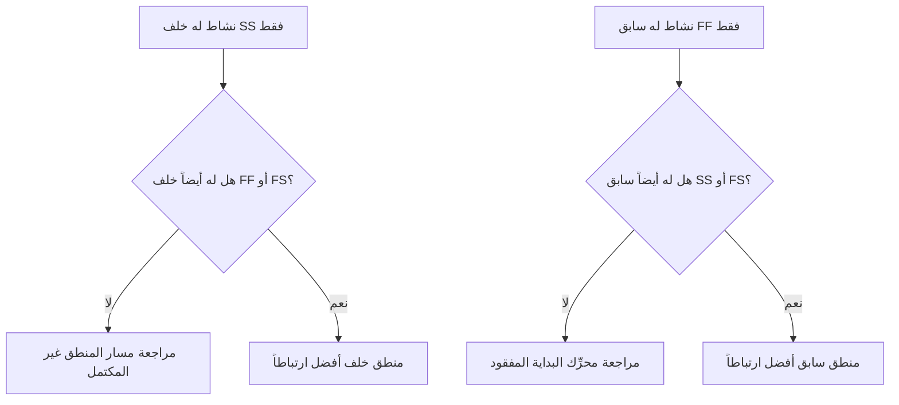

المنطق هو التمثيل الرياضي للتسلسل والتبعيات داخل الجدول الزمني للمشروع. يشرح ما الذي يجب أن يحدث قبل ماذا، وأي الأنشطة يمكن أن تحدث في الوقت ذاته، وكيف ينوي فريق المشروع الانتقال من النشاط الأول إلى الإتمام النهائي.

في جدول Primavera P6 الجيد، المنطق ليس زينةً. إنه المحرك الذي يسمح للجدول الزمني بحساب التواريخ والفائض الزمني والمسار الحرج وحركة التوقع. يروي قصة التنفيذ بطريقة يمكن مراجعتها وتحديها وتحسينها.

إذا قال الجدول الزمني "إنجاز الأساسات، ثم بناء الجدران، ثم بناء السقف"، فإن المنطق هو ما يحوّل ذلك التسلسل إلى شبكة قابلة للحساب. المخطط لا يرسم جدولاً زمنياً فحسب. المخطط يُعرِّف مسار التسليم.

## المنطق يروي قصة العمل

كل فريق مشروع له طريقة مقصودة لتنفيذ المشروع. قد تُصدر الهندسة التصميم حسب المنطقة. قد تُسلّم المشتريات المعدات حسب الحزمة. قد يُعدّ العمل المدني مسار الوصول قبل بدء الأعمال الهيكلية. قد يحتاج الإتمام الميكانيكي إلى الحدوث قبل أن يبدأ التشغيل.

روابط المنطق هي التعبير الرياضي عن تلك الخطة.

هذا الرسم البياني البسيط ليس مجرد تسلسل. إنه نموذج قرار. إذا تأخرت الأساسات، فقد تتأخر الجدران. إذا تأخرت الجدران، فقد يتأخر السقف. إذا تأخر السقف، فقد تتأثر الأعمال الداخلية. لا يمكن للجدول الزمني إظهار ذلك التأثير إلا إذا كان المنطق موجوداً.

المنطق المتين يعني أن الجدول الزمني يستطيع تفسير سبب بدء الأنشطة، وسبب انتهائها، وما يحدث عندما تتحرك جزء من الخطة.

## لماذا يهم المنطق المتين عند تاريخ البيانات

مقياس "الأنشطة التي تبدأ عند تاريخ البيانات بدون منطق محرِّك" هو اختبار قوي لجودة الجدول الزمني.

تاريخ البيانات هو الحد الفاصل بين الأداء الفعلي وعمل التوقع. عندما يبدأ نشاط تماماً عند تاريخ البيانات، يجب على المراجع طرح سؤال بسيط: ما الذي يحرك هذه البداية؟

إذا كان النشاط له منطق سابق صالح، يمكن للجدول الزمني تفسير البداية. ربما أُطلقت منطقة. ربما اكتمل تسليم مادة. ربما انتهى النشاط السابق وسمح للطاقم التالي بالبدء.

إذا لم يكن للنشاط منطق محرِّك، فالبداية أضعف. قد يجلس النشاط عند تاريخ البيانات لأنه لا سابق له، أو لأن المنطق غير مكتمل، أو لأن قيداً يُجبره، أو لأن التحديث لم يُحدَّث بالكامل.

لهذا السبب يهم المنطق المتين. لا ينبغي للجدول الزمني السماح بظهور عمل جاهز لمجرد أن تاريخ البيانات تحرك. يجب أن يُظهر الشرط الحقيقي الذي يسمح للعمل بالبدء.

## التوازن: منطق كافٍ، لا منطق زائد

المنطق الجيد متوازن. تحتاج الشبكة إلى علاقات كافية لربط الأنشطة بشكل صحيح بالسوابق والخلفاء. في الوقت ذاته، يجب تجنب المنطق الزائد الذي يكرر التبعية ذاتها بطرق غير ضرورية.

قلة المنطق تُنشئ بدايات مفتوحة ونهايات مفتوحة وفائضاً زمنياً غير موثوق ونتائج ضعيفة للمسار الحرج. كثرة المنطق يمكن أن تجعل الشبكة صعبة المراجعة ويمكن أن تُخفي المحرك الحقيقي للنشاط.

الهدف ليس تعظيم عدد العلاقات. الهدف هو تمثيل التبعيات الإلزامية والمطلوبة بوضوح.

لكل نشاط، يجب أن يكون المخطط قادراً على الإجابة على:

- ما الذي يسمح لهذا النشاط بالبدء؟
- ما الذي يُتيح هذا النشاط للتالي؟
- أي علاقة تحرك النشاط فعلاً؟
- هل هناك علاقة مكررة أو غير ضرورية؟
- هل سيفهم المراجع التسلسل المقصود؟

هذا التوازن محوري في مراجعات جداول PMO. الشبكة الكثيفة ليست تلقائياً شبكة قوية. والشبكة الخفيفة ليست تلقائياً شبكة نظيفة. الشبكة الصحيحة تشرح خطة التنفيذ دون تعقيد زائد.

## كل نشاط يحتاج إلى محرِّك بداية

المنطق المتين يعني أن كل نشاط له سابق يسمح أو يُطلق بداءته، باستثناء بدايات المشروع الصالحة أو الاستثناءات المأذون بها خارجياً.

لنشاط بنائي، محرِّك البداية قد يكون إذن الدخول إلى المنطقة، أو إتمام السابق، أو توافر المواد، أو إصدار التصميم، أو الموافقة على التصريح، أو إتمام مهنة سابقة. لنشاط مشتريات، قد يكون الموافقة على التصميم أو إصدار أمر الشراء. للتشغيل، قد يكون الإتمام الميكانيكي أو جاهزية حزمة الاختبار أو تسليم النظام.

عندما يكون محرِّك البداية هذا مفقوداً، يمكن للنشاط أن يطفو إلى موضع اصطناعي في الجدول الزمني. خلال التحديثات، قد يظهر عند تاريخ البيانات. هذا يُنشئ إحساساً زائفاً بالجاهزية.

فكّر في نشاط يسمى "تركيب المضخات". إذا كان يبدأ عند تاريخ البيانات ولا يوجد له سابق لإتمام الأساسات أو تسليم المضخات أو استلام المنطقة، فإن الجدول الزمني لا يشرح سبب إمكانية بدء التركيب. قد يكون النشاط مخططاً، لكن المنطق ليس متيناً.

## روابط SS وFF هي علاقات نصفية

علاقات البدء مع البدء (SS) والانتهاء مع الانتهاء (FF) مفيدة، لكن يجب استخدامها بعناية. في كثير من مراجعات الجداول الزمنية، يُفهَم أنها "نصفية" لأنها لا تضع النشاط في مسار منطقي كامل بمفردها.

علاقة SS يمكنها تفسير متى يمكن أن يبدأ نشاط، لكنها قد لا تفسر متى يجب أن ينتهي النشاط أو ما الذي يسلّمه. علاقة FF يمكنها تفسير توافق الانتهاء، لكنها قد لا تفسر متى يُسمح للنشاط بالبدء.

هذا لا يجعل SS أو FF خاطئتين. التداخل في العمل شائع وكثيراً ما يكون واقعياً. المسألة هي ما إذا كان النشاط مرتبطاً بالكامل.

على سبيل المثال:

- النشاط الذي له خلف SS يجب أن يكون له عادةً أيضاً خلف FF أو FS.
- النشاط الذي له سابق FF يجب أن يكون له عادةً أيضاً سابق SS أو FS.

هذا يساعد على منع ربط الأنشطة على جانب واحد فقط من مدتها. يجب أن يشرح الجدول الزمني كيف يبدأ العمل وكيف ينتهي.

## المنطق المتين في الممارسة

يجب أن تبدأ مراجعة المنطق العملية بالأنشطة القريبة من تاريخ البيانات والعمل الحرج وقريب الحرج والمسارات الرئيسية للاستلام. هذه المناطق لها أعلى تأثير على صنع القرار الراهن.

في P6، تشمل أعمدة المراجعة المفيدة معرّف النشاط واسمه ومستوى هيكل تقسيم العمل (WBS) والبداية والانتهاء وحالة النشاط والفائض الزمني الإجمالي والسوابق والخلفاء ونوع العلاقة والتأخير والقيود والتقويم ومؤشرات العلاقة المحرِّكة إن توفرت.

لكل نشاط يبدأ عند تاريخ البيانات، اسأل:

- هل النشاط جاهز فعلاً للبدء؟
- أي سابق يسمح بالبداية؟
- هل ذلك السابق مكتمل أم قيد التنفيذ أم متوقع؟
- هل العلاقة محرِّكة؟
- هل قيد أو تاريخ متوقع يحل محل المنطق؟
- هل للنشاط أيضاً منطق خلف صالح؟

إذا كانت الإجابة غير واضحة، فيجب مراجعة النشاط مع المالك المسؤول. قد يتضمن التصحيح إضافة سابق مفقود، أو تغيير نوع العلاقة، أو إزالة قيد، أو تحديث الفعليات، أو توثيق استثناء صالح.

## تجنب المنطق الاصطناعي

أحد الأخطاء هو إضافة علاقات فقط لاجتياز مقياس. هذا لا يُنشئ منطقاً متيناً. إنه يُنشئ منطقاً اصطناعياً.

يجب أن تمثّل العلاقات تبعيات حقيقية. إذا كان رابط ما لا يعكس تسلسل البناء أو إصدار الهندسة أو احتياج المشتريات أو المدخل أو الموافقة أو الاختبار أو التشغيل أو الاستلام، فقد لا ينتمي إلى الشبكة.

خطأ آخر هو ترك المنطق الزائد لأنه يبدو أكثر أماناً. إذا كانت التبعية ذاتها مُمثَّلة بالفعل بعلاقة أوضح، فإن الروابط الإضافية قد تُربك المسار الحرج وتجعل الشبكة أصعب للتدقيق.

المنطق المتين واضح وهادف وقابل للدفاع عنه.

## الخلاصة

المنطق هو القصة الرياضية لكيفية تنفيذ المشروع. يُعرِّف ما يجب أن يحدث أولاً، وما يمكن أن يحدث معاً، وما يتبع بعد ذلك.

المنطق المتين لا يعني إضافة أكبر عدد ممكن من الروابط. يعني إضافة الروابط الصحيحة: بما يكفي لربط كل نشاط بسوابق وخلفاء حقيقيين، لكن لا يكفي لجعل الشبكة زائدة أو مضللة.

عندما تبدأ الأنشطة عند تاريخ البيانات دون منطق محرِّك، يكشف الجدول الزمني عن ضعف في تلك القصة. قد يُظهَر النشاط على أنه جاهز، لكن الشبكة لا تفسر السبب.

يجب على الجدول الزمني الموثوق الإجابة على ذلك السؤال بوضوح. ما الذي يسمح لهذا العمل بالبدء؟ ما الذي يُتيحه للتالي؟ إذا استطاع الجدول الزمني الإجابة على كليهما، يصبح المنطق متيناً. إذا لم يستطع، فإن فريق المشروع لديه المزيد من عمل التسلسل قبل أن يمكن الوثوق بالتوقعات.
