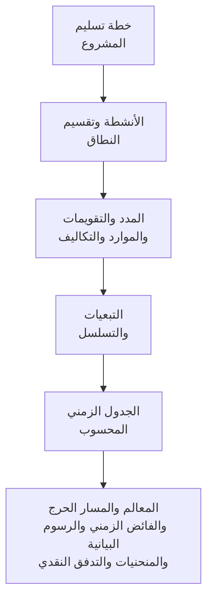

الجدول الزمني للمشروع أكثر من مجرد قائمة تواريخ. فهو تمثيل بياني ومنطقي لخطة تسليم المشروع. يشرح كيف سيُنفَّذ المشروع من البداية إلى النهاية، وكيف تترابط حزم العمل، ومتى ينبغي الوصول إلى المعالم الرئيسية، وما هي المعلومات التي يجب أن يستند إليها فريق المشروع عند اتخاذ القرارات.

بعبارة بسيطة، يحوّل الجدول الزمني خطة المشروع إلى خارطة طريق. يساعد كل المعنيين على فهم ما يجب إنجازه، ومتى يجب أن يحدث، ومن المسؤول عن تحقيقه. بالنسبة لمديري المشاريع والمخططين وفرق البناء والمهندسين ومسؤولي المشتريات ومراجعي PMO، يصبح الجدول الزمني أحد الأدوات الرئيسية للتنسيق والرقابة.

الجدول الزمني جدول زمني، لكنه ليس جدولاً زمنياً فحسب. قد يعرض جدول ضعيف التواريخ. أما الجدول القوي فيشرح سبب موثوقية تلك التواريخ.

## الجدول الزمني بوصفه خارطة طريق للتسليم

كل مشروع يبدأ بنية. يعرف الفريق ما يجب تسليمه: مبنى، أو منشأة، أو نظام صناعي، أو إغلاق، أو أصل بنية تحتية، أو حزمة عمل. لكن التسليم يتطلب أكثر من معرفة الهدف النهائي. يجب على الفريق فهم التسلسل.

ما الذي يأتي أولاً؟ ما الذي يمكن أن يحدث في وقت واحد؟ ما الذي يجب أن ينتظر الموافقة على التصميم، أو تسليم المواد، أو المدخل، أو إصدار التصريح، أو الاختبار، أو الاستلام؟ أي الأنشطة تتحكم في تاريخ الانتهاء؟ أي المعالم الأكثر أهمية للعميل؟

يجيب الجدول الزمني على هذه الأسئلة بتحويل الخطة إلى أنشطة ومدد وتبعيات وتقويمات وموارد وتكاليف ومعالم.

الجدول الزمني البياني مفيد لأن الناس يمكنهم رؤية العمل. وشبكة المنطق مفيدة لأن البرنامج يمكنه حساب العمل. يتيح كلاهما معاً للجدول الزمني أن يصبح أداة تواصل وأداة رقابة في آنٍ واحد.

## ما الذي يُغذّي الجدول الزمني

الجدول الزمني لا يعدو كونه موثوقاً بقدر المعلومات المستخدمة في بنائه. في Primavera P6، يُغذَّى الجدول الزمني بعدة مدخلات رئيسية.

المدخل الأول هو قائمة الأنشطة. تقسّم الأنشطة المشروع إلى قطع عمل قابلة للإدارة. يجب أن تكون كل نشاط واضحاً بما يكفي للتخطيط والمتابعة والقياس.

المدخل الثاني هو المدة الحتمية. وهي وقت العمل المخطط اللازم لإتمام كل نشاط. يجب أن تعكس المدة أسلوب التنفيذ وافتراضات الإنتاجية وحجم الطاقم والمدخل وقيود مكان العمل وظروف المشروع.

المدخل الثالث هو منطق التبعية. تشرح التبعيات كيف ترتبط الأنشطة ببعضها البعض. قد يحتاج نشاط إلى الانتهاء قبل أن يبدأ آخر. قد يبدأ نشاطان معاً. قد يحتاج إنهاءان إلى التوافق. تُنشئ هذه العلاقات شبكة CPM.

المدخل الرابع هو التسلسل. التسلسل هو الترتيب العملي للتنفيذ. يأخذ في الاعتبار قابلية البناء وتدفق الهندسة وتوقيت المشتريات والمدخل ومنطق التشغيل واستراتيجية الاستلام وأولويات العميل.

المدخل الخامس هو الموارد والتكاليف. يتيح تحميل الموارد للجدول الزمني إظهار الطلب على العمالة والمعدات والمواد عبر الزمن. يتيح تحميل التكاليف للجدول الزمني دعم التدفق النقدي وقيمة الإنجاز والتوقعات المالية.

عندما تكون هذه المدخلات كاملة وواقعية، يمكن للجدول الزمني إنتاج مخرجات مفيدة.

## ما الذي يخبرنا به الجدول الزمني

يوضح الجدول الزمني المبني جيداً المدة الإجمالية للمشروع. يعرض معالم الإتمام المخططة والمنجزات المؤقتة. يُنتج رسوماً بيانية للموارد تُظهر متى يرتفع الطلب على العمالة أو المعدات وينخفض. يدعم منحنيات التقدم ومنحنيات التدفق النقدي وتقارير قيمة الإنجاز والتخطيط للمستقبل القريب.

الأهم من ذلك، يُحدد المسار الحرج (Critical Path) أو أطول مسار. وهو سلسلة الأعمال التي تتحكم في إنهاء المشروع. إذا تأخرت الأنشطة الواقعة على ذلك المسار، فقد يتأخر تاريخ إتمام المشروع. لهذا السبب يكتسب المنطق أهمية بالغة. بدون تبعيات جيدة، قد لا يُظهر المسار الحرج المحركات الحقيقية للمشروع.

الفائض الزمني (Float) مخرج مهم آخر. يخبر الفائض الزمني بمقدار المرونة التي يتمتع بها نشاط ما قبل أن يؤثر على نشاط آخر أو على إنهاء المشروع. لكن الفائض الزمني لا يكون ذا معنى إلا عندما تكون شبكة الجدول الزمني مكتملة. إذا كانت الأنشطة تفتقر إلى المنطق، فقد يبدو الفائض الزمني أفضل أو أسوأ من الواقع.

## لماذا يجعل المنطق الجدول الزمني موثوقاً

هنا تكتسب مقياس "الأنشطة التي تبدأ عند تاريخ البيانات بدون منطق محرِّك" أهميته.

تاريخ البيانات (Data Date) في P6 هو الحد الفاصل بين الأداء الفعلي والتوقع. كل ما قبل تاريخ البيانات يجب أن يمثّل ما حدث بالفعل. كل ما بعده يجب أن يمثّل الخطة من الآن فصاعداً.

عندما تبدأ الأنشطة تماماً عند تاريخ البيانات دون منطق يحركها، يُصدر الجدول الزمني إشارة تحذير. قد يبدو وكأن العمل جاهز للبدء فوراً، لكن الجدول الزمني قد لا يستطيع تفسير السبب. ربما لا يوجد سابق يُظهر أن المنطقة متاحة، ولا رابط لتسليم المواد، ولا ارتباط بالموافقة على التصميم، ولا اتصال بإصدار التفتيش، ولا منطق من العمل السابق.

هذا مهم لأن الجدول الزمني لا ينبغي له ببساطة وضع العمل في تاريخ محدد. يجب أن يشرح المسار إلى ذلك التاريخ.

إذا بدأ نشاط عند تاريخ البيانات لأن جميع أعمال السابق المطلوبة مكتملة والمنطق يدعم البدء، فإن التاريخ يكون قابلاً للدفاع عنه. أما إذا بدأ هناك لأن النشاط مفتوح أو غير مدفوع أو مقيَّد أو مُحدَّث بشكل سيئ، فإن التاريخ يكون ضعيفاً. قد يعتقد فريق المشروع أن العمل جاهز بينما لم يتم نمذجة الشروط التمكينية الحقيقية.

## مثال عملي

تخيّل جدولاً زمنياً لمشروع بتاريخ بيانات هو الأول من يونيو. بعد التحديث، تبدأ عدة أنشطة في الأول من يونيو:

- تركيب حامل الكابلات في المنطقة ب.
- بدء اختبار ضغط الأنابيب.
- بدء محاذاة المعدات.
- تعبئة طاقم العزل.

للوهلة الأولى، يبدو الجدول الزمني للمستقبل القريب مزدحماً وجاهزاً. لكن عندما يراجع المخطط المنطق، تتضح المشكلة. تركيب حامل الكابلات ليس مرتبطاً بتسليم المواد. اختبار الضغط ليس مرتبطاً بإتمام الأنابيب. تفتقر محاذاة المعدات إلى السابق لإتمام الأعمال الميكانيكية. تعبئة طاقم العزل ليس لها سابق يتعلق بإصدار إذن الدخول.

يُظهر الجدول الزمني العمل عند تاريخ البيانات، لكنه لا يشرح سبب إمكانية البدء. هذه ليست خارطة طريق موثوقة. إنها قائمة بالنوايا قصيرة المدى.

الحل هو إضافة أو تصحيح منطق CPM الحقيقي. إذا كان تسليم المواد يحرك تركيب حامل الكابلات، فربطه. إذا كان إتمام الأنابيب يحرك اختبار الضغط، فربطه. إذا كان إصدار إذن الدخول يحرك العزل، فنمذجة ذلك الشرط. بعد إعادة الحساب، قد تظل بعض الأنشطة تبدأ قرب تاريخ البيانات، لكن الجدول الزمني يستطيع الآن تفسير السبب.

## ما الذي يجب أن يفعله الجدول الزمني الجيد

يجب أن يساعد الجدول الزمني الجيد الفريق على رؤية الخطة واختبارها وإدارتها.

يجب أن يُظهر ما يجب إنجازه. يجب أن يشرح ترتيب العمل. يجب أن يحدد من يحتاج إلى التصرف ومتى. يجب أن يكشف المسار الحرج. يجب أن يدعم تخطيط الموارد وقياس التقدم وتوقع التدفق النقدي وتقارير PMO.

يجب أيضاً أن يجعل نقاط الضعف مرئية. المنطق المفقود والقيود الصارمة والتواريخ القديمة والبدايات المفتوحة والنهايات المفتوحة والأنشطة المتجمعة عند تاريخ البيانات ليست مجرد مشكلات تقنية. إنها تؤثر على كيفية فهم فريق المشروع للجاهزية والمخاطر والرقابة.

## الخلاصة

الجدول الزمني هو خطة تسليم المشروع معبَّر عنها بالوقت والمنطق والعمل القابل للقياس. وهو خارطة طريق ونموذج حساب وأداة تواصل.

عندما يُبنى جيداً، يخبر فريق المشروع بما يجب أن يحدث، ومتى يجب أن يحدث، ولماذا التواريخ موثوقة. عندما تبدأ الأنشطة عند تاريخ البيانات دون منطق محرِّك، تضعف تلك الموثوقية. يتوقف الجدول الزمني عن شرح الخطة ويبدأ في التخمين حول الخطوة التالية.

لهذا السبب، يجب أن تطرح مراجعات جودة الجدول الزمني دائماً سؤالاً بسيطاً: هل يشرح الجدول الزمني سبب بدء العمل عند بدئه؟ إذا كانت الإجابة نعم، فإن الجدول الزمني يؤدي دوره. إذا كانت الإجابة لا، فإن خارطة الطريق تحتاج إلى مزيد من المنطق قبل أن يمكن الوثوق بها.
