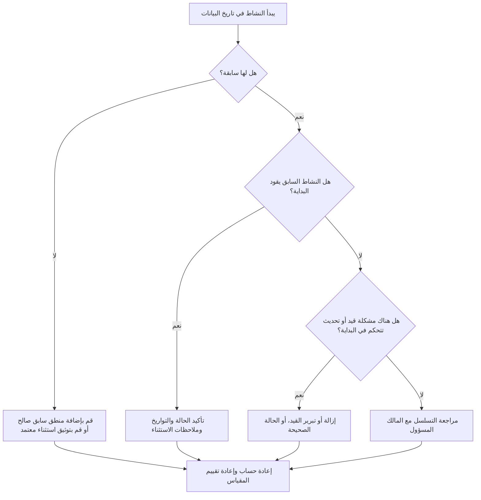

## غاية

يساعد هذا الدليل القائمين على الجدولة وفرق التحكم في المشروع على تقليل أو إلغاء الأنشطة التي تمت جدولتها للبدء في تاريخ بيانات Primavera P6 دون منطق سابق صالح يقود البداية. وينطبق ذلك على جدولة مراجعات الجودة، والفحوصات الصحية لمكتب إدارة المشاريع (PMO)، والتحقق من صحة دورة التحديث.

الهدف هو التأكد من أن العمل على المدى القريب مدعوم بمنطق واضح لإدارة CPM وأن الأنشطة لا تبدأ في تاريخ البيانات فقط بسبب العلاقات المفقودة أو القيود أو التواريخ اليدوية أو تحديثات التقدم غير المكتملة.

## قبل أن تبدأ

اجمع المعلومات التالية قبل اتخاذ الإجراء:

- نتيجة التقييم الحالية لهذا المقياس.
- تاريخ بيانات المشروع المستخدم في أحدث حساب للجدول الزمني.
- قائمة بالأنشطة المفتوحة أو التي لم تبدأ مع تاريخ بدء يساوي تاريخ البيانات.
- تفاصيل العلاقة السابقة واللاحقة لكل نشاط.
- القيود والتواريخ المتوقعة والتواريخ الفعلية ومهام التقويم.
- خيارات جدولة P6 المستخدمة للتحديث، بما في ذلك المنطق المحتفظ به أو إعدادات تجاوز التقدم حيثما كان ذلك مناسبًا.
- أي استثناءات معتمدة، مثل أنشطة بدء المشروع، أو معالم الواجهة الخارجية، أو عمليات البدء الموجهة من المالك.

## فهم النتيجة الخاصة بك

والنتيجة القوية هي عدم وجود أي أنشطة لم يتم حلها بدءًا من تاريخ البيانات دون توجيه المنطق السابق. وهذا يعني أن العمل الحالي وعلى المدى القريب متصل بشبكة الجدولة وأن تاريخ البيانات لا يخفي التسلسل المفقود.

قد تتضمن النتيجة المقبولة عددًا صغيرًا من الاستثناءات الموثقة. ويجب مراجعة هذه الأمور والموافقة عليها، وليس تجاهلها. على سبيل المثال، قد لا يحتاج حدث رئيسي لإشعار بالمتابعة أو نشاط معتمد خارجيًا إلى سابق عادي، ولكن يجب أن يكون السبب مرئيًا للمراجعين.

تعني النتيجة الضعيفة أن العديد من الأنشطة تبدأ في تاريخ البيانات دون وجود محرك منطقي واضح. قد يشير هذا إلى بدايات مفتوحة، أو علاقات سابقة مفقودة، أو قيود مفرطة، أو تحديثات تقدم غير مكتملة، أو أنشطة لم يتم إعادة ترتيبها بشكل صحيح بعد التحديث الأخير.

## هدف التحسين

الهدف هو 0 أنشطة لم يتم حلها بدءًا من تاريخ البيانات بدون منطق قيادة صالح.

هدف التحسين ليس فقط تقليل العدد. الهدف الأعمق هو التأكد من أن كل نشاط بالقرب من تاريخ البيانات له سبب يمكن الدفاع عنه لبدء التنبؤ به. بعد التصحيح، يجب أن يكون لكل نشاط متأثر إما منطق سابق مناسب، أو استثناء موثق، أو حالة/حالة تاريخ مصححة.

## خطة العمل

### الخطوة 1: تحديد المشكلة الرئيسية

قم بإنشاء تخطيط P6 أو تقرير يقوم بتصفية الأنشطة المفتوحة أو التي لم تبدأ مع تاريخ بدء يساوي تاريخ البيانات. قم بتضمين أعمدة لمعرف النشاط، واسم النشاط، وهيكل تنظيم العمل، والبدء، والانتهاء، والحالة، وإجمالي السماحية الزمنية، والتقويم، والقيد الأساسي، والأسلاف، والخلفاء، ومؤشرات العلاقة المحركة إذا كانت متوفرة.

راجع كل نشاط واسأل:

- هل للنشاط أي سابقة؟
- إذا كان أسلافهم موجودين، فهل هم بالفعل يقودون البداية؟
- هل يتم الاحتفاظ بالنشاط أو نقله بواسطة قيد؟
- هل يفتقد النشاط بداية فعلية أو تحديثًا للتقدم؟
- هل يعد النشاط استثناءً صالحًا، مثل حدث رئيسي لبدء المشروع؟
- هل ينتمي النشاط إلى منطقة WBS حيث المنطق ضعيف بشكل عام؟

قم بتجميع النتائج في أسباب عملية: أسلاف مفقودة، أو أسلاف غير قادرين على القيادة، أو قيود أو تواريخ متوقعة، أو أخطاء التحديث/الحالة، أو الاستثناءات المعتمدة.

### الخطوة 2: تطبيق الإصلاحات الموصى بها

ابدأ بالمنطق المفقود أو الضعيف. أضف علاقات سابقة صالحة تمثل التسلسل الحقيقي للعمل، مثل العلاقات من النهاية إلى البداية، أو من البداية إلى البداية، أو من النهاية إلى النهاية حيثما كان ذلك مناسبًا. تجنب إضافة علاقات فقط لتلبية المقياس؛ يجب أن تعكس كل علاقة تبعية حقيقية للبناء أو الهندسة أو المشتريات أو الوصول أو الموافقة أو التسليم.

قم بمراجعة القيود بعد ذلك. إذا كان النشاط يبدأ في تاريخ البيانات بسبب قيد البدء، فتأكد مما إذا كان القيد مبررًا تعاقديًا أو تشغيليًا. إزالة القيود غير الضرورية والسماح للنشاط بأن يكون مدفوعًا بالمنطق. إذا كان القيد صالحًا، فقم بتوثيق السبب والتأكد من أنه لا يشوه المسار الحرج.

التحقق من حالة التقدم. إذا كان العمل قد بدأ بالفعل، فقم بتحديث البداية الفعلية والمدة المتبقية بشكل صحيح. إذا لم يبدأ العمل، فتأكد من أن بداية التنبؤ يجب أن تظل في تاريخ البيانات. يجب ألا يبدو النشاط جاهزًا للبدء لمجرد أن دورة التحديث أوصلته إلى التاريخ الحالي.

بعد إجراء التغييرات، قم بإعادة حساب الجدول الزمني ومراجعة الأنشطة المتأثرة مرة أخرى. تأكد من أن تاريخ البدء أصبح الآن مدفوعًا بالمنطق، أو تم وضعه بشكل صحيح، أو موثق كاستثناء معتمد.

### الخطوة 3: إزالة أدوات الحظر الشائعة

تشمل العوائق الشائعة ردود الفعل الميدانية غير الواضحة، ومعلومات الواجهة المفقودة، والضغط لجعل العمل على المدى القريب يبدو جاهزًا. قم بحل هذه المشكلات من خلال مراجعة الأنشطة المتأثرة مع التقديمات الزمنية أو مديري الإنشاءات أو مالكي المشتريات أو مديري الحزم.

مانع شائع آخر هو إساءة استخدام القيود كبديل للمنطق. قد تكون هناك حاجة إلى قيود في بعض الحالات، لكن لا ينبغي أن تحل محل شبكة الجدول الزمني. إذا تم الاحتفاظ بالقيد، قم بتوثيق سبب وجوده وكيفية تأثيره على السماحية الزمنية والمسار الأطول.

تحقق أيضًا مما إذا كانت المشكلة ناجمة عن إعدادات حساب الجدول الزمني أو ممارسات التحديث. إذا كان تجاوز التقدم، أو المنطق المحتفظ به، أو التقدم خارج التسلسل، أو التنفيذ غير الكامل يؤثر على النتيجة، فقم بمحاذاة طريقة التحديث مع إجراء ضوابط المشروع قبل إعادة تقييم المقياس.

### الخطوة 4: التحقق من صحة التغييرات

التحقق من صحة الجدول الزمني المصحح قبل التقييم التالي. أعد تشغيل عامل التصفية للأنشطة المفتوحة أو التي لم تبدأ بدءًا من تاريخ البيانات بدون المنطق المحرك. تأكد من تصحيح كل عنصر متبقي أو توثيقه كاستثناء معتمد.

قم بمراجعة إجمالي السماحية الزمنية والمسار الأطول وأنشطة البحث المستقبلية على المدى القريب بعد إعادة الحساب. قد يؤدي التصحيح المنطقي إلى تغيير المسار الحرج أو الكشف عن مشكلات إضافية في التسلسل. إذا كانت حركة الجدول الزمني كبيرة، قم بإبلاغ التأثير إلى قائد ضوابط المشروع أو مراجع مكتب إدارة المشاريع.

## جدول التحسين

### اليوم الأول: المراجعة والتشخيص

قم بتشغيل المقياس، وتأكيد تاريخ البيانات، وإنتاج قائمة الأنشطة. قم بفصل النتائج إلى المنطق المفقود، والمنطق غير الدافع، والقيود، وأخطاء الحالة، والاستثناءات المحتملة.

### الأيام 2-3: تنفيذ الإجراءات ذات الأولوية

قم بتصحيح الأنشطة ذات التأثير الأعلى أولاً، وخاصة الأنشطة الحرجة أو شبه الحرجة. قم بإضافة منطق سابق صالح، وإزالة القيود غير الضرورية، وتحديث الحالة غير الصحيحة، واستثناءات المستند.

### الأيام 4-5: مراقبة النتائج المبكرة

أعد حساب الجدول الزمني وراجع ما إذا كانت الأنشطة المتأثرة أصبحت الآن مدفوعة بالمنطق. تحقق من وجود تغييرات غير متوقعة في إجمالي السماحية الزمنية وأطول مسار وتواريخ المعالم.

### اليوم السادس: التعديلات النهائية

قم بحل العوائق المتبقية مع الانضباط المسؤول أو مالك الحزمة. تأكد من أن أي استثناءات تم الاحتفاظ بها مبررة وموثقة بوضوح.

### اليوم السابع: إعادة التقييم والمقارنة

قم بإجراء التقييم مرة أخرى وقارن النتيجة الجديدة بالنتيجة السابقة والحد المستهدف. تأكد مما إذا كان المقياس الآن عند مستوى صفر من الأنشطة التي لم يتم حلها أو ما إذا كان هناك حاجة إلى اتخاذ مزيد من الإجراءات.

## تتبع التقدم

استخدم أداة تعقب بسيطة لإدارة التصحيحات والموافقات.

| تاريخ | تم اتخاذ الإجراء | التأثير المتوقع | النتيجة / الملاحظة | الخطوة التالية |
| --- | --- | --- | --- | --- |
| [تاريخ] | تمت مراجعة الأنشطة بدءًا من تاريخ البيانات بدون المنطق المحرك | تحديد المنطق المفقود أو الضعيف | [النتيجة الملحوظة] | تعيين التصحيحات للمالك المسؤول |
| [تاريخ] | تمت إضافة علاقات سابقة صالحة | تحسين تسلسل CPM | [النتيجة الملحوظة] | إعادة حساب ومراجعة تأثير السماحية الزمنية |
| [تاريخ] | القيود التي تمت إزالتها أو تبريرها | تقليل البدايات الاصطناعية | [النتيجة الملحوظة] | تأكيد الاستثناءات المتبقية |
| [تاريخ] | تم تحديث حالة النشاط غير الصحيحة | تحسين دقة التحديث | [النتيجة الملحوظة] | إعادة تشغيل التقييم |

## إذا لم تتحسن النتائج

إذا لم تتحسن النتيجة، فراجع ما إذا كانت نفس الأنشطة لا تزال فاشلة أو ما إذا كانت الأنشطة الجديدة تظهر في تاريخ البيانات. قد تشير حالات الفشل المتكررة إلى مشكلة تطوير جدول زمني أوسع، مثل المنطق غير المكتمل في منطقة هيكل تنظيم العمل، أو ضعف نظام التحديث، أو الاستخدام غير المتسق للقيود.

تصعيد المشكلات المستمرة إلى قائد ضوابط المشروع أو مدير التخطيط أو مراجع مكتب إدارة المشاريع. بالنسبة للجداول الزمنية الرئيسية، فكر في عقد ورشة عمل لمراجعة المنطق المركزة لحزم العمل المتأثرة. إذا تم استخدام الجدول لإعداد التقارير التعاقدية، أو تحليل التأخير، أو التنبؤ بالقيمة المكتسبة، فيجب التعامل مع العناصر التي لم يتم حلها على أنها مصدر قلق يتعلق بالجودة.

## صيانة

قم بمراجعة هذا المقياس أثناء كل دورة تحديث قبل إصدار الجدول. يجب أن يكون الفحص جزءًا من المراجعة الصحية للجدول الزمني القياسي، خاصة بعد تحديثات التقدم أو إعادة التسلسل أو التغييرات الرئيسية في النطاق أو التخطيط للتعافي.

تتضمن عادات الصيانة الجيدة إبقاء الأعمدة السابقة واللاحقة مرئية في تخطيطات P6، ومراجعة عمليات البدء المفتوحة قبل كل إرسال، وتوثيق الاستثناءات المعتمدة، والتحقق من أن حركة تاريخ البيانات لا تنشئ مجموعة جديدة من الأنشطة غير المدفوعة.

## قائمة المراجعة الموجزة

- [ ] تمت مراجعة النتيجة الحالية
- [ ] تم تأكيد العتبة المستهدفة
- [ ] تم تأكيد تاريخ البيانات
- [ ] الأنشطة التي تبدأ في تاريخ البيانات المحدد
- [ ] تم تحديد المشكلة الرئيسية
- [ ] تصحيح المنطق المفقود أو الضعيف
- [ ] تمت مراجعة القيود وتبريرها أو إزالتها
- [ ] تم التحقق من تواريخ الحالة
- [ ] الاستثناءات المعتمدة موثقة
- [ ] تمت إعادة حساب الجدول الزمني
- [ ] تم رصد النتائج
- [ ] تم تكرار التقييم
- [ ] الخطوات التالية موثقة
## محتوى ذو صلة
- [قالب المدونة](03_blog_template.md)
- [ما هو الجدول الزمني](../../04b_blogs_ar/01_WHAT%20A%20SCHEDULE%20IS/01_blog.md)
- [منطق قوي](../../04b_blogs_ar/02_ROBUST%20LOGIC/02_ROBUST%20LOGIC.md)
