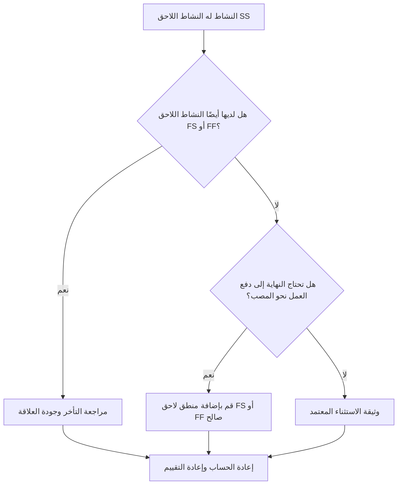

# الأنشطة مع خلفاء SS ولا يوجد خلفاء FS أو FF - دليل التحسين

## غاية

يساعد هذا الدليل المجدولين على مراجعة وتصحيح الأنشطة التي لها مهام لاحقة من "بدء إلى بدء" ولكن ليس لها مهام لاحقة من "إنهاء إلى بدء" أو "إنهاء إلى انتهاء". وهو يدعم منطق CPM أقوى من خلال التأكد من أن انتهاء النشاط، وليس فقط بدايته، متصل بشبكة الجدول الزمني النهائي.

## قبل أن تبدأ

اجمع المعلومات التالية قبل اتخاذ الإجراء:

- نتيجة التقييم الحالية لهذا المقياس.
- قائمة الأنشطة مع خلفاء SS وليس خلفاء FS أو FF.
- تفاصيل العلاقة اللاحقة لكل نشاط.
- نوع النشاط، والمدة، والحالة، والتقويم، والسماحية الزمنية الإجمالي، وWBS.
- أي تأخيرات أو قيود أو تواريخ متوقعة تؤثر على النشاط أو الأنشطة اللاحقة له.
- معلومات تسلسل البناء أو الهندسة أو المشتريات أو التسليم ذات الصلة.

## فهم النتيجة الخاصة بك

والنتيجة القوية هي عدم وجود أي أنشطة لم يتم حلها في هذه الحالة. وهذا يعني أن الأنشطة التي تبدأ العمل النهائي لها أيضًا منطق قائم على الانتهاء حيث يكون إكمال العمل مهمًا.

قد تتضمن النتيجة المقبولة استثناءات موثقة، مثل أنشطة مستوى الجهد، أو الأنشطة الإدارية، أو العمل المتداخل بشكل متعمد حيث لا تكون هناك حاجة إلى منطق الإنهاء. ويجب مراجعة هذه الأمور بدلاً من افتراض أنها صالحة.

وتعني النتيجة الضعيفة أن العديد من الأنشطة يمكن أن تبدأ أنشطة لاحقة ولكنها لا تتحكم في أي إنهاء لاحق أو تبدأ من خلال إكمالها. قد يسمح هذا للعمل غير المكتمل بالتوقف عن التأثير على الجدول الزمني.

## هدف التحسين

الهدف هو 0 أنشطة لم يتم حلها مع خلفاء SS ولا يوجد خلفاء FS أو FF.

الهدف هو التأكد من أن كل نشاط له النشاط اللاحق واقعي يعتمد على النهاية حيث يؤثر الإكمال على العمل النهائي، أو أن الافتقار إلى منطق النهاية مبرر وموثق.

## خطة العمل

### الخطوة 1: تحديد المشكلة الرئيسية

قم بإنشاء تخطيط P6 أو تصدير يسرد الأنشطة التي تحتوي على النشاط اللاحق SS واحد على الأقل ولا يوجد النشاط اللاحق FS أو FF. قم بتضمين معرف النشاط، واسم النشاط، وهيكل تنظيم العمل، والمدة الأصلية، والمدة المتبقية، وإجمالي السماحية الزمنية، والخلفاء، ونوع العلاقة، والتأخر، والقيود، وحالة النشاط.

راجع كل نشاط واسأل:

- ما العمل الذي يبدأ لأن هذا النشاط يبدأ؟
- ما العمل أو الإنجاز أو التسليم أو الفحص الذي يعتمد على إنهاء هذا النشاط؟
- هل النشاط اللاحق FS أو FF مفقود؟
- هل يتم استخدام علاقة SS لنمذجة العمل المتداخل بشكل صحيح؟
- هل يعتبر النشاط استثناءً صالحًا، مثل نشاط مستوى الجهد أو الدعم؟

### الخطوة 2: تطبيق الإصلاحات الموصى بها

أضف منطقًا قائمًا على النهاية حيث يجب أن يتحكم إكمال النشاط في العمل اللاحق. استخدم FS عندما لا يتمكن النشاط اللاحق من البدء حتى انتهاء النشاط. استخدم FF عندما يكون من الممكن أن يتداخل الجزء اللاحق ولكن لا يمكن أن ينتهي حتى ينتهي الجزء السابق.

مراجعة علاقات SS مع التأخر. إذا تم استخدام التأخير لتقريب التبعية النهائية، فاستبدلها أو أكملها بعلاقة FS أو FF أكثر وضوحًا. تجنب إضافة المنطق فقط لتلبية المقياس؛ يجب أن تعكس كل علاقة تسلسل العمل الحقيقي.

إذا كان النشاط استثناءً صالحًا، فقم بتوثيق السبب في موضوع دفتر الملاحظات أو UDF أو حقل التعليق أو جدول تعقب الجودة.

### الخطوة 3: إزالة أدوات الحظر الشائعة

تتضمن أدوات الحظر الشائعة المنطق المنسوخ من الجداول القديمة، وعلاقات SS المفرطة، ونقاط التسليم غير الواضحة، والمدخلات المفقودة من التقديمات الزمنية الميدانيين أو الانضباطيين. قم بحل هذه المشكلات من خلال مراجعة تسلسل العمل الفعلي مع المالك المسؤول.

مانع آخر هو الاعتقاد بأن العمل المتداخل يحتاج دائمًا إلى منطق SS فقط. قد يكون التداخل صالحًا، لكن إنهاء المادة السابقة غالبًا ما يظل بحاجة إلى التحكم في عملية الإنهاء أو الفحص أو الدوران أو نشاط المتابعة.

### الخطوة 4: التحقق من صحة التغييرات

إعادة حساب الجدول بعد التصحيحات. أعد تشغيل المقياس وتأكد من تصحيح كل نشاط متبقي أو توثيقه كاستثناء معتمد.

قم بمراجعة التأثير على إجمالي السماحية الزمنية والمسار الحرج والمسار الأطول والمعالم الرئيسية على المدى القريب. إذا أدت إضافة منطق الانتهاء إلى تغيير التواريخ الرئيسية، فقم بتوصيل النتيجة إلى قائد ضوابط المشروع أو مراجع مكتب إدارة المشاريع.

## جدول التحسين

### اليوم الأول: المراجعة والتشخيص

قم بتشغيل المقياس، وأكد قائمة الأنشطة المتأثرة، وافصل الأنشطة إلى منطق النهاية المفقود، ومنطق SS الضعيف، ومشكلات التأخر، والاستثناءات المحتملة.

### الأيام 2-3: تنفيذ الإجراءات ذات الأولوية

قم بتصحيح الأنشطة الحرجة وشبه الحرجة أولاً. أضف خلفاء FS أو FF صالحين، واضبط منطق SS غير المناسب، وقم بتوثيق الاستثناءات المبررة.

### الأيام 4-5: مراقبة النتائج المبكرة

قم بإعادة حساب الجدول الزمني ومراجعة الحركة في التواريخ الذو سماحية زمنيةة والمسار الأطول والتواريخ الرئيسية.

### اليوم السادس: التعديلات النهائية

قم بحل العناصر غير المؤكدة المتبقية مع الانضباط المسؤول أو مالك الحزمة أو قائد البناء.

### اليوم السابع: إعادة التقييم والمقارنة

قم بإجراء التقييم مرة أخرى وقارن النتيجة بالعتبة المستهدفة.

## تتبع التقدم

استخدم أداة تعقب بسيطة لإدارة التصحيحات والموافقات.

| تاريخ | تم اتخاذ الإجراء | التأثير المتوقع | النتيجة / الملاحظة | الخطوة التالية |
| --- | --- | --- | --- | --- |
| [تاريخ] | تمت مراجعة الأنشطة اللاحقة لـ SS فقط | تحديد منطق النهاية المفقود | [النتيجة الملحوظة] | تعيين التصحيحات |
| [تاريخ] | تمت إضافة المنطق اللاحق FS أو FF | تحسين استمرارية CPM | [النتيجة الملحوظة] | إعادة حساب الجدول الزمني |
| [تاريخ] | الاستثناءات الصحيحة الموثقة | تحسين إمكانية تتبع المراجعة | [النتيجة الملحوظة] | إعادة تقييم المقياس |

## إذا لم تتحسن النتائج

إذا لم تتحسن النتائج، فتحقق مما إذا كان عامل التصفية يحدد الاستثناءات الصالحة أو المنطق المكرر أو الأنشطة في منطقة WBS محددة ذات تطوير ضعيف للشبكة. قد تشير المشكلة المتكررة إلى أن الفريق يعتمد بشكل كبير على علاقات SS أثناء التخطيط.

قم بتصعيد العناصر التي لم يتم حلها إلى قائد التخطيط أو مراجع مكتب إدارة المشاريع عندما تؤثر على العمل الحاسم أو شبه الحرج أو التعاقدي أو المتعلق بالتسليم.

## صيانة

قم بمراجعة هذا المقياس أثناء كل تحديث للجدول الزمني وقبل الموافقة على خط الأساس. انتبه بشكل خاص بعد إعادة التسلسل أو تخطيط الاسترداد أو تطوير الجدول الزمني المنسوخ أو تغييرات النطاق الرئيسية.

## قائمة المراجعة الموجزة

- [ ] تمت مراجعة النتيجة الحالية
- [ ] تم تأكيد العتبة المستهدفة
- [ ] تم تحديد المشكلة الرئيسية
- [ ] تمت مراجعة خلفاء SS
- [ ] تم تصحيح منطق FS أو FF المفقود
- [ ] تم فحص التأخيرات والقيود
- [ ] تم توثيق الاستثناءات الصحيحة
- [ ] تمت إعادة حساب الجدول الزمني
- [ ] تم رصد النتائج
- [ ] تم تكرار التقييم
- [ ] الخطوات التالية موثقة
## محتوى ذو صلة
- [الأنشطة مع خلفاء SS ولا يوجد خلفاء FS أو FF - نظرة عامة](01_overview_template.md)
- [قالب المدونة](03_blog_template.md)
- [ما هو الجدول الزمني](../../04b_blogs_ar/01_WHAT%20A%20SCHEDULE%20IS/01_blog.md)
- [منطق قوي](../../04b_blogs_ar/02_ROBUST%20LOGIC/02_ROBUST%20LOGIC.md)
