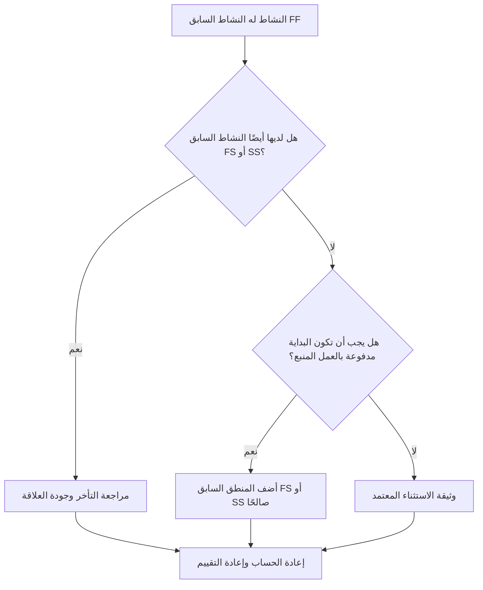

## غاية

يساعد هذا الدليل المجدولين على مراجعة وتصحيح الأنشطة التي لها أسلاف من انتهاء إلى إنهاء ولكن ليس لها أسلاف من انتهاء إلى بدء أو من البدء إلى البدء. وهو يدعم منطق CPM أقوى من خلال التأكد من أن بدء النشاط، وليس فقط نهايته، متصل بشبكة الجدولة الأولية.

## قبل أن تبدأ

اجمع المعلومات التالية قبل اتخاذ الإجراء:

- نتيجة التقييم الحالية لهذا المقياس.
- قائمة الأنشطة التي لها أسلاف FF وليس لها أسلاف FS أو SS.
- تفاصيل العلاقة السابقة لكل نشاط.
- نوع النشاط، والمدة، والحالة، والتقويم، والسماحية الزمنية الإجمالي، وWBS.
- أي تأخيرات أو قيود أو تواريخ متوقعة تؤثر على النشاط أو سابقاته.
- معلومات تسلسل البناء أو الهندسة أو المشتريات أو الوصول أو الموافقة أو التسليم ذات الصلة.

## فهم النتيجة الخاصة بك

والنتيجة القوية هي عدم وجود أي أنشطة لم يتم حلها في هذه الحالة. وهذا يعني أن الأنشطة التي ترتبط نهايتها بالعمل السابق لها أيضًا منطق صالح لبدء القيادة عند الحاجة.

قد تتضمن النتيجة المقبولة استثناءات موثقة، مثل أنشطة مستوى الجهد، أو الأنشطة الإدارية، أو العمل الموازي المصمم بشكل متعمد حيث لا يكون منطق البدء مطلوبًا. ويجب مراجعة هذه الأمور بدلاً من افتراض أنها صالحة.

وتعني النتيجة الضعيفة أن العديد من الأنشطة يمكن أن تنتهي مقارنة بالأنشطة السابقة، لكن بداياتها لا يتم التحكم فيها من خلال العمل المنبع. قد يسمح هذا للأنشطة بالبدء في وقت أبكر مما يدعمه التسلسل الحقيقي.

## هدف التحسين

الهدف هو 0 أنشطة لم يتم حلها مع أسلاف FF ولا توجد أسلاف FS أو SS.

الهدف هو التأكد من أن كل نشاط له سابقة واقعية لبدء القيادة حيث تعتمد البداية على العمل التمهيدي، أو أن الافتقار إلى منطق البداية مبرر وموثق.

## خطة العمل

### الخطوة 1: تحديد المشكلة الرئيسية

قم بإنشاء تخطيط P6 أو تصدير يسرد الأنشطة التي لها النشاط السابق FF واحد على الأقل ولا يوجد النشاط السابق FS أو SS. قم بتضمين معرف النشاط، واسم النشاط، وهيكل تنظيم العمل، والمدة الأصلية، والمدة المتبقية، وإجمالي السماحية الزمنية، والأسلاف، ونوع العلاقة، والتأخر، والقيود، وحالة النشاط.

راجع كل نشاط واسأل:

- ما الذي يجب أن يحدث قبل أن يبدأ هذا النشاط؟
- هل يتحكم النشاط السابق FF في محاذاة النهاية فقط؟
- هل النشاط السابق FS أو SS مفقود؟
- هل يتم استخدام علاقة FF لنمذجة العمل المتداخل بشكل صحيح؟
- هل يعتبر النشاط استثناءً صالحًا، مثل نشاط مستوى الجهد أو الدعم؟

### الخطوة 2: تطبيق الإصلاحات الموصى بها

أضف منطق بدء القيادة حيث يجب أن يعتمد بدء النشاط على العمل السابق. استخدم FS عندما لا يمكن بدء النشاط حتى انتهاء النشاط السابق. استخدم SS عندما يمكن أن يبدأ النشاط بعد بدء النشاط السابق أو عندما يصل إلى نقطة محددة من التقدم.

مراجعة علاقات FF مع التأخر. إذا تم استخدام التأخر لتقريب تبعية البدء، فاستبدله أو أكمله بمنطق FS أو SS أكثر وضوحًا. تجنب إضافة علاقات فقط لتلبية المقياس؛ يجب أن تعكس كل علاقة تسلسل العمل الحقيقي.

إذا كان النشاط استثناءً صالحًا، فقم بتوثيق السبب في موضوع دفتر الملاحظات أو UDF أو حقل التعليق أو جدول تعقب الجودة.

### الخطوة 3: إزالة أدوات الحظر الشائعة

تتضمن أدوات الحظر الشائعة المنطق المنسوخ من الجداول القديمة، والإفراط في استخدام علاقات FF، وعدم وضوح نقاط الوصول أو الإصدار، والمدخلات المفقودة من التقديمات الزمنية الميدانيين أو الانضباط. قم بحل هذه المشكلات من خلال مراجعة حالة البداية الفعلية مع المالك المسؤول.

مانع آخر هو الاعتقاد بأن منطق FF يكفي عندما يجب أن ينتهي نشاطان معًا. قد تكون محاذاة النهاية صالحة، ولكن النشاط اللاحق غالبًا ما يظل بحاجة إلى شرط بداية واضح.

### الخطوة 4: التحقق من صحة التغييرات

إعادة حساب الجدول بعد التصحيحات. أعد تشغيل المقياس وتأكد من تصحيح كل نشاط متبقي أو توثيقه كاستثناء معتمد.

قم بمراجعة التأثير على التواريخ المبكرة، والسماحية الزمنية الإجمالي، والمسار الحرج، والمسار الأطول، والمعالم الرئيسية على المدى القريب. إذا أدت إضافة منطق البداية إلى تغيير التواريخ الرئيسية، فقم بتوصيل النتيجة إلى قائد ضوابط المشروع أو مراجع مكتب إدارة المشروع.

## جدول التحسين

### اليوم الأول: المراجعة والتشخيص

قم بتشغيل المقياس، وأكد قائمة الأنشطة المتأثرة، وافصل الأنشطة إلى منطق البدء المفقود، ومنطق FF الضعيف، ومشكلات التأخر، والاستثناءات المحتملة.

### الأيام 2-3: تنفيذ الإجراءات ذات الأولوية

قم بتصحيح الأنشطة الحرجة وشبه الحرجة أولاً. أضف أسلاف FS أو SS صالحة، واضبط منطق FF غير المناسب، وقم بتوثيق الاستثناءات المبررة.

### الأيام 4-5: مراقبة النتائج المبكرة

قم بإعادة حساب الجدول ومراجعة الحركة في التواريخ المبكرة والسماحية الزمنية والمسار الأطول والتواريخ الرئيسية.

### اليوم السادس: التعديلات النهائية

قم بحل العناصر غير المؤكدة المتبقية مع الانضباط المسؤول أو مالك الحزمة أو قائد البناء.

### اليوم السابع: إعادة التقييم والمقارنة

قم بإجراء التقييم مرة أخرى وقارن النتيجة بالعتبة المستهدفة.

## تتبع التقدم

استخدم أداة تعقب بسيطة لإدارة التصحيحات والموافقات.

| تاريخ | تم اتخاذ الإجراء | التأثير المتوقع | النتيجة / الملاحظة | الخطوة التالية |
| --- | --- | --- | --- | --- |
| [تاريخ] | تمت مراجعة الأنشطة السابقة لـ FF فقط | تحديد منطق البداية المفقود | [النتيجة الملحوظة] | تعيين التصحيحات |
| [تاريخ] | تمت إضافة المنطق السابق FS أو SS | تحسين استمرارية CPM | [النتيجة الملحوظة] | إعادة حساب الجدول الزمني |
| [تاريخ] | الاستثناءات الصحيحة الموثقة | تحسين إمكانية تتبع المراجعة | [النتيجة الملحوظة] | إعادة تقييم المقياس |

## إذا لم تتحسن النتائج

إذا لم تتحسن النتائج، فتحقق مما إذا كان عامل التصفية يحدد الاستثناءات الصالحة أو المنطق المكرر أو الأنشطة في منطقة WBS محددة ذات تطوير ضعيف للشبكة. قد تشير المشكلة المتكررة إلى أن الفريق يعتمد بشكل كبير على علاقات FF أثناء التخطيط.

قم بتصعيد العناصر التي لم يتم حلها إلى قائد التخطيط أو مراجع مكتب إدارة المشاريع عندما تؤثر على العمل الحاسم أو شبه الحرج أو التعاقدي أو المتعلق بالوصول أو التسليم.

## صيانة

قم بمراجعة هذا المقياس أثناء كل تحديث للجدول الزمني وقبل الموافقة على خط الأساس. انتبه بشكل خاص بعد إعادة التسلسل أو تخطيط الاسترداد أو تطوير الجدول الزمني المنسوخ أو تغييرات النطاق الرئيسية.

## قائمة المراجعة الموجزة

- [ ] تمت مراجعة النتيجة الحالية
- [ ] تم تأكيد العتبة المستهدفة
- [ ] تم تحديد المشكلة الرئيسية
- [ ] تمت مراجعة أسلاف FF
- [ ] تم تصحيح منطق FS أو SS المفقود
- [ ] تم فحص التأخيرات والقيود
- [ ] تم توثيق الاستثناءات الصحيحة
- [ ] تمت إعادة حساب الجدول الزمني
- [ ] تم رصد النتائج
- [ ] تم تكرار التقييم
- [ ] الخطوات التالية موثقة
## محتوى ذو صلة
- [قالب المدونة](03_blog_template.md)
- [ما هو الجدول الزمني](../../04b_blogs_ar/01_WHAT%20A%20SCHEDULE%20IS/01_blog.md)
- [منطق قوي](../../04b_blogs_ar/02_ROBUST%20LOGIC/02_ROBUST%20LOGIC.md)
