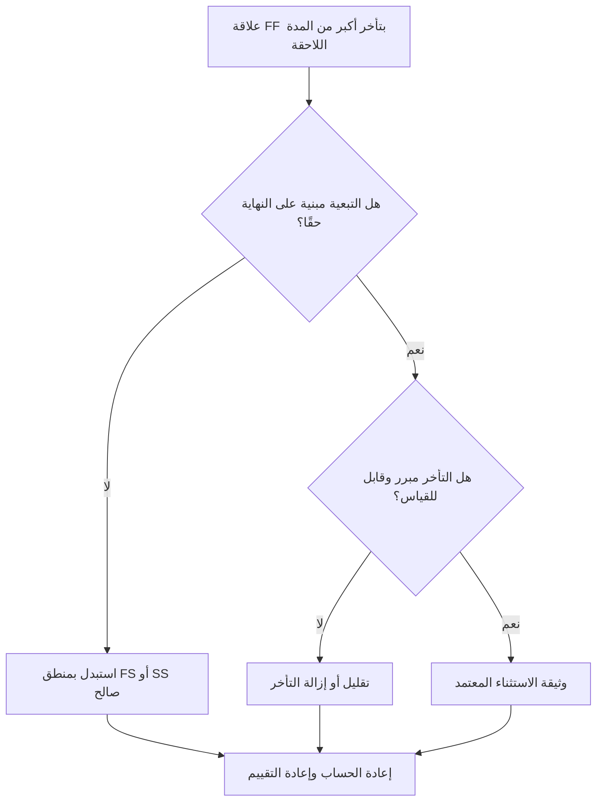

## غاية

يساعد هذا الدليل المجدولين على مراجعة علاقات "الانتهاء إلى النهاية" وتصحيحها حيث يكون التأخير أكبر من مدة النشاط اللاحق. وهو يدعم منطق CPM أكثر وضوحًا عن طريق استبدال تأخر FF المفرط بمنطق العلاقة أو الأنشطة المرئية التي تمثل تسلسل العمل الحقيقي بشكل أفضل.

## قبل أن تبدأ

اجمع المعلومات التالية قبل اتخاذ الإجراء:

- نتيجة التقييم الحالية لهذا المقياس.
- قائمة علاقات FF حيث يكون التأخر أكبر من المدة اللاحقة.
- معرفات النشاط السابقة واللاحقة، والأسماء، وWBS، والمدد، والتقويمات، والحالة.
- تأخر العلاقة ونوع العلاقة وأي قيود ذات صلة.
- إعدادات حساب الجدول الزمني وأساس التقويم المستخدم للتأخر.
- المنطق الميداني أو الهندسي أو المشتريات أو الموافقة أو التسليم الذي يوضح التبعية المقصودة.

## فهم النتيجة الخاصة بك

والنتيجة القوية هي عدم وجود علاقات FF لم يتم حلها حيث يتجاوز التأخر المدة اللاحقة.

قد تتضمن النتيجة المقبولة استثناءات موثقة، ولكن يجب أن تكون نادرة. غالبًا ما يشير تأخر FF الطويل إلى أن نوع العلاقة لا يتطابق مع التبعية التي يتم تصميمها.

تعني النتيجة الضعيفة أن الجدول يحتوي على روابط انتهاء إلى نهاية متعددة حيث يتأخر الانتهاء اللاحق بوقت أطول من مدة النشاط اللاحق. قد يؤدي هذا إلى إخفاء المنطق القائم على البدء أو فترات الانتظار أو الأنشطة المتوسطة المفقودة.

## هدف التحسين

الهدف هو 0 علاقات FF لم يتم حلها مع تأخر أكبر من المدة اللاحقة.

الهدف هو تأكيد ما إذا كان يجب أن تظل كل علاقة FF، أو يتم تحويلها إلى منطق FS أو SS، أو تقليل الفارق الزمني، أو توثيقها كاستثناء صالح.

## خطة العمل

### الخطوة 1: تحديد المشكلة الرئيسية

قم بإنشاء تخطيط P6 أو تصدير يسرد علاقات FF حيث يكون التأخير أكبر من المدة التالية. قم بتضمين معرف النشاط السابق واللاحق، واسم النشاط، وWBS، والمدة الأصلية، والمدة المتبقية، ونوع العلاقة، والتأخر، والتقويم، وإجمالي السماحية الزمنية، وحالة النشاط.

راجع كل علاقة واسأل:

- لماذا ينتهي النشاط اللاحق بعد هذا التأخير الطويل؟
- هل يعتمد الخلف فعلاً على تشطيب النشاط السابق أم على شرط بدء أو تسليم آخر؟
- هل الفارق أكبر من المدة الأصلية التالية أم المدة المتبقية أم كليهما؟
- هل يتم استخدام التأخر في تحديد وقت المراجعة، أو المعالجة، أو التسليم، أو الموافقة، أو الوصول، أو فترة انتظار حقيقية أخرى؟
- هل ستجعل علاقة FS أو SS التبعية أكثر وضوحًا؟

### الخطوة 2: تطبيق الإصلاحات الموصى بها

إذا كان يجب أن يبدأ النشاط اللاحق بعد انتهاء النشاط السابق، فاستبدل علاقة FF بعلاقة FS. إذا كان بإمكان النشاط اللاحق أن يبدأ بعد أن يبدأ النشاط السابق أو يصل إلى نقطة محددة من التقدم، فاستخدم منطق SS.

إذا كانت العلاقة مستندة إلى النهاية بالفعل، فقم بمراجعة قيمة التأخر. تقليل التأخر المفرط حيث تم استخدامه كعنصر نائب تقريبي أو موروث من المنطق المنسوخ. إذا كان التأخر يمثل فترة انتظار حقيقية، تأكد من صحة الوحدة والتقويم والشرح.

تجنب استخدام التأخير الطويل كبديل للأنشطة التي يجب أن تكون مرئية في الجدول. إذا كان التأخير يمثل المراجعة، أو المعالجة، أو التسليم، أو التعبئة، أو الموافقة، أو وقت الإغلاق، ففكر في النمذجة التي تعمل كنشاط منفصل.

### الخطوة 3: إزالة أدوات الحظر الشائعة

تتضمن أدوات الحظر الشائعة المنطق المنسوخ من الجداول الزمنية السابقة وفترات الانتظار المخفية وارتباك التقويم والضغط لإبقاء الشبكة بسيطة. قم بحل هذه المشكلات عن طريق تأكيد التبعية المقصودة مع المالك المسؤول.

مانع آخر يتعامل مع التأخر على أنه غير ضار. قد يكون من الصعب مراجعة التأخير الطويل، ويمكن أن يخفي المخاطر، ويمكن أن يجعل تحليل التأخير أكثر صعوبة لأن فترة الانتظار غير مرئية كنشاط.

### الخطوة 4: التحقق من صحة التغييرات

إعادة حساب الجدول بعد التصحيحات. أعد تشغيل المقياس وتأكد من تصحيح كل عنصر متبقي أو توثيقه كاستثناء معتمد.

قم بمراجعة إجمالي السماحية الزمنية والمسار الأطول والمسار الحرج والمعالم على المدى القريب. إذا كانت تغييرات العلاقة تنقل التواريخ الرئيسية، فقم بتوصيل النتيجة إلى قائد ضوابط المشروع أو مراجع مكتب إدارة المشاريع.

## جدول التحسين

### اليوم الأول: المراجعة والتشخيص

قم بتشغيل المقياس، وأكد قائمة العلاقات المتأثرة، وافصل العناصر إلى نوع علاقة خاطئ، وتأخر زائد، ونشاط مخفي، ومشكلة في التقويم، والاستثناء المحتمل.

### الأيام 2-3: تنفيذ الإجراءات ذات الأولوية

قم بتصحيح العلاقات الحرجة وشبه الحرجة أولاً. تحويل منطق FF إلى FS أو SS حيثما كان ذلك مناسبًا، وتقليل التأخير غير المبرر، وتوثيق الاستثناءات الصالحة.

### الأيام 4-5: مراقبة النتائج المبكرة

قم بإعادة حساب الجدول الزمني ومراجعة الحركة في التواريخ الذو سماحية زمنيةة والمسار الأطول والتواريخ الرئيسية.

### اليوم السادس: التعديلات النهائية

قم بحل العناصر غير المؤكدة المتبقية مع الانضباط المسؤول أو مالك الحزمة أو قائد البناء.

### اليوم السابع: إعادة التقييم والمقارنة

قم بإجراء التقييم مرة أخرى وقارن النتيجة بالعتبة المستهدفة.

## تتبع التقدم

استخدم أداة تعقب بسيطة لإدارة التصحيحات والموافقات.

| تاريخ | تم اتخاذ الإجراء | التأثير المتوقع | النتيجة / الملاحظة | الخطوة التالية |
| --- | --- | --- | --- | --- |
| [تاريخ] | تمت مراجعة تأخر FF أكبر من المدة اللاحقة | تحديد المنطق الضعيف أو غير الواضح | [النتيجة الملحوظة] | تعيين التصحيحات |
| [تاريخ] | العلاقة المحولة إلى FS أو SS | تحسين وضوح منطق CPM | [النتيجة الملحوظة] | إعادة حساب الجدول الزمني |
| [تاريخ] | انخفاض أو تأخير موثق | تحسين إمكانية تتبع المراجعة | [النتيجة الملحوظة] | إعادة تقييم المقياس |

## إذا لم تتحسن النتائج

إذا لم تتحسن النتائج، فتحقق مما إذا كانت أنماط العلاقة نفسها تتكرر في منطقة WBS محددة أو نظام أو قسم جدول منسوخ. قد تشير النتائج المتكررة إلى أن الفريق يستخدم تأخر FF كاختصار قياسي بدلاً من نمذجة التبعيات الحقيقية.

قم بتصعيد العناصر التي لم يتم حلها عندما تؤثر على الأعمال الهامة أو شبه الحرجة أو التعاقدية أو المشتريات أو الموافقة أو التكليف أو الأعمال ذات الصلة بالتسليم.

## صيانة

قم بمراجعة هذا المقياس أثناء كل تحديث للجدول الزمني وقبل الموافقة على خط الأساس. انتبه بشكل خاص بعد تطوير الجدول الزمني المنسوخ، أو إعادة التسلسل، أو تخطيط الاسترداد، أو التغييرات الرئيسية في النطاق.

## قائمة المراجعة الموجزة

- [ ] تمت مراجعة النتيجة الحالية
- [ ] تم تأكيد العتبة المستهدفة
- [ ] تم تحديد المشكلة الرئيسية
- [ ] تمت مراجعة علاقات FF
- [ ] تم تصحيح التأخر المفرط أو تبريره
- [ ] يتم تطبيق بدائل FS أو SS عند الحاجة
- [ ] العمل المخفي على غرار حيثما كان ذلك مناسبا
- [ ] تمت إعادة حساب الجدول الزمني
- [ ] تم رصد النتائج
- [ ] تم تكرار التقييم
- [ ] الخطوات التالية موثقة
## محتوى ذو صلة
- [قالب المدونة](03_blog_template.md)
- [ما هو الجدول الزمني](../../04b_blogs_ar/01_WHAT%20A%20SCHEDULE%20IS/01_blog.md)
- [منطق قوي](../../04b_blogs_ar/02_ROBUST%20LOGIC/02_ROBUST%20LOGIC.md)
