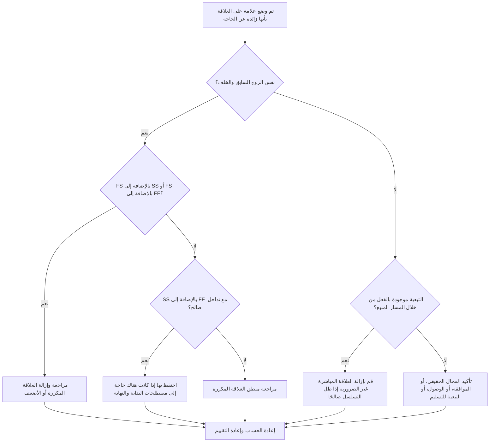

## غاية

يساعد هذا الدليل القائمين على الجدولة في تحديد وإزالة المنطق الزائد من جدول Primavera P6. وينطبق ذلك على أنماط العلاقات المكررة، والمنطق السابق المتكرر، والتبعيات غير الضرورية التي لا تمثل تسلسل عمل حقيقي.

## قبل أن تبدأ

اجمع المعلومات التالية قبل اتخاذ الإجراء:

- نتيجة التقييم الحالية لهذا المقياس.
- قائمة الأنشطة والعلاقات التي تم وضع علامة عليها باعتبارها منطقًا زائدًا عن الحاجة.
- التفاصيل السابقة واللاحقة لكل نشاط تم وضع علامة عليه.
- أنواع العلاقات، والتأخيرات، والتقويمات، والسماحية الزمنية الإجمالي، ومؤشرات العلاقة المحركة.
- WBS، وأكواد النشاط، والانضباط أو ملكية حزمة العمل.
- المعلومات الميدانية أو الهندسية أو المشتريات أو الموافقة أو التسليم التي توضح التبعية الحقيقية.

## فهم النتيجة الخاصة بك

والنتيجة القوية هي صفر علاقات زائدة عن الحاجة لم يتم حلها.

قد تتضمن النتيجة المقبولة استثناءات موثقة نادرة حيث يتم استخدام المنطق المكرر عمدًا لسبب يمكن الدفاع عنه. يجب مراجعة هذه الحالات بعناية لأن المنطق الزائد عادة ما يكون مشكلة تتعلق بجودة الجدول الزمني.

النتيجة الضعيفة تعني أن الجدول يحتوي على منطق علاقة متكرر أو غير ضروري. قد يحدث هذا عندما لا يتم تنظيف أقسام الجدول المنسوخة، أو تتم إضافة العلاقات دون التحقق من المسارات الموجودة، أو يتم استخدام أنواع تبعية متعددة بين نفس الأنشطة.

## هدف التحسين

الهدف هو 0 علاقات زائدة عن الحاجة لم يتم حلها.

الهدف هو الاحتفاظ فقط بالعلاقات التي تمثل تبعيات حقيقية وإزالة المنطق الذي يكرر تسلسل العمل الفعلي أو يخفيه أو يبالغ فيه.

## خطة العمل

### الخطوة 1: تحديد المشكلة الرئيسية

قم بإنشاء تخطيط P6 أو تقرير أو مراجعة للعلاقة الخارجية تحدد المنطق الزائد المحتمل. ركز على هذه الحالات:

- نفس النشاط السابق متصل بنفس النشاط اللاحق أكثر من مرة، خاصة FS مع SS أو FS مع FF.
- قد يكون SS بالإضافة إلى FF بين نفس النشاطين صالحين عندما يتم تصميم التداخل بشكل صحيح وتكون مصطلحات البداية والنهاية مهمة.
- نشاط له نفس النشاط السابق ونوع العلاقة مثل سابقه، مما يؤدي إلى إنشاء منطق موروث متكرر من خلال السلسلة.
- سلاسل سابقة متكررة أطول حيث تظهر نفس التبعية بعدة خطوات إلى الوراء.
- التبعيات التي لا تغير التسلسل أو التواريخ أو السماحية الزمنية أو التسليم أو الوصول أو التحكم في المخاطر.

راجع كل علاقة تم وضع علامة عليها واسأل:

- فهل تضيف هذه العلاقة تبعية حقيقية؟
- هل التبعية ممثلة بالفعل بعلاقة أخرى بين نفس الأنشطة؟
- هل التبعية ممثلة بالفعل بمسار أولي؟
- هل ستؤدي إزالة العلاقة إلى تغيير منطق الجدول الزمني الصحيح أم أنها ستؤدي فقط إلى تبسيط الشبكة؟
- هل العلاقة تقود التواريخ لسبب مشروع أم فقط بسبب إضافة منطق زائد عن الحاجة؟

### الخطوة 2: تطبيق الإصلاحات الموصى بها

ابدأ بالتكرارات الدقيقة والأزواج المتكررة السابقة واللاحقة. إذا كان نفس النشاطين مرتبطين بـ FS مع SS أو FS مع FF، فحدد العلاقة التي تمثل التبعية الحقيقية. قم بإزالة العلاقة التي تكرر المنطق أو تضعفه.

مراجعة أزواج SS بالإضافة إلى FF بشكل منفصل. يمكن أن تكون هذه التركيبة صالحة عندما تتحكم إحدى العلاقات في الوقت الذي يمكن أن يبدأ فيه العمل المتداخل وتتحكم العلاقة الأخرى في الوقت الذي يمكن أن ينتهي فيه. احتفظ بها فقط عندما يكون كلا الشرطين حقيقيين وموثقين بتسلسل العمل.

بعد ذلك، قم بمراجعة المنطق السابق الموروث. إذا كان النشاط C له نفس العلاقة السابقة للنشاط B، وكان النشاط B هو بالفعل نشاط سابق للنشاط C، فقد تكون العلاقة المباشرة من النشاط السابق غير ضرورية. قم بإزالته إذا ظل تسلسل CPM صحيحًا من خلال المسار الحالي.

وأخيرًا، قم بإزالة التبعيات غير الضرورية التي لا تدعم تسلسل العمل أو الوصول أو الموافقة أو التسليم أو التحكم في المخاطر أو المنطق التعاقدي.

### الخطوة 3: إزالة أدوات الحظر الشائعة

تتضمن أدوات الحظر الشائعة المنطق المنسوخ من الجداول القديمة، والنمذجة المفرطة لجعل الشبكة تبدو متصلة، وإضافة العلاقات أثناء التحديثات دون التحقق من المسار الحالي.

هناك عائق آخر وهو الخوف من أن يؤدي إزالة العلاقات إلى إضعاف الجدول الزمني. الهدف ليس إزالة الضوابط الصالحة؛ إنه إزالة العلاقات التي تكرر عناصر التحكم الموجودة بالفعل في الشبكة.

### الخطوة 4: التحقق من صحة التغييرات

أعد حساب الجدول بعد إزالة المنطق الزائد أو تعديله. قم بمراجعة إجمالي السماحية الزمنية وعلاقات القيادة والمسار الأطول والمسار الحرج وتواريخ المعالم الرئيسية.

إذا أدت إزالة العلاقة إلى تغيير التواريخ بشكل غير متوقع، فتحقق مما إذا كان الارتباط الذي تمت إزالته يخدم بالفعل تبعية صالحة أو ما إذا كانت هناك حاجة إلى إضافة علاقة أخرى مفقودة بشكل أكثر دقة.

## جدول التحسين

### اليوم الأول: المراجعة والتشخيص

قم بتشغيل المقياس، وتأكد من قائمة العلاقات المتأثرة، وافصل النتائج إلى أزواج مكررة، ومجموعات FS بالإضافة إلى SS/FF، والمنطق السابق الموروث، والتبعيات غير الضرورية.

### الأيام 2-3: تنفيذ الإجراءات ذات الأولوية

قم بتصحيح العلاقات الحرجة وشبه الحرجة أولاً. قم بإزالة التكرارات الدقيقة، وتنظيف الأزواج السابقة المتكررة، وتوثيق مجموعات SS بالإضافة إلى FF الصالحة.

### الأيام 4-5: مراقبة النتائج المبكرة

أعد حساب الجدول ومراجعة الحركة في السماحية الزمنية والمسار الأطول وعلاقات القيادة والتواريخ المهمة.

### اليوم السادس: التعديلات النهائية

قم بحل العناصر غير المؤكدة مع الانضباط المسؤول أو مالك الحزمة أو قائد البناء.

### اليوم السابع: إعادة التقييم والمقارنة

قم بإجراء التقييم مرة أخرى وقارن النتيجة بالعتبة المستهدفة.

## تتبع التقدم

استخدم أداة تعقب بسيطة لإدارة التصحيحات والموافقات.

| تاريخ | تم اتخاذ الإجراء | التأثير المتوقع | النتيجة / الملاحظة | الخطوة التالية |
| --- | --- | --- | --- | --- |
| [تاريخ] | تمت مراجعة قائمة العلاقات الزائدة عن الحاجة | تحديد المنطق المكرر أو غير الضروري | [النتيجة الملحوظة] | تعيين التصحيحات |
| [تاريخ] | تمت إزالة العلاقات المكررة | تبسيط شبكة CPM | [النتيجة الملحوظة] | إعادة حساب الجدول الزمني |
| [تاريخ] | الاستثناءات الصحيحة الموثقة | تحسين إمكانية تتبع المراجعة | [النتيجة الملحوظة] | إعادة تقييم المقياس |

## إذا لم تتحسن النتائج

إذا لم تتحسن النتائج، فتحقق مما إذا كان المنطق المتكرر يتركز في منطقة WBS محددة، أو قسم المشروع المنسوخ، أو النظام، أو فترة تحديث الجدول الزمني. قد تشير النتائج المتكررة إلى أن تنظيف العلاقة ليس جزءًا من سير عمل الجدولة العادي.

قم بتصعيد المنطق الزائد الذي لم يتم حله عندما يؤثر على العمل المهم أو شبه الحرج أو التعاقدي أو الوصول أو الموافقة أو التسليم.

## صيانة

قم بمراجعة هذا المقياس أثناء كل تحديث للجدول الزمني وقبل الموافقة على خط الأساس. انتبه بشكل خاص بعد تطوير الجدول الزمني المنسوخ، أو إعادة التسلسل، أو تخطيط الاسترداد، أو المراجعات المنطقية الكبيرة.

## قائمة المراجعة الموجزة

- [ ] تمت مراجعة النتيجة الحالية
- [ ] تم تأكيد العتبة المستهدفة
- [ ] تم تحديد المشكلة الرئيسية
- [ ] تمت مراجعة أزواج النشاط السابق والخلف المكررة
- [ ] تم تصحيح مجموعات FS مع SS أو FS مع FF
- [ ] تم توثيق مجموعات SS بالإضافة إلى FF الصالحة
- [ ] تمت مراجعة المنطق السابق الموروث
- [ ] تمت إزالة التبعيات غير الضرورية
- [ ] تمت إعادة حساب الجدول الزمني
- [ ] تم رصد النتائج
- [ ] تم تكرار التقييم
- [ ] الخطوات التالية موثقة
## محتوى ذو صلة
- [قالب المدونة](03_blog_template.md)
- [ما هو الجدول الزمني](../../04b_blogs_ar/01_WHAT%20A%20SCHEDULE%20IS/01_blog.md)
- [منطق قوي](../../04b_blogs_ar/02_ROBUST%20LOGIC/02_ROBUST%20LOGIC.md)
