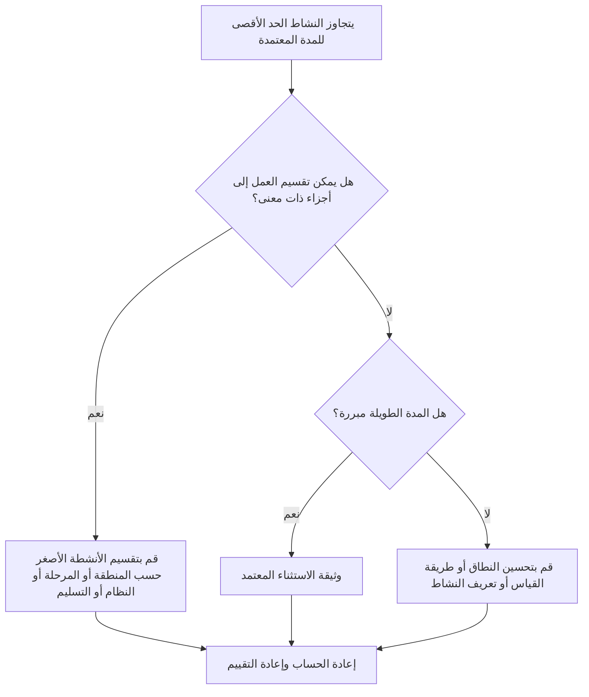

## غاية

يساعد هذا الدليل القائمين على الجدولة في مراجعة الأنشطة وتحسينها بفترات أطول من حد المشروع المعتمد. تعتمد المدة المقبولة على نوع المشروع ومستوى التفاصيل ودورة إعداد التقارير ومتطلبات العقد وحساسية العميل للأنشطة الطويلة.

## قبل أن تبدأ

اجمع المعلومات التالية قبل اتخاذ الإجراء:

- نتيجة التقييم الحالية لهذا المقياس.
- تمت الموافقة على الحد الأقصى لمدة النشاط لمستوى المشروع أو الجدول الزمني.
- قائمة الأنشطة التي تتجاوز عتبة المدة.
- المدة الأصلية، المدة المتبقية، نوع النشاط، الحالة، WBS، التقويم، والسماحية الزمنية الإجمالي.
- المتطلبات الأساسية، وتوقعات تقارير العملاء، وقواعد جودة جدول مكتب إدارة المشاريع.
- فترة التخطيط المسبق، ودورة تحديث التقدم، والانضباط أو ملكية الحزمة.
- أي استثناءات مبررة، مثل المشتريات أو المعالجة أو التسليم أو المراجعة أو الاختبار أو أنشطة مستوى الجهد.

## فهم النتيجة الخاصة بك

والنتيجة القوية هي عدم وجود أي أنشطة لم يتم حلها فوق الحد المعتمد طويل الأمد.

قد تتضمن النتيجة المقبولة استثناءات موثقة، خاصة بالنسبة للأنشطة التي لا يمكن تقسيمها بشكل معقول أو التي تتم إدارتها عن عمد كأنشطة مراقبة شبيهة بالملخص. ويجب أن تكون هذه الإجراءات محدودة ومبررة بشكل واضح.

وتعني النتيجة الضعيفة أن الجدول يحتوي على العديد من الأنشطة التي تعتبر واسعة جدًا بحيث لا يمكن التخطيط والمراقبة بشكل فعال. قد يؤدي ذلك إلى تقليل إمكانية رؤية التقدم ويجعل من الصعب فهم العمل الذي يقود الجدول الزمني فعليًا.

## هدف التحسين

الهدف هو 0 أنشطة لم يتم حلها فوق الحد الأقصى للمدة المعتمدة.

الهدف هو تقسيم الأنشطة الطويلة إلى أنشطة أصغر ذات معنى حيث تكون هناك حاجة إلى تحكم أفضل، مع توثيق الاستثناءات الصالحة عندما تكون المدة الطويلة مناسبة.

## خطة العمل

### الخطوة 1: تحديد المشكلة الرئيسية

قم بإنشاء تخطيط P6 أو تقرير يسرد الأنشطة التي تتجاوز حد المدة المحددة للمشروع. قم بتضمين معرف النشاط، واسم النشاط، وWBS، ونوع النشاط، والمدة الأصلية، والمدة المتبقية، والبدء، والانتهاء، والتقويم، وإجمالي السماحية الزمنية، وحالة النشاط.

راجع كل نشاط واسأل:

- هل مدة النشاط أطول من الحد المعتمد لهذا النوع من المشروع ومستوى الجدول الزمني؟
- هل يغطي النشاط خطوات عمل أو مواقع أو أنظمة أو مناطق أو تسليمات متعددة؟
- هل يمكن قياس التقدم بشكل موضوعي خلال كل دورة تحديث؟
- هل يحتاج النشاط إلى مزيد من التفاصيل لأن العميل أو مكتب إدارة المشاريع حساس للفترات الطويلة؟
- هل النشاط استثناء صالح يجب أن يبقى طويلاً؟

### الخطوة 2: تطبيق الإصلاحات الموصى بها

قم بتقسيم الأنشطة الطويلة حيث يمكن تخطيط العمل وقياسه إلى أجزاء أصغر. تتضمن طرق التقسيم الشائعة الموقع، أو منطقة WBS، أو الانضباط، أو النظام، أو التسليم، أو المرحلة، أو تسلسل الطاقم، أو فترة إعداد التقارير.

عند تقسيم النشاط، حافظ على التسلسل المنطقي الحقيقي. قم بإضافة المهام السابقة واللاحقة المناسبة، وقم بتعيين التقويم الصحيح، وتأكد من أن الأنشطة الجديدة تعكس كيفية تنفيذ العمل فعليًا.

لا تقم بتقسيم الأنشطة فقط لتلبية المقياس. يجب أن يؤدي التقسيم إلى تحسين التحكم أو قياس التقدم أو التخطيط المستقبلي أو وضوح التقارير.

### الخطوة 3: إزالة أدوات الحظر الشائعة

تشتمل العوائق الشائعة على تعريف غير مكتمل للنطاق، وبنية WBS ضعيفة، ومدخلات ميدانية محدودة، والضغط لإبقاء عدد الأنشطة منخفضًا. قم بحل هذه المشكلات من خلال مراجعة الأنشطة الطويلة مع الانضباط المسؤول أو مالك الحزمة أو قائد البناء.

أداة حظر أخرى تستخدم نشاطًا طويلًا لتمثيل العمل الذي يجب التخطيط له كتسلسل. إذا كان النشاط يحتوي على عمليات تسليم متعددة أو وجوه عمل أو تسليمات أو نقاط تحكم، فمن المحتمل أنه يحتاج إلى مزيد من التفاصيل.

### الخطوة 4: التحقق من صحة التغييرات

أعد حساب الجدول بعد تقسيم الأنشطة الطويلة أو تعديلها. تأكد من أن كل نشاط جديد له المنطق المناسب والمدة والتقويم وقياس التقدم.

قم بمراجعة إجمالي السماحية الزمنية والمسار الحرج والمسار الأطول وتواريخ المعالم. إذا تغير التفاصيل في التواريخ الرئيسية، فأبلغ السبب إلى قائد ضوابط المشروع أو مراجع مكتب إدارة المشاريع.

## جدول التحسين

### اليوم الأول: المراجعة والتشخيص

قم بتشغيل المقياس، وأكد حد المدة، وافصل الأنشطة إلى مرشحين مقسمين، والاستثناءات الصالحة، والعناصر التي تتطلب إدخال المالك.

### الأيام 2-3: تنفيذ الإجراءات ذات الأولوية

قم بتصحيح الأنشطة الحرجة وشبه الحرجة والحساسة للعميل أولاً. قم بتقسيم الأنشطة الواسعة وتوثيق الاستثناءات الصالحة.

### الأيام 4-5: مراقبة النتائج المبكرة

أعد حساب الجدول الزمني ومراجعة الحركة في السماحية الزمنية والمسار الأطول وتواريخ المعالم الرئيسية والرؤية الأمامية.

### اليوم السادس: التعديلات النهائية

قم بحل العناصر غير المؤكدة المتبقية مع الانضباط المسؤول أو مالك الحزمة أو قائد ضوابط المشروع.

### اليوم السابع: إعادة التقييم والمقارنة

قم بإجراء التقييم مرة أخرى وقارن النتيجة بالعتبة المستهدفة.

## تتبع التقدم

استخدم أداة تعقب بسيطة لإدارة التصحيحات والموافقات.

| تاريخ | تم اتخاذ الإجراء | التأثير المتوقع | النتيجة / الملاحظة | الخطوة التالية |
| --- | --- | --- | --- | --- |
| [تاريخ] | تمت مراجعة الأنشطة طويلة الأمد | تحديد الأنشطة التي تحتاج إلى تفصيل | [النتيجة الملحوظة] | تعيين أصحاب |
| [تاريخ] | قسّم النشاط إلى خطوات عمل أصغر | تحسين رؤية التقدم | [النتيجة الملحوظة] | إعادة حساب الجدول الزمني |
| [تاريخ] | استثناء صالح موثق | تحسين إمكانية تتبع المراجعة | [النتيجة الملحوظة] | إعادة تقييم المقياس |

## إذا لم تتحسن النتائج

إذا لم تتحسن النتائج، فتحقق مما إذا كانت عتبة المدة غير واضحة، أو مطبقة بشكل غير متسق، أو غير متوافقة مع مستوى الجدول الزمني. راجع أيضًا ما إذا كانت الأنشطة الطويلة مركزة في منطقة محددة من هيكل تنظيم العمل، أو الانضباط، أو مرحلة المشروع.

قم بتصعيد الأنشطة طويلة الأمد التي لم يتم حلها عندما تؤثر على العمل الهام أو شبه الحرج أو التعاقدي أو إعداد التقارير أو العمل الحساس للعميل.

## صيانة

قم بمراجعة هذا المقياس أثناء كل تحديث للجدول الزمني، وتطوير خط الأساس، وممارسة إعادة التسلسل الرئيسية. قم بتحديث الحد الأدنى إذا انتقل المشروع إلى مرحلة أو مستوى مختلف من التفاصيل.

## قائمة المراجعة الموجزة

- [ ] تمت مراجعة النتيجة الحالية
- [ ] تم تأكيد العتبة المستهدفة
- [ ] تم تحديد المشكلة الرئيسية
- [ ] تمت مراجعة الأنشطة الطويلة
- [ ] تم تحديد المرشحين المنقسمين
- [ ] الأنشطة موزعة حيثما تكون مفيدة
- [ ] تم توثيق الاستثناءات الصحيحة
- [ ] تمت إعادة حساب الجدول الزمني
- [ ] تم رصد النتائج
- [ ] تم تكرار التقييم
- [ ] الخطوات التالية موثقة
## محتوى ذو صلة
- [قالب المدونة](03_blog_template.md)
- [ما هو الجدول الزمني](../../04b_blogs_ar/01_WHAT%20A%20SCHEDULE%20IS/01_blog.md)
- [منطق قوي](../../04b_blogs_ar/02_ROBUST%20LOGIC/02_ROBUST%20LOGIC.md)
