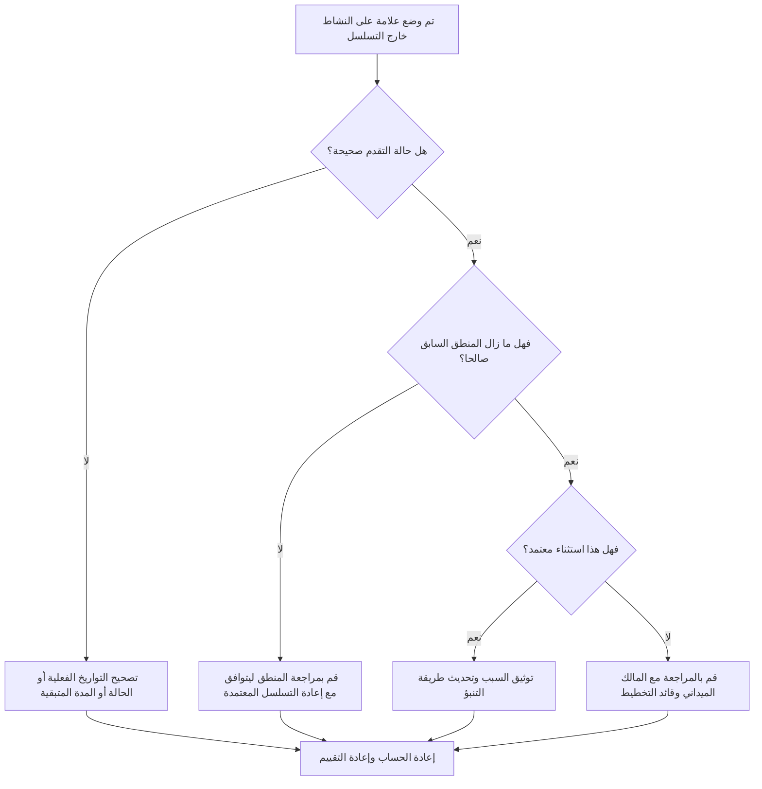

# الأنشطة خارج التسلسل في بريمافيرا ص6 - دليل التحسين

## غاية

يساعد هذا الدليل القائمين على الجدولة في مراجعة وتصحيح الأنشطة غير المتسلسلة في Primavera P6. يتم تطبيقه عندما يبدأ النشاط أو يتقدم قبل استيفاء المنطق السابق المطلوب.

## قبل أن تبدأ

اجمع المعلومات التالية قبل اتخاذ الإجراء:

- نتيجة التقييم الحالية لهذا المقياس.
- قائمة الأنشطة التي تم وضع علامة عليها باعتبارها خارج التسلسل.
- تاريخ البيانات المستخدمة في التحديث الأخير.
- البداية الفعلية والانتهاء الفعلي والمدة المتبقية وحالة النشاط.
- تفاصيل العلاقة السابقة واللاحقة، بما في ذلك نوع العلاقة والتأخر.
- جدولة إعدادات الحساب، وخاصة المنطق المحتفظ به وتجاوز التقدم.
- شرح ميداني لسبب تقدم العمل قبل اكتمال المنطق المخطط.

## فهم النتيجة الخاصة بك

والنتيجة القوية هي عدم وجود أي أنشطة خارج التسلسل لم يتم حلها.

قد تتضمن النتيجة المقبولة استثناءات موثقة حيث تم إعادة تسلسل العمل عن عمد وتم تحديث منطق الجدول الزمني ليعكس الخطة الجديدة.

النتيجة الضعيفة تعني أن تحديث الجدول يحتوي على تقدم يتعارض مع الشبكة المنطقية الموجودة. قد يشير هذا إلى حالة غير صحيحة، أو قيم فعلية مفقودة، أو منطق قديم، أو إعادة تسلسل الحقل الحقيقي الذي لم ينعكس بعد في التنبؤ.

## هدف التحسين

الهدف هو 0 أنشطة خارج التسلسل لم يتم حلها.

الهدف هو تحديد ما إذا كان كل عنصر عبارة عن خطأ في الحالة، أو خطأ منطقي، أو حدث إعادة تسلسل حقيقي، ثم تصحيح الجدول بحيث يمثل الخطة الحالية.

## خطة العمل

### الخطوة 1: تحديد المشكلة الرئيسية

قم بإنشاء تخطيط P6 أو تقرير يسرد الأنشطة خارج التسلسل. قم بتضمين معرف النشاط، واسم النشاط، وWBS، والحالة، والبدء الفعلي، والانتهاء الفعلي، والمدة المتبقية، والبدء، والانتهاء، وإجمالي السماحية الزمنية، والأسلاف، والخلفاء، ونوع العلاقة، والتأخر، ومؤشرات العلاقة المحركة.

راجع كل نشاط واسأل:

- هل بدأ النشاط فعلياً قبل استيفاء المتطلبات السابقة له؟
- هل الوضع السابق صحيح؟
- هل حالة الخلف صحيحة؟
- هل لا تزال العلاقة صالحة بعد إعادة التسلسل الميداني؟
- هل يجب تغيير منطق الجدول أم يجب تصحيح تحديث التقدم؟
- ما هو خيار جدولة P6 الذي يتم استخدامه: المنطق المحتفظ به أو تجاوز التقدم؟

### الخطوة 2: تطبيق الإصلاحات الموصى بها

تصحيح أخطاء الحالة أولاً. إذا كانت البداية الفعلية أو النهاية الفعلية أو المدة المتبقية أو الحالة السابقة خاطئة، فقم بتحديث بيانات النشاط قبل تغيير المنطق.

إذا تغير التسلسل الميداني، فقم بمراجعة المنطق لتمثيل الخطة الحالية المعتمدة. لا تقم ببساطة بإزالة العلاقات السابقة لمسح المقياس. استبدل المنطق القديم بالعلاقات التي تتوافق مع تسلسل التنفيذ الحقيقي.

قم بمراجعة المنطق المحتفظ به وإعدادات تجاوز التقدم. يحافظ المنطق المحتفظ به بشكل عام على المنطق السابق الأصلي للعمل المتبقي، بينما قد يسمح تجاوز التقدم بمواصلة العمل المتبقي على الرغم من المنطق السابق غير المكتمل. يجب أن يتوافق الإعداد مع إجراءات ضوابط المشروع وأن يتم فهمه قبل الإبلاغ عن النتيجة.

### الخطوة 3: إزالة أدوات الحظر الشائعة

تتضمن العوائق الشائعة التحديثات الميدانية المتأخرة، والتواريخ الفعلية غير المكتملة، والضغط لقبول التقدم دون مراجعة منطقية، والارتباك حول خيارات حساب الجدول الزمني.

هناك أداة حظر أخرى تتعامل مع التقدم خارج التسلسل باعتباره مشكلة برمجية فقط. والسؤال الحقيقي هو ما إذا كان المشروع قد غيّر تسلسل العمل وما إذا كان الجدول الزمني يعكس الآن هذا التسلسل المعتمد.

### الخطوة 4: التحقق من صحة التغييرات

إعادة حساب الجدول بعد التصحيحات. أعد تشغيل الفحص خارج التسلسل وتأكد من تصحيح كل عنصر متبقي أو تبريره أو تعيينه للمتابعة.

قم بمراجعة إجمالي السماحية الزمنية والمسار الأطول والمسار الحرج والمعالم على المدى القريب. يمكن أن تؤدي التصحيحات خارج التسلسل إلى تغيير تواريخ التنبؤ، لذا قم بتوصيل التأثيرات ذات المغزى إلى قائد ضوابط المشروع أو مراجع مكتب إدارة المشاريع.

## جدول التحسين

### اليوم الأول: المراجعة والتشخيص

قم بتشغيل المقياس، وتأكيد تاريخ البيانات، وفصل النتائج إلى أخطاء الحالة، والأخطاء المنطقية، وإعادة التسلسل الحقيقي، والاستثناءات المحتملة.

### الأيام 2-3: تنفيذ الإجراءات ذات الأولوية

قم بتصحيح الأنشطة الحرجة وشبه الحرجة والتطلعية أولاً. قم بتحديث الحالة ومراجعة المنطق القديم وتوثيق إعادة التسلسل المعتمد.

### الأيام 4-5: مراقبة النتائج المبكرة

أعد حساب الجدول ومراجعة الحركة في المسار الأطول والمسار الحرج والتواريخ الرئيسية.

### اليوم السادس: التعديلات النهائية

قم بحل العناصر المتبقية مع التقديمات الزمنية الميدانيين أو مالكي الانضباط أو مدير التخطيط.

### اليوم السابع: إعادة التقييم والمقارنة

قم بإجراء التقييم مرة أخرى وقارن النتيجة بالعتبة المستهدفة.

## تتبع التقدم

استخدم أداة تعقب بسيطة لإدارة التصحيحات والموافقات.

| تاريخ | تم اتخاذ الإجراء | التأثير المتوقع | النتيجة / الملاحظة | الخطوة التالية |
| --- | --- | --- | --- | --- |
| [تاريخ] | تمت مراجعة الأنشطة خارج التسلسل | تحديد الحالة أو مشكلة المنطق | [النتيجة الملحوظة] | تعيين مالك |
| [تاريخ] | الحالة المصححة أو التواريخ الفعلية | تحسين دقة التحديث | [النتيجة الملحوظة] | إعادة حساب الجدول الزمني |
| [تاريخ] | المنطق المنقح لإعادة التسلسل المعتمد | تحسين موثوقية التنبؤ | [النتيجة الملحوظة] | إعادة تقييم المقياس |

## إذا لم تتحسن النتائج

إذا لم تتحسن النتائج، فتحقق مما إذا كانت مناطق العمل نفسها تتقدم بشكل متكرر خارج التسلسل. قد يشير هذا إلى ضعف نظام التحديث، أو المنطق غير الواقعي، أو التنسيق الميداني غير المكتمل، أو إعادة التسلسل غير المعتمدة بشكل متكرر.

قم بتصعيد العناصر التي لم يتم حلها عندما تؤثر على العمل الهام أو شبه الحرج أو التعاقدي أو الوصول أو التسليم أو العمل الحساس للعميل.

## صيانة

قم بمراجعة هذا المقياس أثناء كل دورة تحديث قبل إصدار الجدول. تأكد من حل التقدم خارج التسلسل قبل استخدام تقارير الجدول الزمني لإعداد تقارير مكتب إدارة المشاريع أو تحليل التأخير أو تخطيط الاسترداد.

## قائمة المراجعة الموجزة

- [ ] تمت مراجعة النتيجة الحالية
- [ ] تم تأكيد العتبة المستهدفة
- [ ] تم تأكيد تاريخ البيانات
- [ ] تم تحديد المشكلة الرئيسية
- [ ] تم تصحيح أخطاء الحالة
- [ ] تم تصحيح الأخطاء المنطقية
- [ ] تم توثيق إعادة التسلسل المعتمدة
- [ ] تمت مراجعة إعداد حساب الجدول الزمني
- [ ] تمت إعادة حساب الجدول الزمني
- [ ] تم رصد النتائج
- [ ] تم تكرار التقييم
- [ ] الخطوات التالية موثقة
## محتوى ذو صلة
- [الأنشطة خارج التسلسل في بريمافيرا ص6 - نظرة عامة](01_overview_template.md)
- [قالب المدونة](03_blog_template.md)
- [ما هو الجدول الزمني](../../04b_blogs_ar/01_WHAT%20A%20SCHEDULE%20IS/01_blog.md)
- [منطق قوي](../../04b_blogs_ar/02_ROBUST%20LOGIC/02_ROBUST%20LOGIC.md)
