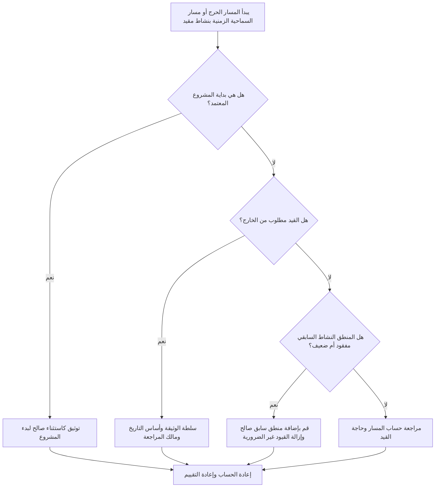

# المسار الحرج أو مسار السماحية الزمنية الذي يبدأ بقيد - دليل التحسين

## غاية

يساعد هذا الدليل القائمين على الجدولة في مراجعة سلاسل المسار الهام أو مسار السماحية الزمنية التي تبدأ بنشاط مقيد. عادة ما تكون بداية المشروع المعتمدة استثناءً صالحًا؛ المشكلة هي عندما يبدأ المسار النهائي من قيد بدلاً من تسلسل منطقي.

## قبل أن تبدأ

اجمع المعلومات التالية قبل اتخاذ الإجراء:

- نتيجة التقييم الحالية لهذا المقياس.
- تقرير المسار الحرج أو مسار السماحية الزمنية من Primavera P6.
- النشاط الأول على كل مسار تم وضع علامة عليه.
- نوع القيد وتاريخ القيد وأي تواريخ متوقعة.
- العلاقات السابقة واللاحقة لنشاط بداية المسار.
- تاريخ البيانات، ومرحلة بدء المشروع، ومتطلبات خط الأساس، وقواعد جدولة مكتب إدارة المشاريع أو العميل.
- شرح لأي قيد خارجي معتمد.

## فهم النتيجة الخاصة بك

والنتيجة القوية هي عدم وجود أي مسارات حرجة أو ذو سماحية زمنيةة لم يتم حلها تبدأ بقيد، باستثناء بداية المشروع المعتمدة.

قد تتضمن النتيجة المقبولة قيودًا خارجية موثقة، مثل إشعار بالمتابعة، أو تحرير وصول المالك، أو إصدار التصريح، أو نقاط الحجز التعاقدية. وينبغي تبرير هذه الأمور بشكل واضح.

النتيجة الضعيفة تعني أنه قد يتم التحكم في المسار من خلال التواريخ المفروضة بدلاً من منطق الشبكة. يمكن أن يؤدي ذلك إلى جعل المسار الحرج أو مسار السماحية الزمنية أقل موثوقية للتنبؤ وإعداد التقارير وتحليل التأخير.

## هدف التحسين

الهدف هو 0 مسارات لم يتم حلها تبدأ بقيد.

الهدف هو تأكيد ما إذا كان المسار يجب أن يبدأ من بداية المشروع المعتمد، أو من منطق سابق صالح، أو من قيد خارجي موثق.

## خطة العمل

### الخطوة 1: تحديد المشكلة الرئيسية

قم بإنشاء تخطيط أو تقرير P6 يوضح المسار الحرج ومسارات السماحية الزمنية المحددة. بالنسبة للنشاط الأول في كل مسار، قم بتضمين معرف النشاط، واسم النشاط، وWBS، والبدء، والإنهاء، وإجمالي السماحية الزمنية، والسماحية الزمنية الحر، والقيد الأساسي، وتاريخ القيد، والأسلاف، والخلفاء، وحالة النشاط.

راجع كل مسار تم وضع علامة عليه واسأل:

- هل هذا هو بداية المشروع المعتمد أم نشاط إشعار للمتابعة؟
- هل القيد مطلوب تعاقديا أم خارجيا؟
- هل يحتوي النشاط على منطق سابق مفقود؟
- هل يخفي القيد شبكة جدول ضعيفة أو غير مكتملة؟
- هل سيبدأ المسار بشكل مختلف إذا تمت إزالة القيد؟
- هل تم توثيق البداية المقيدة لمراجعة مكتب إدارة المشاريع أو العميل؟

### الخطوة 2: تطبيق الإصلاحات الموصى بها

إذا كان النشاط المقيد هو بداية المشروع المعتمدة، فقم بتوثيقه كاستثناء صالح وتأكد من أنه نقطة البداية المقصودة للمسار.

إذا كان القيد مطلوبًا من الخارج، فاحتفظ به فقط عندما يكون السبب واضحًا. قم بتوثيق المصدر، مثل مرحلة العقد أو إصدار الوصول أو التصريح أو تعليمات المالك أو المتطلبات التنظيمية.

إذا لم يكن القيد مطلوبًا، فقم بإزالته وإضافة منطق سابق صالح حيث يعتمد النشاط على العمل السابق أو الموافقات أو عمليات التسليم أو الشراء أو الوصول. أعد حساب الجدول وتأكد من أن المسار أصبح الآن يعتمد على المنطق.

### الخطوة 3: إزالة أدوات الحظر الشائعة

تتضمن أدوات الحظر الشائعة القيود الموروثة من خطوط الأساس القديمة، والقيود المستخدمة لفرض التواريخ، ومنطق الواجهة المفقود، والملكية غير الواضحة للتواريخ الخارجية.

يفترض مانع آخر أن المسار الحرج يمكن الاعتماد عليه ببساطة لأن P6 يحدده. إذا بدأ المسار بقيد غير ضروري، فقد يعكس المسار التحكم في التاريخ بدلاً من منطق CPM الحقيقي.

### الخطوة 4: التحقق من صحة التغييرات

إعادة حساب الجدول بعد تغيير القيود أو المنطق. قم بمراجعة المسار الحرج، والمسار الأطول، ومسارات السماحية الزمنية المحددة، والإجمالي الذو سماحية زمنية، وتواريخ المعالم الرئيسية.

إذا تغير المسار بشكل ملحوظ، قم بتوثيق السبب وإبلاغ التأثير إلى قائد ضوابط المشروع أو مراجع مكتب إدارة المشاريع أو مجدول العميل.

## جدول التحسين

### اليوم الأول: المراجعة والتشخيص

قم بتشغيل المقياس، وحدد أنشطة بدء المسار المقيدة، وافصل النتائج إلى استثناءات بدء المشروع، والقيود الخارجية الصالحة، والمنطق المفقود، والقيود غير الضرورية.

### الأيام 2-3: تنفيذ الإجراءات ذات الأولوية

قم بتصحيح المسارات الهامة والحساسة للعميل أولاً. قم بإزالة القيود غير الضرورية، وأضف المنطق المفقود، وقم بتوثيق الاستثناءات المعتمدة.

### الأيام 4-5: مراقبة النتائج المبكرة

أعد حساب الجدول ومراجعة الحركة في المسار الحرج والمسار الأطول ومسارات السماحية الزمنية وتواريخ الأحداث الرئيسية.

### اليوم السادس: التعديلات النهائية

يبدأ حل المسار المقيد المتبقي بالمالك المسؤول أو قائد عناصر التحكم في المشروع أو مراجع العميل.

### اليوم السابع: إعادة التقييم والمقارنة

قم بإجراء التقييم مرة أخرى وقارن النتيجة بالعتبة المستهدفة.

## تتبع التقدم

استخدم أداة تعقب بسيطة لإدارة التصحيحات والموافقات.

| تاريخ | تم اتخاذ الإجراء | التأثير المتوقع | النتيجة / الملاحظة | الخطوة التالية |
| --- | --- | --- | --- | --- |
| [تاريخ] | مراجعة أنشطة بدء المسار المقيدة | تحديد بداية المسار المستند إلى التاريخ | [النتيجة الملحوظة] | تعيين مالك |
| [تاريخ] | تمت إزالة القيد غير الضروري | استعادة المسار الذي يحركه المنطق | [النتيجة الملحوظة] | إعادة حساب الجدول الزمني |
| [تاريخ] | الاستثناء المعتمد الموثق | تحسين إمكانية تتبع المراجعة | [النتيجة الملحوظة] | إعادة تقييم المقياس |

## إذا لم تتحسن النتائج

إذا لم تتحسن النتائج، فتحقق مما إذا كانت القيود مركزة في منطقة WBS محددة، أو حزمة الواجهة، أو مرحلة المشروع. قد تشير النتائج المتكررة إلى أن الجدول الزمني يتم التحكم فيه من خلال التواريخ المفروضة بدلاً من المنطق الكامل.

يبدأ مسار التصعيد المقيد الذي لم يتم حله عندما يؤثر على العمل الهام، أو شبه الحرج، أو التعاقدي، أو الحساس للعميل، أو الوصول، أو العمل المتعلق بالتسليم.

## صيانة

قم بمراجعة هذا المقياس أثناء كل تحديث للجدول الزمني، ومراجعة خط الأساس، وتمرين إعادة التسلسل الرئيسي. انتبه بشكل خاص بعد التخطيط للاسترداد، أو تغييرات تاريخ العميل، أو مراجعات الواجهة.

## قائمة المراجعة الموجزة

- [ ] تمت مراجعة النتيجة الحالية
- [ ] تم تأكيد العتبة المستهدفة
- [ ] تمت مراجعة تقرير المسار الحرج أو الذو سماحية زمنية
- [ ] تم تحديد استثناءات بدء المشروع
- [ ] تم التحقق من أساس القيد
- [ ] تصحيح المنطق المفقود
- [ ] تمت إزالة القيود غير الضرورية
- [ ] الاستثناءات المعتمدة موثقة
- [ ] تمت إعادة حساب الجدول الزمني
- [ ] تم رصد النتائج
- [ ] تم تكرار التقييم
- [ ] الخطوات التالية موثقة
## محتوى ذو صلة
- [المسار الحرج أو مسار السماحية الزمنية الذي يبدأ بقيد - نظرة عامة](01_overview_template.md)
- [قالب المدونة](03_blog_template.md)
- [ما هو الجدول الزمني](../../04b_blogs_ar/01_WHAT%20A%20SCHEDULE%20IS/01_blog.md)
- [منطق قوي](../../04b_blogs_ar/02_ROBUST%20LOGIC/02_ROBUST%20LOGIC.md)
