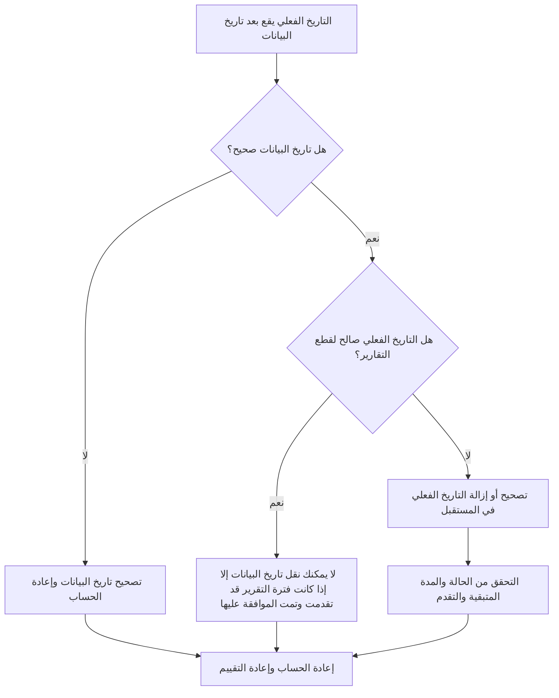

# التواريخ الفعلية متأخرة عن تاريخ البيانات في برنامج Primavera P6 - دليل التحسين

## غاية

يساعد هذا الدليل القائمين على الجدولة في مراجعة الأنشطة وتصحيحها بتواريخ فعلية بعد تاريخ بيانات Primavera P6. وهو يدعم نظام التحديث النظيف من خلال الحفاظ على الأداء الفعلي عند حدود التحديث أو قبلها.

## قبل أن تبدأ

اجمع المعلومات التالية قبل اتخاذ الإجراء:

- نتيجة التقييم الحالية لهذا المقياس.
- تاريخ بيانات المشروع المستخدم في آخر تحديث للجدول الزمني.
- قائمة الأنشطة ذات التواريخ الفعلية أكبر من تاريخ البيانات.
- حقول البداية الفعلية، والانتهاء الفعلي، وحالة النشاط، والمدة المتبقية، والنسبة المئوية للاكتمال.
- مصدر تحديث التقدم، مثل التقرير الميداني أو ملف الاستيراد أو الجدول الزمني أو التحديث اليدوي.
- قواعد قطع تحديث المشروع وفترة إعداد التقارير.
- أي إدخالات عمل معروفة بتاريخ مستقبلي أو مشكلات تتعلق باستيراد البيانات.

## فهم النتيجة الخاصة بك

والنتيجة القوية هي عدم وجود أي أنشطة بتواريخ فعلية بعد تاريخ البيانات.

يجب أن تظل النتيجة المقبولة صفرًا. تشير التواريخ الفعلية بعد تاريخ البيانات عادةً إلى خطأ في التحديث أو تاريخ بيانات غير صحيح.

النتيجة الضعيفة تعني أن الجدول يحتوي على قيم فعلية مستقبلية. يمكن أن يؤدي هذا إلى جعل تقرير الجدول الزمني يعمل كما لو كان مكتملًا أو بدأ قبل أن تصل فترة التحديث فعليًا إلى ذلك التاريخ.

## هدف التحسين

الهدف هو 0 أنشطة لم يتم حلها بتواريخ فعلية أكبر من تاريخ البيانات.

الهدف هو التأكد مما إذا كان التاريخ الفعلي خاطئًا، أو تاريخ البيانات خاطئًا، أو أن عملية استيراد التحديث تسمح بالقيم الفعلية المستقبلية.

## خطة العمل

### الخطوة 1: تحديد المشكلة الرئيسية

قم بإنشاء تخطيط P6 أو تقرير يقوم بتصفية الأنشطة ذات البدء الفعلي أو الانتهاء الفعلي أو التواريخ الفعلية الأخرى الأكبر من تاريخ البيانات. قم بتضمين معرف النشاط، واسم النشاط، وWBS، وحالة النشاط، والبدء الفعلي، والانتهاء الفعلي، والبدء، والانتهاء، والمدة المتبقية، والنسبة المئوية للاكتمال، والتقويم، ومرجع تاريخ البيانات.

راجع كل نشاط واسأل:

- هل تاريخ بيانات المشروع صحيح؟
- هل التاريخ الفعلي صحيح؟
- هل تضمن التحديث التقدم بعد الموعد النهائي؟
- هل قام ملف الاستيراد بتحميل التواريخ الفعلية المستقبلية؟
- هل يجب تغيير التاريخ الفعلي أم يجب نقل تاريخ البيانات؟
- هل تتطابق حالة النشاط مع التاريخ الفعلي المصحح؟

### الخطوة 2: تطبيق الإصلاحات الموصى بها

إذا كان تاريخ البيانات خاطئًا، قم بتصحيحه وفقًا لفترة التقرير المعتمدة وأعد حساب الجدول.

إذا كان التاريخ الفعلي غير صحيح، فقم بتصحيح البدء الفعلي أو الانتهاء الفعلي إلى التاريخ الصحيح. إذا لم يبدأ العمل أو ينته فعليًا بحلول تاريخ البيانات، فقم بإزالة الحالة الفعلية المستقبلية وحالة التحديث، والمدة المتبقية، والنسبة المئوية للاكتمال بشكل صحيح.

إذا كانت المشكلة ناتجة عن عملية استيراد، فراجع ملف الاستيراد والتعيين. تأكد من حظر التواريخ الفعلية المستقبلية أو التحقق منها قبل إصدار تقارير الجدول الزمني.

### الخطوة 3: إزالة أدوات الحظر الشائعة

تتضمن أدوات الحظر الشائعة ملفات التقدم التي تغطي التواريخ التي تتجاوز الموعد النهائي لإعداد التقارير، والتحديثات اليدوية التي تم إدخالها دون التحقق من تاريخ البيانات، والخلط بين التواريخ الفعلية وتواريخ التنبؤ.

أداة حظر أخرى هي نقل تاريخ البيانات فقط لقبول القيم الفعلية المستقبلية. يجب أن يمثل تاريخ البيانات حدود التحديث المعتمدة، ولا يمكن تغييره بشكل عرضي لإخفاء خطأ في الحالة.

### الخطوة 4: التحقق من صحة التغييرات

إعادة حساب الجدول بعد التصحيحات. أعد تشغيل المقياس وتأكد من عدم بقاء أي تواريخ فعلية بعد تاريخ البيانات.

قم بمراجعة قوائم الأنشطة المكتملة، وقوائم الأنشطة قيد التنفيذ، ومخرجات القيمة المكتسبة، وجدولة تقارير المقارنة للتأكد من أن التصحيح لم يخلق حالات عدم تناسق أخرى في الحالة.

## جدول التحسين

### اليوم الأول: المراجعة والتشخيص

قم بتشغيل المقياس، وتأكد من تاريخ البيانات، وافصل النتائج إلى تواريخ فعلية غير صحيحة، وتاريخ بيانات غير صحيح، ومشكلات الاستيراد، وتحديث مشكلات القطع.

### الأيام 2-3: تنفيذ الإجراءات ذات الأولوية

الأنشطة الصحيحة المستخدمة في إعداد التقارير أولا. إصلاح التواريخ الفعلية وتحديث الحالات ومعالجة مشكلات الاستيراد.

### الأيام 4-5: مراقبة النتائج المبكرة

أعد حساب الجدول ومراجعة تقارير التقدم وقوائم الأنشطة المكتملة ومخرجات القيمة المكتسبة وتواريخ المعالم.

### اليوم السادس: التعديلات النهائية

قم بحل العناصر غير المؤكدة المتبقية مع الانضباط المسؤول أو القائد الميداني أو قائد ضوابط المشروع.

### اليوم السابع: إعادة التقييم والمقارنة

قم بإجراء التقييم مرة أخرى وقارن النتيجة بالعتبة المستهدفة.

## تتبع التقدم

استخدم أداة تعقب بسيطة لإدارة التصحيحات والموافقات.

| تاريخ | تم اتخاذ الإجراء | التأثير المتوقع | النتيجة / الملاحظة | الخطوة التالية |
| --- | --- | --- | --- | --- |
| [تاريخ] | تمت مراجعة التواريخ الفعلية بعد تاريخ البيانات | تحديد الحقائق المستقبلية | [النتيجة الملحوظة] | تعيين مالك |
| [تاريخ] | البداية الفعلية المصححة أو النهاية الفعلية | استعادة حدود الحالة الصالحة | [النتيجة الملحوظة] | إعادة حساب الجدول الزمني |
| [تاريخ] | تمت مراجعة عملية الاستيراد | منع تكرار القيم الفعلية في المستقبل | [النتيجة الملحوظة] | إعادة تقييم المقياس |

## إذا لم تتحسن النتائج

إذا لم تتحسن النتائج، فتحقق مما إذا كان يتم تقديم القيم الفعلية المستقبلية بشكل متكرر من خلال عمليات الاستيراد أو الجداول الزمنية أو سير عمل التحديث اليدوي. راجع إجراء قطع التحديث وتأكد من إرسال تاريخ البيانات بوضوح إلى جميع المساهمين.

قم بتصعيد العناصر التي لم يتم حلها عندما تؤثر على القيمة المكتسبة أو شبه الحرجة أو القيمة المكتسبة أو تقارير العميل أو الدفع أو العمل المتعلق بالتسليم.

## صيانة

قم بمراجعة هذا المقياس أثناء كل دورة تحديث قبل إصدار التقارير. يجب أن يكون جزءًا من التحقق من الحالة القياسية مع التواريخ الفعلية وتاريخ البيانات والمدة المتبقية والنسبة المئوية للاكتمال وعمليات التحقق من حالة النشاط.

## قائمة المراجعة الموجزة

- [ ] تمت مراجعة النتيجة الحالية
- [ ] تم تأكيد العتبة المستهدفة
- [ ] تم تأكيد تاريخ البيانات
- [ ] تم تحديد المشكلة الرئيسية
- [ ] تم تصحيح التواريخ الفعلية المستقبلية
- [ ] تم التحقق من حالة النشاط
- [ ] تم التحقق من المدة المتبقية والتقدم المحرز
- [ ] تمت مراجعة سير عمل الاستيراد أو التحديث
- [ ] تمت إعادة حساب الجدول الزمني
- [ ] تم رصد النتائج
- [ ] تم تكرار التقييم
- [ ] الخطوات التالية موثقة
## محتوى ذو صلة
- [التواريخ الفعلية متأخرة عن تاريخ البيانات في برنامج Primavera P6 - نظرة عامة](01_overview_template.md)
- [قالب المدونة](03_blog_template.md)
- [ما هو الجدول الزمني](../../04b_blogs_ar/01_WHAT%20A%20SCHEDULE%20IS/01_blog.md)
- [منطق قوي](../../04b_blogs_ar/02_ROBUST%20LOGIC/02_ROBUST%20LOGIC.md)
