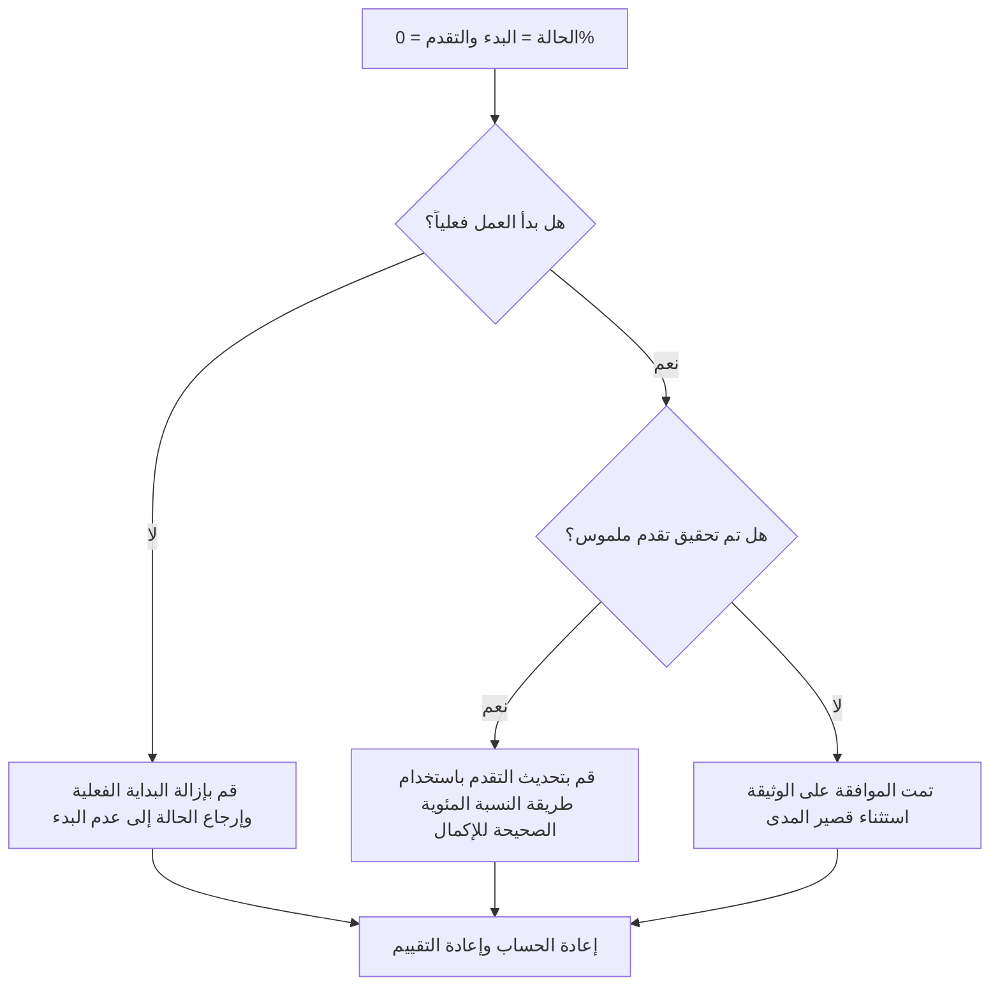

## غاية

يساعد هذا الدليل المجدولين على مراجعة الأنشطة وتصحيحها عند بدء حالة النشاط ولكن التقدم فيها 0%. وهو يدعم تحديثات Primavera P6 الأنظف من خلال محاذاة البداية الفعلية وحالة النشاط ونسبة الاكتمال والمدة المتبقية.

## قبل أن تبدأ

اجمع المعلومات التالية قبل اتخاذ الإجراء:

- نتيجة التقييم الحالية لهذا المقياس.
- قائمة الأنشطة ذات حالة النشاط = البدء والتقدم = 0%.
- البداية الفعلية والانتهاء الفعلي والمدة المتبقية والمدة الأصلية وحالة النشاط.
- النسبة المئوية للإكمال النوع وحقول التقدم ذات الصلة.
- النسبة المئوية للاكتمال الفعلي، والنسبة المئوية للمدة، والنسبة المئوية للوحدات، والنسبة المئوية للنشاط.
- تاريخ البيانات وآخر ملاحظات التحديث.
- التأكيد الميداني على ما إذا كان العمل قد بدأ بالفعل وما هو التقدم الذي تم تحقيقه.

## فهم النتيجة الخاصة بك

والنتيجة القوية هي عدم وجود أنشطة بحالة البدء والتقدم بنسبة 0%.

قد تتضمن النتيجة المقبولة حالات موثقة نادرة حيث تم بدء النشاط في نهاية فترة التحديث ولم يتم تحقيق أي تقدم قابل للقياس بعد. ويجب أن تكون هذه الحالات محدودة وموضحة بوضوح.

النتيجة الضعيفة تعني أن الجدول يحتوي على أنشطة لا تتفق حالة البداية وقيمة التقدم فيها. يمكن أن يؤدي ذلك إلى إنشاء تقارير مرحلية مضللة، ومشاكل في القيمة المكتسبة، وارتباك في النظرة المستقبلية.

## هدف التحسين

الهدف هو 0 أنشطة لم يتم حلها مع حالة النشاط = البدء والتقدم = 0%.

الهدف هو التأكد مما إذا كان كل نشاط قد بدأ بالفعل، أو ما إذا كان التقدم قد تم تفويته، أو ما إذا كان يجب إرجاع النشاط إلى "لم يبدأ".

## خطة العمل

### الخطوة 1: تحديد المشكلة الرئيسية

قم بإنشاء تخطيط P6 أو تقرير يقوم بتصفية الأنشطة ذات حالة البدء والتقدم 0%. قم بتضمين معرف النشاط، واسم النشاط، وWBS، وحالة النشاط، والبدء الفعلي، والانتهاء الفعلي، والمدة الأصلية، والمدة المتبقية، والنسبة المئوية للاكتمال، والنسبة المئوية للاكتمال الفعلي، والنسبة المئوية للاكتمال، والنسبة المئوية للوحدات المكتملة، والنسبة المئوية للنشاط المكتمل، والبدء، والانتهاء، والإجمالي الذو سماحية زمنية.

راجع كل نشاط واسأل:

- هل بدأ العمل فعلياً؟
- إذا بدأ العمل، ما هو التقدم الملموس الذي تم تحقيقه؟
- هل البداية الفعلية صحيحة؟
- ما نوع النسبة المئوية الكاملة الذي يتم استخدامه؟
- هل التقدم مفقود من المجال الصحيح؟
- هل بدأ النشاط إدارياً دون بداية العمل الحقيقي؟

### الخطوة 2: تطبيق الإصلاحات الموصى بها

إذا لم يبدأ العمل فعليًا، قم بإزالة "البدء الفعلي" غير الصحيح وأعد النشاط إلى "لم يبدأ". تأكد من أن المدة المتبقية وتواريخ التوقعات لا تزال صالحة.

إذا بدأ العمل بالفعل وتم تحقيق التقدم، فقم بتحديث حقل التقدم الصحيح استنادًا إلى نوع نسبة الاكتمال. بالنسبة إلى النسبة المئوية للاكتمال الفعلي، أدخل التقدم المادي. بالنسبة إلى نسبة اكتمال المدة، تأكد من أن المدة المتبقية تعكس العمل المنجز. بالنسبة للوحدات المئوية المكتملة، تأكد من تحديث تقدم الوحدات.

إذا بدأ العمل ولكن لم يتم تحقيق تقدم ملموس، قم بتوثيق السبب. يجب أن يكون هذا نادرًا ومؤقتًا، مثل تسجيل بداية التعبئة بالقرب من الموعد النهائي للتحديث مع عدم وجود تقدم مكتسب حتى الآن.

### الخطوة 3: إزالة أدوات الحظر الشائعة

تتضمن أدوات الحظر الشائعة كميات الحقول المفقودة، وعمليات البدء الفعلية المستوردة بدون قيم التقدم، والارتباك بشأن النسبة المئوية للنوع المكتمل، والضغط لإظهار العمل كما بدأ قبل توفر تقدم قابل للقياس.

هناك مانع آخر يتعامل مع البداية الفعلية كإشارة تخطيط بدلاً من حقيقة الحالة. يجب أن تمثل البداية الفعلية بداية حقيقية للعمل، وليس نية البدء قريبًا.

### الخطوة 4: التحقق من صحة التغييرات

إعادة حساب الجدول بعد التصحيحات. أعد تشغيل المقياس وتأكد من تصحيح كل عنصر متبقي أو تبريره أو تعيينه للمتابعة.

قم بمراجعة تقارير التقدم ومخرجات القيمة المكتسبة وتقارير النظرة المستقبلية وقوائم الأنشطة الجارية للتأكد من أن التصحيح لم يخلق أي تناقضات جديدة.

## جدول التحسين

### اليوم الأول: المراجعة والتشخيص

قم بتشغيل المقياس، وقم بتأكيد تاريخ البيانات، وفصل النتائج إلى بدايات غير صحيحة، والتقدم المفقود، ومشكلات طريقة النسبة المئوية للإكمال، والاستثناءات المحتملة.

### الأيام 2-3: تنفيذ الإجراءات ذات الأولوية

الأنشطة الصحيحة المستخدمة في إعداد التقارير أولا. قم بإزالة عمليات البدء الفعلية غير الصحيحة، أو قم بتحديث قيم التقدم، أو قم بتوثيق الاستثناءات الصالحة.

### الأيام 4-5: مراقبة النتائج المبكرة

أعد حساب الجدول ومراجعة تقارير التقدم ومخرجات القيمة المكتسبة وقوائم الأنشطة الجارية وتقارير البحث المستقبلي.

### اليوم السادس: التعديلات النهائية

قم بحل العناصر غير المؤكدة المتبقية مع الانضباط المسؤول أو القائد الميداني أو قائد ضوابط المشروع.

### اليوم السابع: إعادة التقييم والمقارنة

قم بإجراء التقييم مرة أخرى وقارن النتيجة بالعتبة المستهدفة.

## تتبع التقدم

استخدم أداة تعقب بسيطة لإدارة التصحيحات والموافقات.

| تاريخ | تم اتخاذ الإجراء | التأثير المتوقع | النتيجة / الملاحظة | الخطوة التالية |
| --- | --- | --- | --- | --- |
| [تاريخ] | تمت مراجعة الأنشطة التي بدأت مع تقدم بنسبة 0% | تحديد عدم تناسق الحالة | [النتيجة الملحوظة] | تعيين مالك |
| [تاريخ] | تمت إزالة البداية الفعلية غير الصحيحة | استعادة الحالة الدقيقة | [النتيجة الملحوظة] | إعادة حساب الجدول الزمني |
| [تاريخ] | تم تحديث قيمة التقدم | محاذاة حالة البدء مع التقدم | [النتيجة الملحوظة] | إعادة تقييم المقياس |

## إذا لم تتحسن النتائج

إذا لم تتحسن النتائج، فتحقق مما إذا كان يتم استيراد عمليات البدء الفعلية دون مطابقة قيم التقدم أو ما إذا كانت الفرق تستخدم قواعد مختلفة لما يتم اعتباره بمثابة بداية. قم بمراجعة إجراء قطع التحديث وطريقة النسبة المئوية للاكتمال.

قم بتصعيد العناصر التي لم يتم حلها عندما تؤثر على القيمة المكتسبة أو شبه الحرجة أو القيمة المكتسبة أو تقارير العميل أو الدفع أو العمل المتعلق بالتسليم.

## صيانة

قم بمراجعة هذا المقياس أثناء كل دورة تحديث قبل إصدار التقارير. ويجب أن يكون جزءًا من التحقق من صحة التحديث القياسي مع التواريخ الفعلية والمدة المتبقية والنسبة المئوية للاكتمال وعمليات التحقق من حالة النشاط.

## قائمة المراجعة الموجزة

- [ ] تمت مراجعة النتيجة الحالية
- [ ] تم تأكيد العتبة المستهدفة
- [ ] تم تأكيد تاريخ البيانات
- [ ] تم تحديد المشكلة الرئيسية
- [ ] تمت إزالة عمليات البدء الفعلية غير الصحيحة
- [ ] تم تحديث التقدم المفقود
- [ ] تمت مراجعة النسبة المئوية للنوع الكامل
- [ ] تم توثيق الاستثناءات الصحيحة
- [ ] تمت إعادة حساب الجدول الزمني
- [ ] تم رصد النتائج
- [ ] تم تكرار التقييم
- [ ] الخطوات التالية موثقة
## محتوى ذو صلة
- [قالب المدونة](03_blog_template.md)
- [ما هو الجدول الزمني](../../04b_blogs_ar/01_WHAT%20A%20SCHEDULE%20IS/01_blog.md)
- [منطق قوي](../../04b_blogs_ar/02_ROBUST%20LOGIC/02_ROBUST%20LOGIC.md)
