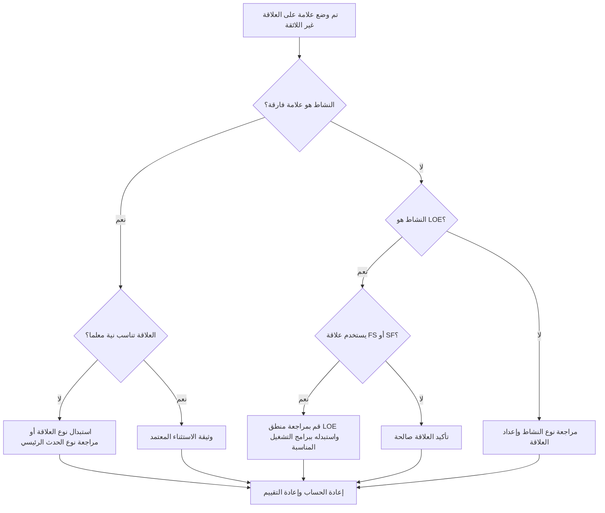

## غاية

يساعد هذا الدليل القائمين على الجدولة على مراجعة وتصحيح العلاقات غير الملائمة التي تتضمن معالم الإنهاء، ومراحل البدء، وأنشطة مستوى الجهد (LOE) في Primavera P6.

## قبل أن تبدأ

اجمع المعلومات التالية قبل اتخاذ الإجراء:

- نتيجة التقييم الحالية لهذا المقياس.
- قائمة العلاقات التي تم وضع علامة عليها حسب النشاط السابق والخلف ونوع النشاط ونوع العلاقة.
- معرف النشاط، واسم النشاط، وWBS، ونوع النشاط، والبدء، والإنهاء، وإجمالي السماحية الزمنية، وحالة المسار الحرج أو الأطول.
- نوع العلاقة، والتأخر، ونوع النشاط السابق، ونوع النشاط اللاحق.
- الغرض الرئيسي، والغرض من LOE، ومتطلبات إعداد التقارير ذات الصلة.
- تاريخ البيانات وأحدث مخرجات حساب الجدول الزمني.

## فهم النتيجة الخاصة بك

والنتيجة القوية هي صفر علاقات غير لائقة لم يتم حلها.

يجب أن يشير المقياس إلى هذه الحالات:

- قم بإنهاء الحدث الرئيسي باستخدام النشاط اللاحق SS أو SF.
- قم بإنهاء الحدث المهم مع النشاط السابق SS.
- معلم بداية مع النشاط السابق FF أو SF.
- معلم البداية مع FS أو FF اللاحق.
- علاقة LOE مع FS.
- علاقة LOE مع SF.

قد توجد استثناءات نادرة، ولكن يجب توثيقها وسهولة شرحها أثناء مراجعة الجدول الزمني.

## هدف التحسين

الهدف هو 0 علاقات غير لائقة لم يتم حلها.

الهدف هو جعل كل حدث رئيسي وعلاقة LOE مطابقة لسلوك الجدولة المقصود دون فرض التواريخ أو إخفاء المنطق الضعيف.

## خطة العمل

### الخطوة 1: تحديد المشكلة الرئيسية

قم بإنشاء تخطيط P6 أو تقرير يعرض جميع الأحداث الرئيسية وأنشطة LOE مع تفاصيل سابقة ولاحقة. قم بتضمين نوع النشاط، ونوع العلاقة، والتأخر، والبدء، والإنهاء، وإجمالي السماحية الزمنية، ومؤشرات المسار الحرج أو الأطول.

راجع كل علاقة تم وضع علامة عليها واسأل:

- هل نوع النشاط صحيح؟
- هل يتطابق نوع العلاقة مع غرض الحدث الرئيسي أو LOE؟
- هل تحاول العلاقة فرض تاريخ البدء أو الانتهاء أو التقرير؟
- هل تمثل العلاقة العادية FS أو SS أو FF المنطق بشكل أفضل؟
- هل العلاقة استثناء معتمد؟

### الخطوة 2: تطبيق الإصلاحات الموصى بها

بالنسبة لمراحل الإنهاء، تأكد من أن المنطق يقود أو يستجيب للإكمال. استبدل علاقات SS أو SF عندما لا تمثل تبعية حقيقية قائمة على النهاية.

بالنسبة لمراحل البدء، تأكد من أن المنطق يدعم حدث البداية. استبدل FF أو SF أو FS اللاحقة أو العلاقات الأخرى غير المناسبة عند استخدامها لفرض تاريخ إعداد التقارير.

بالنسبة لأنشطة LOE، راجع ما إذا كانت علاقات FS أو SF تجعل محرك LOE يعمل بشكل منفصل بشكل غير صحيح. عادةً ما تلخص أنشطة LOE أعمالًا أخرى أو تمتد إليها، لذا يجب التعامل مع علاقاتها بعناية.

إذا كانت العلاقة صالحة عن طريق العقد أو طريقة العميل أو تصميم جدول خاص، قم بتوثيق السبب والموافقة.

### الخطوة 3: إزالة أدوات الحظر الشائعة

تتضمن أدوات الحظر الشائعة المنطق المنسوخ من الجداول القديمة، وسوء فهم سلوك المعالم الرئيسية، واستخدام علاقات SF كاختصار، واستخدام أنشطة LOE للتحكم في العمل الذي يجب أن يكون مدفوعًا بأنشطة منفصلة.

مانع آخر هو التعامل مع تنظيف العلاقة كمستحضرات تجميل. يمكن أن تؤثر هذه الارتباطات على تقرير المسار الحرج وتواريخ الأحداث الرئيسية ومصداقية الجدول الزمني.

### الخطوة 4: التحقق من صحة التغييرات

إعادة حساب الجدول بعد التصحيحات. أعد تشغيل المقياس وتأكد من تصحيح كل عنصر متبقي أو تبريره أو تعيينه للمتابعة.

مراجعة تواريخ الأحداث الرئيسية، وتواريخ LOE، والسماحية الزمنية الإجمالي، والمسار الحرج أو الأطول، ومخرجات التقارير الرئيسية للتأكد من أن التصحيح لم يخلق مشكلات جديدة.

## جدول التحسين

### اليوم الأول: المراجعة والتشخيص

قم بتشغيل المقياس وتجميع النتائج حسب نوع النشاط ونمط العلاقة.

### الأيام 2-3: تنفيذ الإجراءات ذات الأولوية

قم بتصحيح العلاقات بشأن المعالم المهمة وشبه الحرجة والتعاقدية والتسليم والمواجهة مع العميل أولاً.

### الأيام 4-5: مراقبة النتائج المبكرة

أعد حساب الجدول ومراجعة السماحية الزمنية والمسار الحرج وحركة المعالم وسلوك LOE.

### اليوم السادس: التعديلات النهائية

قم بحل الاستثناءات المتبقية مع المجدول أو قائد ضوابط المشروع أو مراجع مكتب إدارة المشاريع.

### اليوم السابع: إعادة التقييم والمقارنة

قم بإجراء التقييم مرة أخرى وقارن النتيجة بالعتبة المستهدفة.

## تتبع التقدم

استخدم أداة تعقب بسيطة لإدارة التصحيحات والموافقات.

| تاريخ | تم اتخاذ الإجراء | التأثير المتوقع | النتيجة / الملاحظة | الخطوة التالية |
| --- | --- | --- | --- | --- |
| [تاريخ] | مراجعة العلاقات غير اللائقة | تحديد القضايا المتعلقة بنوع العلاقة | [النتيجة الملحوظة] | تعيين مالك |
| [تاريخ] | تصحيح العلاقة الهامة | محاذاة المنطق مع الغرض الرئيسي | [النتيجة الملحوظة] | إعادة حساب الجدول الزمني |
| [تاريخ] | تمت مراجعة علاقات LOE | منع LOE من قيادة العمل المنفصل بشكل غير صحيح | [النتيجة الملحوظة] | إعادة تقييم المقياس |

## إذا لم تتحسن النتائج

إذا لم تتحسن النتائج، فتحقق مما إذا كان يتم إعادة تقديم نفس العلاقات من خلال عمليات الاستيراد أو المنطق المنسوخ أو التغييرات العامة أو تكامل الجدول الخارجي.

قم بتصعيد العناصر التي لم يتم حلها عندما تؤثر على المعالم التعاقدية أو تقارير المسار الحرج أو عمليات إرسال العميل أو أحداث الدفع أو تواريخ التسليم.

## صيانة

قم بمراجعة هذا المقياس أثناء كل دورة تحديث وقبل الموافقة على خط الأساس. وهو مفيد بشكل خاص بعد عمليات الاستيراد المجدولة، والأجزاء المنسوخة، وإعادة التسلسل الرئيسية، ومراجعات المعالم الرئيسية.

## قائمة المراجعة الموجزة

- [ ] تمت مراجعة النتيجة الحالية
- [ ] تم تأكيد العتبة المستهدفة
- [ ] تمت مراجعة أنواع الأنشطة الرئيسية وLOE
- [ ] تم فحص أنواع العلاقات التي تم وضع علامة عليها
- [ ] تصحيح العلاقات الخاطئة
- [ ] تم توثيق الاستثناءات الصحيحة
- [ ] تمت إعادة حساب الجدول الزمني
- [ ] تمت مراجعة مسار السماحية الزمنية والمسار الحرج
- [ ] تم رصد النتائج
- [ ] تم تكرار التقييم
- [ ] الخطوات التالية موثقة
## محتوى ذو صلة
- [03_blog_template](../14_unusual_relations/03_blog_template.md)
- [ما هو الجدول الزمني](../../04b_blogs_ar/01_WHAT%20A%20SCHEDULE%20IS/01_blog.md)
- [منطق قوي](../../04b_blogs_ar/02_ROBUST%20LOGIC/02_ROBUST%20LOGIC.md)
