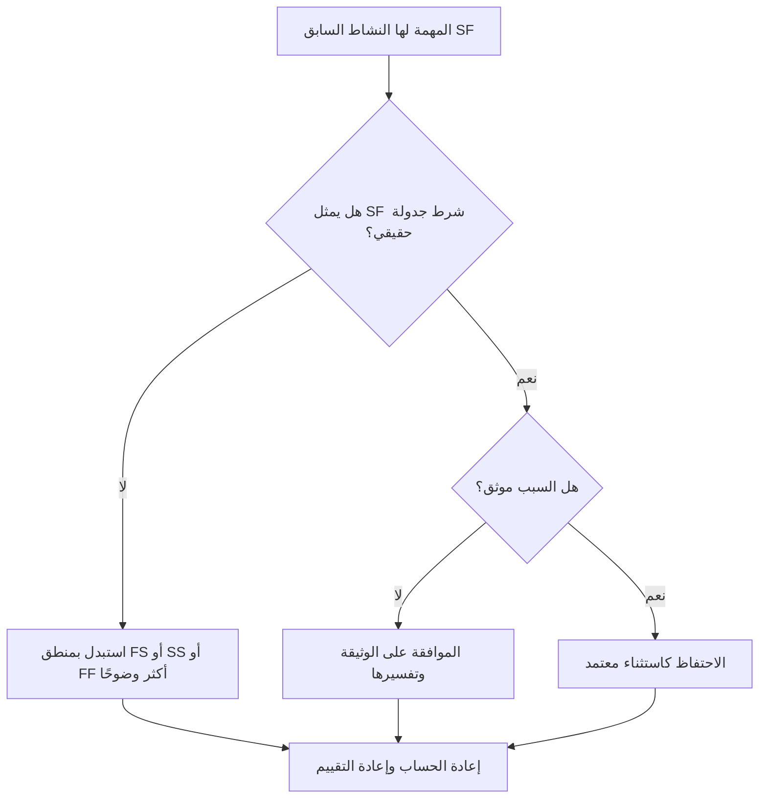

# أنشطة المهام مع أسلاف SF في بريمافيرا P6 - دليل التحسين

## غاية

يساعد هذا الدليل المجدولين على مراجعة وتصحيح أنشطة المهام التي لها علاقات سابقة من البداية إلى النهاية (SF) في Primavera P6.

## قبل أن تبدأ

اجمع المعلومات التالية قبل اتخاذ الإجراء:

- نتيجة التقييم الحالية لهذا المقياس.
- قائمة بأنشطة المهام مع النشاط السابق SF واحد على الأقل.
- معرف النشاط، واسم النشاط، وWBS، ونوع النشاط، والبدء، والإنهاء، وإجمالي السماحية الزمنية، وحالة المسار الحرج أو الأطول.
- معرف النشاط السابق، ونوع النشاط السابق، ونوع العلاقة، والتأخر.
- أي قيود، وتقويمات، ومصطلحات الانتهاء المتوقعة، وملاحظات التحديث ذات الصلة.
- تاريخ البيانات وأحدث مخرجات حساب الجدول الزمني.

## فهم النتيجة الخاصة بك

والنتيجة القوية هي عدم وجود أي أنشطة مهمة لم يتم حلها مع علاقات SF السابقة.

تعني علاقة SF أن النشاط اللاحق لا يمكن أن ينتهي حتى يبدأ النشاط السابق. وهذا أمر غير شائع في منطق البناء العادي أو الهندسة أو المشتريات أو التشغيل. يجب أن يتم تمثيل معظم علاقات المهام بمنطق FS أو SS أو FF عندما تعكس التسلسل الحقيقي.

وتعني النتيجة الضعيفة أنه قد يتم التحكم في انتهاء نشاط المهمة عن طريق المنطق الذي يصعب تبريره أو الذي تم نسخه من جزء آخر من الجدول دون مراجعة.

## هدف التحسين

الهدف هو 0 علاقات SF سابقة لم يتم حلها في أنشطة المهمة.

الهدف هو تأكيد ما إذا كانت كل علاقة SF هي نموذج جدولة صالح أو يجب استبدالها بمنطق أكثر وضوحًا.

## خطة العمل

### الخطوة 1: تحديد المشكلة الرئيسية

قم بإنشاء تخطيط P6 أو تقرير يقوم بتصفية أنشطة المهمة باستخدام النشاط السابق SF. قم بتضمين المعرفات السابقة واللاحقة، ونوع النشاط، ونوع العلاقة، والتأخر، والبدء، والإنهاء، والسماحية الزمنية الإجمالي، والقيود، ومؤشرات المسار الحرج أو الأطول.

راجع كل علاقة واسأل:

- ما هو الوضع الحقيقي الذي تحاول علاقة SF تمثيله؟
- هل يجب أن يبدأ النشاط السابق حقًا في السيطرة على النهاية اللاحقة؟
- هل يصف منطق FS أو SS أو FF التسلسل بشكل أكثر وضوحًا؟
- هل يتم استخدام التأخر لفرض موعد؟
- هل العلاقة على المسار الحرج أم شبه الحرج؟
- هل هناك سبب موثق لاستخدام SF؟

### الخطوة 2: تطبيق الإصلاحات الموصى بها

إذا كانت علاقة SF لا تمثل حالة حقيقية، فاستبدلها بنوع العلاقة الذي يصف التسلسل بشكل أفضل. استخدم FS عندما يجب أن يبدأ اللاحق بعد اكتمال النشاط السابق، وSS عندما تكون البدايات مرتبطة، وFF عندما تكون محاذاة النهاية هي المنطق المقصود.

إذا تمت إضافة علاقة SF للتحكم في تاريخ الانتهاء، فراجع ما إذا كان الجدول يحتاج إلى تاريخ سابق أو حدث رئيسي أو مراجعة قيد أو تقسيم نشاط بدلاً من ذلك.

إذا كانت علاقة SF صالحة، قم بتوثيق سبب طلبها ومن وافق عليها. يجب أن يكون هذا استثناءً نادرًا، وليس نمط جدولة شائعًا.

### الخطوة 3: إزالة أدوات الحظر الشائعة

تشتمل أدوات الحظر الشائعة على العلاقات المنسوخة والمنطق الخارجي المستورد وسوء فهم سلوك SF واستخدام SF مع تأخر لفرض تاريخ انتهاء.

مانع آخر هو ترك العلاقة لأن التاريخ المحسوب يبدو مقبولاً. لا تزال العلاقة بحاجة إلى الدفاع عنها منطقياً.

### الخطوة 4: التحقق من صحة التغييرات

إعادة حساب الجدول بعد التصحيحات. أعد تشغيل المقياس وتأكد من تصحيح كل النشاط السابق SF المتبقي أو تبريره أو تعيينه للمتابعة.

قم بمراجعة إجمالي السماحية الزمنية والمسار الحرج أو الأطول والمراحل الرئيسية المتأثرة ومخرجات البحث الأمامي للتأكد من أن تغيير المنطق لم يتسبب في حدوث مشكلات جديدة.

## جدول التحسين

### اليوم الأول: المراجعة والتشخيص

قم بتشغيل المقياس، وقم بتأكيد تاريخ البيانات، وفصل النتائج إلى علاقات SF غير صالحة، والاستثناءات المحتملة، والعناصر التي تحتاج إلى إدخال المالك.

### الأيام 2-3: تنفيذ الإجراءات ذات الأولوية

قم بتصحيح علاقات SF بشأن الأنشطة الحرجة وشبه الحرجة والتعاقدية وقصيرة المدى أولاً.

### الأيام 4-5: مراقبة النتائج المبكرة

أعد حساب الجدول ومراجعة السماحية الزمنية والمسار الحرج وتواريخ البحث المسبق وحركة المعالم الرئيسية.

### اليوم السادس: التعديلات النهائية

قم بحل الاستثناءات المتبقية مع المجدول أو قائد الانضباط أو قائد ضوابط المشروع أو مراجع مكتب إدارة المشاريع.

### اليوم السابع: إعادة التقييم والمقارنة

قم بإجراء التقييم مرة أخرى وقارن النتيجة بالعتبة المستهدفة.

## تتبع التقدم

استخدم أداة تعقب بسيطة لإدارة التصحيحات والموافقات.

| تاريخ | تم اتخاذ الإجراء | التأثير المتوقع | النتيجة / الملاحظة | الخطوة التالية |
| --- | --- | --- | --- | --- |
| [تاريخ] | تمت مراجعة أنشطة المهمة مع أسلاف SF | تحديد منطق العلاقة غير العادية | [النتيجة الملحوظة] | تعيين مالك |
| [تاريخ] | تم استبدال علاقة SF غير الصالحة | تحسين وضوح المنطق | [النتيجة الملحوظة] | إعادة حساب الجدول الزمني |
| [تاريخ] | استثناء SF صالح موثق | الحفاظ على المنطق الخاص المعتمد | [النتيجة الملحوظة] | إعادة تقييم المقياس |

## إذا لم تتحسن النتائج

إذا لم تتحسن النتائج، فتحقق مما إذا كان يتم إعادة تقديم علاقات SF من خلال الواردات أو الأجزاء المنسوخة أو التغييرات العالمية أو تكامل الجدول الزمني الخارجي.

قم بتصعيد العناصر التي لم يتم حلها عندما تؤثر على المسار الهام، أو المعالم التعاقدية، أو عمليات إرسال العميل، أو أحداث الدفع، أو أعمال التنفيذ على المدى القريب.

## صيانة

قم بمراجعة هذا المقياس أثناء كل دورة تحديث وقبل الموافقة على خط الأساس. وهو مفيد بشكل خاص بعد عمليات الاستيراد المجدولة وإعادة التسلسل الرئيسية وتمارين تنظيف المنطق.

## قائمة المراجعة الموجزة

- [ ] تمت مراجعة النتيجة الحالية
- [ ] تم تأكيد العتبة المستهدفة
- [ ] تم إنشاء قائمة النشاط السابق SF
- [ ] تم إعطاء الأولوية للعناصر الحرجة وشبه الحرجة
- [ ] تم تصحيح علاقات SF غير الصالحة
- [ ] تم توثيق الاستثناءات الصحيحة
- [ ] تمت إعادة حساب الجدول الزمني
- [ ] تمت مراجعة مسار السماحية الزمنية والمسار الحرج
- [ ] تم رصد النتائج
- [ ] تم تكرار التقييم
- [ ] الخطوات التالية موثقة
## محتوى ذو صلة
- [أنشطة المهام مع أسلاف SF في بريمافيرا P6 - نظرة عامة](01_overview_template.md)
- [أنشطة المهام مع أسلاف SF في بريمافيرا P6](03_blog_template.md)
- [ما هو الجدول الزمني](../../04b_blogs_ar/01_WHAT%20A%20SCHEDULE%20IS/01_blog.md)
- [منطق قوي](../../04b_blogs_ar/02_ROBUST%20LOGIC/02_ROBUST%20LOGIC.md)
