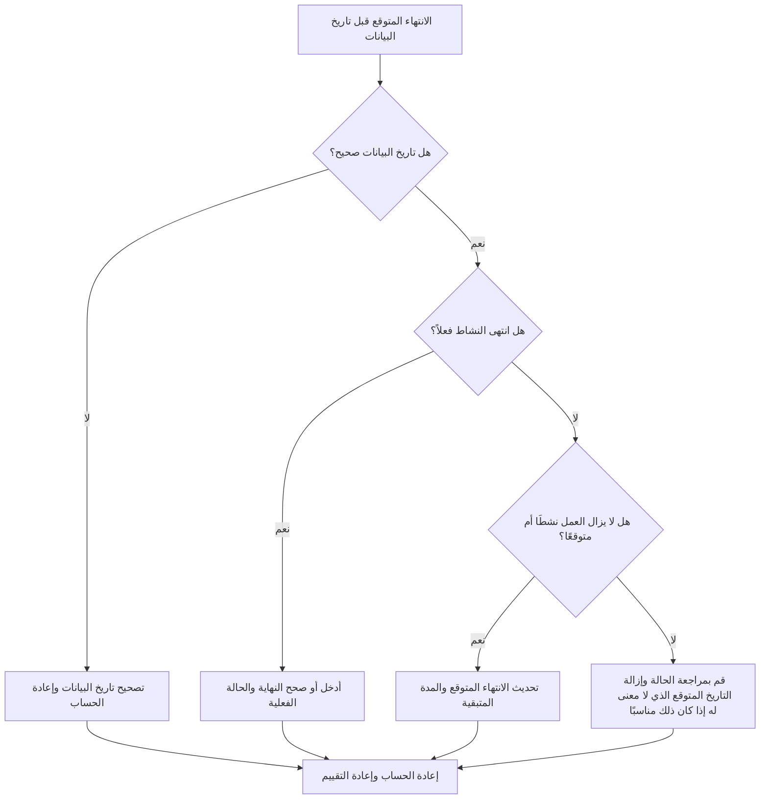

# الانتهاء المتوقع قبل تاريخ البيانات في Primavera P6 - دليل التحسين

## غاية

يساعد هذا الدليل القائمين على الجدولة في مراجعة وتصحيح الأنشطة التي يكون تاريخ الانتهاء المتوقع فيها أقدم من تاريخ بيانات Primavera P6. وهو يدعم نظام التحديث الأنظف من خلال الحفاظ على محاذاة التواريخ المتوقعة مع حدود التقارير الحالية.

## قبل أن تبدأ

اجمع المعلومات التالية قبل اتخاذ الإجراء:

- نتيجة التقييم الحالية لهذا المقياس.
- تاريخ بيانات المشروع المستخدم في آخر تحديث للجدول الزمني.
- قائمة بالأنشطة التي يكون تاريخ الانتهاء المتوقع فيها أقدم من تاريخ البيانات.
- حالة النشاط، البداية الفعلية، النهاية الفعلية، المدة المتبقية، النسبة المئوية للاكتمال، البداية، النهاية، وإجمالي السماحية الزمنية.
- مصدر النهاية المتوقع، مثل الإدخال اليدوي أو ملف الاستيراد أو التنبؤ الميداني أو سير عمل تحديث P6.
- قواعد قطع تحديث المشروع وأحدث ملاحظات التقدم.

## فهم النتيجة الخاصة بك

والنتيجة القوية هي عدم وجود أي أنشطة مع انتهاء متوقع قبل تاريخ البيانات.

عادةً ما يعني الانتهاء المتوقع قبل تاريخ البيانات أن التنبؤ أو معلومات الإكمال المتوقع لم يتم تحديثها عند المضي قدمًا في الجدول. وقد يشير أيضًا إلى أن النشاط يجب أن يكون له انتهاء فعلي، أو مدة متبقية منقحة، أو حالة مصححة.

النتيجة الضعيفة تعني أن الجدول يحتوي على تواريخ اكتمال متوقعة تقع في الماضي بالنسبة إلى حد التحديث الحالي.

## هدف التحسين

الهدف هو 0 أنشطة لم يتم حلها مع انتهاء متوقع قبل تاريخ البيانات.

الهدف هو التأكد مما إذا كان كل نشاط قد اكتمل أو لا يزال قيد التقدم أو لم يبدأ أو تم تحديثه بشكل غير صحيح.

## خطة العمل

### الخطوة 1: تحديد المشكلة الرئيسية

قم بإنشاء تخطيط P6 أو تقرير يقوم بتصفية الأنشطة التي يكون تاريخ الانتهاء المتوقع فيها أقدم من تاريخ البيانات. قم بتضمين معرف النشاط، واسم النشاط، وWBS، وحالة النشاط، والانتهاء المتوقع، والبدء الفعلي، والانتهاء الفعلي، والمدة المتبقية، والنسبة المئوية للاكتمال، والبدء، والانتهاء، وإجمالي السماحية الزمنية، والتقويم.

راجع كل نشاط واسأل:

- هل تاريخ البيانات صحيح؟
- هل تم الانتهاء من النشاط بالفعل قبل تاريخ البيانات؟
- إذا تم الانتهاء، فهل النهاية الفعلية مفقودة؟
- إذا لم ينته، ​​فهل يجب تحديث "الانتهاء المتوقع"؟
- هل لا تزال المدة المتبقية تمثل العمل المتبقي؟
- هل أدى الاستيراد أو التحديث اليدوي إلى ترك قيمة "الإنهاء المتوقع" القديمة؟

### الخطوة 2: تطبيق الإصلاحات الموصى بها

إذا كان تاريخ البيانات خاطئًا، قم بتصحيحه وفقًا لفترة التقرير المعتمدة وأعد حساب الجدول.

إذا انتهى النشاط قبل تاريخ البيانات، فأدخل أو صحح الانتهاء الفعلي وتأكد من اتساق حالة النشاط والنسبة المئوية للاكتمال والمدة المتبقية.

إذا كان النشاط لا يزال نشطًا أو لم ينته بعد، فقم بتحديث تاريخ الانتهاء المتوقع إلى تاريخ صالح في تاريخ البيانات أو بعده. تأكيد المدة المتبقية وتواريخ التنبؤ تعكس أحدث المعلومات الميدانية.

إذا تم تقديم "الانتهاء المتوقع" من خلال عملية استيراد، فقم بمراجعة ملف الاستيراد وتعيينه بحيث لا يتم تحميل التواريخ المتوقعة القديمة بشكل متكرر.

### الخطوة 3: إزالة أدوات الحظر الشائعة

تتضمن أدوات الحظر الشائعة التنبؤات الميدانية القديمة، وواردات التقدم التي تعمل على تحديث النسبة المئوية للاكتمال ولكن التواريخ غير المتوقعة، والخلط بين الانتهاء المتوقع، والانتهاء المتوقع، والانتهاء الفعلي.

هناك أداة حظر أخرى تتجاهل "الانتهاء المتوقع" لأن التواريخ المجدولة تبدو مقبولة. في P6، يمكن أن تؤثر التواريخ المتوقعة على حساب الجدول الزمني اعتمادًا على الإعدادات وسير العمل، لذلك يجب مراجعة القيم القديمة.

### الخطوة 4: التحقق من صحة التغييرات

إعادة حساب الجدول بعد التصحيحات. أعد تشغيل المقياس وتأكد من عدم بقاء أي تواريخ انتهاء متوقعة لم يتم حلها قبل تاريخ البيانات.

قم بمراجعة الأنشطة الجارية، والتطلعات المستقبلية على المدى القريب، وإجمالي السماحية الزمنية، وتواريخ المعالم، وتقارير مقارنة الجدول الزمني للتأكد من أن التصحيح لم يخلق تناقضات جديدة.

## جدول التحسين

### اليوم الأول: المراجعة والتشخيص

قم بتشغيل المقياس، وأكد تاريخ البيانات، وافصل النتائج إلى العمل المكتمل، والتواريخ المتوقعة التي لا معنى لها، ومشكلات المدة المتبقية، ومشكلات الاستيراد.

### الأيام 2-3: تنفيذ الإجراءات ذات الأولوية

الأنشطة الصحيحة المستخدمة في إعداد التقارير أولا. قم بتحديث الانتهاء الفعلي، أو الانتهاء المتوقع، أو المدة المتبقية، أو النسبة المئوية للاكتمال، أو حالة النشاط حسب الحاجة.

### الأيام 4-5: مراقبة النتائج المبكرة

قم بإعادة حساب الجدول ومراجعة التقارير المستقبلية وقوائم الأنشطة قيد التقدم وحركة المعالم الرئيسية والتغييرات الذو سماحية زمنيةة.

### اليوم السادس: التعديلات النهائية

قم بحل العناصر غير المؤكدة المتبقية مع الانضباط المسؤول أو القائد الميداني أو قائد ضوابط المشروع.

### اليوم السابع: إعادة التقييم والمقارنة

قم بإجراء التقييم مرة أخرى وقارن النتيجة بالعتبة المستهدفة.

## تتبع التقدم

استخدم أداة تعقب بسيطة لإدارة التصحيحات والموافقات.

| تاريخ | تم اتخاذ الإجراء | التأثير المتوقع | النتيجة / الملاحظة | الخطوة التالية |
| --- | --- | --- | --- | --- |
| [تاريخ] | تمت مراجعة الانتهاء المتوقع قبل تاريخ البيانات | تحديد التواريخ المتوقعة التي لا معنى لها | [النتيجة الملحوظة] | تعيين مالك |
| [تاريخ] | تم تحديث النهاية المتوقعة أو النهاية الفعلية | محاذاة الحالة مع حدود التحديث | [النتيجة الملحوظة] | إعادة حساب الجدول الزمني |
| [تاريخ] | تمت مراجعة عملية الاستيراد | منع تكرار التواريخ المتوقعة التي لا معنى لها | [النتيجة الملحوظة] | إعادة تقييم المقياس |

## إذا لم تتحسن النتائج

إذا لم تتحسن النتائج، فتحقق مما إذا كان يتم استيراد التواريخ المتوقعة من الأنظمة الميدانية أو جداول البيانات أو ملفات التحديث السابقة دون التحقق من الصحة. راجع سير عمل التحديث وتأكد من مالك تحديثات "الانتهاء المتوقع".

قم بتصعيد العناصر التي لم يتم حلها عندما تؤثر على تقارير العملاء الهامة أو شبه الحرجة أو الدفع أو التسليم أو أعمال التنفيذ على المدى القريب.

## صيانة

قم بمراجعة هذا المقياس أثناء كل دورة تحديث قبل إصدار التقارير. يجب أن يكون جزءًا من التحقق من الحالة القياسية جنبًا إلى جنب مع تاريخ البيانات والتواريخ الفعلية والمدة المتبقية والنسبة المئوية للاكتمال وعمليات التحقق من حالة النشاط.

## قائمة المراجعة الموجزة

- [ ] تمت مراجعة النتيجة الحالية
- [ ] تم تأكيد العتبة المستهدفة
- [ ] تم تأكيد تاريخ البيانات
- [ ] تم إنشاء قائمة النهاية المتوقعة
- [ ] تم الانتهاء من العمل نظرا للانتهاء الفعلي
- [ ] تم تحديث تواريخ الانتهاء المتوقعة التي لا معنى لها
- [ ] تم فحص المدة المتبقية
- [ ] تم التحقق من حالة النشاط والنسبة المئوية للاكتمال
- [ ] تمت مراجعة سير عمل الاستيراد أو التحديث
- [ ] تمت إعادة حساب الجدول الزمني
- [ ] تم تكرار التقييم
- [ ] الخطوات التالية موثقة
## محتوى ذو صلة
- [الانتهاء المتوقع قبل تاريخ البيانات في Primavera P6 - نظرة عامة](01_overview_template.md)
- [الانتهاء المتوقع قبل تاريخ البيانات في Primavera P6](03_blog_template.md)
- [ما هو الجدول الزمني](../../04b_blogs_ar/01_WHAT%20A%20SCHEDULE%20IS/01_blog.md)
- [منطق قوي](../../04b_blogs_ar/02_ROBUST%20LOGIC/02_ROBUST%20LOGIC.md)
