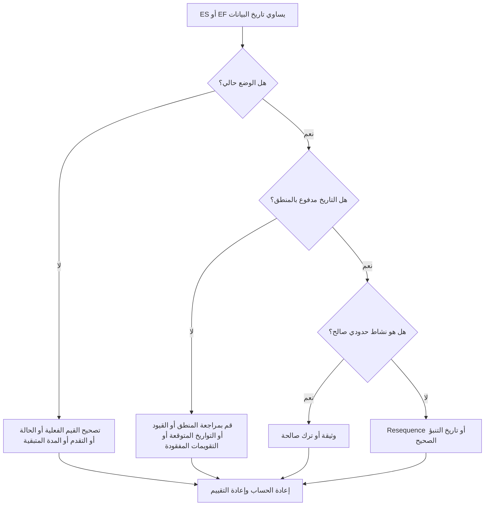

# الأنشطة المتعلقة بتاريخ البيانات - دليل التحسين

## غاية

يساعد هذا الدليل القائمين على الجدولة في مراجعة الأنشطة التي تقع بدايتها المبكرة أو إنهائها المبكر تمامًا في تاريخ بيانات Primavera P6. وهو يدعم عمليات فحص دورة التحديث من خلال إظهار مكان تجميع العمل عند الحد بين الأداء الفعلي والعمل المتوقع.

## قبل أن تبدأ

اجمع المعلومات التالية قبل اتخاذ الإجراء:

- نتيجة التقييم الحالية لهذا المقياس.
- تاريخ بيانات المشروع المستخدم في أحدث حساب للجدول الزمني.
- قائمة الأنشطة التي يكون فيها البدء المبكر = تاريخ البيانات.
- قائمة الأنشطة حيث الانتهاء المبكر = تاريخ البيانات.
- حالة النشاط، البداية الفعلية، النهاية الفعلية، المدة المتبقية، البداية، النهاية، إجمالي السماحية الزمنية، والتقويم.
- تفاصيل علاقة النشاط السابق والنشاط اللاحق.
- القيود والتواريخ المتوقعة وملاحظات التحديث.

## فهم النتيجة الخاصة بك

والنتيجة القوية هي عدم وجود أي أنشطة غير مفسرة مع البدء المبكر أو الانتهاء المبكر في تاريخ البيانات.

قد تكون بعض الأنشطة موجودة بشكل قانوني في تاريخ البيانات، خاصة العمل قصير المدى الجاهز للمتابعة أو العمل الذي ينتهي عند حدود التحديث. القضية ليست التاريخ وحده. المشكلة هي ما إذا كان التاريخ موضحًا بالحالة الصحيحة والمنطق ومعلومات التحديث.

تعني النتيجة الضعيفة أن العديد من الأنشطة يتم جمعها في تاريخ البيانات دون سبب واضح للجدول الزمني.

## هدف التحسين

الهدف هو 0 أنشطة غير مفسرة باستخدام ES = تاريخ البيانات أو EF = تاريخ البيانات.

الهدف هو التأكد مما إذا كان كل نشاط قد تم وضعه بشكل صحيح، وموجه بشكل منطقي، ومتوقع من حدود التحديث الصحيحة.

## خطة العمل

### الخطوة 1: تحديد المشكلة الرئيسية

قم بإنشاء تخطيط أو تقرير P6 يقوم بتصفية الأنشطة حيث يساوي "البدء المبكر" تاريخ البيانات أو "الانتهاء المبكر" يساوي "تاريخ البيانات". قم بتضمين معرف النشاط، واسم النشاط، وWBS، وحالة النشاط، والبدء المبكر، والانتهاء المبكر، والبدء، والانتهاء، والبدء الفعلي، والانتهاء الفعلي، والمدة المتبقية، وإجمالي السماحية الزمنية، والتقويم، والقيود، والأسلاف، والخلفاء.

راجع كل نشاط واسأل:

- هل النشاط مكتمل أم قيد التنفيذ أم لم يبدأ؟
- هل البداية الفعلية أو النهاية الفعلية مفقودة؟
- هل النشاط مدفوع منطقيًا إلى تاريخ البيانات؟
- هل القيد أو التاريخ المتوقع أو التقويم يدفع النشاط إلى تاريخ البيانات؟
- هل النشاط مفتوح أم مرتبط بشكل ضعيف؟
- هل تاريخ البيانات صحيح لفترة التحديث؟

### الخطوة 2: تطبيق الإصلاحات الموصى بها

إذا كانت الحالة غير مكتملة، فقم بتصحيح البداية الفعلية، والانتهاء الفعلي، والمدة المتبقية، والنسبة المئوية للاكتمال، وحالة النشاط قبل تغيير المنطق.

إذا كان النشاط يبدأ في تاريخ البيانات لأن المنطق السابق مفقود أو غير محفز، فقم بإضافة أو تصحيح العلاقات التي تمثل تسلسل العمل الحقيقي.

إذا كان النشاط ينتهي في تاريخ البيانات لأنه لم يتم تحديث التقدم، فتأكد مما إذا كان العمل قد انتهى بحلول حدود التحديث. أدخل "الانتهاء الفعلي" إذا اكتمل، أو قم بتحديث المدة المتبقية والانتهاء المتوقع إذا بقي العمل.

إذا كانت القيود أو التواريخ المتوقعة تدفع الأنشطة إلى تاريخ البيانات، فقم بإزالتها أو مراجعتها أو توثيقها وفقًا لإجراءات ضوابط المشروع.

### الخطوة 3: إزالة أدوات الحظر الشائعة

تشتمل أدوات الحظر الشائعة على التحسين غير المكتمل، والبدايات المفتوحة، والتشطيبات المفتوحة، والقيود المستخدمة كبدائل للمنطق، وحركة تاريخ البيانات دون مراجعة كافية للحالة.

يفترض مانع آخر أن الأنشطة في تاريخ البيانات غير ضارة. يمكن لمجموعة كبيرة عند حدود التحديث إخفاء التسلسل المفقود أو جعل التوقعات على المدى القريب تبدو أكثر وضوحًا مما هي عليه الآن.

### الخطوة 4: التحقق من صحة التغييرات

إعادة حساب الجدول بعد التصحيحات. أعد تشغيل المقياس وتأكد من أن كل نشاط متبقي في تاريخ البيانات موضح بالحالة الحالية أو المنطق الصحيح أو الاستثناء المعتمد.

قم بمراجعة إجمالي السماحية الزمنية والمسار الحرج أو الأطول وتواريخ الأحداث الرئيسية وتقارير البحث المستقبلية قصيرة المدى للتأكد من أن التصحيح لم يخلق أي تناقضات جديدة.

## جدول التحسين

### اليوم الأول: المراجعة والتشخيص

قم بتشغيل المقياس، وأكد تاريخ البيانات، وافصل النتائج إلى ES في تاريخ البيانات، وEF في تاريخ البيانات، ومشكلات الحالة، ومشكلات المنطق، والقيود، وأنشطة الحدود الصالحة.

### الأيام 2-3: تنفيذ الإجراءات ذات الأولوية

قم بتصحيح الأنشطة الحرجة وشبه الحرجة وقصيرة المدى أولاً. تحديث الحالة وإضافة المنطق أو تصحيحه ومراجعة القيود.

### الأيام 4-5: مراقبة النتائج المبكرة

قم بإعادة حساب الجدول ومراجعة مخرجات البحث الأمامي وتغييرات السماحية الزمنية وحركة المعالم والأنشطة التي لا تزال موجودة في تاريخ البيانات.

### اليوم السادس: التعديلات النهائية

قم بحل العناصر غير المؤكدة المتبقية مع الانضباط المسؤول أو القائد الميداني أو قائد ضوابط المشروع.

### اليوم السابع: إعادة التقييم والمقارنة

قم بإجراء التقييم مرة أخرى وقارن النتيجة بالعتبة المستهدفة.

## تتبع التقدم

استخدم أداة تعقب بسيطة لإدارة التصحيحات والموافقات.

| تاريخ | تم اتخاذ الإجراء | التأثير المتوقع | النتيجة / الملاحظة | الخطوة التالية |
| --- | --- | --- | --- | --- |
| [تاريخ] | تمت مراجعة ES/EF في تاريخ البيانات | تحديد التجمعات الحدودية | [النتيجة الملحوظة] | تعيين مالك |
| [تاريخ] | الحالة المصححة أو التواريخ الفعلية | محاذاة حالة العمل مع حدود التحديث | [النتيجة الملحوظة] | إعادة حساب الجدول الزمني |
| [تاريخ] | تصحيح المنطق أو القيود | تقليل تجميع تاريخ البيانات غير المبررة | [النتيجة الملحوظة] | إعادة تقييم المقياس |

## إذا لم تتحسن النتائج

إذا لم تتحسن النتائج، فتحقق مما إذا كان يتم سحب الأنشطة بشكل متكرر إلى تاريخ البيانات بسبب فقدان المنطق أو القيود أو التواريخ المتوقعة التي لا معنى لها أو إجراءات التحديث غير المكتملة.

قم بتصعيد العناصر التي لم يتم حلها عندما تؤثر على تقارير العملاء الهامة أو شبه الحرجة أو التسليم أو الدفع أو أعمال التنفيذ على المدى القريب.

## صيانة

قم بمراجعة هذا المقياس أثناء كل دورة تحديث قبل إصدار التقارير. وهو مفيد بشكل خاص بعد نقل تاريخ البيانات، أو استيراد التقدم، أو إعادة تسلسل العمل، أو إعادة الحساب بعد تغييرات الحالة الرئيسية.

## قائمة المراجعة الموجزة

- [ ] تمت مراجعة النتيجة الحالية
- [ ] تم تأكيد العتبة المستهدفة
- [ ] تم تأكيد تاريخ البيانات
- [ ] ES = تاريخ مراجعة أنشطة البيانات
- [ ] EF = تاريخ مراجعة البيانات
- [ ] تم التحقق من الحالة والتواريخ الفعلية
- [ ] تم فحص المدة المتبقية
- [ ] تمت مراجعة المنطق والقيود
- [ ] تم توثيق الأنشطة الحدودية الصالحة
- [ ] تمت إعادة حساب الجدول الزمني
- [ ] تم تكرار التقييم
- [ ] الخطوات التالية موثقة
## محتوى ذو صلة
- [الأنشطة المتعلقة بتاريخ البيانات: فحوصات البدء المبكر والانتهاء المبكر في برنامج Primavera P6 - نظرة عامة](01_overview_template.md)
- [الأنشطة المتعلقة بتاريخ البيانات: فحوصات البدء المبكر والانتهاء المبكر في برنامج Primavera P6](03_blog_template.md)
- [ما هو الجدول الزمني](../../04b_blogs_ar/01_WHAT%20A%20SCHEDULE%20IS/01_blog.md)
- [منطق قوي](../../04b_blogs_ar/02_ROBUST%20LOGIC/02_ROBUST%20LOGIC.md)
