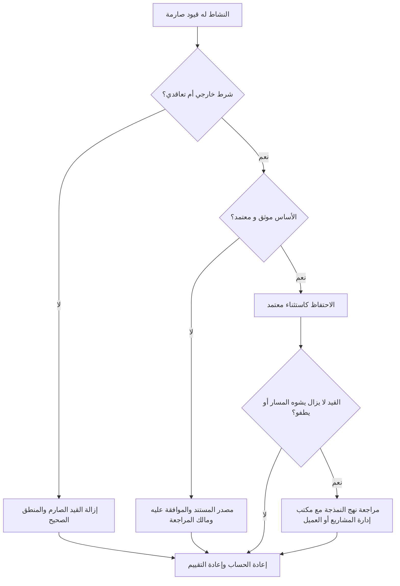

## غاية

يساعد هذا الدليل القائمين على الجدولة على مراجعة القيود الصعبة في Primavera P6 وتقليلها. ويركز على القيود التي تتحكم بقوة في تواريخ النشاط، وخاصة البداية الإلزامية والانتهاء الإلزامي.

## قبل أن تبدأ

اجمع المعلومات التالية قبل اتخاذ الإجراء:

- نتيجة التقييم الحالية لهذا المقياس.
- قائمة الأنشطة ذات القيود الصعبة.
- نوع القيد وتاريخ القيد لكل نشاط.
- معرف النشاط، واسم النشاط، وWBS، وحالة النشاط، والبدء، والانتهاء، وإجمالي السماحية الزمنية، وحالة المسار الحرج أو الأطول.
- تفاصيل علاقة النشاط السابق والنشاط اللاحق.
- أساس العقد أو العميل أو التصريح أو الوصول أو التنظيم أو التسليم لأي قيد مطلوب.
- تظهر مقارنة التحديث الأساسي أو السابق وقت إضافة القيد.

## فهم النتيجة الخاصة بك

والنتيجة القوية هي صفر قيود صعبة غير مفسرة.

يمكن للقيود الصارمة أن تتجاوز أو تقيد بشكل كبير حساب CPM العادي. وقد تكون صالحة لتواريخ العقود، أو نوافذ الوصول، أو إصدارات التصاريح، أو نقاط الحجز التنظيمية، أو المتطلبات الموجهة من المالك، ولكن لا ينبغي استخدامها كبديل للمنطق المفقود.

النتيجة الضعيفة تعني أن الجدول يحتوي على تواريخ مفروضة قد تتحكم في التنبؤ بدلاً من منطق الشبكة.

## هدف التحسين

الهدف هو 0 قيود صعبة غير مفسرة.

الهدف هو إزالة القيود الصعبة غير الضرورية وتوثيق أي قيود مطلوبة حقًا.

## خطة العمل

### الخطوة 1: تحديد المشكلة الرئيسية

قم بإنشاء تخطيط P6 أو تقرير يقوم بتصفية الأنشطة ذات أنواع القيود الصارمة. قم بتضمين معرف النشاط، واسم النشاط، وWBS، وحالة النشاط، والبدء، والانتهاء، ونوع القيد، وتاريخ القيد، وإجمالي السماحية الزمنية، وحالة المسار الحرج أو الأطول، والأسلاف، والخلفاء.

راجع كل نشاط مقيد واسأل:

- ما هو مصدر القيد الصارم؟
- هل هو مطلوب تعاقديا أم خارجيا؟
- هل هو استبدال المنطق السابق أو اللاحق المفقود؟
- هل يفرض تاريخًا مستهدفًا يجب التنبؤ به في الجدول الزمني؟
- هل يؤثر ذلك على إجمالي السماحية الزمنية أو المسار الحرج أو إعداد تقارير المعالم الرئيسية؟
- هل السبب موثق ومعتمد؟

### الخطوة 2: تطبيق الإصلاحات الموصى بها

إذا لم يكن القيد الصارم مطلوبًا من الخارج، فقم بإزالته وإضافة منطق CPM أو تصحيحه. استخدم العلاقات وتسلسل الأنشطة والتقويمات والمدد الواقعية لنمذجة العمل بدلاً من فرض التواريخ.

إذا كان القيد الصلب مطلوبًا، قم بتوثيق الأساس. التقط المصدر والموافقة والتاريخ والمالك المسؤول وسبب عدم إمكانية تصميمه بالمنطق العادي.

إذا تم استخدام القيد للاحتفاظ بتاريخ مستهدف، فراجع ما إذا كان القيد الأكثر ليونة أو الحدث الرئيسي أو الموعد النهائي أو مذكرة التقرير أكثر ملاءمة.

### الخطوة 3: إزالة أدوات الحظر الشائعة

تتضمن أدوات الحظر الشائعة القيود الموروثة من خطوط الأساس القديمة، والتواريخ المستهدفة للعميل التي تم إدخالها كتواريخ إلزامية، وخطط الاسترداد التي تترك القيود المؤقتة خلفها، ومنطق الواجهة المفقود.

هناك مانع آخر يفترض أن القيد الصارم مقبول لأن التاريخ مهم. يجب أن تكون التواريخ المهمة مرئية، ولكن يجب أن يوضح الجدول كيفية وصول العمل إليها.

### الخطوة 4: التحقق من صحة التغييرات

إعادة حساب الجدول بعد التصحيحات. أعد تشغيل المقياس وتأكد من الموافقة على القيود الصعبة المتبقية وتوثيقها.

قم بمراجعة إجمالي السماحية الزمنية والمسار الحرج أو الأطول وتواريخ الأحداث الرئيسية ومخرجات مقارنة الجدول الزمني للتأكد من أن التصحيح لم ينشئ حركة غير متوقعة.

## جدول التحسين

### اليوم الأول: المراجعة والتشخيص

قم بتشغيل نتائج القياس والمجموعة حسب هيكل تنظيم العمل ونوع القيد والأهمية والأساس الموثق.

### الأيام 2-3: تنفيذ الإجراءات ذات الأولوية

قم بإزالة القيود الصارمة غير الضرورية من الأنشطة الحرجة وشبه الحرجة والتعاقدية وقصيرة المدى أولاً. أضف المنطق المفقود عند الحاجة.

### الأيام 4-5: مراقبة النتائج المبكرة

أعد حساب الجدول الزمني ومراجعة حركة السماحية الزمنية وتغييرات المسار الحرج وتأثيرات المعالم الرئيسية.

### اليوم السادس: التعديلات النهائية

قم بحل الاستثناءات المتبقية مع المجدول أو قائد ضوابط المشروع أو مراجع مكتب إدارة المشاريع أو ممثل العميل.

### اليوم السابع: إعادة التقييم والمقارنة

قم بإجراء التقييم مرة أخرى وقارن النتيجة بالعتبة المستهدفة.

## تتبع التقدم

استخدم أداة تعقب بسيطة لإدارة التصحيحات والموافقات.

| تاريخ | تم اتخاذ الإجراء | التأثير المتوقع | النتيجة / الملاحظة | الخطوة التالية |
| --- | --- | --- | --- | --- |
| [تاريخ] | مراجعة القيود الصعبة | تحديد ضوابط التاريخ المفروضة | [النتيجة الملحوظة] | تعيين مالك |
| [تاريخ] | تمت إزالة القيد الصارم غير الضروري | استعادة الحساب القائم على المنطق | [النتيجة الملحوظة] | إعادة حساب الجدول الزمني |
| [تاريخ] | القيد الثابت المعتمد الموثق | الحفاظ على الاستثناء المبرر | [النتيجة الملحوظة] | إعادة تقييم المقياس |

## إذا لم تتحسن النتائج

إذا لم تتحسن النتائج، فتحقق مما إذا كان سيتم إعادة تقديم القيود الصارمة من خلال الواردات أو الأجزاء المنسوخة أو تحديثات خط الأساس أو تغييرات جدول التعافي.

قم بتصعيد العناصر التي لم يتم حلها عندما تؤثر على المسار الهام أو المعالم التعاقدية أو تقارير العملاء أو تحليل التأخير أو أحداث الدفع أو تواريخ التسليم.

## صيانة

قم بمراجعة هذا المقياس أثناء كل دورة تحديث وقبل الموافقة على خط الأساس. يجب أن تكون القيود الصارمة جزءًا من فحوصات الصحة ذات الجدول الزمني القياسي، خاصة بعد إعادة التسلسل الرئيسية، وتخطيط التعافي، والتحضير لتقديم العميل.

## قائمة المراجعة الموجزة

- [ ] تمت مراجعة النتيجة الحالية
- [ ] تم تأكيد العتبة المستهدفة
- [ ] تم إنشاء قائمة القيود الصعبة
- [ ] تم التحقق من نوع القيد وتاريخه
- [ ] تم تأكيد الأساس الخارجي
- [ ] تمت إزالة القيود الصعبة غير الضرورية
- [ ] تصحيح المنطق المفقود
- [ ] الاستثناءات المعتمدة موثقة
- [ ] تمت إعادة حساب الجدول الزمني
- [ ] تمت مراجعة مسار السماحية الزمنية والمسار الحرج
- [ ] تم تكرار التقييم
- [ ] الخطوات التالية موثقة
## محتوى ذو صلة
- [القيود الصارمة في بريمافيرا ص6](03_blog_template.md)
- [ما هو الجدول الزمني](../../04b_blogs_ar/01_WHAT%20A%20SCHEDULE%20IS/01_blog.md)
- [منطق قوي](../../04b_blogs_ar/02_ROBUST%20LOGIC/02_ROBUST%20LOGIC.md)
