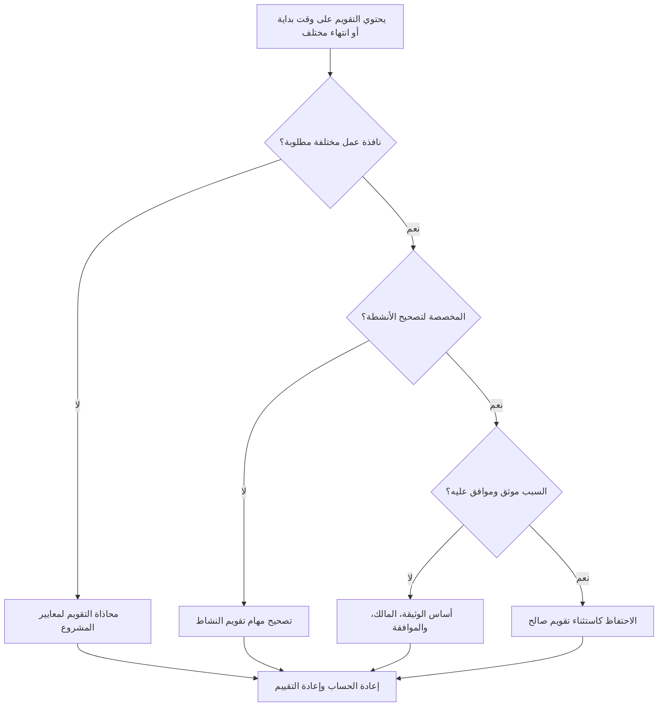

# تقاويم بأوقات بداية ونهاية مختلفة في بريمافيرا P6 - دليل التحسين

## غاية

يساعد هذا الدليل القائمين على الجدولة في مراجعة تقويمات Primavera P6 التي تستخدم أوقات بدء أو انتهاء يوم عمل مختلفة. وهو يدعم فحوصات جودة الجدول الزمني من خلال التأكد من أن اختلافات وقت التقويم مقصودة ومعتمدة ومفهومة.

## قبل أن تبدأ

اجمع المعلومات التالية قبل اتخاذ الإجراء:

- نتيجة التقييم الحالية لهذا المقياس.
- تمت الموافقة على معيار تقويم المشروع ونافذة العمل اليومية العادية.
- قائمة التقويمات ذات أوقات البدء أو أوقات الانتهاء أو نوافذ التحول أو أنماط اليوم الجزئي المختلفة.
- الأنشطة المخصصة لكل تقويم متأثر.
- نوع التقويم، مثل التقويم العام أو تقويم المشروع أو تقويم الموارد.
- الأنشطة الحرجة أو شبه الحرجة باستخدام التقويمات المتأثرة.
- سبب كل تقويم غير قياسي، مثل الوردية الليلية، أو انقطاع العمل، أو الوصول المقيد، أو جدول الطاقم الخاص.

## فهم النتيجة الخاصة بك

والنتيجة القوية هي عدم وجود تقويمات غير مفسرة بأوقات بداية أو انتهاء مختلفة.

قد تكون اختلافات التقويم صالحة عندما يتبع العمل بالفعل ورديات مختلفة أو نوافذ الوصول أو توفر الموارد. المشكلة هي عندما تختلف التقاويم حسب الوقت من اليوم دون سبب واضح.

تعني النتيجة الضعيفة أن الجدول قد يحتوي على افتراضات تقويم مخفية تؤثر على التواريخ والسماحية الزمنية والسلوك المنطقي.

## هدف التحسين

الهدف هو 0 تقويمات غير مفسرة بأوقات بداية أو انتهاء مختلفة.

الهدف هو التأكد مما إذا كانت كل نافذة عمل مختلفة مطلوبة وموثقة ومخصصة فقط للأنشطة الصحيحة.

## خطة العمل

### الخطوة 1: تحديد المشكلة الرئيسية

قم بإنشاء تصدير مراجعة التقويم من P6 أو أداة تقييم الجدول الزمني التي تسرد كل تقويم ووقت بدء يوم العمل العادي ووقت الانتهاء والساعات اليومية والاستثناءات والأنشطة المعينة.

راجع كل تقويم غير قياسي واسأل:

- ما هو يوم العمل القياسي المعتمد للمشروع؟
- ما هي التقويمات التي تستخدم أوقات بداية أو نهاية مختلفة؟
- هل الاختلافات مقصودة أم عرضية؟
- ما هي الأنشطة التي تستخدم كل تقويم؟
- هل تتأثر الأنشطة الحرجة أو شبه الحرجة؟
- هل اختلاف التقويم موثق ومعتمد؟

### الخطوة 2: تطبيق الإصلاحات الموصى بها

إذا كان اختلاف التقويم عرضيًا، فقم بمحاذاة وقت البدء ووقت الانتهاء وفترات العمل اليومية مع معيار المشروع المعتمد.

إذا كان اختلاف التقويم صحيحًا، قم بتوثيق السبب. تشمل الحالات الصالحة الشائعة النوبة الليلية، أو العمل في عطلة نهاية الأسبوع، أو نوافذ الإغلاق، أو قيود وصول المالك، أو القيود البيئية، أو فترات العمل الخاصة بالموارد.

إذا تم تعيين الأنشطة إلى تقويم خاطئ، فقم بتصحيح تعيين تقويم النشاط قبل تغيير التقويم نفسه. لا يزال من الممكن أن يتسبب التقويم الخاص الصالح في حدوث مشكلات إذا تم تعيينه على نطاق واسع جدًا.

### الخطوة 3: إزالة أدوات الحظر الشائعة

تشتمل أدوات الحظر الشائعة على التقويمات المنسوخة من الجداول القديمة، والتقويمات المستوردة مع إعدادات الوقت المخفية، وتقويمات الموارد المستخدمة كتقويمات للأنشطة، وفروق زمنية صغيرة غير مرئية في تخطيطات التاريخ القياسية.

يقوم مانع آخر بمراجعة التاريخ فقط دون الوقت. في P6، يمكن أن يؤثر الوقت من اليوم على موضع النشاط، والسماحية الزمنية، وسلوك العلاقة، وحركة التاريخ الواضحة ليوم واحد.

### الخطوة 4: التحقق من صحة التغييرات

إعادة حساب الجدول بعد تصحيحات التقويم. أعد تشغيل المقياس وتأكد من أن اختلافات التقويم المتبقية صالحة وموثقة.

قم بمراجعة تواريخ النشاط المتأثرة، والسماحية الزمنية الإجمالي، والمسار الحرج أو الأطول، وروابط العلاقة، وتقارير البحث المسبق على المدى القريب للتأكد من أن التصحيح لم يخلق حركة غير متوقعة.

## جدول التحسين

### اليوم الأول: المراجعة والتشخيص

قم بتشغيل المقياس وتجميع النتائج حسب التقويم ونافذة العمل ونوع التقويم والأنشطة المعينة والأهمية.

### الأيام 2-3: تنفيذ الإجراءات ذات الأولوية

قم بتصحيح الاختلافات العرضية في وقت التقويم وتعيينات تقويم الأنشطة الخاطئة في الأنشطة الهامة وشبه الحرجة وقصيرة المدى أولاً.

### الأيام 4-5: مراقبة النتائج المبكرة

أعد حساب الجدول الزمني ومراجعة حركة السماحية الزمنية وتحولات التاريخ وتأثيرات المعالم الرئيسية والتغييرات المستقبلية.

### اليوم السادس: التعديلات النهائية

قم بحل استثناءات التقويم المتبقية مع المجدول أو مالك الانضباط أو قائد ضوابط المشروع أو مراجع مكتب إدارة المشاريع.

### اليوم السابع: إعادة التقييم والمقارنة

قم بإجراء التقييم مرة أخرى وقارن النتيجة بالعتبة المستهدفة.

## تتبع التقدم

استخدم أداة تعقب بسيطة لإدارة التصحيحات والموافقات.

| تاريخ | تم اتخاذ الإجراء | التأثير المتوقع | النتيجة / الملاحظة | الخطوة التالية |
| --- | --- | --- | --- | --- |
| [تاريخ] | مراجعة أوقات البدء والانتهاء للتقويم | تحديد نوافذ العمل غير القياسية | [النتيجة الملحوظة] | تعيين مالك |
| [تاريخ] | محاذاة التقويم لمعايير المشروع | إزالة فارق التوقيت العرضي | [النتيجة الملحوظة] | إعادة حساب الجدول الزمني |
| [تاريخ] | استثناء تقويم صالح موثق | الحفاظ على نافذة العمل المبررة | [النتيجة الملحوظة] | إعادة تقييم المقياس |

## إذا لم تتحسن النتائج

إذا لم تتحسن النتائج، فتحقق مما إذا كان يتم إعادة تقديم التقويمات غير القياسية من خلال عمليات الاستيراد أو الجداول المنسوخة أو تعيينات الموارد أو تحديثات الأساس.

قم بتصعيد اختلافات التقويم التي لم يتم حلها عندما تؤثر على المسار الهام، أو تقارير العملاء، أو مراحل الدفع، أو انقطاع العمل، أو تواريخ التسليم، أو التنفيذ على المدى القريب.

## صيانة

قم بمراجعة هذا المقياس أثناء تطوير خط الأساس، وجدول الواردات، وكل دورة تحديث رئيسية. يجب أن تكون إعدادات وقت التقويم جزءًا من عمليات التحقق من صحة الجدول الزمني القياسي قبل إصدار التقارير.

## قائمة المراجعة الموجزة

- [ ] تمت مراجعة النتيجة الحالية
- [ ] تم تأكيد العتبة المستهدفة
- [ ] تم تأكيد معيار تقويم المشروع
- [ ] تم تحديد أوقات التقويم غير القياسية
- [ ] تمت مراجعة الأنشطة المخصصة
- [ ] تم فحص التأثيرات الحرجة وشبه الحرجة
- [ ] تم تصحيح اختلافات التقويم العرضية
- [ ] تم توثيق استثناءات التقويم الصالحة
- [ ] تمت إعادة حساب الجدول الزمني
- [ ] تمت مراجعة تغييرات التاريخ والسماحية الزمنية
- [ ] تم تكرار التقييم
- [ ] الخطوات التالية موثقة
## محتوى ذو صلة
- [تقاويم بأوقات بداية ونهاية مختلفة في بريمافيرا P6 - نظرة عامة](01_overview_template.md)
- [تقاويم بأوقات بداية ونهاية مختلفة في بريمافيرا P6](03_blog_template.md)
- [ما هو الجدول الزمني](../../04b_blogs_ar/01_WHAT%20A%20SCHEDULE%20IS/01_blog.md)
- [منطق قوي](../../04b_blogs_ar/02_ROBUST%20LOGIC/02_ROBUST%20LOGIC.md)
