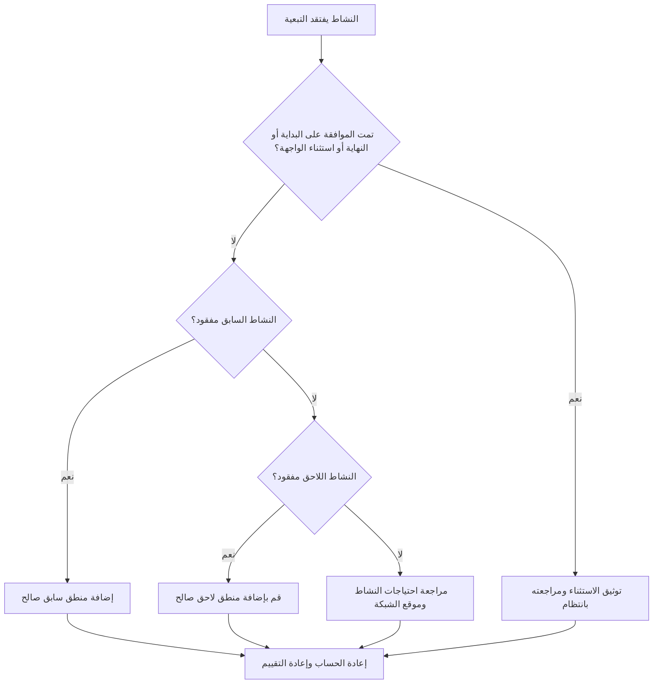

# التبعيات المفقودة في بريمافيرا P6 - دليل التحسين

## غاية

يساعد هذا الدليل القائمين على الجدولة في تحديد وتصحيح المنطق السابق أو اللاحق المفقود في Primavera P6. وهو يدعم جودة الجدول الزمني من خلال تحسين اكتمال شبكة CPM.

## قبل أن تبدأ

اجمع المعلومات التالية قبل اتخاذ الإجراء:

- نتيجة التقييم الحالية لهذا المقياس.
- قائمة الأنشطة التي ليس لها سابقات.
- قائمة الأنشطة التي ليس لها خلفاء.
- قائمة الأنشطة التي ليس لها منطق سابق أو لاحق.
- معرف النشاط، اسم النشاط، WBS، نوع النشاط، حالة النشاط، البدء، النهاية، إجمالي السماحية الزمنية، والتقويم.
- الموافقة على بداية المشروع، وإنهاء المشروع، والواجهة الخارجية، وقائمة الاستثناءات التعاقدية.
- آخر ملاحظات التحديث والانضباط المسؤول أو مالك الحزمة.

## فهم النتيجة الخاصة بك

والنتيجة القوية هي عدم وجود أي أنشطة لم يتم حلها مع فقدان منطق التبعية.

قد لا يكون لبعض الأنشطة النشاط السابق أو لاحق، مثل مرحلة بدء المشروع المعتمدة، أو مرحلة الإنجاز النهائي، أو معالم الواجهة الخارجية المعتمدة. ويجب أن تكون هذه الأمور محدودة وموثقة.

النتيجة الضعيفة تعني أن الجدول يحتوي على أنشطة غير متصلة بشكل صحيح بشبكة CPM.

## هدف التحسين

الهدف هو 0 أنشطة لم يتم حلها ذات تبعيات مفقودة.

الهدف هو ربط كل نشاط بمنطق سابق ولاحق صالح، أو توثيق السبب المعتمد لكونه استثناءً.

## خطة العمل

### الخطوة 1: تحديد المشكلة الرئيسية

قم بإنشاء تخطيط P6 أو تقرير يقوم بتصفية الأنشطة التي لا تحتوي على أي عمليات سابقة أو لاحقة أو لا شيء على الإطلاق. قم بتضمين معرف النشاط، واسم النشاط، وWBS، ونوع النشاط، وحالة النشاط، والبدء، والانتهاء، وإجمالي السماحية الزمنية، والتقويم، والقيود، والأسلاف، والخلفاء.

راجع كل نشاط واسأل:

- هل هذا النشاط هو بداية مشروع معتمدة أو عنصر انتهاء المشروع؟
- هل هي واجهة خارجية أم تاريخ يتحكم فيه المالك أم استثناء تعاقدي؟
- ما العمل الذي يجب أن يحدث قبل أن يبدأ هذا النشاط؟
- ما العمل الذي يعتمد على انتهاء هذا النشاط أو بدايته؟
- هل النشاط قديم أو مكرر أو تم وضعه بشكل غير صحيح؟
- أي مالك يمكنه تأكيد التبعية الحقيقية؟

### الخطوة 2: تطبيق الإصلاحات الموصى بها

بالنسبة للبدايات المفتوحة، قم بإضافة المنطق السابق الذي يمثل الحالة الحقيقية المطلوبة قبل بدء النشاط. قد يشمل ذلك العمل السابق أو الموافقات أو الوصول أو الشراء أو إصدار التصميم أو التفتيش أو التسليم.

بالنسبة للتشطيبات المفتوحة، قم بإضافة المنطق اللاحق الذي يمثل ما يعتمد على النشاط. قد يشمل ذلك متابعة العمل، أو الاختبار، أو التشغيل، أو الدوران، أو الإغلاق، أو مرحلة الإنجاز.

بالنسبة للأنشطة المعزولة التي ليس لها أي سابقات أو لاحقات، تأكد مما إذا كان النشاط لا يزال مطلوبًا أم لا. إذا كان عمل صالح، قم بتوصيله بالشبكة. إذا كان قديمًا، فقم بإزالته أو إغلاقه وفقًا لإجراءات ضوابط المشروع.

### الخطوة 3: إزالة أدوات الحظر الشائعة

تشمل أدوات الحظر الشائعة الأنشطة المنسوخة، والأجزاء غير المكتملة، وعمليات التسليم غير الواضحة بين التخصصات، ومعلومات الواجهة المفقودة، والضغط لتحميل الأنشطة قبل معرفة التسلسل.

يقوم مانع آخر بإضافة علاقات العناصر النائبة فقط لتمرير المقياس. يجب أن تمثل العلاقات تبعيات حقيقية، وليس روابط مصطنعة.

### الخطوة 4: التحقق من صحة التغييرات

إعادة حساب الجدول بعد التصحيحات. أعد تشغيل المقياس وتأكد من أن كل نشاط متبقي إما متصل أو موثق كاستثناء معتمد.

قم بمراجعة إجمالي السماحية الزمنية والمسار الحرج أو الأطول وتواريخ الأحداث الرئيسية وتقارير البحث المستقبلية قصيرة المدى للتأكد من أن المنطق المضاف لم ينشئ حركة غير متوقعة.

## جدول التحسين

### اليوم الأول: المراجعة والتشخيص

قم بتشغيل المقياس ونتائج المجموعة إلى الأنشطة السابقة المفقودة والخلفاء المفقودين والأنشطة المعزولة والاستثناءات الصالحة والأنشطة القديمة.

### الأيام 2-3: تنفيذ الإجراءات ذات الأولوية

قم بتصحيح الأنشطة الحرجة وشبه الحرجة والتعاقدية وقصيرة المدى أولاً. أضف منطقًا صالحًا وقم بإزالة الأنشطة القديمة حيثما كان ذلك مناسبًا.

### الأيام 4-5: مراقبة النتائج المبكرة

أعد حساب الجدول الزمني ومراجعة السماحية الزمنية والمسار الحرج وتواريخ البحث المستقبلية وتأثيرات المعالم الرئيسية.

### اليوم السادس: التعديلات النهائية

قم بحل أسئلة التبعية المتبقية مع التقديمات الزمنية أو مالكي الحزم أو مديري الإنشاءات أو قيادة ضوابط المشروع.

### اليوم السابع: إعادة التقييم والمقارنة

قم بإجراء التقييم مرة أخرى وقارن النتيجة بالعتبة المستهدفة.

## تتبع التقدم

استخدم أداة تعقب بسيطة لإدارة التصحيحات والموافقات.

| تاريخ | تم اتخاذ الإجراء | التأثير المتوقع | النتيجة / الملاحظة | الخطوة التالية |
| --- | --- | --- | --- | --- |
| [تاريخ] | مراجعة التبعيات المفقودة | تحديد البدايات المفتوحة والتشطيبات المفتوحة | [النتيجة الملحوظة] | تعيين مالك |
| [تاريخ] | تمت إضافة المنطق السابق | تحسين منطق بدء النشاط | [النتيجة الملحوظة] | إعادة حساب الجدول الزمني |
| [تاريخ] | تمت إضافة المنطق اللاحق | تحسين استمرارية إنهاء النشاط | [النتيجة الملحوظة] | إعادة تقييم المقياس |

## إذا لم تتحسن النتائج

إذا لم تتحسن النتائج، فتحقق مما إذا كان يتم إضافة أنشطة جديدة بدون منطق، أو أن الأجزاء المستوردة غير مكتملة، أو أن قواعد الاستثناء فضفاضة جدًا.

قم بتصعيد العناصر التي لم يتم حلها عندما تؤثر على المسار الحرج، أو تقارير العملاء، أو مراحل الدفع، أو التسليم، أو الشراء، أو التنفيذ على المدى القريب.

## صيانة

قم بمراجعة هذا المقياس أثناء كل دورة تحديث، وبعد عمليات استيراد الجدول الزمني، وقبل الموافقة على خط الأساس. يجب أن تكون التبعيات المفقودة جزءًا من فحوصات السلامة ذات الجدول الزمني القياسي.

## قائمة المراجعة الموجزة

- [ ] تمت مراجعة النتيجة الحالية
- [ ] تم تأكيد العتبة المستهدفة
- [ ] تمت مراجعة البداية المفتوحة
- [ ] تمت مراجعة التشطيبات المفتوحة
- [ ] تمت مراجعة الأنشطة المعزولة
- [ ] تم توثيق الاستثناءات الصحيحة
- [ ] تمت إضافة المنطق السابق المفقود
- [ ] تمت إضافة المنطق اللاحق المفقود
- [ ] تم حل الأنشطة المتقادمة
- [ ] تمت إعادة حساب الجدول الزمني
- [ ] تم تكرار التقييم
- [ ] الخطوات التالية موثقة
## محتوى ذو صلة
- [التبعيات المفقودة في بريمافيرا P6 - نظرة عامة](01_overview_template.md)
- [التبعيات المفقودة في بريمافيرا P6](03_blog_template.md)
- [ما هو الجدول الزمني](../../04b_blogs_ar/01_WHAT%20A%20SCHEDULE%20IS/01_blog.md)
- [منطق قوي](../../04b_blogs_ar/02_ROBUST%20LOGIC/02_ROBUST%20LOGIC.md)
