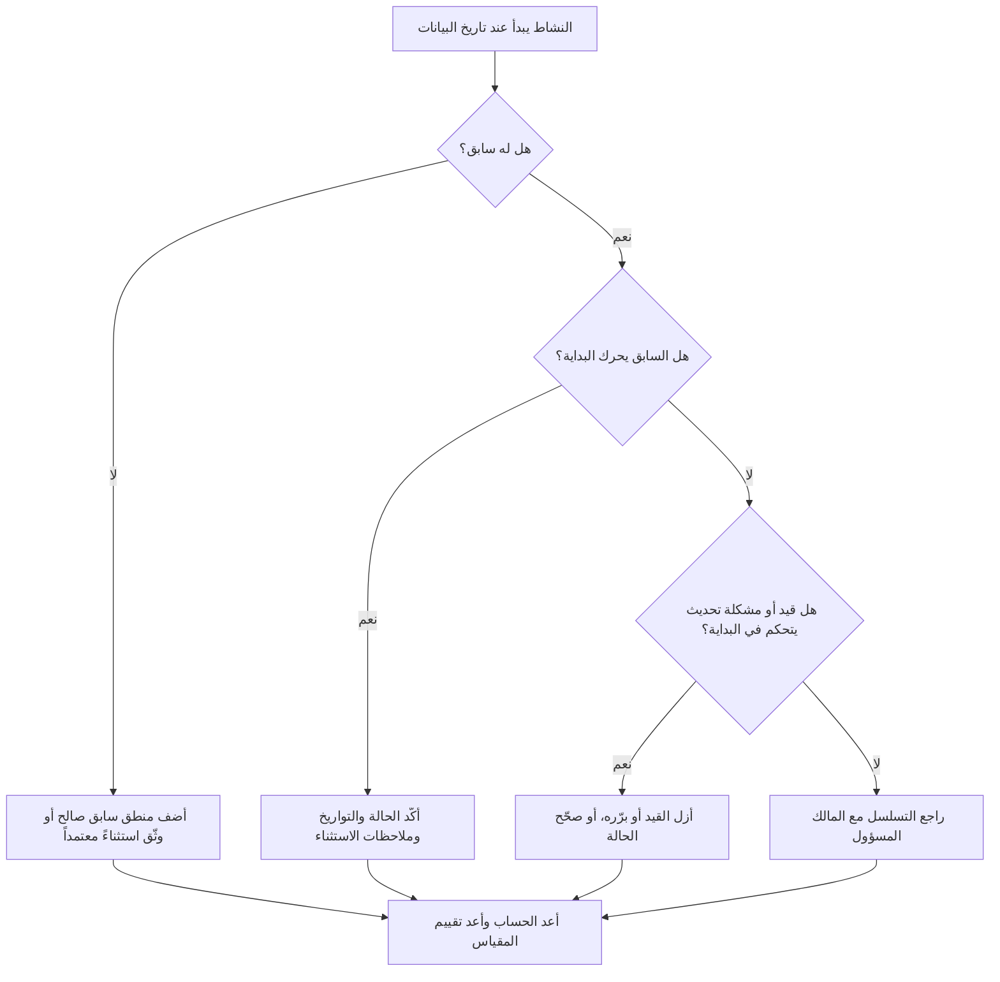

## الغرض

يساعد هذا الدليل المخططين وفرق ضبط المشاريع على تقليل أو إزالة الأنشطة المقررة للبدء عند تاريخ بيانات Primavera P6 دون منطق سابق صالح يحرك البداية. ينطبق على مراجعات جودة الجدول الزمني وفحوصات صحة PMO والتحقق من صحة دورة التحديث.

الهدف هو التأكد من أن العمل قريب المدى مدعوم بمنطق CPM واضح وأن الأنشطة لا تبدأ عند تاريخ البيانات فقط بسبب علاقات مفقودة أو قيود أو تواريخ يدوية أو تحديثات تقدم غير مكتملة.

## قبل البدء

اجمع المعلومات التالية قبل اتخاذ أي إجراء:

- نتيجة التقييم الراهن لهذا المقياس.
- تاريخ بيانات المشروع المستخدم في آخر حساب للجدول الزمني.
- قائمة الأنشطة المفتوحة أو غير البادئة بتاريخ بداية يساوي تاريخ البيانات.
- تفاصيل علاقات السابق والخلف لكل نشاط.
- القيود والتواريخ المتوقعة والتواريخ الفعلية وتعيينات التقويم.
- خيارات جدولة P6 المستخدمة في التحديث، بما في ذلك إعدادات المنطق المُحتجَز أو تجاوز التقدم عند الاقتضاء.
- أي استثناءات معتمدة، كأنشطة بدء المشروع أو معالم الواجهة الخارجية أو البدايات الموجّهة من المالك.

## فهم نتيجتك

النتيجة القوية هي صفر أنشطة غير محسومة تبدأ عند تاريخ البيانات دون منطق سابق محرِّك. يعني ذلك أن العمل الراهن وقريب المدى مرتبط بشبكة الجدول الزمني وأن تاريخ البيانات لا يُخفي تسلسلاً مفقوداً.

قد تتضمن نتيجة مقبولة عدداً صغيراً من الاستثناءات الموثقة. يجب مراجعتها واعتمادها، لا تجاهلها. فمثلاً، معلمة إشعار المتابعة أو نشاط مأذون به خارجياً قد لا يحتاج إلى سابق طبيعي، لكن يجب أن يكون السبب مرئياً للمراجعين.

نتيجة ضعيفة تعني أنشطة متعددة تبدأ عند تاريخ البيانات دون محرِّك منطقي واضح. قد يشير ذلك إلى بدايات مفتوحة أو علاقات سابق مفقودة أو قيود مفرطة أو تحديثات تقدم غير مكتملة أو أنشطة لم تُعاد جدولتها بشكل صحيح بعد آخر تحديث.

## هدف التحسين

الهدف هو 0 أنشطة غير محسومة تبدأ عند تاريخ البيانات بدون منطق محرِّك صالح.

هدف التحسين ليس فقط تقليل العدد. الهدف الأعمق هو التأكد من أن كل نشاط قرب تاريخ البيانات له سبب قابل للدفاع عنه لبداية التوقع. بعد التصحيح، يجب أن يكون لكل نشاط متأثر إما منطق سابق مناسب أو استثناء موثق أو حالة/تاريخ مصحَّح.

## خطة العمل

### الخطوة الأولى: تحديد المشكلة الرئيسية

أنشئ تخطيطاً أو تقريراً في P6 يُصفّي الأنشطة المفتوحة أو غير البادئة بتاريخ بداية يساوي تاريخ البيانات. أضف أعمدة لمعرّف النشاط واسمه وWBS والبداية والانتهاء والحالة والفائض الزمني الإجمالي والتقويم والقيد الأساسي والسوابق والخلفاء ومؤشرات العلاقة المحرِّكة إن توفرت.

راجع كل نشاط واسأل:

- هل للنشاط أي سوابق؟
- إذا وُجدت السوابق، هل تحرك البداية فعلاً؟
- هل النشاط محتجَز أو مُحرَّك بقيد؟
- هل النشاط يفتقر إلى بداية فعلية أو تحديث تقدم؟
- هل النشاط استثناء صالح، كمعلمة بدء مشروع؟
- هل النشاط ينتمي إلى منطقة WBS يكون فيها المنطق عموماً ضعيفاً؟

جمّع النتائج في أسباب عملية: سوابق مفقودة أو سوابق غير محرِّكة أو قيود أو تواريخ متوقعة أو أخطاء تحديث/حالة أو استثناءات معتمدة.

### الخطوة الثانية: تطبيق الإصلاحات الموصى بها

ابدأ بالمنطق المفقود أو الضعيف. أضف علاقات سابق صالحة تمثّل التسلسل الحقيقي للعمل، كعلاقات FS أو SS أو FF حسب الاقتضاء. تجنب إضافة علاقات فقط لإرضاء المقياس؛ يجب أن تعكس كل علاقة تبعية بناء أو هندسة أو مشتريات أو وصول أو موافقة أو استلام حقيقية.

راجع القيود بعد ذلك. إذا كان نشاط يبدأ عند تاريخ البيانات بسبب قيد بداية، تأكد مما إذا كان القيد مبرراً تعاقدياً أو تشغيلياً. أزل القيود غير الضرورية واسمح للنشاط بأن يكون مدفوعاً بالمنطق. إذا كان القيد صالحاً، وثّق السبب وتأكد من أنه لا يشوّه المسار الحرج.

تحقق من حالة التقدم. إذا كان العمل قد بدأ بالفعل، حدّث البداية الفعلية والمدة المتبقية بشكل صحيح. إذا لم يبدأ العمل، تأكد من أن توقع البداية يجب أن يظل عند تاريخ البيانات. لا يجب أن يظهر النشاط جاهزاً للبدء فقط لأن دورة التحديث سحبته إلى التاريخ الراهن.

بعد إجراء التغييرات، أعد حساب الجدول الزمني وراجع الأنشطة المتأثرة مجدداً. تأكد من أن تاريخ البداية مدفوع الآن بالمنطق أو محدَّث الحالة بشكل صحيح أو موثق كاستثناء معتمد.

### الخطوة الثالثة: إزالة العوائق الشائعة

تشمل العوائق الشائعة ردود الفعل الميدانية غير الواضحة ومعلومات الواجهة المفقودة والضغط لجعل العمل قريب المدى يبدو جاهزاً. حلّها بمراجعة الأنشطة المتأثرة مع قادة التخصصات ومديري البناء وأصحاب المشتريات أو مديري الحزم.

عائق شائع آخر هو إساءة استخدام القيود كبديل عن المنطق. قد تكون القيود ضرورية في بعض الحالات، لكن لا يجب أن تحل محل شبكة الجدول الزمني. إذا احتُفظ بقيد، وثّق سبب وجوده وكيف يؤثر على الفائض الزمني وأطول مسار.

تحقق أيضاً مما إذا كانت المشكلة ناجمة عن إعدادات حساب الجدول أو ممارسات التحديث. إذا كان تجاوز التقدم أو المنطق المُحتجَز أو التقدم خارج التسلسل أو التحيين غير المكتمل يؤثر على النتيجة، فوحّد أسلوب التحديث مع إجراء ضبط المشاريع قبل إعادة تقييم المقياس.

### الخطوة الرابعة: التحقق من صحة التغييرات

تحقق من صحة الجدول الزمني المصحَّح قبل التقييم التالي. أعد تشغيل فلتر الأنشطة المفتوحة أو غير البادئة التي تبدأ عند تاريخ البيانات بدون منطق محرِّك. تأكد من أن كل عنصر متبقٍّ إما مصحَّح أو موثق كاستثناء معتمد.

راجع الفائض الزمني الإجمالي وأطول مسار وأنشطة المستقبل القريب بعد إعادة الحساب. قد يغيّر تصحيح المنطق المسار الحرج أو يكشف عن مشكلات تسلسل إضافية. إذا كانت حركة الجدول الزمني كبيرة، أبلغ بالتأثير مسؤول ضبط المشاريع أو مراجع PMO.

## جدول التحسين

### اليوم الأول: المراجعة والتشخيص

شغّل المقياس وأكّد تاريخ البيانات وأنتج قائمة الأنشطة. افصل النتائج إلى منطق مفقود ومنطق غير محرِّك وقيود وأخطاء حالة واستثناءات محتملة.

### اليومان الثاني والثالث: تنفيذ الإجراءات ذات الأولوية

صحّح الأنشطة الأعلى تأثيراً أولاً، خاصةً الأنشطة الحرجة وقريبة الحرج. أضف منطق السابق الصالح وأزل القيود غير الضرورية وحدّث الحالة غير الصحيحة ووثّق الاستثناءات.

### اليومان الرابع والخامس: مراقبة النتائج المبكرة

أعد حساب الجدول الزمني وراجع ما إذا كانت الأنشطة المتأثرة مدفوعة الآن بالمنطق. تحقق من أي تغييرات غير متوقعة في الفائض الزمني الإجمالي وأطول مسار وتواريخ المعالم.

### اليوم السادس: التعديلات النهائية

حلّ العوائق المتبقية مع التخصص أو صاحب الحزمة المسؤول. تأكد من أن أي استثناءات محتفظ بها مبررة وموثقة بوضوح.

### اليوم السابع: إعادة التقييم والمقارنة

شغّل التقييم مجدداً وقارن النتيجة الجديدة بالنتيجة السابقة والعتبة المستهدفة. تأكد مما إذا كان المقياس الآن عند صفر أنشطة غير محسومة أو ما إذا كان هناك إجراء آخر مطلوب.

## تتبع التقدم

استخدم متابعاً بسيطاً لإدارة التصحيحات والاعتمادات.

| التاريخ | الإجراء المتخذ | التأثير المتوقع | النتيجة / الملاحظة | الخطوة التالية |
| --- | --- | --- | --- | --- |
| [التاريخ] | مراجعة الأنشطة التي تبدأ عند تاريخ البيانات بدون منطق محرِّك | تحديد المنطق المفقود أو الضعيف | [النتيجة المرصودة] | تعيين التصحيحات للمالك المسؤول |
| [التاريخ] | إضافة علاقات سابق صالحة | تحسين تسلسل CPM | [النتيجة المرصودة] | إعادة الحساب ومراجعة تأثير الفائض الزمني |
| [التاريخ] | إزالة أو تبرير القيود | تقليل البدايات الاصطناعية | [النتيجة المرصودة] | تأكيد الاستثناءات المتبقية |
| [التاريخ] | تحديث حالة النشاط غير الصحيحة | تحسين دقة التحديث | [النتيجة المرصودة] | إعادة تشغيل التقييم |

## إذا لم تتحسن النتائج

إذا لم تتحسن النتيجة، راجع ما إذا كانت الأنشطة ذاتها لا تزال تفشل أو ما إذا كانت أنشطة جديدة تظهر عند تاريخ البيانات. قد تشير الإخفاقات المتكررة إلى مشكلة أشمل في تطوير الجدول الزمني، كمنطق غير مكتمل في منطقة WBS أو انضباط تحديث ضعيف أو استخدام غير متسق للقيود.

صعّد المشكلات المستمرة إلى مسؤول ضبط المشاريع أو مدير التخطيط أو مراجع PMO. للجداول الزمنية الكبرى، فكّر في ورشة عمل لمراجعة المنطق المركّزة على حزم العمل المتأثرة. إذا كان الجدول الزمني مستخدماً للتقارير التعاقدية أو تحليل التأخير أو توقع قيمة الإنجاز، فيجب التعامل مع العناصر غير المحسومة كمشكلة جودة.

## الصيانة

راجع هذا المقياس في كل دورة تحديث قبل إصدار الجدول الزمني. يجب أن يكون الفحص جزءاً من مراجعة صحة الجدول الزمني القياسية، خاصةً بعد تحديثات التقدم وإعادة الجدولة والتغييرات الكبرى في النطاق وتخطيط الاسترداد.

تشمل عادات الصيانة الجيدة إبقاء أعمدة السابق والخلف مرئية في تخطيطات P6، ومراجعة البدايات المفتوحة قبل كل تقديم، وتوثيق الاستثناءات المعتمدة، والتحقق من أن تحرك تاريخ البيانات لا يُنشئ مجموعة جديدة من الأنشطة غير المدفوعة.

## قائمة التحقق الملخصة

- [ ] مراجعة النتيجة الراهنة
- [ ] تأكيد العتبة المستهدفة
- [ ] تأكيد تاريخ البيانات
- [ ] تحديد الأنشطة التي تبدأ عند تاريخ البيانات
- [ ] تحديد المشكلة الرئيسية
- [ ] تصحيح المنطق المفقود أو الضعيف
- [ ] مراجعة القيود وتبريرها أو إزالتها
- [ ] فحص تواريخ الحالة
- [ ] توثيق الاستثناءات المعتمدة
- [ ] إعادة حساب الجدول الزمني
- [ ] مراقبة النتائج
- [ ] تكرار التقييم
- [ ] توثيق الخطوات التالية
