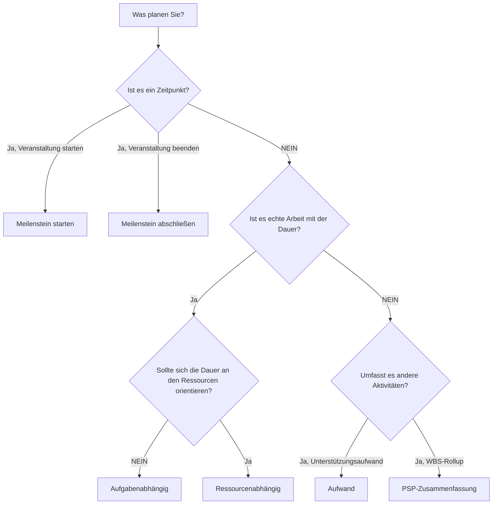

# Aktivitätstypen in P6

Der Aktivitätstyp ist eines der wichtigsten Setup-Felder in Primavera P6. Es teilt P6 mit, welche Art von Aktivität es berechnet und wie sich diese Aktivität im Terminplan verhalten soll.

Viele Planer konzentrieren sich zunächst auf Aktivitätsnamen, Dauer, Daten und Beziehungen. Diese sind wichtig, aber auch die Art der Aktivität spielt eine Rolle. Eine Aufgabenaktivität, ein Meilenstein, eine Aufwandsgradaktivität und eine WBS-Zusammenfassungsaktivität verhalten sich nicht gleich. Die Auswahl des falschen Typs kann zu einer Verzerrung von Daten, Fortschritt, Ressourcenauslastung, Puffer und Berichten führen.

Der Zweck dieses Blogs besteht darin, die wichtigsten Aktivitätstypen zu erklären, die in P6 verfügbar sind, wofür jeder einzelne verwendet wird und wie man entscheidet, welcher Typ für die geplante Arbeit geeignet ist.

## Warum Aktivitätstypen wichtig sind

Ein Aktivitätstyp sollte zum Planungszweck des Artikels passen. Ist es echte Arbeit mit einer Dauer? Ist es ein Zeitpunkt? Handelt es sich um eine Zusammenfassung der Arbeit, die sich über andere Aktivitäten erstreckt? Ist der Aufwand eher von den Ressourcen abhängig als von einer festen Aufgabendauer?

Wenn die Aktivitätsart nicht zum Zweck passt, kann der Terminplan unübersichtlich werden. Ein Meilenstein mit Dauer ist kein Meilenstein. Eine normale Aufgabe, die als Zusammenfassung verwendet wird, kann die Logik verbergen. Eine zur Steuerung der Arbeit verwendete Aktivität „Level of Effort“ kann den kritischen Pfad verzerren. Eine falsch verwendete ressourcenabhängige Aktivität berechnet möglicherweise anders als erwartet.

In P6 hilft der Aktivitätstyp bei der Beantwortung einer praktischen Frage: Wie soll sich dieses Element bei der Berechnung des Terminplans verhalten?

## Die wichtigsten Aktivitätstypen in P6

Die häufigsten Primavera P6-Aktivitätsarten sind:

- Aufgabenabhängig.
- Ressourcenabhängig.
- Aufwand.
- Meilenstein starten.
- Meilenstein abschließen.
- PSP-Zusammenfassung.

Jeder hat einen anderen Zweck.

## Aufgabenabhängige Aktivitäten

Aufgabenabhängig ist der häufigste Aktivitätstyp in P6. Verwenden Sie es für normale geplante Arbeiten, bei denen die Aktivitätsdauer durch den der Aktivität zugewiesenen Kalender und nicht durch einzelne Ressourcenkalender gesteuert wird.

Beispiele hierfür sind:

- Fundament ausheben.
- Kabelrinne installieren.
- Betonplatte gießen.
- Designpaket vorbereiten.
- Drucktest durchführen.

Aufgabenabhängige Aktivitäten sind in der Regel die beste Wahl für die meisten Bau-, Ingenieurs-, Beschaffungs-, Test- und Inbetriebnahmeaufgaben. Sie sind klar, stabil und leicht verständlich. Der Planer definiert die Dauer, weist den Aktivitätskalender zu, verbindet die Logik und P6 berechnet die Termine.

Verwenden Sie „Aufgabenabhängig“, wenn die Aktivität einen diskreten Arbeitsumfang darstellt und sich die Arbeitsdauer basierend auf Ressourcenkalendern nicht ändern sollte.

## Ressourcenabhängige Aktivitäten

Ressourcenabhängige Aktivitäten werden verwendet, wenn die Dauer und das Planungsverhalten durch die der Aktivität zugewiesenen Ressourcen beeinflusst werden sollen. In diesem Fall kann P6 Ressourcenkalender und Ressourcenverfügbarkeit verwenden, um zu berechnen, wie die Aktivität geplant wird.

Dies kann nützlich sein, wenn die Ressourcenverfügbarkeit ein echter Faktor für die Arbeit ist. Beispielsweise ist ein spezialisiertes Team, ein Inspektor oder eine Ausrüstungsressource möglicherweise nur an bestimmten Tagen oder Schichten verfügbar.

Beispiele können sein:

- Spezialisierte Inspektion durch einen eingeschränkten Inspektor.
- Technischer Support des Anbieters.
- Gerätekalibrierung mit einer knappen Ressource.
- Ressourcengerechte Wartungsarbeiten.

Ressourcenabhängige Aktivitäten sollten mit Vorsicht eingesetzt werden. Wenn das Projekt nicht aktiv ressourcenbelastet oder ressourcennivelliert ist, kann die gewohnheitsmäßige Verwendung von „Resource Dependent“ zu Verwirrung führen. Viele Terminpläne verwenden „Aufgabenabhängig“ als Standardeinstellung, da der Aktivitätskalender die Hauptplanungsgrundlage ist.

Verwenden Sie „Ressourcenabhängig“, wenn Ressourcen und ihre Kalender die Terminplanberechnung beeinflussen sollen.

## Meilenstein starten

Ein Startmeilenstein ist eine Aktivität von null Dauer, die den Beginn eines Ereignisses, einer Phase, eines Zugriffsfensters, einer Autorisierung oder einer wichtigen Arbeitsbedingung darstellt.

Beispiele hierfür sind:

- Mitteilung zum Fortfahren erhalten.
- Bereichszugang gewährt.
- Baubeginn.
- Designpaket zur Ausführung freigegeben.
- Inbetriebnahmefenster starten.

Startmeilensteine ​​stellen keine geleistete Arbeit dar. Sie stellen einen Zeitpunkt dar, der den Arbeitsbeginn ermöglicht oder ein wichtiges Startereignis markiert.

Verwenden Sie einen Startmeilenstein, wenn der Terminplan den Beginn von etwas Wichtigem markieren muss. Es sollte normalerweise mit einer Logik verbunden sein, die erklärt, was den Meilenstein antreibt und welche Arbeit er freigibt.

## Meilenstein abschließen

Ein Abschlussmeilenstein ist eine Aktivität von null Dauer, die den Abschluss eines Ereignisses, einer Phase, einer Leistung oder eines Vertragspunkts darstellt.

Beispiele hierfür sind:

- Mechanische Fertigstellung erreicht.
- Systemwechsel abgeschlossen.
- Genehmigungsbewilligung erhalten.
- Substanzielle Fertigstellung.
- Endgültige Fertigstellung.

Abschlussmeilensteine ​​sind für die Berichterstattung hilfreich, da sie den Erfolg kennzeichnen. Sie sollten nicht als normale Arbeitstätigkeit genutzt werden. Wenn zum Erreichen des Meilensteins Aufwand erforderlich ist, sollte dieser Aufwand als Aufgaben modelliert werden, die zum Meilenstein führen.

Verwenden Sie einen Abschlussmeilenstein, wenn im Terminplan markiert werden muss, dass etwas abgeschlossen oder erreicht wurde.

## Aufwand

Der Level of Effort, oft auch LOE genannt, wird für Aktivitäten verwendet, die andere Arbeiten umfassen und nicht das Projekt direkt vorantreiben. LOE-Aktivitäten werden häufig für Management, Überwachung, Inspektionsunterstützung, Projektkontrolle oder laufende Koordination eingesetzt.

Beispiele hierfür sind:

- Unterstützung im Projektmanagement.
- Bauüberwachung.
- Ingenieurmanagement.
- Bauleitung.
- Unterstützung bei der Qualitätskontrolle.

Eine LOE-Aktivität leitet ihre Daten normalerweise von anderen Aktivitäten ab. Es sollte eine Unterstützungsmaßnahme darstellen, die fortgesetzt wird, während andere Arbeiten ausgeführt werden. Normalerweise ist es nicht als Treiber für einzelne Konstruktions- oder Ingenieuraufgaben gedacht.

Verwenden Sie LOE, wenn die Aktivität eine fortlaufende Unterstützung, Aufsicht oder Verwaltung darstellt, die sich über eine Gruppe von Aktivitäten erstrecken sollte.

Seien Sie vorsichtig mit der LOE-Logik. Wenn ein LOE falsch verknüpft ist, kann es so aussehen, als würde es die Daten beeinflussen oder den Puffer verzerren. LOE-Aktivitäten sollten bei der Prüfung der Terminplanqualität überprüft werden, insbesondere wenn sie auf dem kritischen Pfad erscheinen oder ungewöhnliche FS- oder SF-Beziehungen aufweisen.

## PSP-Zusammenfassung

WBS-Zusammenfassungsaktivitäten fassen eine Gruppe von Aktivitäten innerhalb eines WBS-Elements zusammen. Ihre Daten leiten sich aus den Aktivitäten im Rahmen des WBS ab, nicht aus ihrer eigenen detaillierten Logik.

Beispiele hierfür sind:

- Technische Zusammenfassung.
- Zusammenfassung der Beschaffung.
- Bauübersicht für Bereich A.
- Zusammenfassung der Inbetriebnahme von System 01.

WBS-Zusammenfassungsaktivitäten können für die Berichterstellung auf hoher Ebene nützlich sein, sollten jedoch keine echten Aktivitäten oder Logik ersetzen. Es handelt sich um Rollup-Tools, nicht um Ausführungsaufgaben.

Verwenden Sie WBS-Zusammenfassungsaktivitäten, wenn Sie eine zusammenfassende Ansicht eines WBS-Abschnitts benötigen, und nur dann, wenn die Projektberichtsmethode ihre Verwendung unterstützt.

## Auswahl des richtigen Typs

Eine einfache Regel hilft:

- Wenn es sich um echte Arbeit mit Dauer handelt, verwenden Sie „Aufgabenabhängig“, es sei denn, Ressourcenkalender sollten dies steuern.
- Wenn die Ressourcenverfügbarkeit dies steuern soll, verwenden Sie „Ressourcenabhängig“.
- Wenn es sich um ein Startereignis handelt, verwenden Sie Startmeilenstein.
- Wenn es sich um ein Abschlussereignis handelt, verwenden Sie Finish Milestone.
- Wenn es sich um fortlaufenden Support handelt, der sich über andere Arbeiten erstreckt, verwenden Sie „Level of Effort“.
- Wenn es sich um einen Berichts-Rollup handelt, verwenden Sie die PSP-Zusammenfassung.

Der Aktivitätstyp soll das Verständnis des Terminplans erleichtern. Wenn Prüfer fragen müssen, warum ein Meilenstein eine Dauer hat, warum ein LOE die Arbeit vorantreibt oder warum eine WBS-Zusammenfassung in detaillierter Logik erscheint, ist der Aktivitätstyp möglicherweise falsch.

## Häufige Fehler

Ein häufiger Fehler besteht darin, Meilensteine ​​als Ersatz für die Arbeit zu verwenden. Ein Meilenstein sollte einen Zeitpunkt markieren. Wenn Arbeit erforderlich ist, erstellen Sie Aktivitäten für die Arbeit.

Ein weiterer Fehler besteht darin, LOE-Aktivitäten zur Steuerung diskreter Arbeit zu verwenden. LOE sollte die Arbeit unterstützen oder überspannen und nicht die Logik zwischen realen Aktivitäten ersetzen.

Ein dritter Fehler besteht darin, Resource Dependent ohne einen ressourcengesteuerten Planungsprozess zu verwenden. Wenn keine Ressourcenkalender gepflegt werden, kann der Aktivitätstyp mehr Verwirrung als Nutzen hervorrufen.

Vermeiden Sie schließlich die Verwendung von WBS-Zusammenfassungsaktivitäten als Ersatz für einen gut aufgebauten WBS und eine detaillierte Logik. Zusammenfassungen sind für die Berichterstattung nützlich, aber der Terminplan benötigt noch echte Aktivitäten darunter.

## Abschluss

Aktivitätstypen in P6 definieren, wie sich Aktivitäten verhalten. Es sind nicht nur Etiketten. Der richtige Aktivitätstyp hilft dabei, den Terminplan korrekt zu berechnen und klar zu kommunizieren.

Aufgabenabhängige Aktivitäten stellen den Großteil der normalen Arbeit dar. Ressourcenabhängige Aktivitäten sind nützlich, wenn Ressourcenkalender die Planung steuern sollen. Start- und Zielmeilensteine ​​markieren wichtige Zeitpunkte. Level-of-Effort-Aktivitäten stellen eine Unterstützung dar, die sich über andere Arbeiten erstreckt. WBS-Zusammenfassungsaktivitäten unterstützen Rollup-Reporting.

Durch die Auswahl des richtigen Aktivitätstyps ist der Terminplan einfacher zu überprüfen, leichter zu erklären und zuverlässiger für die Projektsteuerung. Zu einem starken Terminplan gehören nicht nur gute Daten und Logik. Es verwendet auch die richtige Art von Aktivität für das dargestellte Werk.
## Verwandte Inhalte
- [Aktivitäten, die am Datenstichtag ohne steuernde Logik beginnen: Warum diese Terminplanmetrik wichtig ist - Überblick](../../metrics/01_activities_starting_in_dd_with_no_logic_driving/02_guide_template.md)
- [Kritikalitätsmatrix](../04_CRITICALITY%20MATRIX/04_CRITICALITY%20MATRIX.md)
- [Dauertypen in P6](../06_DURATION%20TYPES%20IN%20P6/06_DURATION%20TYPES%20IN%20P6.md)
