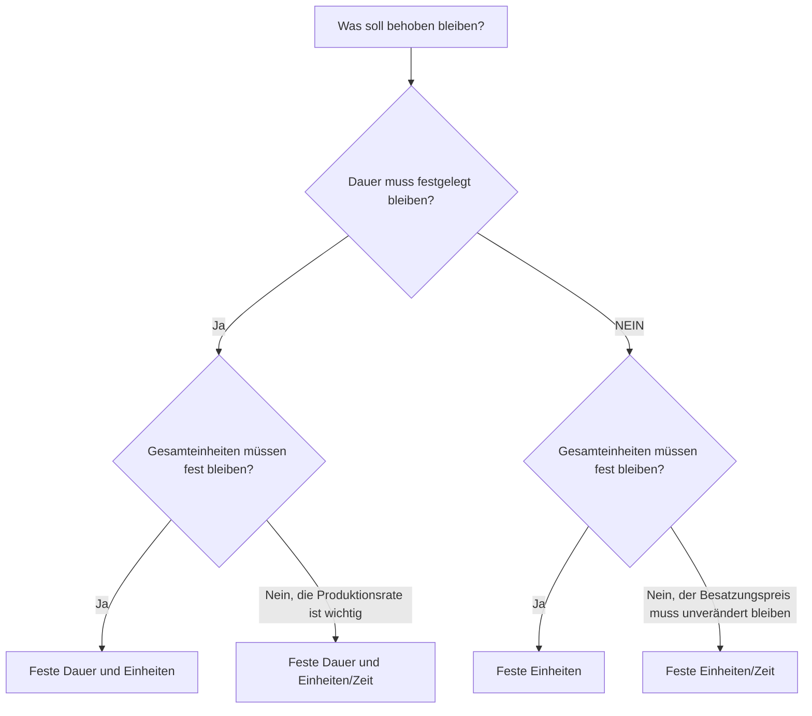

# Dauertypen in P6

Der Dauertyp ist eines der Felder in Primavera P6, das steuert, wie sich eine Aktivität verhält, wenn sich Dauer, Einheiten und Ressourcenproduktivität ändern. Es ist leicht zu übersehen, kann sich jedoch auf Terminplandaten, Ressourcenauslastung, Kostenprognosen, Earned Value und Aktualisierungsverhalten auswirken.

Viele Planer betrachten die Dauer nur als die Anzahl der Tage. In P6 ist die Dauer mehr als eine Zahl. Eine Aktivität kann auch Arbeitseinheiten, Nichtarbeitseinheiten, Einheiten pro Zeit, Ressourcenkalender, Aktivitätskalender und verbleibende Arbeit haben. Der Dauertyp teilt P6 mit, was unverändert bleiben soll, wenn der Terminplan neu berechnet wird oder wenn der Planer Ressourcen und Dauer ändert.

In diesem Blog werden die wichtigsten Dauertypen erläutert, die für Aktivitäten in P6 verfügbar sind, wie sie sich unterscheiden, wofür sie verwendet werden und wann man sie anstelle der anderen verwenden sollte.

## Der Dauertyp ist nicht dasselbe wie das Dauerfeld

Bevor wir uns die Typen ansehen, ist es hilfreich, zwei Ideen zu trennen.

Bei den Feldern „Dauer“ handelt es sich um Werte wie „ursprüngliche Dauer“, „verbleibende Dauer“, „tatsächliche Dauer“ und „Dauer bei Abschluss“. Diese beschreiben die Zeit.

Der Dauertyp ist eine Berechnungseinstellung. Es teilt P6 mit, wie Dauer, Gesamteinheiten und Einheiten pro Zeit ausgeglichen werden sollen, wenn sich etwas ändert.

Wenn Sie beispielsweise einer Aktivität weitere Ressourcen hinzufügen, sollte die Aktivität dann früher abgeschlossen werden? Oder soll die Dauer gleich bleiben und der Gesamtaufwand steigen? Die Antwort hängt vom Dauertyp ab.

## Die wichtigsten Dauertypen

Die gängigen P6-Dauertypen sind:

- Feste Dauer und Einheiten.
- Feste Dauer und Einheiten/Zeit.
- Feste Einheiten.
- Feste Einheiten/Zeit.

Die Namen mögen zunächst technisch erscheinen, aber jeder beantwortet eine praktische Frage: Welchen Teil der Aktivität sollte P6 schützen, wenn sich etwas ändert?

## Feste Dauer und Einheiten

„Feste Dauer und Einheiten“ hält die Aktivitätsdauer und die Gesamteinheiten fest. Wenn sich die Einheiten pro Zeit ändern, passt P6 die Rate an, anstatt die Dauer oder den Gesamtaufwand zu ändern.

Dieser Typ ist sinnvoll, wenn sowohl das geplante Zeitfenster als auch der Gesamtaufwand stabil bleiben sollen.

Beispiel:

Eine Tätigkeit ist für 10 Tage mit 400 Arbeitsstunden geplant. Das Planungsteam möchte, dass die Dauer bei 10 Tagen und der budgetierte Gesamtaufwand bei 400 Stunden bleibt. Wenn sich die Details der Ressourcenzuweisung ändern, sollten sich die geplante Dauer und die Gesamteinheiten nicht automatisch verschieben.

Verwenden Sie feste Dauer und Einheiten, wenn:

- Die Aktivität hat ein festes Arbeitsfenster.
- Der Gesamtaufwand ist bereits vereinbart.
- Änderungen der Ressourcenrate sollten nicht automatisch die Aktivitätsdauer ändern.
- Der Terminplan dient der stabilen Kosten- oder Earned Valuekontrolle.

Dies ist häufig für verwaltete Arbeitspakete nützlich, bei denen sowohl die Terminplandauer als auch der budgetierte Aufwand kontrolliert werden.

## Feste Dauer und Einheiten/Zeit

„Feste Dauer und Einheiten/Zeit“ hält die Dauer und die Ressourcenrate fest. Wenn Ressourcen hinzugefügt oder entfernt werden, kann P6 die Gesamteinheiten anpassen.

Dieser Typ ist nützlich, wenn die Aktivität in einem festen Zeitfenster stattfinden muss und die Ressourcenladerate konstant bleiben soll.

Beispiel:

Eine Projektmanagement-Unterstützungsaktivität dauert 20 Tage. Das Team stellt einen Projektingenieur für 8 Stunden pro Tag ein. Die Dauer sollte 20 Tage betragen und der Tagessatz sollte 8 Stunden pro Tag betragen. Die Gesamteinheiten ergeben sich aus dem Zeitfenster und der Rate.

Verwenden Sie eine feste Dauer und Einheiten/Zeit, wenn:

- Die Aktivitätsdauer ist festgelegt.
- Der tägliche oder stündliche Ressourcensatz ist wichtig.
- Die Gesamtzahl der Einheiten sollte aus Dauer und Rate berechnet werden.
- Die Tätigkeit stellt eine laufende Betreuung oder einen festen Arbeitszeitraum dar.

Dies kann für Überwachung, Management, Inspektionsunterstützung oder zeitbasierte Supportaktivitäten nützlich sein.

## Feste Einheiten

Mit „Feste Einheiten“ bleiben die Gesamteinheiten fest. Wenn sich die Ressourcenrate ändert, kann P6 die Dauer anpassen.

Dieser Typ ist nützlich, wenn der Arbeitsumfang festgelegt ist, die Dauer jedoch von der Produktivität oder der Ressourcenverfügbarkeit abhängt.

Beispiel:

Eine Tätigkeit erfordert 800 Arbeitsstunden. Wenn das Team mehr Besatzungskapazität zuweist, kann die Aktivität früher beendet werden. Wenn weniger Besatzungskapazität zur Verfügung steht, kann die Aktivität länger dauern. Die Gesamtarbeit beträgt 800 Stunden.

Verwenden Sie feste Einheiten, wenn:

- Die Arbeitsmenge bzw. der Gesamtaufwand ist festgelegt.
- Die Dauer sollte auf die Ressourcenverfügbarkeit oder Produktivität reagieren.
- Die Größe der Besatzung kann die für die Durchführung der Aktivität benötigte Zeit verändern.
- Die Ressourcenplanung ist aktiv und wird gepflegt.

Dies kann für Arbeiten im Produktionsstil nützlich sein, bei denen der Gesamtaufwand bekannt ist und erwartet wird, dass die Dauer auf die Auslastung der Mannschaft reagiert.

## Feste Einheiten/Zeit

„Feste Einheiten/Zeit“ hält die Ressourcenrate fest. Wenn sich die Dauer ändert, ändern sich auch die Gesamteinheiten.

Dieser Typ ist nützlich, wenn ein Team oder eine Ressource so lange mit einer festen Rate arbeitet, wie die Aktivität andauert.

Beispiel:

Bei einer Bauaufsichtstätigkeit ist ein Vorgesetzter 8 Stunden pro Tag im Einsatz. Wenn sich die Aktivitätsdauer von 10 Tagen auf 15 Tage erhöht, sollten sich die Gesamteinheiten erhöhen, da der Betreuer für mehr Tage benötigt wird. Der Tagessatz bleibt fest.

Verwenden Sie feste Einheiten/Zeit, wenn:

- Der Besatzungs- oder Ressourcensatz ist festgelegt.
- Die Gesamtzahl der Einheiten sollte sich erhöhen oder verringern, wenn sich die Dauer ändert.
- Die Aktivität stellt einen zeitbasierten Aufwand dar.
- Die Ressource wird für die gesamte Aktivitätsdauer zugewiesen.

Dies ist oft nützlich für Support-, Überwachungs-, Inspektions- und Managementaktivitäten, bei denen der Zeitaufwand den Gesamtaufwand bestimmt.

## So wählen Sie den richtigen Dauertyp aus

Der beste Dauertyp hängt davon ab, was die Aktivität darstellt und wie das Projektsteuerungsteam erwartet, dass P6 Änderungen berechnet.

Eine einfache Möglichkeit zur Auswahl besteht darin, zu fragen:

- Ist die Dauer durch Plan, Vertrag, Zeitfenster oder Zugang festgelegt?
- Ist der Gesamtaufwand durch Menge, Budget oder Schätzung festgelegt?
- Ist der Ressourcensatz durch den Besatzungsplan oder den Personalplan festgelegt?
- Sollte das Hinzufügen von Ressourcen die Aktivität verkürzen?
- Sollte die Erweiterung der Aktivität die Gesamtzahl der Einheiten erhöhen?

Wenn Dauer und Gesamteinheiten fest bleiben sollen, verwenden Sie „Feste Dauer und Einheiten“.

Wenn Dauer und Produktionsrate konstant bleiben sollen, verwenden Sie „Feste Dauer und Einheiten/Zeit“.

Wenn die Gesamtarbeit konstant bleiben und die Dauer auf die Ressourcenbelastung reagieren soll, verwenden Sie feste Einheiten.

Wenn die Ressourcenrate fest bleiben soll und sich die Einheiten mit der Dauer ändern sollen, verwenden Sie „Feste Einheiten/Zeit“.

## Praxisbeispiele

Für einen Betonguss, der als fester 1-Tages-Vorgang mit einem definierten Personal- und Kostenbudget geplant ist, können „Feste Dauer und Einheiten“ angemessen sein.

Für die Unterstützung des Projektmanagements, die zu einem konstanten Tagessatz über einen festen Berichtszeitraum zugewiesen wird, können „Feste Dauer und Einheiten/Zeit“ oder „Feste Einheiten/Zeit“ angemessen sein, je nachdem, ob Gesamteinheiten oder Änderungen der Dauer die Prognose bestimmen sollen.

Für eine Installationsaktivität mit einem bekannten Gesamtarbeitsumfang, bei der die Größe der Besatzung die Fertigstellungszeit beeinflusst, können feste Einheiten geeignet sein.

Für eine Bauüberwachung, die über die gesamte Bauzeit andauert, können feste Einheiten/Zeiten angemessen sein.

Der wichtige Punkt ist, dass die Wahl die Projektsteuerungsmethode und nicht die Gewohnheit widerspiegeln sollte.

## Häufige Fehler

Ein häufiger Fehler besteht darin, bei jeder Aktivität den standardmäßigen Dauertyp beizubehalten, ohne zu prüfen, ob er dem Aktivitätszweck entspricht.

Ein weiterer Fehler besteht darin, ein ressourcengesteuertes Dauerverhalten zu verwenden, wenn das Projekt die Ressourcenzuweisungen nicht sorgfältig verwaltet. Wenn die Ressourcendaten schwach sind, kann die ressourcenbasierte Berechnung zu unzuverlässigen Ergebnissen führen.

Ein dritter Fehler besteht darin, die Dauer während Aktualisierungen zu ändern, ohne zu verstehen, wie P6 Einheiten oder Tarife neu berechnet. Dies kann sich auf die Kostenbelastung, den Earned Value und die Ressourcenhistogramme auswirken.

Vermeiden Sie schließlich, den Dauertyp als rein technische Einstellung zu betrachten. Es beeinflusst, wie sich der Terminplan verhält, wenn sich der Plan ändert.

## Dauertyp und Terminplanqualität

Der Dauertyp ist Teil der Terminplanqualität, da er Einfluss darauf hat, ob die Prognose glaubwürdig ist. Wenn sich Dauer, Einheiten und Ressourcenrate einer Aktivität nicht wie erwartet verhalten, werden im Terminplan möglicherweise irreführende Daten oder Ressourcenbedarf angezeigt.

Bei PMO-Überprüfungen ist es hilfreich zu prüfen, ob die Dauertypen in ähnlichen Aktivitätsgruppen konsistent sind. Für technische Aktivitäten, Beschaffungsaktivitäten, Bauaktivitäten, LOE-Aktivitäten und Unterstützungsaktivitäten sind möglicherweise unterschiedliche Regeln erforderlich, die Auswahl sollte jedoch bewusst erfolgen.

Wenn der Terminplan ressourcenbelastet ist, wird der Dauertyp noch wichtiger. Es hilft festzustellen, ob sich Ressourcenänderungen auf die Dauer, die Gesamteinheiten oder die Einheiten pro Zeit auswirken.

## Abschluss

Dauertypen in P6 definieren, wie Aktivitäten reagieren, wenn sich Dauer, Gesamteinheiten und Ressourcensätze ändern. Es handelt sich dabei nicht nur um Hintergrundeinstellungen.

Feste Dauer und Einheiten schützen sowohl Zeit als auch Gesamtaufwand. Feste Dauer und Einheiten/Zeit schützen Zeit und Tarif. Feste Einheiten schützen den Gesamtaufwand. Feste Einheiten/Zeit schützen die Ressourcenrate.

Durch die Auswahl des richtigen Dauertyps kann der Terminplan so berechnet werden, dass er mit dem Projektplan übereinstimmt. Außerdem sind Ressourcenbelastung, Fortschrittsaktualisierungen, Kostenprognosen und Terminplanberichte leichter zu verstehen und zu verteidigen.
## Verwandte Inhalte
- [Aktivitäten, die am Datenstichtag ohne steuernde Logik beginnen: Warum diese Terminplanmetrik wichtig ist - Überblick](../../metrics/01_activities_starting_in_dd_with_no_logic_driving/02_guide_template.md)
- [Aktivitätstypen in P6](../05_ACTIVITY%20TYPES%20IN%20P6/05_ACTIVITY%20TYPES%20IN%20P6.md)
- [Termine in P6](../07_DATES%20IN%20P6/07_DATES%20IN%20P6.md)
