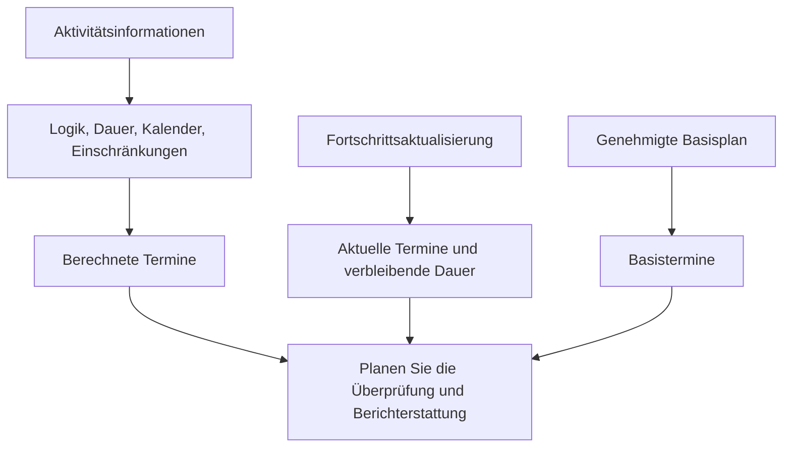

# Termine in P6

Termine in Primavera P6 können verwirrend sein, da eine Aktivität nicht nur ein Startdatum und ein Enddatum hat. Es kann geplante Termine, aktuelle Termine, frühe Termine, späte Termine, tatsächliche Termine, Basistermine, Einschränkungstermine, erwartete Termine und manchmal externe oder prognosebezogene Termine enthalten, abhängig vom Layout und den Projekteinstellungen.

Diese Daten bedeuten nicht alle dasselbe. Einige werden nach der CPM-Logik berechnet. Einige werden während der Fortschrittsaktualisierungen eingegeben. Einige werden zum Vergleich herangezogen. Einige werden verwendet, um den Terminplan zu steuern oder einzuschränken. Das Verständnis des Unterschieds ist für die Terminqualität, das PMO-Reporting, die Bereitschaft zur Verzögerungsanalyse und die grundlegende Projektsteuerung von entscheidender Bedeutung.

Die wichtigste Frage ist einfach: Was sagt mir dieses Datum und woher kommt es?

## Warum P6 so viele Termine hat

P6 ist nicht nur eine Datumsliste. Es handelt sich um ein Berechnungsmodell. Die Software berechnet Daten aus Aktivitätsdauer, Kalendern, Beziehungen, Einschränkungen, Ressourcen, Fortschrittsstatus und dem Datenstichtag.

Es gibt unterschiedliche Datumsfelder, da Planer unterschiedliche Fragen beantworten müssen:

- Was war der ursprüngliche Plan?
- Wie ist die aktuelle Prognose?
- Was ist eigentlich passiert?
- Wann kann die Aktivität frühestens beginnen oder enden?
- Was ist das Neueste, das gestartet oder beendet werden kann, ohne das Projekt zu beeinträchtigen?
- Erzwingt eine Einschränkung die Aktivität?
- Wie schneidet der aktuelle Plan im Vergleich zum Basisplan ab?

Das Problem beginnt, wenn diese Datumstypen miteinander vermischt werden, ohne ihren Zweck zu verstehen.

## Datenstichtag

Der Datenstichtag ist kein Aktivitätsdatum, aber es steuert, wie alle Aktivitätsdaten interpretiert werden sollen.

Der Datenstichtag ist die Grenze zwischen tatsächlicher Leistung und prognostizierter Arbeit. Arbeiten vor dem Datenstichtag sollten aktualisiert oder mit einem Status versehen werden. Arbeiten nach dem Datenstichtag sollten prognostiziert werden.

Wenn eine Aktivität Ist-Termine nach dem Datenstichtag hat, handelt es sich normalerweise um einen Statusfehler. Wenn eine offene Aktivität genau am Datenstichtag ohne steuernde Logik beginnt, kann dies auf eine fehlende Sequenzierung hinweisen. Wenn das erwartete Ende vor dem Datenstichtag liegt, kann dies auf veraltete Aktualisierungsinformationen hinweisen.

Bevor Sie ein Aktivitätsdatum überprüfen, bestätigen Sie der Datenstichtag.

## Start und Ende

Start und Ende sind die wichtigsten Terminplandaten, die die meisten Benutzer in P6-Layouts sehen. Sie stellen die aktuell berechneten oder geplanten Termine für die Aktivität basierend auf den Terminplandaten dar.

Für noch nicht begonnene Aktivitäten sind Start und Ende Prognosedaten. Für laufende Aktivitäten können sie den tatsächlichen Status und die verbleibende Prognose kombinieren. Für abgeschlossene Aktivitäten sollten sie mit den Ist-Terminen übereinstimmen.

Dies sind in der Regel die Daten, die in Berichten, Prognoseplänen und Managementbesprechungen verwendet werden. Sie sollten jedoch nicht akzeptiert werden, ohne die Logik und den Status dahinter zu prüfen.

Verwenden Sie „Start“ und „Ende“, um die Frage zu beantworten: Wann soll die Aktivität derzeit beginnen und enden?

## Früher Start und frühes Ende

„Früher Start“ und „Frühes Ende“ sind CPM-Berechnungstermine. Sie zeigen die frühesten Daten an, an denen eine Aktivität beginnen und enden kann, basierend auf Vorgängerlogik, Kalendern, Einschränkungen und aktuellen Terminplanbedingungen.

Frühzeitige Termine sind wichtig, da sie dabei helfen, den Fortschritt der Terminplanberechnung zu erläutern. Sie zeigen, wie sich Arbeit durch das Netzwerk bewegen kann, sobald die Logik es zulässt.

Wenn viele Aktivitäten am Datenstichtag einen frühen Start haben, sollte der Prüfer prüfen, ob sie wirklich bereit sind oder ob es sich um offene Starts, eingeschränkte Aktivitäten oder schwach verknüpfte Aktivitäten handelt.

Verwenden Sie „Früher Start“ und „Frühes Ende“, um zu antworten: Wann kann diese Aktivität laut dem aktuellen Netzwerk frühestens stattfinden?

## Später Start und spätes Ende

„Später Start“ und „Spätes Ende“ zeigen die spätesten Daten an, an denen eine Aktivität beginnen oder enden kann, ohne dass sich das Projektende oder der Kontrollendpunkt verzögert, abhängig von der Terminplaneinrichtung.

Verspätete Termine sind Teil des Rückwärtsdurchlaufs. Sie werden zur Berechnung des Puffers verwendet. Der Unterschied zwischen frühen und späten Terminen zeigt, wie flexibel die Aktivität ist.

Wenn verspätete Termine seltsam erscheinen, suchen Sie nach Einschränkungen, fehlenden Nachfolgern, offenen Abschlüssen, Kalendern oder ungewöhnlichen Projektabschlusseinstellungen.

Verwenden Sie „Später Start“ und „Spätes Ende“, um die Frage zu beantworten: Wie spät kann diese Aktivität verschoben werden, bevor sie sich auf das steuernde Abschlussdatum auswirkt?

## Ist-Start und Ist-Ende

Ist-Start und Ist-Ende sind Statusfakten. Sie sollten darstellen, was tatsächlich vor Ort oder bei der Projektdurchführung passiert ist.

Ist-Start bedeutet, dass die Aktivität tatsächlich begonnen hat. Tatsächlicher Abschluss bezeichnet die tatsächlich abgeschlossene Aktivität. Diese Termine sollten nicht als Planungsziele oder Prognosetermine verwendet werden.

Tatsächliche Daten sollten normalerweise am oder vor dem Datenstichtag liegen. Wenn die Ist-Terminen nach dem Datenstichtag liegen, meldet der Terminplan zukünftige Arbeiten als bereits begonnen oder abgeschlossen, was die Glaubwürdigkeit der Aktualisierung schwächt.

Verwenden Sie „Ist-Start“ und „Ist-Ende“, um zu antworten: Was ist wirklich passiert?

## Geplanter Start und geplantes Ende

Geplanter Start und geplantes Ende werden oft missverstanden. Abhängig davon, wie der Terminplan erstellt, aktualisiert und angezeigt wird, verhalten sich diese Felder möglicherweise nicht wie ein offiziell genehmigter Basisplan.

Einige Benutzer erwarten, dass in den geplanten Daten immer der ursprüngliche Plan angezeigt wird. Das ist nicht immer eine sichere Annahme. Für die formelle Abweichungsberichterstattung ist eine zugewiesene Basisplan in der Regel zuverlässiger, als sich beiläufig auf geplante Daten zu verlassen.

Verwenden Sie „Geplanter Start“ und „Geplantes Ende“ nur, wenn in Ihrem Projektkontrollverfahren klar definiert ist, wie sie gepflegt werden und was sie bedeuten.

## Basisplan-Start und Basisplannende

Die Basistermine stammen aus einem zugewiesenen Basisplan. Sie werden verwendet, um den aktuellen Terminplan mit dem genehmigten Plan zu vergleichen.

Beispielsweise können unter „BL1-Start“ und „BL1-Ende“ die Start- und Enddaten der Aktivität ab dem genehmigten Basisplan angezeigt werden. Aktueller Start und Ziel zeigen die neueste Vorhersage. Der Unterschied zwischen ihnen zeigt Varianz.

Basistermine sind von zentraler Bedeutung für die Leistungsberichterstattung, Terminabweichungen, Änderungskontrolle und die Vorbereitung von Verzögerungsanalysen.

Verwenden Sie Basisplan Start und Basisplan Finish, um die Frage zu beantworten: Wie schneidet der aktuelle Terminplan im Vergleich zum genehmigten Plan ab?

## Einschränkungsdatum

Beschränkungstermine sind auferlegte Datumskontrollen. Sie sind mit Einschränkungstypen wie „Start am“, „Start am oder nach“, „Ende am“, „Ende am oder davor“, „Obligatorischer Start“ oder „Obligatorisches Ende“ verbunden.

Einschränkungen sind nicht automatisch falsch. Einige stellen tatsächliche Vertragsdaten, Zugangsbeschränkungen, Genehmigungsfreigaben, Ausfallfenster oder Eigentümeranforderungen dar. Aber Einschränkungen können auch fehlende Logik verbergen oder unrealistische Daten erzwingen.

Harte Einschränkungen, insbesondere obligatorischer Start und obligatorisches Ende, sollten selten sein und dokumentiert werden.

Verwenden Sie das Einschränkungsdatum, um die Frage zu beantworten: Wird diese Aktivität durch ein vorgeschriebenes Datum kontrolliert oder eingeschränkt?

## Erwartete End- und Prognosetermine

„Erwarteter Abschluss“ wird häufig bei Aktualisierungen verwendet, um zu erfassen, wann das Projektteam den Abschluss einer Aktivität erwartet. Je nach Einstellungen und Verfahren können erwartete Termine Einfluss darauf haben, wie P6 Aktivitätstermine berechnet oder anzeigt.

„Erwartetes Ende“ kann für laufende Arbeiten nützlich sein, wenn Außendienstteams eine realistische Fertigstellungserwartung angeben. Aber wenn es nicht gepflegt wird, kann es veraltet sein. Ein erwartetes Ende vor dem Datenstichtag ist ein häufiges Warnzeichen.

Einige Projekte verwenden auch prognosebezogene Datumsfelder oder benutzerdefinierte Felder für die Berichterstellung. Der Schlüssel besteht darin, sie klar zu definieren, damit das Team weiß, ob sie berechnet, manuell eingegeben oder importiert werden.

Verwenden Sie erwartete oder prognostizierte Daten, um die Frage zu beantworten: Was sind die neuesten Erwartungen des Teams und werden diese durch ein definiertes Aktualisierungsverfahren gesteuert?

## Primäre und sekundäre Einschränkungsdaten

Abhängig von den ausgewählten Einschränkungsfeldern kann P6 mehr als eine Einschränkungsbedingung für eine Aktivität enthalten. Die primäre Einschränkung ist normalerweise die Haupteinschränkung, die in Standardlayouts angezeigt wird, aber auch eine sekundäre Einschränkung kann die Interpretation beeinflussen.

Achten Sie bei der Durchsicht des Terminplans nicht nur auf Start und Ende. Fügen Sie dem Layout Felder für den Einschränkungstyp und das Einschränkungsdatum hinzu. Wenn sich Datumsangaben nicht wie erwartet verhalten, sind Einschränkungen eines der ersten Dinge, die überprüft werden müssen.

## Welche Daten sollten Sie verwenden?

Nutzen Sie jedes Datum für seinen Zweck:

- Verwenden Sie Start und Ende für die aktuelle Terminplanprognose.
- Verwenden Sie Früh- und Spätdaten, um die CPM-Berechnung und den Puffer zu verstehen.
- Verwenden Sie Ist-Termine für abgeschlossene oder begonnene Arbeiten.
- Verwenden Sie Basisdaten für Abweichungen vom genehmigten Plan.
- Verwenden Sie Einschränkungsdaten, um auferlegte Datumskontrollen zu identifizieren.
- Verwenden Sie die Felder „Erwartetes Ende“ oder „Prognose“ nur, wenn sie im Aktualisierungsverfahren definiert sind.
- Verwenden Sie der Datenstichtag, um die tatsächliche Leistung von der prognostizierten Arbeit zu trennen.

## Häufige Fehler

Ein häufiger Fehler ist der Vergleich falscher Daten. Beispielsweise ist der Vergleich des aktuellen Starts mit dem geplanten Start möglicherweise nicht aussagekräftig, wenn die geplanten Daten nicht durch das Projektverfahren gesteuert werden.

Ein weiterer Fehler besteht darin, den tatsächlichen Start als Prognose zu betrachten. Tatsächliche Daten sollten die tatsächliche Leistung widerspiegeln, nicht die Absicht.

Ein dritter Fehler besteht darin, die Tageszeit zu ignorieren. P6 speichert Datumsangaben mit Uhrzeit, und Kalenderunterschiede können zu offensichtlichen Verschiebungen um einen Tag oder Überraschungen führen.

Vermeiden Sie schließlich das Ausblenden von Einschränkungsterminen. Wenn ein Datum festgelegt ist, müssen die Gutachter es sehen.

## Abschluss

Termine in P6 sind aussagekräftig, weil sie verschiedene Teile der Terminplangeschichte erzählen. Aktuelle Termine zeigen die Prognose. Frühe und späte Daten erläutern die CPM-Berechnung. Tatsächliche Daten dokumentieren, was passiert ist. Basisdaten unterstützen den Vergleich. Beschränkungstermine offenbaren auferlegte Kontrollen. Voraussichtliche Daten können Aktualisierungen unterstützen, wenn sie ordnungsgemäß gepflegt werden.

Bei einer gründlichen Überprüfung des Terminplans wird nicht nur gefragt: „Was ist das Datum?“ Es wird gefragt: „Was ist das für ein Datum, woher kommt es und ist es glaubwürdig?“

Wenn das Projektteam die Bedeutung jedes Datumsfelds versteht, wird der Terminplan einfacher zu erklären, einfacher zu prüfen und zuverlässiger für die Projektsteuerung.
## Verwandte Inhalte
- [Tatsächliche Daten liegen später als der Datenstichtag in Primavera P6 - Überblick](../../metrics/12_actual_date_greater_than_data_date/02_guide_template.md)
- [Dauertypen in P6](../06_DURATION%20TYPES%20IN%20P6/06_DURATION%20TYPES%20IN%20P6.md)
- [Kalender in P6](../08_CALENDARS%20IN%20P6/08_CALENDARS%20IN%20P6.md)
