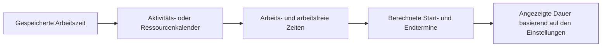

# Dauer in P6

Die Dauer in Primavera P6 sieht zunächst einfach aus: Eine Aktivität dauert eine bestimmte Anzahl von Tagen. In der Praxis ist die Dauer einer der wichtigsten und am meisten missverstandenen Teile eines Terminplans.

Die Dauer hängt mit Kalendern, Aktivitätstypen, Ressourcenzuweisungen, Fortschrittsaktualisierungen und Benutzeranzeigeeinstellungen zusammen. Eine als „5 Tage“ angezeigte Dauer bedeutet möglicherweise nicht in jedem Terminplan, jedem Kalender oder jedem Benutzerlayout dasselbe. Aus diesem Grund müssen Planer nicht nur verstehen, was die Dauer ist, sondern auch, wie P6 sie speichert, berechnet und anzeigt.

## Was Dauer bedeutet

Unter Dauer versteht man die Arbeitszeit, die für die Ausübung einer Tätigkeit erforderlich ist. Dabei handelt es sich nicht einfach um die Anzahl der Kalendertage zwischen einem Startdatum und einem Enddatum.

Beispielsweise kann eine Aktivität mit einer Dauer von 5 Tagen Folgendes umfassen:

- 5 Kalendertage im Kalender von Montag bis Freitag ohne Unterbrechung.
- 7 Kalendertage, wenn ein Wochenende in die Arbeitszeit fällt.
- Weniger als 5 Kalendertage bei einem 24-Stunden- oder Langzeitschichtkalender.
- Mehr als 5 Kalendertage, wenn Feiertage oder arbeitsfreie Tage die Arbeit unterbrechen.

Dies ist die erste wichtige Lektion: Dauer ist Arbeitszeit, während Start- und Enddatum Kalenderpositionen sind.

## Wie P6 die Dauer speichert

P6 speichert die Dauer als Zeit, üblicherweise auf Stundenebene in den zugrunde liegenden Terminplandaten. Was der Benutzer im Layout sieht, kann je nach Präferenz als Tage, Wochen, Monate oder Jahre angezeigt werden.

Dies bedeutet, dass es sich bei der angezeigten Dauer häufig um eine Umrechnung handelt. Wenn P6 eine Aktivität als 40 Arbeitsstunden speichert, sieht ein Benutzer sie möglicherweise als 5 Tage, wenn die Anzeigekonvertierung 8 Stunden pro Tag verwendet. Ein anderes Setup zeigt es möglicherweise anders an, wenn die Zeitperiodenkonvertierung oder die Kalenderbasis unterschiedlich ist.

Aus diesem Grund können zwei Personen denselben Terminplan betrachten und verwirrt sein, wenn ihre Benutzerpräferenzen oder administrativen Zeitintervalleinstellungen nicht übereinstimmen.

## Dauer und Kalender

Kalender teilen P6 mit, wann gearbeitet werden kann. Die Dauer teilt P6 mit, wie viel Arbeitszeit benötigt wird. Der Kalender ordnet diese Arbeitszeit dann den Ist-Terminen zu.

Wenn eine Aktivität noch 40 Stunden dauert, bestimmt der Kalender, wie diese 40 Stunden verteilt werden.

In einem 8-Stunden-Tageskalender können 40 Stunden als 5 Arbeitstage erscheinen. In einem 10-Stunden-Tageskalender können dieselben 40 Stunden als 4 Arbeitstage erscheinen. Bei einem 24-Stunden-Kalender kann die Kalenderzeit deutlich kürzer sein.

Aus diesem Grund sind Kalenderzuweisungen wichtig. Durch eine Änderung des Kalenders kann sich der Endtermin ändern, auch wenn die gespeicherte Arbeitsdauer gleich bleibt.

## Ursprüngliche Dauer

Die ursprüngliche Dauer ist die geplante Dauer der Aktivität, bevor der Fortschritt angewendet wird. Es stellt die anfängliche Schätzung der Arbeitszeit dar, die zur Erledigung der Aktivität benötigt wird.

Die ursprüngliche Dauer ist während der Planung und Basisentwicklung wichtig. Es hilft dabei, den erwarteten Aufwand oder das Zeitfenster für eine Aufgabe zu definieren. Es wird auch in Fortschritts- und Leistungsbesprechungen verwendet, da es einen Anhaltspunkt dafür bietet, wie lange die Aktivität voraussichtlich dauern wird.

Verwenden Sie die ursprüngliche Dauer, um zu antworten: Wie lange sollte diese Aktivität dauern, bevor der Status aktualisiert wird?

## Verbleibende Dauer

Die verbleibende Dauer ist die Menge an Arbeitszeit, die noch benötigt wird, um die Aktivität ab dem aktuellen Datenstichtag abzuschließen.

Bei einer noch nicht begonnenen Aktivität entspricht die verbleibende Dauer normalerweise der ursprünglichen Dauer, sofern sie nicht geändert wurde. Bei einer laufenden Aktivität sollte die verbleibende Dauer die realistische noch erforderliche Arbeit widerspiegeln. Für eine abgeschlossene Aktivität sollte die verbleibende Dauer 0 sein.

Die verbleibende Dauer ist eines der wichtigsten Aktualisierungsfelder in P6. Wenn es falsch ist, wird die Prognose falsch sein.

Beantworten Sie mit „Restdauer“ die Frage: Wie viel Arbeitszeit ist noch erforderlich?

## Tatsächliche Dauer

Die tatsächliche Dauer stellt die Zeit dar, die basierend auf dem tatsächlichen Fortschritt bereits für die Aktivität aufgewendet wurde. Es ist an den tatsächlichen Start, das tatsächliche Ende, der Datenstichtag, Kalender und die Aktualisierungsmethode gebunden.

Die tatsächliche Dauer sollte die Statusgeschichte unterstützen. Wenn eine Aktivität begonnen hat, sollte die tatsächliche Dauer im Verhältnis zum tatsächlichen Start- und Datenstichtag sinnvoll sein. Wenn die Aktivität abgeschlossen ist, sollte die tatsächliche Dauer mit der tatsächlichen Arbeitsperiode übereinstimmen.

Verwenden Sie die tatsächliche Dauer, um zu beantworten: Wie viel Arbeitszeit wurde bereits verbraucht?

## Bei Abschlussdauer

Die Dauer bei Abschluss stellt die erwartete Gesamtdauer der Aktivität nach der Kombination der tatsächlichen und verbleibenden Arbeit dar.

In einfachen Worten:

Tatsächliche Dauer + verbleibende Dauer = Dauer bei Fertigstellung

Dies ist nützlich, da es zeigt, ob eine Aktivität voraussichtlich mehr oder weniger Zeit in Anspruch nehmen wird als ursprünglich geplant. Wenn die ursprüngliche Dauer 10 Tage betrug, die Dauer bei Abschluss jetzt jedoch 15 Tage beträgt, wird die Aktivität voraussichtlich länger dauern als geplant.

Verwenden Sie die Option „Bei Abschlussdauer“, um die Frage zu beantworten: Wie lange wird diese Aktivität voraussichtlich insgesamt dauern?

## Dauer und Benutzereinstellungen

Benutzereinstellungen steuern, wie Zeiteinheiten für einen einzelnen Benutzer angezeigt werden. Ein Benutzer kann wählen, ob die Dauer in Stunden, Tagen, Wochen, Monaten oder Jahren angezeigt wird.

Dies wirkt sich auf das aus, was der Benutzer sieht, nicht unbedingt auf die zugrunde liegende Terminplanberechnung. Beispielsweise kann die gleiche gespeicherte Dauer in einem Layout als Stunden und in einem anderen als Tage angezeigt werden.

Das ist nützlich, kann aber auch Verwirrung stiften. Ein Planer, der detaillierte Arbeiten überprüft, bevorzugt möglicherweise Stunden. Ein Projektmanager bevorzugt möglicherweise Tage. Ein Portfoliobericht kann Monate anzeigen. Wenn die Umrechnungsbasis nicht verstanden wird, können die Zahlen inkonsistent aussehen.

Bestätigen Sie beim Überprüfen der Dauer die Anzeigeeinheit. Fragen Sie, ob die angezeigte Dauer in Stunden, Tagen, Wochen oder einer anderen Einheit angegeben ist.

## Administratoreinstellungen und Zeiträume

Zu den Administratoreinstellungen gehören Zeitperiodeneinstellungen, die festlegen, wie P6 Stunden in größere Einheiten wie Tage, Wochen, Monate und Jahre umrechnet. Diese Einstellungen sind wichtig, da sie Einfluss darauf haben, wie Dauerwerte angezeigt und konvertiert werden.

Wenn das System beispielsweise 8 Stunden pro Tag verbraucht, werden 40 Stunden als 5 Tage angezeigt. Wenn das System 10 Stunden pro Tag verbraucht, werden 40 Stunden als 4 Tage angezeigt.

Dies bedeutet nicht unbedingt, dass sich die Arbeit geändert hat. Es bedeutet möglicherweise nur, dass sich die Konvertierung geändert hat.

In einigen P6-Konfigurationen kann die Daueranzeige auch davon abhängen, ob das System oder der Benutzer zugewiesene Kalenderstunden für die Zeitperiodenkonvertierung verwendet. Aus diesem Grund sollten Projektteams vor der formellen Berichterstattung Kalenderstandards, Benutzerpräferenzen und Administrator-Zeitraumeinstellungen abgleichen.

## Warum die Dauer unterschiedlich aussehen kann

Die Dauer kann aus mehreren Gründen unterschiedlich aussehen:

- Verschiedene Benutzer zeigen die Zeit in unterschiedlichen Einheiten an.
- Die Einstellungen für den Admin-Zeitraum konvertieren Stunden unterschiedlich.
- Aktivitätskalender haben unterschiedliche Stunden pro Tag.
- Ressourcenkalender unterscheiden sich von Aktivitätskalendern.
- Aktivitäten verwenden unterschiedliche Aktivitätstypen.
- Die verbleibende Dauer wurde manuell aktualisiert.
- Der Fortschritt wurde falsch angewendet.
- Die Tageszeit ist im Layout ausgeblendet.

Aus diesem Grund ist ein Dauerproblem nicht immer ein Dauerproblem. Manchmal ist es ein Kalenderproblem. Manchmal handelt es sich um ein Problem mit der Anzeigeeinstellung. Manchmal handelt es sich um ein Problem mit der Fortschrittsaktualisierung.

## Beziehung zu Aktivitätstypen und Dauertypen

Der Aktivitätstyp beeinflusst, welche Kalenderbasis am wichtigsten ist. Aufgabenabhängige Aktivitäten basieren normalerweise hauptsächlich auf dem Aktivitätskalender. Ressourcenabhängige Aktivitäten können stärker durch Ressourcenkalender beeinflusst werden.

Der Dauertyp beeinflusst, wie P6 Dauer, Ressourceneinheiten und Einheiten pro Zeit ausgleicht. Beispielsweise kann das Hinzufügen von Ressourcen je nach Dauertyp die Aktivität verkürzen oder auch nicht.

Wenn sich eine Dauer unerwartet verhält, prüfen Sie drei Dinge gemeinsam:

- Aktivitätskalender und Ressourcenkalender.
- Aktivitätstyp.
- Dauertyp.

Diese Felder arbeiten zusammen. Die Betrachtung nur einer davon kann zu einer falschen Schlussfolgerung führen.

## Häufige Probleme

Ein häufiges Problem besteht darin, eine Dauer in Tagen einzugeben, ohne zu bemerken, dass der Aktivitätskalender eine andere Anzahl von Stunden pro Tag als erwartet verwendet.

Ein weiteres Problem besteht darin, die Dauer von Aktivitäten zu vergleichen, die unterschiedliche Kalender verwenden. Fünf Tage in einem Kalender stellen möglicherweise nicht die gleiche Arbeitszeit dar wie fünf Tage in einem anderen.

Ein drittes Problem sind inkonsistente Benutzereinstellungen. Ein Rezensent sieht möglicherweise Stunden, während ein anderer Tage sieht, und beide denken möglicherweise, dass sich der Terminplan geändert hat.

Ein weiteres häufiges Problem ist das Ändern der Administratoreinstellungen, nachdem bereits Terminpläne vorhanden sind. Dies kann dazu führen, dass die angezeigten Dauern unterschiedlich erscheinen, selbst wenn sich die zugrunde liegenden gespeicherten Stunden nicht geändert haben.

## So überprüfen Sie die Dauer richtig

Achten Sie bei der Überprüfung der Dauer in P6 nicht nur auf die in der Spalte „Dauer“ angezeigte Zahl.

Überprüfen:

- Ursprüngliche Dauer.
- Verbleibende Dauer.
- Tatsächliche Dauer.
- Bei Abschlussdauer.
- Aktivitätskalender.
- Ressourcenkalender, wenn Ressourcen verwendet werden.
- Aktivitätstyp.
- Dauertyp.
- Anzeige der Zeiteinheit der Benutzereinstellungen.
- Konvertierung des Zeitraums der Administratoreinstellungen.

Wenn Datumsangaben oder Dauern seltsam aussehen, fügen Sie dem Layout Kalender- und Zeitfelder hinzu. Verheimlichen Sie bei der Fehlerbehebung nicht die Tageszeit.

## Abschluss

Die Dauer in P6 ist die Arbeitszeit, nicht nur die verstrichene Kalenderzeit. P6 speichert die Dauer als Zeit, wendet Kalender an, um diese Zeit im Terminplan zu platzieren, und zeigt sie entsprechend den Benutzerpräferenzen und administrativen Zeitintervalleinstellungen an.

Das bedeutet, dass die Dauer im Kontext überprüft werden muss. Ein als „5 Tage“ angezeigter Wert hängt von Kalenderstunden, Anzeigeeinheiten, Konvertierungseinstellungen, Aktivitätstyp, Dauertyp und Aktualisierungsstatus ab.

Ein guter Planer versteht, dass die Dauer nicht nur eine Eingabe ist. Es ist Teil der Berechnungsmaschine. Wenn Dauer, Kalender und Präferenzen aufeinander abgestimmt sind, wird der Terminplan einfacher zu erklären und zuverlässiger für die Projektsteuerung.
## Verwandte Inhalte
- [Aktivitäten, die am Datenstichtag ohne steuernde Logik beginnen: Warum diese Terminplanmetrik wichtig ist - Überblick](../../metrics/01_activities_starting_in_dd_with_no_logic_driving/02_guide_template.md)
- [Kalender in P6](../08_CALENDARS%20IN%20P6/08_CALENDARS%20IN%20P6.md)
- [Prozent vollständige Typen in P6](../10_PERCENT%20COMPLETION%20TYPES%20IN%20P6/10_PERCENT%20COMPLETION%20TYPES%20IN%20P6.md)
