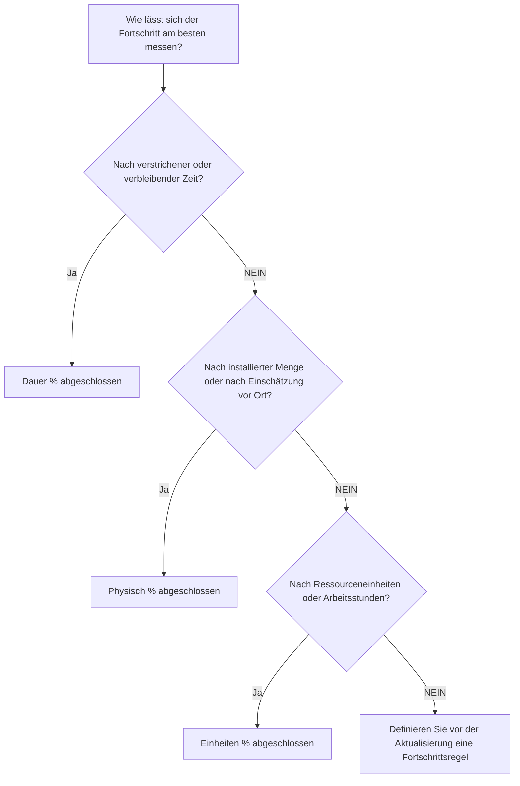

# Prozent vollständige Typen in P6

„Prozent abgeschlossen“ ist eines der sichtbarsten Fortschrittsfelder in Primavera P6, wird aber auch am meisten missverstanden. Ein Wert von 50 % abgeschlossen kann unterschiedliche Bedeutungen haben, je nachdem, wie die Aktivität konfiguriert ist und wie das Projekt den Fortschritt misst.

In P6 steuert der Typ „Prozent abgeschlossen“ die Art und Weise, wie der Aktivitätsprozentsatz berechnet oder aktualisiert wird. Es teilt P6 mit, ob der Fortschritt auf Zeit, körperlicher Leistung oder Ressourceneinheiten basieren soll.

Die wichtigsten Arten des Fertigstellungsgrads für Aktivitäten sind:

- Dauer % abgeschlossen.
- Physisch % abgeschlossen.
- Einheiten % abgeschlossen.

Es ist wichtig, die richtige Wahl zu treffen, denn Fortschritt ist nicht nur eine Berichtszahl. Dies wirkt sich auf die verbleibende Dauer, den Earned Value, die Ressourcenberichterstattung, die Glaubwürdigkeit des Terminplans und die Qualität jedes Aktualisierungszyklus aus.

## Warum Prozentvollständigkeitstyp wichtig ist

Unterschiedliche Aktivitäten erfordern unterschiedliche Methoden zur Messung des Fortschritts.

Für einige Aktivitäten ist Zeit ein sinnvoller Indikator. Wenn eine Aufgabe 10 Tage dauerte und 5 Arbeitstage abgeschlossen sind, kann man davon ausgehen, dass die Aktivität zu etwa 50 % abgeschlossen ist.

Für andere Aktivitäten reicht die Zeit nicht aus. Eine Mannschaft kann 5 Tage mit einer 10-Tage-Aufgabe verbringen und nur 20 % der körperlichen Arbeit erledigen. Eine andere Mannschaft kann in der ersten Hälfte der Laufzeit 80 % der Menge fertigstellen. In diesen Fällen kann ein auf der Dauer basierender Fortschritt das Projektteam in die Irre führen.

Bei ressourcenbelasteten Terminplänen können Einheiten die beste Fortschrittsbasis sein. Wenn für eine Aktivität 1.000 Arbeitsstunden geplant sind und 600 Arbeitsstunden verdient oder verbraucht wurden, spiegelt „Einheiten % abgeschlossen“ möglicherweise den Fortschritt besser wider.

Der richtige Typ „Prozent abgeschlossen“ hängt davon ab, was die Aktivität darstellt und wie der Fortschritt tatsächlich gemessen wird.

## Aktivität % abgeschlossen

Aktivität % abgeschlossen ist der allgemeine Fortschrittswert, der für die Aktivität angezeigt wird. Seine Quelle hängt vom ausgewählten Typ „Prozent abgeschlossen“ ab.

Wenn die Aktivität „Dauer % abgeschlossen“ verwendet, wird „Aktivität % abgeschlossen“ durch das Verhältnis zwischen ursprünglicher, tatsächlicher und verbleibender Dauer bestimmt.

Wenn für die Aktivität „Physischer %-Abschluss“ verwendet wird, folgt der Aktivitäts-%-Abschluss dem vom Benutzer eingegebenen Wert „Physischer %-Abschluss“.

Wenn die Aktivität Einheiten % abgeschlossen verwendet, basiert der Aktivität % abgeschlossen auf dem Fortschritt der Ressourceneinheiten.

Aus diesem Grund können zwei Aktivitäten beide zu 50 % abgeschlossen sein, aber sehr unterschiedliche Bedeutungen haben.

## Dauer % abgeschlossen

Dauer % Abgeschlossen misst den Fortschritt basierend auf der Zeit. Es vergleicht die verbrauchte Dauer mit der erwarteten Gesamtdauer.

Vereinfacht ausgedrückt: Wenn eine Aktivität 10 Tage geplant oder bei Abschluss dauert und 5 Tage verbraucht wurden, kann die Aktivität etwa 50 % „Dauer % abgeschlossen“ anzeigen.

„Dauer % abgeschlossen“ ist nützlich, wenn der Fortschritt einigermaßen proportional zur Zeit ist.

Beispiele hierfür sind:

- Verwaltungsüberprüfungszeiträume.
- Warte- oder Aushärtezeiten.
- Zeitbasierte Supportaufgaben.
- Einige einfache Aktivitäten, bei denen die Arbeitsproduktion stabil ist.

Verwenden Sie „Dauer % abgeschlossen“, wenn die Zeit ein angemessenes Maß für den Fortschritt ist und die verbleibende Dauer sorgfältig eingehalten wird.

Das Risiko besteht darin, dass die aufgewendete Zeit nicht immer der geleisteten Arbeit entspricht. Eine Aufgabe kann die Hälfte ihrer geplanten Dauer in Anspruch nehmen und dennoch physisch weit hinterherhinken. Wenn sich der Planer nur auf die Dauer verlässt, sehen Fortschrittsberichte möglicherweise besser aus als die Realität.

## Physisch % abgeschlossen

Der physische %-Abschluss wird basierend auf dem tatsächlichen physischen Fortschritt manuell eingegeben oder aktualisiert. Es stellt dar, was in der Arbeit tatsächlich erreicht wurde, unabhängig von Dauer oder Ressourceneinheiten.

Dies ist oft die beste Option für Bauarbeiten, technische Leistungen, Installationsarbeiten, Inbetriebnahmepakete oder andere Aktivitäten, bei denen der Fortschritt auf einer messbaren Leistung basieren sollte.

Beispiele hierfür sind:

- 40 % der ausgestellten Zeichnungen.
- 60 % der Kabelrinne installiert.
- 75 % der Rohrleitungen sind verschweißt.
- 30 % des Testpakets abgeschlossen.
- 100 % der Geräteausrichtung abgeschlossen.

Verwenden Sie „Physical % Completed“, wenn der Fortschritt anhand der Menge, des Lieferstatus, der Feldüberprüfung oder der Beurteilung durch den verantwortlichen Eigentümer gemessen werden soll.

Der Vorteil besteht darin, dass es die Realität besser widerspiegeln kann als die verstrichene Zeit. Das Risiko besteht darin, dass es Disziplin erfordert. Das Projektteam muss festlegen, wie der physische Fortschritt gemessen wird, wer ihn genehmigt und wie Beweise gesammelt werden.

## Einheiten % abgeschlossen

Einheiten % Abgeschlossen misst den Fortschritt basierend auf Ressourceneinheiten. Es vergleicht tatsächliche Einheiten mit Einheiten bei Fertigstellung.

Dies ist nützlich, wenn der Terminplan ressourcenbelastet ist und der Fortschritt anhand von Arbeitsstunden, Gerätestunden oder anderen messbaren Ressourceneinheiten verfolgt wird.

Beispiele hierfür sind:

- Tatsächlich verdiente Arbeitsstunden im Vergleich zu budgetierten Arbeitsstunden.
- Genutzte Gerätestunden im Vergleich zu geplanten Gerätestunden.
- Installierte Arbeit ist an den Fortschritt der Ressourceneinheit gebunden.
- Earned-Value-Workflows basierend auf Einheiten.

Verwenden Sie „Einheiten % abgeschlossen“, wenn Ressourceneinheiten zuverlässig sind, gewartet werden und Teil der Projektfortschrittsmethode sind.

Das Risiko besteht darin, dass der Ressourcenverbrauch nicht immer dem physischen Fortschritt entspricht. Ein Team kann viele Stunden damit verbringen, die erwartete Arbeit nicht zu erledigen. Aus diesem Grund funktioniert „Einheiten % abgeschlossen“ am besten, wenn die Ressourcenberichterstattung und die Fortschrittsmessung gut kontrolliert werden.

## So wählen Sie den richtigen Typ aus

Eine praktische Möglichkeit, den Typ „Prozent abgeschlossen“ auszuwählen, besteht darin, zu fragen, was Fortschritt für die Aktivität bedeutet.

Wenn Fortschritt bedeutet, dass Zeit vergangen ist, verwenden Sie „Dauer % abgeschlossen“.

Wenn Fortschritt bedeutet, dass körperliche Arbeit geleistet wurde, verwenden Sie „Physischer % abgeschlossen“.

Wenn der Fortschritt bedeutet, dass Ressourceneinheiten verdient oder verbraucht wurden, verwenden Sie „Einheiten % abgeschlossen“.

Die Auswahl sollte für alle ähnlichen Aktivitätsgruppen konsistent sein. Für technische Leistungen kann „Physical % Complete“ verwendet werden. Bei der Bauinstallation kann der physische %-Fertigstand basierend auf den Mengen verwendet werden. Für die zeitbasierte Verwaltungsunterstützung kann die Dauer % abgeschlossen verwendet werden. Ressourcenintensive Arbeitspakete können „Einheiten % abgeschlossen“ verwenden, wenn die Ressourcendaten zuverlässig sind.

## Zusammenhang mit der verbleibenden Laufzeit

Der Fertigstellungsgrad und die verbleibende Dauer sollten eine konsistente Geschichte erzählen.

Eine Aktivität kann zu 80 % körperlich abgeschlossen sein, aber noch eine Restdauer von 10 Tagen haben, wenn die verbleibende Arbeit schwierig ist, sich verzögert oder von einer anderen Bedingung abhängt. Das mag gültig sein.

Eine Aktivität kann zu 50 % der Dauer % abgeschlossen sein, weil die Hälfte der geplanten Zeit vergangen ist. Wenn jedoch nur 20 % der Arbeit physisch erledigt werden, sollte die verbleibende Dauer wahrscheinlich überarbeitet werden.

Aus diesem Grund erfordern gute Updates sowohl eine Fortschritts- als auch eine Prognoseüberprüfung. Der Fertigstellungsgrad gibt an, wie viel erreicht wurde. Die verbleibende Dauer gibt an, wie viel Zeit noch benötigt wird.

## Häufige Fehler

Ein häufiger Fehler besteht darin, „Dauer % abgeschlossen“ für Aktivitäten zu verwenden, bei denen der körperliche Fortschritt nicht proportional zur Zeit ist. Dies kann dazu führen, dass der Fortschritt besser oder schlechter aussieht als die eigentliche Arbeit.

Ein weiterer Fehler besteht darin, „Physical % Complete“ ohne Messregel zu verwenden. Wenn eine Disziplin körperliche Fortschritte nach installierter Menge meldet und eine andere nach Meinung, wird der Terminplan inkonsistent.

Ein dritter Fehler besteht darin, „Einheiten % abgeschlossen“ zu verwenden, wenn Ressourcendaten unvollständig oder unzuverlässig sind. Wenn die tatsächlichen Einheiten nicht beibehalten werden, ist der Fortschrittswert nicht vertrauenswürdig.

Ein weiteres Problem besteht darin, den Prozentsatz der Fertigstellung zu aktualisieren, aber die verbleibende Dauer zu ignorieren. Eine Aktivität kann Fortschritte zeigen und dennoch eine unrealistische Prognose haben.

## Gute Praxis

Definieren Sie Fortschrittsregeln, bevor der Aktualisierungszyklus beginnt. Das Projektteam sollte wissen, welche Aktivitätsgruppen „Dauer“, „Physisch“ oder „Einheiten % abgeschlossen“ verwenden.

Verwenden Sie Layouts, die den Typ „Prozent abgeschlossen“, „Aktivität % abgeschlossen“, „Physisch % abgeschlossen“, „Dauer % abgeschlossen“, „Einheiten % abgeschlossen“, „Restdauer“, „Ist-Start“, „Ist-Ende“ und „Aktivitätsstatus“ anzeigen.

Prüfen Sie auf Inkonsistenzen wie:

- Gestartete Aktivitäten mit 0 % Fortschritt.
- Verbleibende Dauer = 0, aber Status nicht abgeschlossen.
- 100 % Fortschritt ohne Ist-Ende.
- Physischer Prozentsatz abgeschlossen, der nicht mit den Feldbeweisen übereinstimmt.
- Einheiten % abgeschlossen basierend auf fehlenden Ressourcenaktualisierungen.

Diese Kontrollen tragen dazu bei, dass Fortschritte nicht nur erfasst, sondern auch glaubwürdig sind.

## Abschluss

Der Typ „Prozent abgeschlossen“ in P6 definiert, wie der Aktivitätsfortschritt gemessen wird. „Dauer % abgeschlossen“ misst den zeitbasierten Fortschritt. Physischer %-Abschluss misst die tatsächlich geleistete Arbeit. Einheiten % abgeschlossen misst den Fortschritt der Ressourceneinheit.

Kein einzelner Typ ist für jede Aktivität am besten geeignet. Die richtige Wahl hängt davon ab, wie die Arbeit geplant, gemessen und kontrolliert wird.

Ein starker Terminplan verwendet absichtlich Prozent-Abschluss-Typen. Wenn die Methode zur Arbeit passt, werden Fortschrittsaktualisierungen klarer, die verbleibende Dauer wird zuverlässiger und die Projektberichterstattung lässt sich leichter verteidigen.
## Verwandte Inhalte
- [Aktivitäten, die am Datenstichtag ohne steuernde Logik beginnen: Warum diese Terminplanmetrik wichtig ist - Überblick](../../metrics/01_activities_starting_in_dd_with_no_logic_driving/02_guide_template.md)
- [Dauer in P6](../09_DURATION%20IN%20P6/09_DURATION%20IN%20P6.md)
- [Wo die Kosten in P6 leben](../11_WHERE%20THE%20COST%20LIVE%20IN%20P6/11_WHERE%20THE%20COST%20LIVE%20IN%20P6.md)
