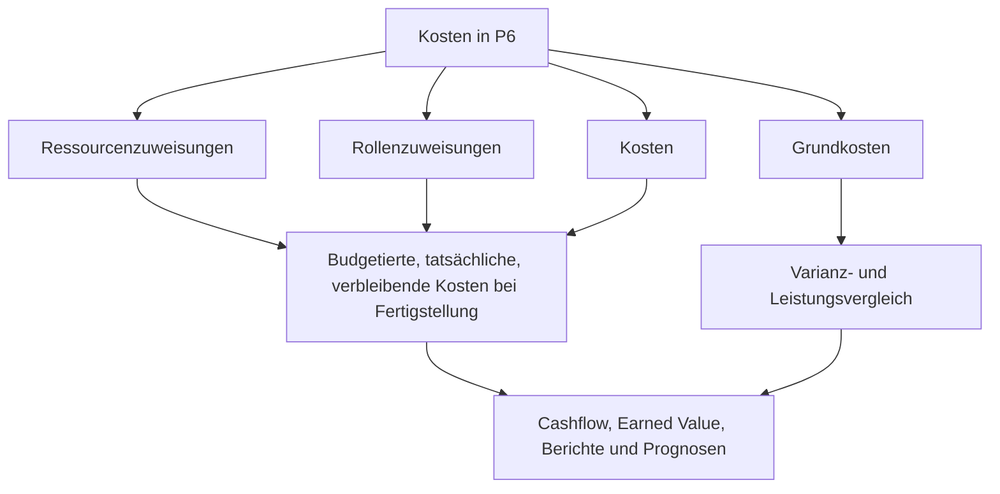

# Wo die Kosten in P6 leben

Kosten in Primavera P6 können an mehreren Orten leben. Das ist nützlich, kann aber auch verwirrend sein. Ein Terminplan kann die budgetierten Kosten, die tatsächlichen Kosten, die verbleibenden Kosten, die Kosten bei Fertigstellung, die Ressourcenkosten, die Rollenkosten, die Ausgabenkosten, die Felder für den Earned Value und die Basiskosten anzeigen. Diese Werte hängen zusammen, bedeuten aber nicht alle dasselbe.

Für Projektkontrollteams ist die Schlüsselfrage nicht nur „Wie hoch sind die Kosten?“ Die bessere Frage ist: Woher kommen diese Kosten, was stellen sie dar und wie sollten sie verwendet werden?

In diesem Blog werden die wichtigsten Kostenarten erläutert, die in P6 verfügbar sind, die Unterschiede zwischen ihnen und wann jede einzelne nützlich ist.

## Warum der Kostenstandort wichtig ist

P6 ist in erster Linie ein Planungstool, kann aber auch kostengeladene Terminpläne, Earned Value-, Cashflow- und Prognoseberichte unterstützen. Um dies richtig zu machen, müssen die Kosten im richtigen Teil des Terminplanmodells platziert werden.

Wenn Arbeitskosten als Aufwand eingegeben werden, erzählen Ressourcenhistogramme möglicherweise nicht die richtige Aussage. Wenn Ist-Kosten manuell eingegeben werden, das Projekt jedoch davon ausgeht, dass sie aus Ist-Daten der Ressourcen stammen, können Berichte inkonsistent werden. Wenn die Basiskosten fehlen, verlieren die Berichte zu Terminabweichungen und Kostenabweichungen ihren Kontext.

Der Standort der Kosten ist wichtig, da die Quelle der Kosten Einfluss darauf hat, wie sie zusammengefasst, aktualisiert, prognostiziert und berichtet werden.

## Ressourcenkosten

Ressourcenkosten ergeben sich aus Ressourcen, die Aktivitäten zugeordnet sind. Eine Ressource kann Arbeitskraft, Ausrüstung oder eine andere Ressourcenkategorie darstellen. Für jede Ressource können Tarife, Einheiten und Kostenberechnungen vorhanden sein.

Wenn für eine Aktivität beispielsweise 80 Stunden lang ein Rohrmonteurteam zu einem definierten Stundensatz eingesetzt wird, kann P6 die Arbeitskosten anhand der zugewiesenen Einheiten und des Tarifs berechnen.

Ressourcenkosten sind nützlich, wenn das Projekt Terminplanaktivitäten mit Arbeits-, Ausrüstungs-, Produktivitäts- und Ressourcenhistogrammen verknüpfen möchte.

Verwenden Sie Ressourcenkosten, wenn:

- Der Arbeits- oder Ausrüstungsbedarf ist von Bedeutung.
- Es werden Ressourcenhistogramme benötigt.
- Die Kosten sind an Stunden oder Einheiten gebunden.
- Der erzielte Wert oder Fortschritt ist ressourcenbasiert.
- Der Terminplan dient der Ressourcenplanung.

Das Hauptrisiko liegt in der Wartung. Ressourcenbelastete Terminpläne erfordern Disziplin. Wenn Einheiten, Tarife, Kalender oder Ist-Werte nicht gepflegt werden, sind die Kostenberichte nicht zuverlässig.

## Rollenkosten

Rollen sind generische Jobfunktionen, wie z. B. Ingenieur, Elektriker, Planer, Prüfer oder Kranführer. In P6 können Rollen Aktivitäten zugewiesen werden, bevor benannte Ressourcen bekannt sind.

Rollenkosten können eine frühzeitige Planung unterstützen, wenn das Team die Art der benötigten Ressource kennt, aber nicht die spezifische Person oder Crew.

Während der frühen technischen Planung kann eine Aktivität beispielsweise 120 Stunden „Senior Engineer“-Zeit erfordern. Die benannte Person ist möglicherweise noch nicht zugewiesen, die Rolle kann jedoch eine Planungsrate und einen Kostenvoranschlag liefern.

Rollenkosten verwenden, wenn:

- Der Terminplan ist noch in Planung.
- Die genannten Ressourcen sind noch nicht bestätigt.
- Das Projekt benötigt eine umfassende Ressourcen- oder Kostenschätzung.
- Rollen werden später durch tatsächliche Ressourcen ersetzt.

Rollenkosten sind für die Planung im Frühstadium nützlich, sollten jedoch im Laufe der Projektreife überprüft werden. Wenn Rollen bestehen bleiben, nachdem die tatsächlichen Ressourcen bekannt sind, wird der Terminplan möglicherweise zu allgemein für eine detaillierte Steuerung.

## Spesenkosten

Ausgaben sind nicht ressourcenbezogene Kosten, die direkt Aktivitäten zugeordnet werden. Sie sind nützlich für Kosten, die nicht optimal durch Arbeits- oder Ausrüstungsressourcen repräsentiert werden.

Beispiele hierfür sind:

- Genehmigungen.
- Reisen.
- Lieferantenpauschalen.
- Pakete für Subunternehmer.
- Materialien, die als feste Menge gekauft werden.
- Prüfungsgebühren.
- Mobilisierungsgebühren.

Je nachdem, wie das Projekt sie verfolgt, können die Ausgaben budgetiert, tatsächlich, verbleibend oder bei Abschluss sein.

Verwenden Sie Ausgaben, wenn:

- Die Kosten hängen nicht von den Ressourcenstunden ab.
- Bei den Kosten handelt es sich um einen Fest- oder Pauschalbetrag.
- Für die Aktivität sind direkte, nicht ressourcenbezogene Kosten erforderlich.
- Das Projekt benötigt einen Cashflow für Nichtarbeitsposten.

Das Risiko besteht darin, dass Ausgaben zur Mülldeponie werden können. Wenn alle Kosten als Ausgaben erfasst werden, kann es sein, dass der Terminplan nicht mehr in der Lage ist, Arbeit, Ausrüstung und Produktivität separat zu erklären.

## Budgetierte Kosten

Die budgetierten Kosten sind die geplanten Kosten, die der Aktivität zugeordnet sind. Es kann aus Ressourcenzuweisungen, Rollenzuweisungen, Ausgaben oder einer Kombination davon stammen.

Die budgetierten Kosten sind wichtig, da sie den Kostenplan vor der Ausführung darstellen. Es unterstützt Cashflow, Basiskosten, Earned-Value-Setup und Projektkontrollberichte.

Verwenden Sie „Budgetierte Kosten“, um die Frage zu beantworten: Wie hoch waren die geplanten Kosten für diese Aktivität?

Wenn die budgetierten Kosten fehlen oder inkonsistent sind, berechnet der Terminplan möglicherweise weiterhin Termine, unterstützt jedoch keine aussagekräftigen kostenbelasteten Berichte.

## Ist-Kosten

Die tatsächlichen Kosten stellen die bereits angefallenen Kosten dar. Abhängig von der Projektkonfiguration können die tatsächlichen Kosten anhand tatsächlicher Ressourceneinheiten und -sätze berechnet, manuell eingegeben, aus Stundenzetteln importiert oder aus einem externen Kostensystem geladen werden.

Die tatsächlichen Kosten sind wichtig für die Fortschrittsberichterstattung und den Earned Value. Es zeigt an, was bisher ausgegeben oder erfasst wurde.

Verwenden Sie die tatsächlichen Kosten, um zu beantworten: Welche Kosten sind bereits angefallen oder erfasst?

Das Risiko besteht darin, Quellen zu vermischen. Wenn einige Ist-Kosten aus der Buchhaltung importiert werden und andere manuell in P6 eingegeben werden, benötigt das Team eine klare Regel, um Doppelarbeit oder Lücken zu vermeiden.

## Verbleibende Kosten

Die verbleibenden Kosten sind die prognostizierten Kosten, die noch zum Abschluss der Aktivität erforderlich sind. Es ist an verbleibende Einheiten, Ressourcensätze, verbleibende Ausgaben und Aktualisierungsannahmen gebunden.

Die Restkosten sind eines der wichtigsten Prognosefelder. Es teilt dem Projektteam mit, wie viel Kosten ab dem aktuellen Datenstichtag verbleiben.

Verwenden Sie „Verbleibende Kosten“, um die Frage zu beantworten: Wie hoch sind die noch zu erwartenden Kosten?

Wenn die verbleibende Dauer aktualisiert wird, die verbleibenden Kosten jedoch nicht, kann die Prognose inkonsistent werden. Das Gleiche gilt, wenn Ressourceneinheiten oder verbleibende Ausgabenwerte nicht gepflegt werden.

## Bei Fertigstellungskosten

Bei den Fertigstellungskosten handelt es sich um die erwarteten Gesamtkosten der Aktivität nach Kombination der tatsächlichen und verbleibenden Kosten.

In einfachen Worten:

Ist-Kosten + Restkosten = Kosten bei Fertigstellung

Mithilfe der Kosten bei Fertigstellung können Sie erkennen, ob eine Aktivität voraussichtlich über, unter oder im Rahmen des Budgets abgeschlossen wird.

Verwenden Sie „Kosten bei Fertigstellung“, um die Frage zu beantworten: Wie hoch sind die zuletzt erwarteten Gesamtkosten?

## Grundkosten

Die Basiskosten stammen aus einem zugewiesenen Basisplan. Es wird verwendet, um aktuelle Kostenwerte mit dem genehmigten Plan zu vergleichen.

Die Basiskosten sind wichtig für die Abweichungsberichterstattung. Ohne einen Basisplan kennt das Projekt möglicherweise die aktuellen prognostizierten Kosten, weiß jedoch nicht, ob diese Prognose besser oder schlechter als der genehmigte Plan ist.

Verwenden Sie die Basiskosten, um die Frage zu beantworten: Wie sind die aktuellen Kosten im Vergleich zum genehmigten Kostenplan?

Die Basiskosten sind besonders wichtig, wenn P6 für den Earned Value oder die formelle PMO-Berichterstattung verwendet wird.

## Felder für Earned Valuekosten

P6 kann je nach Projekteinrichtung Earned Valuefelder wie Planwert, Earned Value, Ist-Kosten, Kostenabweichung und Terminplanabweichung unterstützen.

Der Arbeitswert nutzt kostenbelastete Terminplaninformationen, um geplante Arbeit, verdiente Arbeit und Ist-Kosten zu vergleichen.

Diese Felder sind nützlich, wenn das Projekt über einen formellen Earned-Value-Prozess verfügt. Sie erfordern konsistente Basisplans, Fortschrittsregeln, Methoden für den Fertigstellungsgrad und Kostenbelastung.

Verwenden Sie Earned Value-Kostenfelder, wenn:

- Das Projekt erfordert eine EV-Berichterstattung.
- Fortschrittsregeln werden definiert.
- Die Grundkosten werden genehmigt.
- Die Ist-Kostenquelle wird kontrolliert.
- Der Aktivitätsfortschritt wird konstant beibehalten.

Ohne diese Kontrollen können die Ergebnisse des Earned Values zwar präzise aussehen, aber unzuverlässig sein.

## Welche Kostenart sollten Sie verwenden?

Verwenden Sie Ressourcenkosten für Arbeitskräfte und Ausrüstung, die Ressourcenplanung, Produktivität und Histogramme unterstützen sollen.

Nutzen Sie Rollenkosten für eine frühzeitige Planung, wenn benannte Ressourcen noch nicht bekannt sind.

Verwenden Sie Spesenkosten für direkte Nichtressourcenkosten, Pauschalbeträge, Lieferantenartikel, Genehmigungen, Reisen oder Unterauftragspakete.

Verwenden Sie die Felder „Budgetierte Kosten“, „Istkosten“, „Restkosten“ und „Bei Fertigstellung“, um den zeitlichen Kostenlebenszyklus zu verstehen.

Vergleichen Sie die Basiskosten mit dem genehmigten Plan.

Verwenden Sie Earned Valuefelder, wenn das Projekt über die erforderliche Governance verfügt, um EV-Berichte zu unterstützen.

## Häufige Probleme

Ein häufiges Problem ist die Kostendoppelung. Die gleichen Subunternehmerkosten können als Ressourcenkosten und erneut als Aufwand eingegeben werden.

Ein weiteres Problem sind fehlende Ist-Kosten. Der Terminplan enthält möglicherweise ein Budget und verbleibende Kosten, die tatsächlichen Kosten können jedoch in einem separaten Buchhaltungssystem gespeichert sein und niemals P6 erreichen.

Ein drittes Problem besteht darin, die Ausgaben für alles zu verwenden. Dies kann zwar zu Gesamtkosten, aber zu einer schwachen Ressourcentransparenz führen.

Ein weiteres Problem ist der inkonsistente Fortschritt. Wenn der Fertigstellungsgrad, die verbleibende Dauer und die verbleibenden Kosten nicht übereinstimmen, werden die Kosten bei Fertigstellung unzuverlässig.

## Gute Praxis

Definieren Sie die Kostenstrategie, bevor Sie den Terminplan laden. Entscheiden Sie, wo Arbeitskräfte, Ausrüstung, Materialien, Subunternehmer und indirekte Kosten untergebracht werden sollen.

Verwenden Sie konsistente Kostenkonten, Aktivitätscodes, Ressourcen, Rollen und Ausgabenkategorien.

Dokumentieren Sie, ob Ist-Kosten in P6 eingegeben, importiert oder aus einem anderen System gemeldet werden.

Überprüfen Sie die Kostenfelder während jedes Aktualisierungszyklus. Budgetierte, tatsächliche, verbleibende und bei Fertigstellung anfallende Kosten sollten eine zusammenhängende Geschichte erzählen.

## Abschluss

Die Kosten in P6 können in Ressourcen-, Rollen-, Ausgaben-, Basisplan- und Earned-Value-Feldern enthalten sein. Jeder Ort hat einen anderen Zweck.

Ressourcenkosten verbinden Kosten mit Arbeit und Ausrüstung. Rollenkosten unterstützen eine frühzeitige Planung. Spesenkosten erfassen direkte Posten, die keine Ressourcen sind. Budgetierte, tatsächliche, verbleibende und Fertigstellungskosten zeigen den Kostenlebenszyklus. Basisplan- und Earned-Value-Felder unterstützen Vergleiche und Leistungsberichte.

Ein stark kostenintensiver Terminplan entsteht nicht dadurch, dass man die Zahlen überall hinbringt, wo sie hinpassen. Der Aufbau erfolgt durch die Entscheidung, wo die einzelnen Kostenarten hingehören, und durch die Beibehaltung dieser Struktur in jedem Aktualisierungszyklus.
## Verwandte Inhalte
- [Aktivitäten, die am Datenstichtag ohne steuernde Logik beginnen: Warum diese Terminplanmetrik wichtig ist - Überblick](../../metrics/01_activities_starting_in_dd_with_no_logic_driving/02_guide_template.md)
- [Prozent vollständige Typen in P6](../10_PERCENT%20COMPLETION%20TYPES%20IN%20P6/10_PERCENT%20COMPLETION%20TYPES%20IN%20P6.md)
- [Ressourcentypen in P6](../12_RESOURCE%20TYPES%20IN%20P6/12_RESOURCE%20TYPES%20IN%20P6.md)
