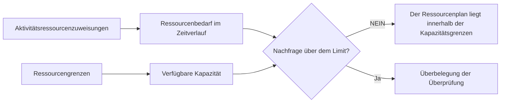

# Ressourcengrenzen in P6

Ressourcenlimits in Primavera P6 definieren, wie viel einer Ressource während eines Zeitraums verfügbar ist. Sie werden verwendet, um den durch Aktivitätszuweisungen verursachten Ressourcenbedarf mit der Kapazität zu vergleichen, über die das Projekt tatsächlich verfügt.

Vereinfacht ausgedrückt beantwortet ein Ressourcenlimit die Frage: Wie viel dieser Ressource kann das Projekt nutzen?

Wenn ein Terminplan vorsieht, dass eine Mannschaft an fünf Tätigkeiten gleichzeitig arbeiten muss, kann P6 den Bedarf anzeigen. Ohne eine Ressourcenbegrenzung kann der Terminplan jedoch nicht eindeutig zeigen, ob dieser Bedarf realistisch ist. Das Limit ermöglicht es dem Planer, Überlastungen, Kapazitätsprobleme und mögliche ressourcenbedingte Terminplanprobleme zu erkennen.

## Was sind Ressourcengrenzen?

Ein Ressourcenlimit ist die maximale Verfügbarkeit einer Ressource. Sie kann als Einheiten pro Zeitraum definiert werden, beispielsweise als Stunden pro Tag, Stunden pro Woche oder als Anzahl der während eines Arbeitszeitraums verfügbaren Einheiten.

Zum Beispiel:

- Ein Planer steht 8 Stunden pro Tag zur Verfügung.
- Drei Elektriker stehen Ihnen rund um die Uhr zur Verfügung.
- Ein Kran steht 8 Gerätestunden pro Tag zur Verfügung.
- Zwei Inspektoren stehen 16 Arbeitsstunden pro Tag zur Verfügung.

Wenn Aktivitäten ressourcenbelastet sind, berechnet P6 den durch diese Zuweisungen verursachten Ressourcenbedarf. Das Ressourcenlimit stellt die Kapazitätslinie dar, mit der der Bedarf verglichen wird.

## Warum Ressourcengrenzen wichtig sind

Ressourcengrenzen sind wichtig, da Terminpläne oft technisch möglich, aber praktisch unmöglich sind.

Ein logisches Netzwerk kann berechnen, dass mehrere Aktivitäten parallel stattfinden können. Die Daten sehen möglicherweise akzeptabel aus. Der kritische Pfad mag vernünftig erscheinen. Wenn jedoch für alle diese Aktivitäten die gleiche begrenzte Anzahl an Besatzungsmitgliedern, Spezialisten oder Ausrüstungen erforderlich ist, ist der Plan möglicherweise nicht durchführbar.

Ressourcengrenzen helfen dabei, den Unterschied zwischen einem berechneten Terminplan und einem lieferbaren Terminplan aufzuzeigen.

Sie sind nützlich für:

- Identifizierung überlasteter Arbeitskräfte.
- Überprüfung der Ausrüstungsnachfrage.
- Unterstützende Ressourcenhistogramme.
- Überprüfung von Personalplänen.
- Vorbereitung der Ressourcennivellierung.
- Erklären, warum manche Arbeiten nicht beginnen können, selbst wenn die Logik dies zulässt.
- Testen, ob der Plan mit der verfügbaren Kapazität übereinstimmt.

Bei der Projektsteuerung ist dies besonders wertvoll, wenn der Terminplan für die Personalbesetzung, Beschaffungsunterstützung, Bauplanung oder Earned Valueberichterstattung verwendet wird.

## Grenzen der Arbeitsressourcen

Arbeitsgrenzen legen fest, wie viele Personen oder Arbeitsstunden zur Verfügung stehen.

Wenn das Projekt beispielsweise 10 Elektriker umfasst, die 8 Stunden pro Tag arbeiten, kann die tägliche Arbeitsgrenze 80 Stunden pro Tag betragen. Wenn der Terminplanbedarf am selben Tag 120 Elektrikerstunden anzeigt, sind im Terminplan mehr Elektriker erforderlich, als für das Projekt vorgesehen sind.

Dies bedeutet nicht automatisch, dass der Terminplan falsch ist. Das bedeutet, dass der Planer den Plan überprüfen muss. Die Lösung kann darin bestehen, Teams hinzuzufügen, die Reihenfolge zu ändern, unkritische Arbeit zu verschieben, Überstunden zu machen oder eine vorübergehende Spitzenlast zu akzeptieren, wenn dies realistisch und genehmigt ist.

Begrenzungen der Arbeitsressourcen sind nützlich, wenn die Verfügbarkeit von Arbeitskräften eine echte Einschränkung darstellt. Sie sind weniger nützlich, wenn der Terminplan nicht auf dem Detaillierungsgrad gehalten wird, der zur Unterstützung der Ressourcenkontrolle erforderlich ist.

## Grenzwerte für Nichtarbeitsressourcen

Für Geräte und andere wiederverwendbare Vermögenswerte gelten Grenzwerte für die Nichtarbeit.

Beispiele hierfür sind Kräne, Bagger, Prüfgeräte, Spezialwerkzeuge, Generatoren oder temporäre Einrichtungen. Wenn nur ein Kran verfügbar ist, können Tätigkeiten, die denselben Kran erfordern, nicht alle gleichzeitig ausgeführt werden, es sei denn, ein weiterer Kran wird hinzugefügt oder die Arbeit wird neu angeordnet.

Hier können Ressourcenbeschränkungen sehr praktisch sein. Ausrüstung stellt oft ein echtes Hindernis dar, insbesondere wenn sie teuer ist, von mehreren Bereichen gemeinsam genutzt wird, schwer zu mobilisieren ist oder für kritische Arbeiten benötigt wird.

Beispielsweise können zwei schwere Hebevorgänge logischerweise beide bereit sein. Wenn jedoch beide denselben Kran benötigen, kann das Ressourcenlimit zeigen, dass der Plan die verfügbare Kapazität überschreitet.

## Materielle Ressourcen und Grenzen

Materielle Ressourcen verhalten sich anders als Arbeits- und Nichtarbeitsressourcen. Sie stellen in der Regel Mengen dar, nicht die tägliche Verfügbarkeit der Arbeitszeit.

Eine Materialzuordnung kann das geplante Betonvolumen, die Kabellänge, die Stahltonnage oder die installierte Menge anzeigen. Das Projekt unterliegt möglicherweise immer noch Materialbeschränkungen, diese werden jedoch häufig über Beschaffungstermine, Liefermeilensteine, Bestandsverfolgung oder Einschränkungen im Terminplan verwaltet und nicht über die gleiche Art von täglicher Ressourcenverfügbarkeitsgrenze, die für Personen oder Geräte verwendet wird.

Das bedeutet nicht, dass Materialien unwichtig sind. Das bedeutet, dass der Planer sorgfältig darauf achten sollte, was der Grenzwert darstellen soll.

Wenn es um die Produktionskapazität geht, beispielsweise um die maximale Anzahl an Kubikmetern Beton, die pro Tag eingebracht werden können, kann ein Ressourcen- oder Produktionsmodell hilfreich sein. Wenn es um die Frage geht, ob das Material angekommen ist, sind möglicherweise logische Zusammenhänge oder Beschaffungsmeilensteine ​​klarer.

## Wie P6 Grenzen nutzt

P6 kann Ressourcengrenzen in Ressourcenprofilen, Tabellenkalkulationen, Histogrammen und Ressourcenanalysen verwenden. Der Bedarf aus Leistungszuordnungen kann gegen das verfügbare Limit ausgewiesen werden.

Wenn der Ressourcenabgleich verwendet wird, kann P6 abhängig von den Abgleichseinstellungen auch die Ressourcenverfügbarkeit nutzen, um Aktivitäten zu verzögern, damit die Nachfrage innerhalb der Grenzen bleibt.

Das ist mächtig, muss aber vorsichtig gehandhabt werden. Der Ressourcenabgleich kann Prognosedaten ändern. Wenn die Grenzwerte, Kalender, Prioritäten und Aktivitätslogik nicht gut eingehalten werden, sieht das abgeglichene Ergebnis möglicherweise mathematisch, aber nicht praktisch aus.

Ressourcenlimits sollten daher Teil eines kontrollierten Planungsprozesses sein und nicht ein Knopfdruck am Ende einer Aktualisierung.

## Wann sollten Ressourcenlimits verwendet werden?

Verwenden Sie Ressourcenlimits, wenn die Ressourcen tatsächlich begrenzt sind und der Terminplan über ausreichend Ressourcen verfügt, um die Analyse zu unterstützen.

Zu den guten Anwendungsfällen gehören:

- Ein Projekt mit einer festen Anzahl von Crews.
- Gemeinsame Kräne oder Spezialausrüstung.
- Begrenzte Engineering- oder Inbetriebnahmespezialisten.
- Abschaltungen, Turnarounds und Ausfälle.
- Baupläne, bei denen Arbeitskräftespitzen kontrolliert werden müssen.
- Programme, bei denen derselbe Ressourcenpool mehrere Projekte unterstützt.

Ressourcengrenzen sind auch bei Was-wäre-wenn-Analysen nützlich. Der Planer kann testen, ob der aktuelle Plan mit der verfügbaren Kapazität funktioniert oder ob zusätzliche Mannschaften, Überstunden oder Umplanungen erforderlich sind.

## Wann ist Vorsicht geboten?

Seien Sie vorsichtig, wenn die Ressourcendaten unvollständig oder symbolisch sind.

Wenn Ressourcen nur zur Kostenbelastung hinzugefügt wurden, stellen die Einheiten möglicherweise nicht die tatsächliche Verfügbarkeit dar. Wenn die gesamte Arbeit generischen Ressourcen zugewiesen ist, ist das Histogramm möglicherweise zu breit, um echte Entscheidungen zu unterstützen. Wenn die tatsächlichen Einheiten nicht aktualisiert werden, kann es passieren, dass der Ressourcenplan schnell von der Realität abweicht.

Seien Sie auch vorsichtig mit künstlichen Grenzen. Ein zu niedriger Grenzwert kann zu unnötigen Verzögerungen beim Nivellieren führen. Ein zu hoher Grenzwert kann echte Kapazitätsprobleme verbergen.

Der Grenzwert sollte mit der tatsächlichen Planungsfrage übereinstimmen. Testen wir die tatsächliche Verfügbarkeit der Besatzung, die budgetierte Personalausstattung, den Zugang zur Ausrüstung oder ein Managementziel? Für jeden ist möglicherweise ein anderes Setup erforderlich.

## Häufige Fehler

Ein häufiger Fehler besteht darin, Ressourcengrenzen festzulegen, ohne deren Bedeutung zuzustimmen. Eine Ressource kann 80 Stunden pro Tag anzeigen. Handelt es sich dabei jedoch um die aktuelle Belegschaft, die maximale Belegschaft, die budgetierte Belegschaft oder die vom Auftragnehmer zugesagte Belegschaft?

Ein weiterer Fehler besteht darin, Nivellierungsergebnisse zu verwenden, ohne sie zu überprüfen. P6 kann Aktivitäten auf der Grundlage von Ressourcenregeln verschieben, der Planer muss jedoch dennoch prüfen, ob das Ergebnis für die Konstruktion sinnvoll ist.

Ein weiteres Problem ist das Ignorieren von Kalendern. Ein Ressourcenlimit ist an die Verfügbarkeit gebunden und die Verfügbarkeit hängt von der Arbeitszeit ab. Wenn der Ressourcenkalender nicht mit dem tatsächlichen Arbeitsmuster übereinstimmt, kann das Limit zu irreführenden Überlastungen oder falschen Verfügbarkeiten führen.

Es kommt auch häufig vor, dass Ressourcen überlastet werden und das Histogramm so akzeptiert wird, als wäre es nur ein Bericht. Eine Überlastung ist ein Planungssignal. Es sollte eine Überprüfung auslösen und nicht einfach ignoriert werden.

## Gute Praxis

Beginnen Sie mit den Ressourcen, die am wichtigsten sind. Nicht jede Ressource benötigt ein detailliertes Limit. Konzentrieren Sie sich auf kritische Teams, knappe Ausrüstung, wichtige Spezialisten und Ressourcen, die sich auf den Projektabschluss oder wichtige Meilensteine ​​auswirken.

Legen Sie fest, ob der Grenzwert die normale Kapazität, die maximale Kapazität oder die genehmigte Spitzenkapazität darstellt. Halten Sie diese Definition konsistent.

Überprüfen Sie Ressourcenprofile während der Terminplanaktualisierungen. Wenn sich die Prognose ändert, ändert sich auch der Ressourcenbedarf. Die Grenzwerte sollten zusammen mit der Logik, den Kalendern, der verbleibenden Dauer und dem Fortschritt überprüft werden.

Gehen Sie beim Ressourcenausgleich sorgfältig vor und dokumentieren Sie die Einstellungen. Vergleichen Sie das ausgeglichene Ergebnis mit dem nicht ausgeglichenen Terminplan, damit das Team versteht, was sich geändert hat und warum.

Am wichtigsten ist, dass Sie die Ausgabe mit den Personen validieren, die die Arbeit ausführen. Ein Histogramm ist nur dann sinnvoll, wenn es einen echten Ressourcenplan widerspiegelt.

## Abschluss

Ressourcenlimits in P6 definieren die verfügbare Kapazität. Sie ermöglichen es dem Projektteam, die Anforderungen des Terminplans mit dem zu vergleichen, was das Projekt realistischerweise leisten kann.

Bei richtiger Nutzung helfen Ressourcengrenzen dabei, Überlastungen zu erkennen, die Personalplanung zu unterstützen, den Gerätebedarf zu kontrollieren und den Terminplan realistischer zu gestalten. Bei unsachgemäßer Verwendung können sie zu irreführenden Histogrammen oder künstlichen Nivellierungsergebnissen führen.

Die besten Ressourcengrenzen sind einfach, bewusst und mit realen Projektentscheidungen verknüpft. Sie helfen bei der Beantwortung einer praktischen Frage: Kann das Projekt diesen Plan mit den tatsächlich vorhandenen Ressourcen umsetzen?
## Verwandte Inhalte
- [Aktivitäten begannen mit 0 % Fortschritt in Primavera P6 - Überblick](../../09_metrics_de/13_activity_started_progress_zero/01_overview_template.md)
- [Ressourcentypen in P6](../12_RESOURCE%20TYPES%20IN%20P6/12_RESOURCE%20TYPES%20IN%20P6.md)
- [Ressourcenausgleich in P6](../14_RESOURCES%20BALANCING%20IN%20P6/14_RESOURCES%20BALANCING%20IN%20P6.md)
