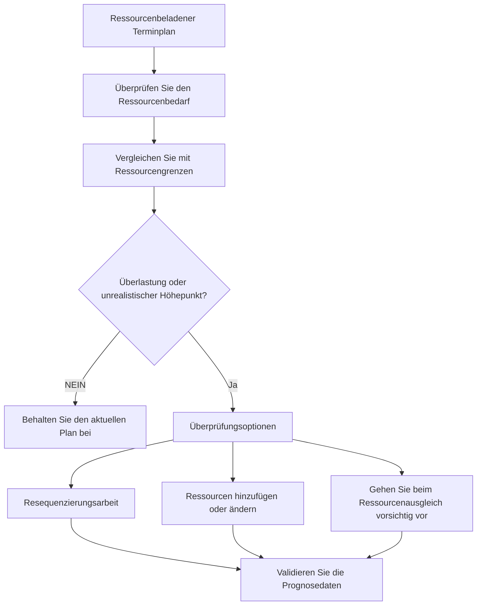

# Ressourcenausgleich in P6

Beim Ressourcenausgleich in Primavera P6 wird der Ressourcenbedarf anhand der verfügbaren Kapazität überprüft und der Plan so angepasst, dass die Arbeit mit den verfügbaren Ressourcen ausgeführt werden kann. Es hilft dem Projektteam zu verstehen, ob der Terminplan nur logisch korrekt oder auch aus Ressourcensicht sinnvoll ist.

Bei der täglichen Planung werden die Begriffe „Ressourcenausgleich“ und „Ressourcennivellierung“ häufig verwendet, als ob sie dasselbe bedeuten würden. Sie hängen zusammen, sind aber nicht genau gleich.

Der Ressourcenausgleich ist die umfassendere Planungsüberprüfung. Dazu gehört die Betrachtung von Histogrammen, Ressourcenprofilen, Besatzungsverfügbarkeit, Ausrüstungsbedarf, Personalspitzen und der Realitätsnähe des Plans.

Die Ressourcennivellierung ist eine P6-Funktion, mit der Aktivitäten basierend auf der Ressourcenverfügbarkeit und den Nivellierungseinstellungen verschoben werden können.

Die Funktion kann nützlich sein, sollte aber kontrolliert genutzt werden. P6 kann ein ausgeglichenes Ergebnis berechnen, aber der Planer muss entscheiden, ob dieses Ergebnis für das Projekt sinnvoll ist.

## Was ist Ressourcenausgleich?

Beim Ressourcenausgleich stellt sich eine praktische Frage: Kann das Projekt diesen Terminplan mit den tatsächlich vorhandenen Ressourcen umsetzen?

Ein Terminplan kann eine gute Logik, akzeptable Termine und einen angemessenen kritischen Pfad aufweisen. Wenn jedoch dieselbe begrenzte Mannschaft oder Ausrüstung erforderlich ist, um an zu vielen Orten gleichzeitig zu arbeiten, ist der Plan möglicherweise nicht realistisch.

Um die Ressourcen auszubalancieren, muss der Bedarf überprüft und entschieden werden, wie er verwaltet werden soll.

Zu den möglichen Aktionen gehören:

- Verschieben unkritischer Arbeiten.
- Ressourcen hinzufügen.
- Aufteilen der Arbeit in verschiedene Teams oder Bereiche.
- Ändern der Aktivitätssequenz.
- Überstunden oder Schichtarbeit nutzen.
- Kalender anpassen.
- Ressourcenlimits werden aktualisiert.
- Akzeptieren Sie einen vorübergehenden Höhepunkt, wenn dieser realistisch und genehmigt ist.

Das Ziel besteht nicht darin, das Histogramm vollkommen flach zu machen. Echte Projekte haben Höhen und Tiefen. Das Ziel besteht darin, sicherzustellen, dass der Ressourcenbedarf verstanden, erreichbar und mit dem Ausführungsplan in Einklang gebracht wird.

## Warum es wichtig ist

Der Ressourcenausgleich ist wichtig, da der Terminplan die Ausführung und nicht nur die Berechnung unterstützen soll.

Wenn der Plan nächste Woche 50 Schweißer vorsieht, der Auftragnehmer jedoch nur 30 bereitstellen kann, zeigt der Terminplan einen Bedarf an, der nicht gedeckt werden kann. Wenn zwei kritische Tätigkeiten gleichzeitig denselben Kran erfordern, muss möglicherweise mindestens einer von ihnen umziehen. Wenn für alle technischen Überprüfungsaktivitäten derselbe Spezialist erforderlich ist, kann der Engpass bereits vor Baubeginn auftreten.

Ohne Ressourcenausgleich könnte das Projekt glauben, es verfüge über mehr Kapazität, als es tatsächlich hat.

Dies kann Auswirkungen haben auf:

- Kurzfristige Vorausplanung.
- Personalprognosen.
- Ausrüstungsplanung.
- Glaubwürdigkeit des kritischen Pfades.
- Earned-Value-Prognosen.
- Kosten- und Cashflow-Kurven.
- Fortschrittsverpflichtungen.
- Wiederherstellungspläne.

Der Ressourcenausgleich hilft dabei, den CPM-Terminplan mit der tatsächlichen Außendienst- und Bürokapazität zu verbinden.

## Ressourcenausgleich vs. Ressourcennivellierung

Der Ressourcenausgleich ist eine Management- und Planungsaktivität.

Der Ressourcenabgleich ist eine Planungsberechnung.

Diese Unterscheidung ist wichtig. Ein Planer kann die Ressourcen manuell ausgleichen, indem er Histogramme überprüft und den Terminplan basierend auf Projektkenntnissen anpasst. Der P6-Ressourcenabgleich kann auch hilfreich sein, indem Aktivitäten automatisch verzögert werden, wenn der Ressourcenbedarf die Verfügbarkeit übersteigt.

Beide Ansätze können nützlich sein.

Der manuelle Ausgleich ist besser, wenn der Planer Urteilsvermögen, Eingaben vor Ort, eine Überprüfung der Konstruierbarkeit oder eine sorgfältige Kontrolle darüber benötigt, welche Aktivitäten verschoben werden.

Der P6-Ressourcenabgleich ist nützlich, wenn die Ressourcendaten zuverlässig sind, Ressourcengrenzen definiert sind, Kalender korrekt sind und der Planer testen möchte, wie sich der Terminplan ändert, wenn die Ressourcenverfügbarkeit erzwungen wird.

Eine Nivellierung sollte keine Planungsbeurteilung ersetzen. Es sollte es unterstützen.

## Was P6 vor dem Leveln braucht

Bevor Sie die P6-Ressourcennivellierungsfunktion verwenden, sollte der Terminplan für die Ressourcenanalyse bereit sein.

Überprüfen Sie mindestens Folgendes:

- Aktivitäten verfügen über sinnvolle Ressourcenzuweisungen.
- Ressourceneinheiten spiegeln die tatsächliche Nachfrage wider.
- Ressourcengrenzen spiegeln die tatsächliche Verfügbarkeit wider.
- Ressourcenkalender sind korrekt.
- Aktivitätskalender sind korrekt.
- Die Logik ist umfassend genug, um Planungsentscheidungen zu unterstützen.
- Einschränkungen werden verstanden.
- Prioritäten werden definiert oder überprüft.
- Der aktuelle Terminplan wurde gespeichert, sodass das Nivellierungsergebnis verglichen werden kann.

Wenn diese Elemente schwach sind, führt die Nivellierung möglicherweise zu einem Ergebnis, das präzise aussieht, aber nicht nützlich ist.

Wenn beispielsweise die gesamte Bauarbeit einer generischen Ressource „Bauteam“ zugewiesen ist, zeigt P6 möglicherweise eine Ressourcenüberlastung an, das Ergebnis sagt dem Projekt jedoch möglicherweise nicht, ob es sich um ein Bau-, Rohrleitungs-, Elektro- oder Mechanikproblem handelt. Die Ressourceneinrichtung muss mit der Planungsentscheidung übereinstimmen.

## Wie P6 die Ressourcennivellierung nutzt

Beim P6-Ressourcennivellierung werden Ressourcenzuweisungen und -verfügbarkeit überprüft. Abhängig von den Einstellungen können Aktivitäten verzögert werden, um die Überbelegung von Ressourcen zu reduzieren oder zu beseitigen.

Bei der Berechnung können Ressourcengrenzen, Aktivitätslogik, Puffer, Kalender, Prioritäten und Nivellierungsoptionen berücksichtigt werden. Das genaue Ergebnis hängt von der Projektkonfiguration ab.

In der Praxis sucht P6 nach Situationen, in denen der Ressourcenbedarf höher ist als die Verfügbarkeit, und versucht dann, Aktivitäten auf Termine zu verschieben, an denen die Ressourcen verfügbar sind.

Dies kann zu einem ressourcenschonenderen Terminplan führen, kann aber auch den kritischen Pfad ändern, Meilensteine ​​verzögern oder die Arbeit auf eine Weise verschieben, die einer Überprüfung bedarf.

Nach der Nivellierung sollte der Planer das Ergebnis mit der ursprünglichen Prognose vergleichen:

- Welche Aktivitäten sind umgezogen?
- Welche Meilensteine ​​haben sich geändert?
- Hat sich der kritische Pfad geändert?
- Hat die Nivellierung den verfügbaren Schwimmer beansprucht oder den Projektabschluss verzögert?
- Sind die neuen Termine realisierbar?
- Hat das Ergebnis das Ressourcenproblem gelöst oder ein neues geschaffen?

Der abgestufte Terminplan sollte nicht blind akzeptiert werden.

## Wann sollte der Ressourcenausgleich verwendet werden?

Verwenden Sie den Ressourcenausgleich immer dann, wenn die Ressourcenverfügbarkeit die Ausführung beeinflusst.

Es ist besonders nützlich bei:

- BauTerminpläne mit Personalbeschränkungen.
- Abschaltungen, Turnarounds und Ausfälle.
- Inbetriebnahmepläne mit begrenzten Spezialisten.
- Technische Terminpläne mit gemeinsamen Prüfern.
- Projekte mit teurer oder gemeinsam genutzter Ausrüstung.
- Programme, bei denen ein Ressourcenpool mehrere Projekte unterstützt.
- Wiederherstellungspläne, bei denen zusätzliche Ressourcen in Betracht gezogen werden.

Der Ressourcenausgleich ist auch vor des Basisplans-Genehmigung nützlich. Eine Ausgangslage, die eine unrealistische Personal- oder Ausrüstungsverfügbarkeit voraussetzt, könnte sich später als schwer zu verteidigen erweisen.

Bei Aktualisierungen hilft der Ressourcenausgleich dabei, zu bestätigen, ob die verbleibende Arbeit noch mit dem aktuellen Team und der aktuellen Ausrüstung erledigt werden kann.

## Wann ist Vorsicht geboten?

Seien Sie vorsichtig, wenn Ressourcendaten nicht gepflegt werden.

Wenn die tatsächlichen Einheiten nicht aktualisiert werden, weichen die Ressourcenkurven möglicherweise von der Realität ab. Wenn Ressourcen nur zur Kostenbelastung zugewiesen werden, stellen die Einheiten möglicherweise nicht die tatsächliche Kapazität dar. Wenn die Kalender falsch sind, ist möglicherweise auch die Ressourcenverfügbarkeit falsch.

Seien Sie auch vorsichtig, wenn Sie den Ressourcenabgleich im Rahmen eines Vertrags- odes Basisplanss verwenden. Durch die Nivellierung können Termine verschoben und der Puffer beeinflusst werden. Das Team sollte verstehen, ob es sich bei dem abgestuften Terminplan um den offiziellen Plan, ein Was-wäre-wenn-Szenario oder eine interne Planungsansicht handelt.

Leveling kann auch logische Schwächen verbergen. Wenn eine Aktivität aufgrund der Nivellierung verschoben wird, übersehen die Prüfer möglicherweise, dass die ursprüngliche Logik unvollständig oder falsch war. Überprüfen Sie immer zuerst die Logik und dann die Ressourcen.

## Wie man es in der Praxis nutzt

Beginnen Sie damit, die Ressourcen zu identifizieren, die am wichtigsten sind. Versuchen Sie nicht, jede kleinere Ressource mit dem gleichen Detaillierungsgrad auszubalancieren. Konzentrieren Sie sich auf wichtige Teams, wichtige Spezialisten, gemeinsam genutzte Ausrüstung und Ressourcen, die sich auf Meilensteine ​​auswirken könnten.

Überprüfen Sie dann das Ressourcenprofil oder Histogramm in P6. Suchen Sie nach Spitzen, Überlastungen, Lücken und plötzlichen Nachfrageänderungen.

Vergleichen Sie die Nachfrage mit den Ressourcengrenzen. Wenn die Nachfrage das Limit überschreitet, besprechen Sie das Problem mit dem zuständigen Team. Die Antwort könnte operativer Natur sein und nicht nur die Planung.

Als nächstes legen Sie die Korrekturmethode fest:

- Wenn das Ressourcenlimit falsch ist, aktualisieren Sie das Ressourcenlimit.
- Wenn der Ressourcenbedarf falsch ist, korrigieren Sie die Zuordnung.
- Wenn die Reihenfolge unrealistisch ist, passen Sie die Logik oder das Aktivitäts-Timing an.
- Wenn die Überlastung real ist, entscheiden Sie, ob Sie Ressourcen hinzufügen, Überstunden machen, Arbeit verlagern oder die Spitze akzeptieren möchten.
- Wenn eine automatisierte Nivellierung angemessen ist, führen Sie sie als kontrolliertes Szenario aus und vergleichen Sie das Ergebnis.

Bewahren Sie eine Kopie des nicht abgeglichenen Terminplans auf, bevor Sie den Ressourcenabgleich durchführen. Dies gibt dem Team einen Anhaltspunkt und hilft zu erklären, was sich geändert hat.

## Gute Praxis

Nutzen Sie den Ressourcenausgleich als Teil der Terminplanprüfung und nicht als einmalige Aufräumaktion.

Überprüfen Sie die Ressourcenkurven während der Basisentwicklung, größeren Neuprognosen, der Wiederherstellungsplanung und regelmäßigen Aktualisierungszyklen.

Erstellen Sie keinen Terminplan mit schlechter Qualität und erwarten Sie, dass das Ergebnis zuverlässig wird. Zuerst Logik, Kalender, Aktivitätsstatus, verbleibende Dauer und Ressourcenzuweisungen korrigieren.

Einstellungen für die Dokumentnivellierung bei Verwendung der P6-Funktion. Der Ressourcenabgleich kann je nach den ausgewählten Optionen zu unterschiedlichen Ergebnissen führen, daher sind die Einstellungen Teil des Terminplandatensatzes.

Am wichtigsten ist, dass Sie den Ressourcenplan mit den Personen validieren, denen die Arbeit gehört. Das Projektteam sollte prüfen, ob die Ressourcenspitzen erreichbar sind, ob die Reihenfolge sinnvoll ist und ob tatsächlich zusätzliche Ressourcen verfügbar sind.

## Abschluss

Der Ressourcenausgleich in P6 hilft dem Projektteam zu testen, ob der Terminplan mit den verfügbaren Ressourcen ausgeführt werden kann. Es verbindet Daten und Logik mit Arbeitskräften, Ausrüstung, Fachkräfteverfügbarkeit und tatsächlicher Produktionskapazität.

Der P6-Ressourcenabgleich kann diese Überprüfung unterstützen, indem Aktivitäten basierend auf der Ressourcenverfügbarkeit verschoben werden. Er sollte jedoch sorgfältig verwendet und nach der Berechnung überprüft werden.

Ein ausgewogener Terminplan ist nicht unbedingt ein vollkommen reibungsloser Terminplan. Es handelt sich um einen Terminplan, bei dem der Ressourcenbedarf sichtbar, realistisch und auf die Art und Weise abgestimmt ist, wie das Projekt tatsächlich umgesetzt wird.
## Verwandte Inhalte
- [Aktivitäten begannen mit 0 % Fortschritt in Primavera P6 - Überblick](../../09_metrics_de/13_activity_started_progress_zero/01_overview_template.md)
- [Ressourcengrenzen in P6](../13_RESOURCES%20LIMITS%20IN%20P6/13_RESOURCES%20LIMITS%20IN%20P6.md)
- [SS- und FF-Beziehungen](../15_SS%20&%20FF%20RELATIONS/15_SS%20&%20FF%20RELATIONS.md)
