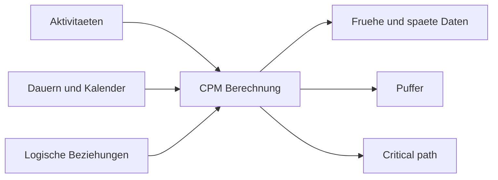

Die Critical Path Method, oder CPM, ist die Berechnungsmethode hinter einem ernsthaften Projektterminplan. Sie verwandelt eine Liste von Aktivitaeten in ein logisches Modell, das zentrale Fragen beantwortet: Wann kann das Projekt enden, welche Aktivitaeten steuern dieses Ende, und wo hat der Terminplan Flexibilitaet?

In Primavera P6 ist CPM oft hinter der schedule Schaltflaeche verborgen. Die Software berechnet Daten, Puffer und kritische Aktivitaeten sehr schnell. Die Methode selbst muss man trotzdem verstehen. Wenn der Planer CPM nicht versteht, kann der Terminplan zwar rechnen, aber das Ergebnis kann die reale Ausfuehrung falsch darstellen.

## Was CPM Macht

CPM berechnet die Projektdauer aus einem Netzwerk von Aktivitaeten, Dauern, Kalendern und Beziehungen.

Die Grundidee ist einfach: Die Projektdauer ist nicht die Summe aller Aktivitaeten. Sie ist die Dauer des laengsten verbundenen Pfads abhaengiger Arbeit im Netzwerk. Dieser Pfad ist der kritischer Pfad.

Wenn eine Aktivitaet auf diesem Pfad verspaetet ist, verspaetet sich das Projektende, sofern die Zeit nicht auf demselben Pfad wieder aufgeholt wird.

## Welche Eingaben CPM Braucht

CPM haengt von der Qualitaet des Terminplannetzwerks ab.

Zuerst braucht der Terminplan Aktivitaeten, die klare Arbeitspakete darstellen. Jede Aktivitaet sollte einen definierten Umfang, eine sinnvolle Dauer und ein klares Abschlusskriterium haben.

Zweitens braucht jede Aktivitaet eine Dauer. In den meisten P6 Terminplaenen ist dies eine deterministic Schaetzung auf Basis von Produktivitaet, Ressourcen, Kalendern und Ausfuehrungsannahmen.

Drittens brauchen Aktivitaeten Logik. Beziehungen definieren, was vor was erfolgen muss, was parallel laufen kann und welche Bedingungen erlauben, dass ein Nachfolger startet oder endet.

CPM weiss nicht, ob die Logik gut ist. Es berechnet mit der Logik, die es erhaelt. Fehlende Logik, schwache Einschränkungen, uebermaessiger lag oder unvollstaendige SS/FF Beziehungen koennen ein mathematisch korrektes, aber praktisch unzuverlaessiges Ergebnis erzeugen.

## Forward Pass und Backward Pass

CPM berechnet den Terminplan in zwei Hauptdurchlaeufen.

Der forward pass laeuft von der Datenstichtag zum Projektende. Er berechnet die fruehesten Start- und Enddaten jeder Aktivitaet auf Basis von Logik, Dauern, Kalendern und Einschränkungen.

Das sind Early Start und Early Finish.

Der backward pass laeuft vom Projektende zurueck zum Start. Er berechnet die spaetesten Start- und Enddaten, ohne das Projektende oder ein gewaehltes Ziel zu verschieben.

Das sind Late Start und Late Finish.

Aus fruehen und spaeten Daten berechnet P6 den Puffer.

## Puffer

Puffer ist die Zeit, um die eine Aktivitaet verschoben werden kann, bevor ein definiertes Terminplanziel beeinflusst wird.

Gesamtpuffer ist meist der wichtigste Wert in P6. Er zeigt, wie lange eine Aktivitaet verzögert werden kann, bevor sie das Projektende oder den steuernden Pfad beeinflusst.

Freier Puffer ist lokaler. Er zeigt, wie lange eine Aktivitaet verzögert werden kann, ohne den early start des direkten Nachfolgers zu beeinflussen.

Puffer ist keine freie Zeit zum Verbrauch. Es ist Terminplanflexibilitaet. Wenn Puffer verbraucht wird, hat das Projekt weniger Schutz gegen zukuenftige Verspaetungen.

## Critical Path

Der kritischer Pfad ist der laengste verbundene Pfad abhaengiger Aktivitaeten, der das Projektende steuert. In vielen Terminplaenen werden kritische Aktivitaeten ueber zero oder negative Gesamtpuffer identifiziert, aber besser ist es, den longest path zu verstehen und auf Plausibilitaet zu pruefen.

Ein guter kritischer Pfad sollte eine glaubwuerdige Ausfuehrungsgeschichte erzaehlen. Er sollte durch Aktivitaeten fuehren, die die Fertigstellung wirklich steuern: Engineering-Freigaben, Beschaffung, Bauabfolgen, Tests, Inbetriebnahme, handover oder andere echte Treiber.

Wenn der kritischer Pfad durch seltsame milestones, unnoetige Einschränkungen, fehlende Logik oder nicht steuernde Aktivitaeten laeuft, sendet der Terminplan moeglicherweise ein falsches Signal.

## Near-Critical Arbeit

Das Projektteam sollte nicht nur Aktivitaeten mit zero Puffer betrachten.

Near-critical Aktivitaeten haben wenig Puffer und koennen durch eine moderate Verspaetung kritisch werden. Der Schwellenwert haengt von Projektgroesse und Sensitivitaet ab. Bei grossen Projekten verdienen Aktivitaeten mit weniger als 10 oder 20 Arbeitstagen Puffer oft enge Beobachtung.

Near-critical Pfade sind wichtig, weil Risiko selten in einer einzigen Linie bleibt. In dichter Bauausfuehrung, Inbetriebnahme oder shutdown Phasen koennen mehrere Pfade fast kritisch sein.

## CPM und Risikoanalyse

CPM liefert eine deterministic Antwort: Wenn jede Aktivitaet die geplante Dauer benoetigt, endet das Projekt an diesem Datum.

Schedule Risk Analysis geht weiter. Sie testet Unsicherheit durch Bandbreiten oder Wahrscheinlichkeitsverteilungen fuer Dauern und fuehrt viele Simulationen durch. So laesst sich die Wahrscheinlichkeit eines Zieltermins einschaetzen.

Aber Risikoanalyse haengt vom CPM Netzwerk ab. Ist die Logik schwach, ist auch das Risikoergebnis schwach. Monte Carlo repariert keine fehlende Logik, unrealistische Dauern oder schlechte Struktur.

## CPM in Primavera P6

P6 macht CPM Berechnung schnell, aber diese Geschwindigkeit kann Annahmen verbergen.

Bei der Berechnung nutzt P6 Datenstichtag, Kalender, Dauern, Beziehungen, Einschränkungen, Ist-Daten, verbleibende Dauern und schedule options. Kleine Aenderungen dieser Einstellungen koennen Puffer, kritischer Pfad und Prognose Daten veraendern.

Deshalb sollte der Planer nicht nur F9 druecken und das Ergebnis akzeptieren. Er sollte pruefen, ob die Berechnung zum realen Ausfuehrungsplan passt.

## Gute Praxis

Bauen Sie das CPM Netzwerk aus realer Ausfuehrungslogik. Fuegen Sie Beziehungen nicht nur hinzu, um eine Pruefung zu bestehen oder ein gewuenschtes Datum zu erzeugen.

Pruefen Sie den kritischer Pfad nach jedem Update. Bestaetigen Sie, dass Anfang und Ende zum aktuellen Projektstatus passen.

Verfolgen Sie die Entwicklung von Puffer. Ein Projekt kann planmaessig aussehen, waehrend Puffer still verbraucht wird.

Pruefen Sie nahezu kritisch Pfade. Sie zeigen oft, wo das naechste Terminproblem entsteht.

Halten Sie den Terminplan sauber genug fuer CPM. Open starts, open finishes, hard Einschränkungen, uebermaessiger lag und unvollstaendige Beziehungen reduzieren den Wert der Berechnung.

## Fazit

CPM ist der Motor, der einen Primavera P6 Terminplan in ein Projektsteuerung Werkzeug verwandelt. Es berechnet fruehe Daten, spaete Daten, Puffer und kritischer Pfad aus dem Aktivitaetsnetzwerk.

CPM ist jedoch nur so verlaesslich wie der Terminplan, den es berechnet. Gute Aktivitaeten, realistische Dauern, saubere Kalender und starke Logik machen das Ergebnis aussagekraeftig.

Der Wert von CPM liegt nicht nur in einem Projektenddatum. Der eigentliche Wert liegt darin, zu erklaeren, warum dieses Datum gesteuert wird, wo Flexibilitaet besteht und wo management attention hingehoert.
## Verwandte Inhalte
- [Kritischer Pfad oder Pufferpfad, beginnend mit einer Einschränkung - Überblick](../../metrics/09_cp_or_float_path_starting_with_constraint/02_guide_template.md)
- [SS- und FF-Beziehungen](../15_SS%20&%20FF%20RELATIONS/15_SS%20&%20FF%20RELATIONS.md)
- [Projektterminplan Entwickeln](../17_DEVELOPE%20A%20PROJECT%20SCHEDULE/17_DEVELOPE%20A%20PROJECT%20SCHEDULE.md)
