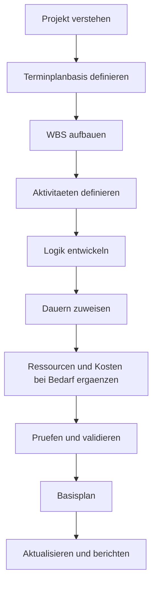

# Projektterminplan Entwickeln

Einen Projektterminplan von null zu entwickeln bedeutet nicht nur, Aktivitaeten in Primavera P6 einzugeben. Es bedeutet, Umfang, Ausfuehrungsstrategie, Randbedingungen, Ressourcen und Projektverpflichtungen in ein Zeitmodell zu uebersetzen, das geprueft, genehmigt, aktualisiert und fuer Entscheidungen genutzt werden kann.

Ein guter Terminplan wird gebaut, bevor er berechnet wird. Die Qualitaet der P6 Datei haengt vom Denken ab, das vor der ersten Aktivitaet stattfindet.

## Entwicklungsablauf

## Zuerst das Projekt Verstehen

Starten Sie nicht in P6, bevor das Projekt verstanden ist.

Pruefen Sie Vertrag, Leistungsumfang, Spezifikationen, wichtige milestones, Ausfuehrungsstrategie, Beschaffung Randbedingungen, Genehmigungen, Zugaenge und handover Anforderungen. Sprechen Sie danach mit Projektleitung, Engineering, Procurement, Construction, Commissioning, subcontractors und suppliers.

Der Terminplan ist ein Modell davon, wie das Team das Projekt liefern will. Wenn der Planer diese Absicht nicht versteht, basiert der Terminplan auf Annahmen.

## Terminplanbasis Definieren

Die scheduling basis erklaert, wie der Terminplan aufgebaut wird. Sie sollte WBS, Kalender, Codes, Detailgrad, Beziehungsregeln, lag policy, P6 Einstellungen, Datenstichtag Konvention, Reporting und Basisplan Ansatz definieren.

Dieses Dokument ist wichtig, weil es erklaert, warum der Terminplan so gebaut wurde. Es gibt auch eine Referenz fuer Qualitaetspruefungen und spaetere Vergleiche.

## WBS Aufbauen

Die Work Breakdown Structure ist der organisatorische Rahmen des Terminplans. Sie sollte widerspiegeln, wie das Projekt gefuehrt und berichtet wird.

Die WBS kann nach Phase, Bereich, System, Disziplin, deliverable, Vertragspaket oder Kombination organisiert sein. Sie sollte Filter, Fortschrittsmessung, Verantwortlichkeiten und Reporting unterstuetzen.

Wenn die WBS nicht zur Projektsteuerung passt, ist der Terminplan schwer nutzbar, auch wenn die Aktivitaeten korrekt sind.

## Aktivitaeten Definieren

Aktivitaeten sollten klare und messbare Arbeitspakete darstellen. Jede Aktivitaet braucht definierten Umfang, klare Startbedingung, klare Endbedingung und einen Verantwortlichen.

Zu grosse Aktivitaeten sind schwer zu statusieren. Zu kleine Aktivitaeten machen den Terminplan schwer zu pflegen. Der richtige Detailgrad haengt von Phase, Vertrag, Reporting und Steuerungsbedarf ab.

Aktivitaetsnamen sind wichtig. Ein guter Name sollte sagen, welche Arbeit ausgefuehrt wird, wo sie ausgefuehrt wird und auf welches Objekt, System oder Ergebnis sie sich bezieht.

## Logik Entwickeln

Logik ist das Herz des CPM Terminplans. Sie definiert, was vor was passieren muss, was parallel laufen kann und welche Bedingung Start oder Ende jeder Aktivitaet erlaubt.

Logik sollte mit den Personen entwickelt werden, die die Arbeit kennen. In P6 sollte die Sequenz nicht allein am Schreibtisch entstehen. Pruefen Sie sie mit Fachverantwortlichen, Bauleitung, Commissioning, Procurement und subcontractors.

Nutzen Sie FS, wenn es die Arbeit am besten abbildet. Nutzen Sie SS und FF vorsichtig, wenn Ueberlappung real ist. Vermeiden Sie negative lag und SF ohne klaren genehmigten Grund. Jede Aktivitaet sollte normalerweise predecessor und successor haben, ausser gueltige Start- und Endmilestones.

## Dauern Zuweisen

Dauern sollten realistisch sein, nicht nur ehrgeizig. Sie sollten auf Umfang, Produktivitaet, Ressourcen, Kalendern, vendor input, subcontractor input und vergleichbarer Erfahrung basieren.

Eine Dauer ist nicht nur eine Zahl. Sie setzt eine Mannschaft, Produktionsrate, Kalender, Zugang und Ausfuehrungsmethode voraus. Wenn sich diese Annahmen aendern, kann sich die Dauer aendern.

Dokumentieren Sie wichtige Dauerannahmen. Das hilft bei Reviews, Updates, change management und delay analysis.

## Ressourcen und Kosten Ergaenzen

Wenn der Terminplan fuer resource planning, cost loading, earned value oder cash flow genutzt wird, muessen Ressourcen und Kosten sorgfaeltig ergaenzt werden.

Resource loading zeigt Arbeitskraeftebedarf, Equipmentbedarf, Materialmengen und moegliche Ueberlastungen. Cost loading verbindet den Terminplan mit Budget, Prognose und Zahlungs- oder Fortschrittskurven.

Fuegen Sie Ressourcen nicht nur fuer die Optik hinzu. Wenn das Projekt diese Daten nutzt, muessen sie in Updates gepflegt werden.

## Pruefen und Validieren

Vor Basisplan Genehmigung sollte der Terminplan technisch und operativ geprueft werden.

Pruefen Sie open starts, open finishes, Beziehungstypen, lags, Einschränkungen, lange Dauern, fehlende Logik, Puffer Verteilung und Plausibilitaet des kritischer Pfad. DCMA-artige Checks sind hilfreich, brauchen aber Projekturteil.

Gehen Sie den Terminplan mit dem Projektteam durch. Stimmen Logik, Dauern, Ressourcen und milestones mit dem echten Ausfuehrungsplan ueberein? Ein Terminplan, der Kennzahlen besteht, aber die Feldpruefung nicht, ist nicht bereit.

## Basisplan Setzen

Nach Review und Genehmigung wird der Terminplan zur Basisplan. Der Basisplan ist die Referenz fuer Fortschritt, Abweichung, Verzug, recovery und performance.

Baselining sollte formal sein. Speichern Sie die genehmigte Version, schuetzen Sie sie vor unkontrollierten Aenderungen und dokumentieren Sie approvals. Spaetere Aenderungen sollten change control folgen.

Ein Basisplan, die sich jedes Mal aendert, wenn das Projekt zurueckfaellt, ist keinen Basisplan. Sie ist ein bewegliches Ziel.

## Update-Zyklus Festlegen

Der Terminplan bleibt nur nuetzlich, wenn er konsequent aktualisiert wird.

Definieren Sie, wer Fortschritt liefert, wann Daten gesammelt werden, welche Nachweise noetig sind, wie actual dates geprueft werden, wie verbleibende Dauern geprueft werden und welche reports erscheinen. Aktive Bau- und Inbetriebnahme Phasen koennen weekly oder biweekly updates brauchen. Fruehe Phasen koennen monthly sein.

Der Update-Zyklus macht aus des Basisplans ein lebendiges Steuerungswerkzeug.

## Fazit

Einen Projektterminplan zu entwickeln ist ein strukturierter Prozess. Projekt verstehen, basis definieren, WBS bauen, Aktivitaeten erstellen, Logik entwickeln, Dauern zuweisen, Ressourcen bei Bedarf laden, validieren, Basisplan setzen und mit Updates pflegen.

Die besten Terminplaene entstehen nicht durch schnelles Oeffnen von P6. Sie entstehen durch Verstehen der Arbeit, Hinterfragen von Annahmen und ein Modell, dem das Projektteam vertrauen kann.
## Verwandte Inhalte
- [Aktivitäten, die am Datenstichtag ohne steuernde Logik beginnen: Warum diese Terminplanmetrik wichtig ist - Überblick](../../metrics/01_activities_starting_in_dd_with_no_logic_driving/02_guide_template.md)
- [CPM (Critical Path Method)](../16_CPM%20(CRITICAL%20PATH%20METHOD)/16_CPM%20(CRITICAL%20PATH%20METHOD).md)
- [Aktivitätscodes](../18_ACTIVITY%20CODES/18_ACTIVITY%20CODES.md)
