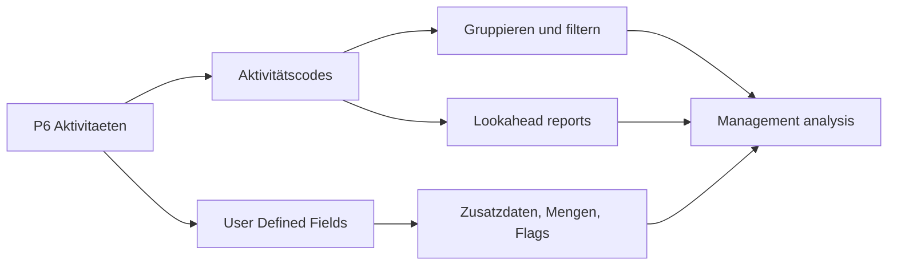

Aktivitätscodes in Primavera P6 sind eines der wichtigsten Werkzeuge, um einen Terminplan von einer Aktivitaetsliste in eine nutzbare Projektsteuerungs Datenbank zu verwandeln. Sie ermoeglichen Gruppierung, Filterung, Sortierung, Reporting und Analyse aus unterschiedlichen Managementperspektiven.

Ein Terminplan ist nicht nur ein bar chart. In P6 ist jede Aktivitaet auch ein Datensatz, der Informationen zu Verantwortung, Phase, Bereich, System, Disziplin, Vertrag, milestone type und anderen Projektattributen tragen kann. Aktivitätscodes organisieren diese Informationen kontrolliert.

## Was Aktivitätscodes Sind

Aktivitätscodes sind strukturierte Klassifikationsfelder, die Aktivitaeten zugewiesen werden. Jeder code type stellt eine Reportingdimension dar, jeder code value eine Option innerhalb dieser Dimension.

Beispiel:

- Code type: Area.
- Code values: Unit 1, Unit 2, Tank Farm, Utilities.

Oder:

- Code type: Discipline.
- Code values: Civil, Mechanical, Electrical, Instrumentation, Commissioning.

Die WBS zeigt, wo die Arbeit in der Projektstruktur liegt. Aktivitätscodes zeigen, wie die Arbeit fuer Reporting und Analyse betrachtet werden kann.

## Was Sie Nicht Sind

Aktivitätscodes ersetzen nicht die WBS. Die WBS ist die Scope-Hierarchie. Codes sind zusaetzliche Sichten auf dieselben Aktivitaeten.

Aktivitätscodes ersetzen nicht die Logik. Logik definiert die Arbeitsabfolge.

Aktivitätscodes ersetzen nicht Ressourcen. Ressourcen definieren Arbeitskraefte, Equipment, Materialien und cost loading.

Wenn diese Konzepte vermischt werden, wird der Terminplan schwerer zu pflegen. Ein sauberer P6 Terminplan nutzt WBS, Logik, Ressourcen, Aktivitätscodes und UDFs fuer unterschiedliche Zwecke.

## Global und Project Aktivitätscodes

P6 kennt Global Aktivitätscodes und Project Aktivitätscodes.

Global Aktivitätscodes werden projektuebergreifend geteilt. Sie sind sinnvoll, wenn dieselbe Klassifikation ueber ein portfolio genutzt werden soll, etwa Standardphasen, Corporate Responsibility Gruppen oder Program Reporting Kategorien.

Project Aktivitätscodes gehoeren zu einem spezifischen Projekt. Sie sind sinnvoll fuer projektbezogene Attribute wie Bereiche, Systeme, contract packages, work fronts, turnover packages oder lokale Reportingkategorien.

Nutzen Sie global codes vorsichtig, weil Aenderungen andere Projekte beeinflussen koennen. Nutzen Sie project codes fuer Attribute, die nur in einem Projekt Bedeutung haben.

## Typische Activity Code Types

Nuetzliche code types haengen vom Projekt ab, aber typische Beispiele sind:

- Responsible Party.
- Discipline.
- Project Phase.
- Area or Location.
- System or Subsystem.
- Contract Package.
- Work Package.
- Milestone Type.
- Turnover Package.
- Reporting Level.

Die besten code types entstehen aus Reportinganforderungen. Vor dem Erstellen von codes sollte gefragt werden: Welche Fragen muss der Terminplan beantworten?

Beispiele:

- Welche Arbeit ist naechsten Monat in Area A geplant?
- Welche Aktivitaeten gehoeren zum electrical contractor?
- Welche systems treiben Inbetriebnahme?
- Welches contract package rutscht?
- Welche milestones muessen an den Kunden berichtet werden?

## User Defined Fields

User Defined Fields, oder UDFs, unterscheiden sich von Aktivitätscodes. Codes klassifizieren Aktivitaeten in Kategorien. UDFs speichern benutzerdefinierte Daten wie Daten, Zahlen, Text, Kosten, Mengen oder ja/nein Indikatoren.

Nutzen Sie UDFs, wenn die Information nicht nur eine Kategorie ist.

Beispiele:

- Contractual finish date.
- Forecast finish date.
- Risk flag.
- Quantity planned.
- Quantity installed.
- Change order number.
- Drawing reference.
- Inspection status.

Aktivitätscodes sind am besten fuer Gruppierung und Filterung. UDFs sind am besten fuer zusaetzliche Informationen, die P6 nicht standardmaessig bereitstellt.

## Warum Codes Fuer Reporting Wichtig Sind

Gute Codierung macht reports schneller und verlaesslicher.

Mit konsistenten Aktivitätscodes kann der Terminplaner discipline lookaheads, area reports, contract package summaries, Inbetriebnahme system reports, milestone reports und dashboards erstellen, ohne jedes Mal Filter neu zu bauen.

Ohne codes wird reporting oft manuell. Das Team exportiert Daten, bearbeitet spreadsheets, fuegt labels per Hand hinzu und wiederholt dies bei jedem update. Das erzeugt Fehler und kostet Zeit.

Codes machen den Terminplan zu einer wiederverwendbaren Datenquelle.

## Governance

Aktivitätscodes brauchen governance. Wenn jeder values frei erstellt, wird der Terminplan schnell inkonsistent.

Beispiel: Eine Person nutzt "Electrical", eine andere "Elec", eine dritte "E&I". Ein report kann Aktivitaeten verpassen, weil dieselbe Kategorie in mehrere labels geteilt ist.

Definieren Sie code types und gueltige values moeglichst vor Basisplan. Dokumentieren Sie Bedeutung, Verantwortlichen und ob der code mandatory ist.

Coding completeness sollte wie andere Terminplanqualitaet geprueft werden. Wenn viele Aktivitaeten mandatory codes nicht haben, sind reports auf dieser Basis nicht verlaesslich.

## Over-Engineering Vermeiden

Mehr codes bedeuten nicht automatisch bessere Steuerung.

Jeder code und jedes UDF erzeugt Pflegeaufwand. Wenn ein code nie in report, filter, dashboard oder analysis genutzt wird, lohnt er sich moeglicherweise nicht.

Starten Sie mit den wichtigen Reportingfragen. Bauen Sie genug Struktur, um sie zu beantworten, aber erstellen Sie keine Felder nur, weil sie irgendwann nuetzlich sein koennten.

## Gute Praxis

Entwerfen Sie die Codierung structure waehrend der Terminplanentwicklung, nicht nach Basisplan.

Richten Sie codes am reporting plan des Projekts aus. Wenn das Projekt nach area, discipline, contract und system berichtet, sollten diese Dimensionen in P6 existieren.

Halten Sie code values konsistent und kontrolliert. Vermeiden Sie Duplikate und unklare Abkuerzungen.

Nutzen Sie UDFs fuer benutzerdefinierte Daten, Mengen, Referenzen und Indikatoren. Erzwingen Sie keine Zahlen oder Daten in Aktivitätscodes.

Pruefen Sie Codierung bei jedem update. Neue Aktivitaeten sollten required codes erhalten, bevor reports herausgegeben werden.

## Fazit

Aktivitätscodes sind nicht nur administrative labels. Sie ermoeglichen einem Primavera P6 Terminplan, Managementfragen schnell und konsistent zu beantworten.

Richtig genutzt machen codes den Terminplan leichter filterbar, gruppierbar, berichtbar und analysierbar. UDFs erweitern diese Faehigkeit durch projektspezifische Informationen, die Standardfelder in P6 nicht abdecken.

Der bar chart zeigt Zeit. Die Codierung structure zeigt, wie der Terminplan gelesen, geschnitten und genutzt werden kann.
## Verwandte Inhalte
- [Fehlende Abhängigkeiten in Primavera P6 - Überblick](../../metrics/21_missing_dependencies/02_guide_template.md)
- [Projektterminplan Entwickeln](../17_DEVELOPE%20A%20PROJECT%20SCHEDULE/17_DEVELOPE%20A%20PROJECT%20SCHEDULE.md)
- [Schedule Basis](../19_SCHEDULE%20BASIS/19_SCHEDULE%20BASIS.md)
