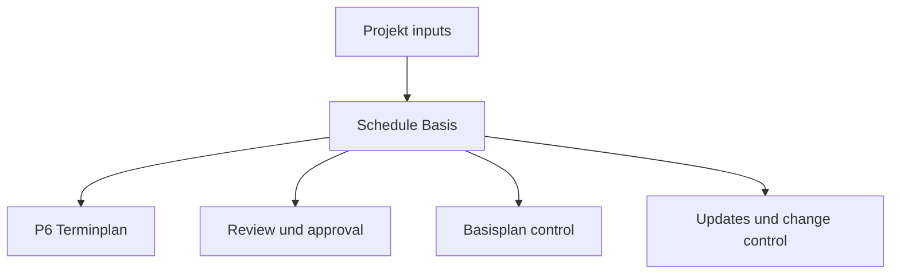

# Schedule Basis

Die Schedule Basis, oft auch Basis of Schedule genannt, ist das Dokument, das erklaert, wie ein Projektterminplan aufgebaut wurde und welche Annahmen ihn stuetzen. Es ist die schriftliche Begleitung zur Primavera P6 Datei.

Der Terminplan zeigt Daten, Logik, Puffer, milestones, Ressourcen und kritischer Pfad. Die Schedule Basis erklaert, warum diese Elemente so aussehen.

## Wofuer Sie Verwendet Wird

Die Schedule Basis unterstuetzt Review, Approval, Basisplan Control, Updates, Change Management und Delay Analysis. Sie hilft Reviewern, Regeln, Annahmen, Inputs und Grenzen des Terminplans zu verstehen.

Ohne sie kann die P6 Datei zwar korrekt rechnen, aber das Team kennt moeglicherweise die Annahmen nicht und weiss nicht, ob der Terminplan fuer Entscheidungen geeignet ist.

## Wer Sie Schreibt und Fuer Wen

Der Terminplaner oder planning engineer erstellt normalerweise die Schedule Basis, mit input von project manager, engineering, Beschaffung, construction, Inbetriebnahme, Projektsteuerungs, contracts und cost teams.

Sie richtet sich an Projektteam, client, PMO, reviewers, claims analysts und alle, die verstehen muessen, wie der Terminplan gebaut wurde.

## Warum Sie Wichtig Ist

Ein Terminplan enthaelt viele Entscheidungen. Calendars, durations, logic, crews, milestones, approval cycles, permits und resource limits beeinflussen Daten und Puffer.

Die Schedule Basis macht diese Entscheidungen sichtbar. Sie reduziert Unklarheit, unterstuetzt Auditierbarkeit und verhindert spaetere Diskussionen ueber Basisplan-Annahmen.

## Was Sie Enthalten Sollte

Eine umfassende Basis of Schedule sollte enthalten:

- Project scope und exclusions.
- Zweck des Terminplans und contractual use.
- Schedule development methodology.
- WBS und activity Codierung structure.
- Calendars, shifts, holidays, weather und non-work periods.
- Key assumptions und Einschränkungen.
- Milestones fuer start, completion, access, approvals und material delivery.
- Approval cycles und permit cycles.
- Handover und turnover assumptions.
- Logic rules, relationship types und lag policy.
- Duration basis, productivity rates und norms.
- Crews, resource availability, labor limits und equipment limits.
- Cost rules, falls zutreffend.
- Critical path und near-kritischer Pfad explanation.
- Risk assumptions und major uncertainties.
- Update cycle, status rules und reporting approach.

## Assumptions

Assumptions sollten klar und pruefbar sein. Dazu gehoeren site access dates, engineering releases, vendor delivery dates, permit approval durations, client review periods, crew availability, weather allowances und Inbetriebnahme sequence assumptions.

Wenn eine Annahme Daten, Puffer, Ressourcen oder handover beeinflusst, gehoert sie in die Schedule Basis.

## Calendars und Work Periods

Das Dokument sollte alle wichtigen in P6 genutzten Kalender erklaeren. Dazu gehoeren working days, shifts, holidays, seasonal shutdowns, weather calendars, night work, weekend work und non-work periods.

Kalender beeinflussen activity dates und Puffer direkt. Wenn engineering, Beschaffung, construction, Inbetriebnahme oder resources unterschiedliche Kalender nutzen, erklaeren Sie warum.

## Crews, Resources und Limits

Dauern sind nur aussagekraeftig, wenn die angenommenen Ressourcen verstanden sind. Die Schedule Basis sollte crew assumptions, resource availability, labor limits, equipment limits und overtime oder shift strategy beschreiben.

Wenn resource loading enthalten ist, erklaeren Sie, ob es fuer manpower planning, cost loading, earned value oder resource leveling genutzt wird.

## Milestones, Approvals, Permits und Handover

Wichtige milestones sollten gelistet und erklaert werden: project start, contractual completion, access granted, client approvals, third-party interfaces, material delivery, permits, system handovers und final turnover.

Approval und permit cycles sollten angenommene Dauern und Verantwortliche zeigen. Wenn client oder third party actions den Terminplan steuern, muss das sichtbar sein.

## Methodology, Productivity und Costs

Die Schedule Basis sollte erklaeren, wie der Terminplan entwickelt wurde: sources, workshops, sequencing logic, duration estimating method, productivity rates, norms und validation process.

Wenn cost loading enthalten ist, beschreiben Sie die Regeln. Erklaeren Sie, ob costs nach resource, expense, activity, WBS, contract package oder earned value method zugeordnet sind.

## Critical Path und Risk

Die Schedule Basis sollte den kritischer Pfad zusammenfassen und erklaeren, warum er plausibel ist. Sie sollte auch near-kritischer Pfads, major risks, schedule sensitivities und Annahmen nennen, die sich waehrend execution aendern koennen.

So versteht das Team nicht nur das planned finish date, sondern was es steuert.

## Gute Praxis

Schreiben Sie die Schedule Basis vor Basisplan approval. Halten Sie sie mit der P6 Datei synchron. Aktualisieren Sie sie, wenn approved changes wichtige assumptions, calendars, milestones, resource strategy oder methodology aendern.

Machen Sie daraus keine generische Erzaehlung. Sie sollte so konkret sein, dass ein anderer Terminplaner versteht, wie der Terminplan aufgebaut wurde.

## Fazit

Die Schedule Basis ist die Erklaerung hinter dem Terminplan. Sie beschreibt, was der Terminplan annimmt, wie er gebaut wurde, was er einschliesst, was er ausschliesst und welche Bedingungen fuer gueltige Daten bestehen muessen.

Eine starke Basis of Schedule macht die P6 Datei leichter zu pruefen, zu verteidigen, zu aktualisieren und zu vertrauen.
## Verwandte Inhalte
- [Aktivitäten, die am Datenstichtag ohne steuernde Logik beginnen: Warum diese Terminplanmetrik wichtig ist - Überblick](../../metrics/01_activities_starting_in_dd_with_no_logic_driving/02_guide_template.md)
- [Aktivitätscodes](../18_ACTIVITY%20CODES/18_ACTIVITY%20CODES.md)
