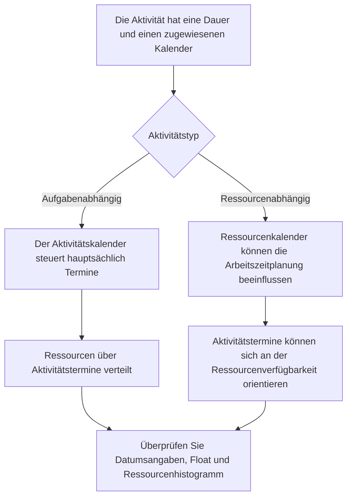

Kalender sind eine der stillen Grundlagen eines Primavera P6-Plans. Sie legen fest, wann gearbeitet werden kann. Sie teilen P6 mit, welche Tage Arbeitstage sind, welche Tage arbeitsfreie Tage sind, wie viele Stunden ein Tag zur Verfügung steht und zu welcher Tageszeit die Arbeit beginnt und endet.

Da Kalender im Verborgenen funktionieren, kann es leicht passieren, dass sie unterschätzt werden. Ein Zeitplan kann eine starke Logik und angemessene Dauer haben, aber wenn die Kalender falsch oder inkonsistent sind, können die Daten dennoch irreführend sein.

Das Verständnis von Kalendern ist für die Terminqualität, die Ressourcenplanung, die Überprüfung kritischer Pfade und die Aktualisierungsdisziplin von entscheidender Bedeutung.

## Was ein Kalender in P6 macht

In P6 wandelt ein Kalender die Dauer in Datumsangaben um. Wenn eine Aktivität eine Dauer von 10 Arbeitstagen hat, muss P6 wissen, was ein Arbeitstag bedeutet. Ist es Montag bis Freitag? Ist der Samstag inbegriffen? Ist der Arbeitstag 8 Stunden, 10 Stunden oder 12 Stunden? Beginnt die Arbeit um 7:00 oder 8:00 Uhr? Sind Feiertage ausgeschlossen?

Der Kalender beantwortet diese Fragen.

Einfluss von Kalendern:

- Start- und Enddatum der Aktivität.
- Frühe und späte Termine.
- Gesamtschwimmer.
- Kritischer Pfad und längster Pfad.
- Zeitpunkt der Ressourcennutzung.
- Interpretation der Beziehungsverzögerung.
- Datumsverschiebungen während Aktualisierungen.
- Look-Ahead und Berichtsgenauigkeit.

Ein Kalender ist nicht nur ein administratives Einrichtungselement. Es ist Teil der Zeitplanberechnung.

## Warum möglicherweise mehr als ein Kalender erforderlich ist

Viele Projekte benötigen mehr als einen Kalender, da nicht alle Arbeiten dem gleichen Arbeitsmuster folgen.

Beispiele hierfür sind:

- Bürotechnik arbeitet nach einem 5-Tage-Kalender.
- Baustellenbauarbeiten nach einem 6-Tages-Kalender.
- Abschalt- oder Ausfallarbeiten im 24-Stunden-Kalender.
- Inbetriebnahmearbeiten in der Nachtschicht.
- Fenster für den Eigentümerzugang.
- Umweltbeschränkungen.
- Beschaffungsaktivitäten basierend auf Lieferantenarbeitstagen.
- Ressourcenspezifische Kalender für Inspektoren, Lieferanten oder Spezialteams.

Die Verwendung eines einzigen Kalenders für alles sieht vielleicht einfach aus, kann aber zu unrealistischen Terminen führen. Wenn die Inbetriebnahme nur nachts erfolgen kann, kann ein normaler Tageskalender falsch sein. Wenn ein Anbieter nur wochentags arbeitet, kann es sein, dass ein 7-Tage-Baukalender die Verfügbarkeit überbewertet.

Das Ziel besteht nicht darin, viele Kalender zu erstellen. Ziel ist es, genügend Kalender zu erstellen, um reale Arbeitsbedingungen abzubilden, ohne den Zeitplan unnötig zu komplex zu machen.

## Aktivitätskalender

Der Aktivitätskalender wird direkt einer Aktivität zugeordnet. Es definiert die Arbeitszeit, die zur Berechnung der Dauer und Daten dieser Aktivität verwendet wird, insbesondere für aufgabenabhängige Aktivitäten.

Wenn beispielsweise „Kabeltrasse installieren“ über einen 6-Tage-Baukalender verfügt, berechnet P6 seine Arbeit auf der Grundlage dieses Kalenders. Wenn der Samstag ein Arbeitstag ist, endet die Aktivität möglicherweise früher als in einem 5-Tage-Kalender.

Aktivitätskalender sind normalerweise die Hauptkalendersteuerung für normale Zeitplanaktivitäten.

Verwenden Sie Aktivitätskalender, wenn die Arbeit selbst einem definierten Arbeitsmuster folgt, z. B. Tagschicht, Nachtschicht, Stillstandsarbeiten oder Büroarbeit.

## Ressourcenkalender

Ressourcenkalender legen fest, wann eine Ressource verfügbar ist. Eine Ressource kann eine Person, ein Team, ein Ausrüstungsgegenstand, ein Anbieterspezialist oder eine andere zugewiesene Ressource sein.

Ressourcenkalender werden besonders wichtig, wenn Aktivitäten ressourcenabhängig sind oder wenn das Projekt Ressourcennivellierung oder detaillierte Ressourcenplanung verwendet.

Beispielsweise kann eine Aktivität einem 6-tägigen Baukalender zugeordnet sein, der ihr zugeordnete Fachinspektor ist jedoch möglicherweise nur Montag bis Mittwoch verfügbar. Wenn die Aktivität ressourcengesteuert ist, berechnet P6 die Termine möglicherweise auf der Grundlage des Ressourcenkalenders und nicht nur des Aktivitätskalenders.

Ressourcenkalender sind nützlich, wenn die Ressourcenverfügbarkeit eine echte Termineinschränkung darstellt. Sie können auch Verwirrung stiften, wenn sie zugewiesen, aber nicht gepflegt werden.

## Wie Aktivitäts- und Ressourcenkalender miteinander interagieren

Die Beziehung zwischen Aktivitätskalendern und Ressourcenkalendern hängt vom Aktivitätstyp, den Ressourceneinstellungen und dem Verhalten bei der Zeitplanberechnung ab.

Bei aufgabenabhängigen Aktivitäten ist der Aktivitätskalender normalerweise die primäre Grundlage für die Aktivitätsdauer. Ressourcenkalender können sich weiterhin auf die Ressourcenverteilung und -nutzung auswirken.

Bei ressourcenabhängigen Aktivitäten können Ressourcenkalender Einfluss darauf haben, wann die Arbeit ausgeführt wird. Dies bedeutet, dass sich der Ressourcenkalender möglicherweise direkter auf die Aktivitätstermine auswirkt.

Der entscheidende Punkt ist, dass Kalender gemeinsam überprüft werden müssen. In einem Aktivitätskalender kann es sein, dass Arbeit möglich ist, während im Ressourcenkalender steht, dass die zugewiesene Ressource nicht verfügbar ist. Diese Nichtübereinstimmung kann zu einer Desynchronisierung führen.

## Was Kalenderdesynchronisierung bedeutet

Eine Kalenderdesynchronisierung tritt auf, wenn verschiedene Kalender im Zeitplan nicht mit der tatsächlichen Funktionsweise des Projekts übereinstimmen.

Häufige Beispiele sind:

- Für die Aktivität wird ein 6-Tage-Kalender verwendet, für zugewiesene Ressourcen jedoch ein 5-Tage-Kalender.
- Für die Aktivität wird ein Tagschichtkalender verwendet, für Ressourcen jedoch eine Nachtschicht.
- Zwei verknüpfte Aktivitäten verwenden unterschiedliche Start- und Endzeiten am Tag.
- Verzögerung wird durch einen Kalender interpretiert, der nicht mit der Arbeit übereinstimmt.
- Eine kopierte Aktivität behält einen alten Kalender aus einem anderen Projekt.
- Ein Ressourcenkalender hat Feiertage, die der Aktivitätskalender nicht hat.

Das Ergebnis kann verwirrend sein. Termine können sich unerwartet verschieben. Es kann sein, dass die Aktivitäten einen Tag später abgeschlossen werden. Float kann sich ohne offensichtlichen logischen Grund ändern. Ressourcenhistogramme stimmen möglicherweise nicht mit dem Ausführungsplan überein. Der kritische Pfad kann sich aufgrund des Kalenderverhaltens und nicht aufgrund der tatsächlichen Reihenfolge verschieben.

## Probleme aufgrund von Kalenderkonflikten

Eine Nichtübereinstimmung des Kalenders kann zu verschiedenen Problemen mit der Qualität des Zeitplans führen.

Erstens kann es zu irreführenden Daten kommen. Eine Aufgabe kann so aussehen, als würde sie länger dauern, weil der Kalender weniger Arbeitsperioden enthält.

Zweitens kann es den Schwimmer verzerren. Aktivitäten in unterschiedlichen Kalendern können frühe und späte Daten auf schwer zu erklärende Weise berechnen.

Drittens kann es den kritischen Pfad beeinflussen. Ein Pfad kann kritisch werden, weil ein Kalender die Arbeit einschränkt, und nicht, weil die logische Abfolge wirklich maßgebend ist.

Viertens kann es die Ressourcenberichterstattung beeinträchtigen. Ein Ressourcenhistogramm zeigt möglicherweise den Ressourcenbedarf an Daten an, an denen die Ressource tatsächlich nicht verfügbar ist, oder übersieht möglicherweise den Bedarf, der auftreten sollte.

Schließlich kann es zu Update-Verwirrung kommen. Wenn sich das Datendatum verschiebt, reagieren Aktivitäten in verschiedenen Kalendern möglicherweise unterschiedlich, was die Statusfeststellung und Überprüfung des Zeitplans erschwert.

## So lösen Sie Desynchronisationen

Beginnen Sie mit der Identifizierung des Projektkalenderstandards. Definieren Sie die normale Arbeitswoche, die Start- und Endzeiten der Arbeitstage, Feiertage, Ruhezeiten und spezielle Arbeitsfenster.

Überprüfen Sie dann alle Kalender im Zeitplan. Überprüfen:

- Name und Zweck des Kalenders.
- Arbeitstage.
- Tägliche Arbeitszeiten.
- Start- und Endzeiten.
- Feiertage und Ausnahmen.
- Kalendertyp.
- Dem Kalender zugewiesene Aktivitäten.
- Dem Kalender zugewiesene Ressourcen.

Überprüfen Sie als Nächstes Aktivitäten, bei denen die Daten seltsam aussehen. Fügen Sie Spalten für Aktivitätskalender, Aktivitätstyp, Start, Ende, Früher Start, Frühes Ende, Gesamtbestand, Ressourcen und Ressourcenkalender hinzu, sofern verfügbar.

Wenn ein Kalender falsch ist, korrigieren Sie ihn. Wenn die Aktivität dem falschen Kalender zugewiesen ist, ändern Sie die Zuordnung. Wenn der Ressourcenkalender gültig ist, aber zu unerwarteten Ergebnissen führt, bestätigen Sie, ob die Aktivität ressourcenabhängig oder aufgabenabhängig sein soll.

Nachdem Sie Korrekturen vorgenommen haben, berechnen Sie den Zeitplan neu und überprüfen Sie die betroffenen Daten, den Float, den kritischen Pfad und das Ressourcenhistogramm.

## Gute Kalenderverwaltung

Kalender sollten wie Logik und Einschränkungen verwaltet werden. Sie sollten sich nicht unkontrolliert vermehren.

Zur guten Praxis gehört:

- Verwenden Sie eine klare Namenskonvention.
- Führen Sie einen begrenzten Satz genehmigter Projektkalender.
- Dokumentieren Sie, warum es spezielle Kalender gibt.
- Vermeiden Sie das Kopieren ungenutzter Kalender aus alten Zeitplänen.
- Überprüfen Sie die Zuweisungen des Aktivitätskalenders vor der grundlegenden Genehmigung.
- Überprüfen Sie die Ressourcenkalender, wenn das Laden von Ressourcen verwendet wird.
- Überprüfen Sie die Start- und Endzeiten des Kalenders, nicht nur die Arbeitstage.

Die Kalenderverwaltung ist besonders wichtig bei großen Zeitplänen, bei denen viele Benutzer Aktivitäten hinzufügen oder kopieren können.

## Praxisbeispiel

Ein Bauprojekt verwendet einen 6-Tage-Kalender für die Arbeit vor Ort. Die meisten Bauarbeiten finden montags bis samstags von 7:00 bis 17:00 Uhr statt. Ein Inbetriebnahmeteam arbeitet in der Nachtschicht von 22:00 bis 6:00 Uhr, da Tests nur im Offline-Betrieb durchgeführt werden können.

Beide Kalender sind gültig.

Das Problem tritt auf, wenn kopierte Bauaktivitäten versehentlich den Nachtschichtkalender erben. Ihre Daten beginnen sich seltsam zu bewegen. Manche Beziehungen scheinen Nachfolger auf den nächsten Tag zu drängen. Float verändert sich auf eine Weise, die das Team nicht erklären kann.

Die Lösung besteht darin, den Nachtschichtkalender nicht zu löschen. Die Lösung besteht darin, die Zuweisung des Aktivitätskalenders zu korrigieren, zu bestätigen, welche Aktivitäten wirklich den Nachtschichtkalender benötigen, und den Zeitplan neu zu berechnen.

## Abschluss

Kalender in P6 legen fest, wann gearbeitet werden kann. Sie wirken sich auf Aktivitätsdaten, Float, kritischen Pfad, Ressourcenauslastung, Verzögerungen und Aktualisierungsverhalten aus.

Oft ist mehr als ein Kalender erforderlich, da Projekte unterschiedliche Arbeitsmuster umfassen: Arbeit vor Ort, Büroarbeit, Nachtschichten, Stillstände, Lieferantenarbeit und Ressourcenverfügbarkeit. Mehrere Kalender müssen jedoch sorgfältig kontrolliert werden.

Das Hauptrisiko ist die Desynchronisation. Wenn Aktivitätskalender und Ressourcenkalender nicht mit dem tatsächlichen Ausführungsplan übereinstimmen, kann der Zeitplan verwirrende Daten, irreführende Schwankungen und unzuverlässige Ressourceninformationen anzeigen.

Ein starker Zeitplan verwendet Kalender absichtlich. Jeder Kalender hat einen Zweck, jeder spezielle Kalender wird dokumentiert und Aktivitäts- und Ressourcenkalenderzuweisungen werden überprüft, bevor dem Zeitplan vertraut wird.
