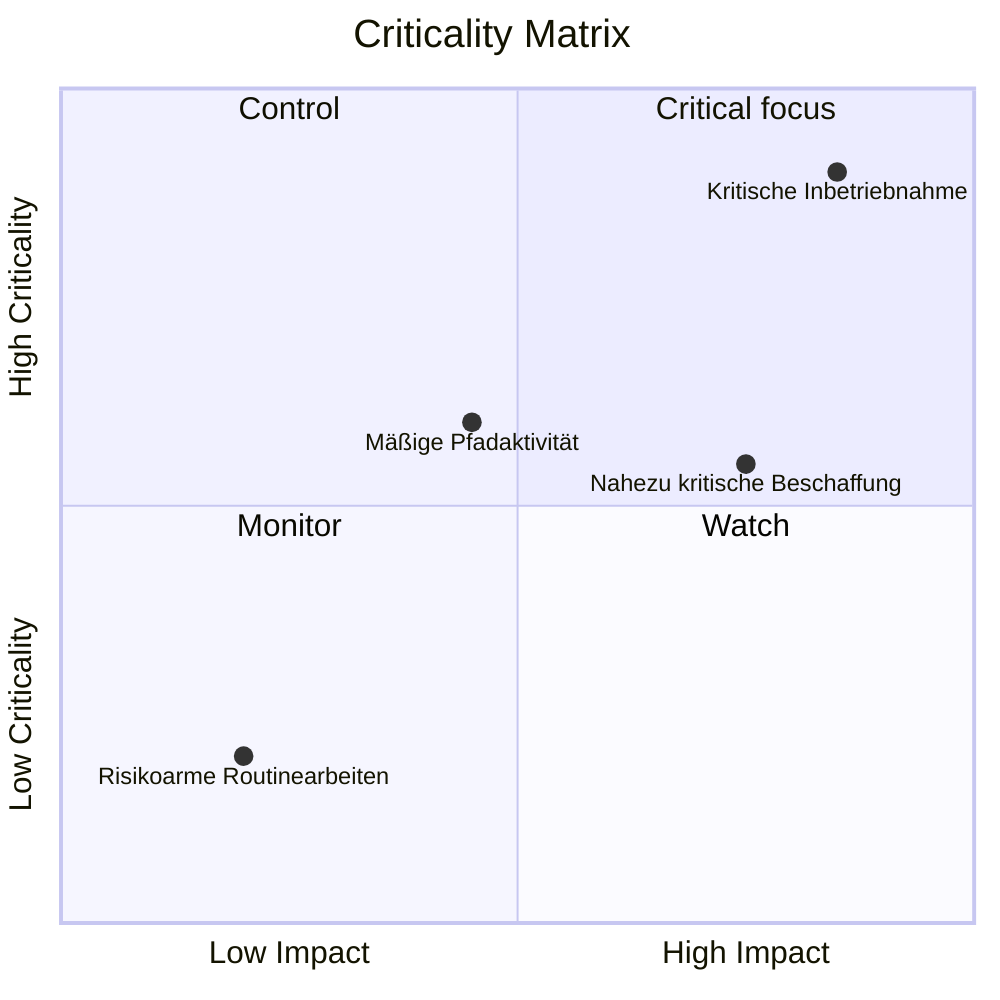

Eine Kritikalitätsmatrix ist eine visuelle oder analytische Methode zur Klassifizierung und Priorisierung von Projektaktivitäten basierend darauf, wie wichtig sie für den Projektabschluss sind. Im Primavera P6-Kontext hilft es Projektmanagern, Planern und PMO-Prüfern dabei, herauszufinden, welche Aktivitäten das größte Terminrisiko darstellen.

Der kritische Pfad erzählt die aktuelle deterministische Geschichte des Zeitplans. Eine Kritikalitätsmatrix geht noch einen Schritt weiter. Es hilft dem Team zu verstehen, welche Aktivitäten bereits kritisch sind, welche kurz davor stehen, kritisch zu werden, und welche schwerwiegende Auswirkungen haben würden, wenn sie scheitern.

Dies ist wichtig, da die Aktivität, die heute von entscheidender Bedeutung ist, nicht immer die einzige Aktivität ist, die Aufmerksamkeit verdient. Eine nahezu kritische Aktivität mit großen Verzögerungsauswirkungen könnte zum Problem von morgen werden. Eine langfristige Beschaffungsaktivität befindet sich möglicherweise nicht auf dem aktuellen kritischen Pfad, birgt jedoch möglicherweise genügend Risiken, um eine strenge Kontrolle zu rechtfertigen.

## Was Kritikalität in P6 bedeutet

In Primavera P6 bezieht sich die Kritikalität normalerweise darauf, ob sich eine Aktivität auf das Enddatum des Projekts auswirken kann, wenn sie sich verzögert. Traditionell identifiziert P6 kritische Aktivitäten anhand der Einstellungen „Gesamtpuffer“ oder „Längster Pfad“.

Die gängige deterministische Definition ist einfach:

- Kritische Aktivitäten sind Aktivitäten mit Null oder negativem Float.
- Diese Aktivitäten liegen auf dem kritischen Pfad oder sind eng damit verbunden.
- Wenn sie sich verzögern, wird sich wahrscheinlich auch der Endtermin des Projekts verzögern.

Diese Definition ist nützlich, aber nicht vollständig. Es basiert auf einer berechneten Zeitplanbedingung. Es erklärt nicht vollständig die Unsicherheit, die Wahrscheinlichkeit oder das Ausmaß der Auswirkungen, wenn eine Aktivität ausbleibt.

Eine Kritikalitätsmatrix erweitert die Diskussion von „Ist diese Aktivität heute kritisch?“ zu „Wie wahrscheinlich ist es, dass diese Aktivität kritisch wird, und wie viel Schaden könnte sie anrichten?“

## Was für eine Kritikalitätsmatrix vereint

Eine Kritikalitätsmatrix kombiniert normalerweise zwei Dimensionen.

Die erste Dimension ist die Zeitplansensitivität oder -wahrscheinlichkeit. Dies kann daran gemessen werden, wie oft eine Aktivität während der Monte-Carlo-Simulation kritisch wird, oder daran, wie nahe sie an kritisch ist, basierend auf Gesamt-Float- oder nahezu kritischen Schwellenwerten.

Die zweite Dimension ist die Wirkung. Damit ist die Schwere der Verzögerung gemeint, wenn die Aktivität ausbleibt. Die Auswirkungen können auf der Dauer der Aktivität, dem Verzögerungseffekt auf den Projektabschluss, dem Sensitivitätsindex, dem Kostenrisiko, den Auswirkungen auf vertragliche Meilensteine ​​oder auf der Beurteilung des Managements basieren.

Zusammen helfen diese Dimensionen dem Team, Aktivitäten zu priorisieren.

Diese Art der Ansicht ist nützlich, da sie Aktivitäten, die lediglich im kritischen Filter erscheinen, von Aktivitäten trennt, die eine aktive Managementaufmerksamkeit erfordern.

## Eine einfache Matrixstruktur

Eine grundlegende Kritikalitätsmatrix kann als Raster dargestellt werden:

| Kritikalität/Auswirkung | Geringe Auswirkungen | Mittlere Wirkung | Hohe Wirkung |
| --- | --- | --- | --- |
| Geringe Kritikalität | Monitor | Monitor | Betrachten |
| Mittlere Kritikalität | Rezension | Kontrolle | Hohe Priorität |
| Hohe Kritikalität | Kontrolle | Hohe Priorität | Kritischer Fokus |

Die genauen Bezeichnungen können sich je nach Organisation ändern, die Idee bleibt jedoch dieselbe. Aktivitäten mit geringer Kritikalität und geringen Auswirkungen können überwacht werden. Aktivitäten mit hoher Kritikalität und großer Auswirkung erfordern eine gezielte Kontrolle.

## In der Matrix verwendete P6-Daten

Primavera P6 bietet normalerweise standardmäßig keine integrierte Kritikalitätsmatrixansicht. Die Matrix wird üblicherweise anhand von P6-Aktivitätsdaten in Kombination mit externer Analyse erstellt.

Zu den nützlichen P6-Feldern gehören:

- Gesamtschwimmer.
- Streubesitz.
- Aktivitätsdauer.
- Verbleibende Dauer.
- Aktivitätsstatus.
- Start- und Endtermine.
- Einschränkungen.
- Beziehungslogik.
- Kalender.
- WBS oder Aktivitätscodes.
- Kritische oder längste Pfadindikatoren.

Diese Daten ergeben die deterministische Zeitplanansicht. Es zeigt den aktuell berechneten Pfad, nahezu kritische Arbeiten, eingeschränkte Aktivitäten und Aktivitäten mit langer verbleibender Exposition an.

## Eingaben zur Risikoanalyse

Um die Matrix leistungsfähiger zu machen, kann das Team probabilistische Zeitplanrisikodaten aus der Monte-Carlo-Analyse hinzufügen. Dies kann von Tools wie Primavera Risk Analysis oder anderen Risikosimulationsplattformen stammen.

Zu den wichtigen Risikometriken gehören der Kritizitätsindex, der Total Float, der Schedule Sensitivity Index sowie die Dauer oder der Auswirkungswert.

Der Kritikalitätsindex, oft auch CI genannt, zeigt den Prozentsatz der Simulationen an, bei denen eine Aktivität auf dem kritischen Pfad erscheint. Wenn eine Aktivität beispielsweise einen KI-Wert von 80 % aufweist, war sie in 80 % der simulierten Szenarien kritisch.

„Total Float“ zeigt an, wie nah eine Aktivität daran ist, das Projektende im deterministischen Zeitplan zu beeinflussen. Ein Float nahe Null ist ein Warnzeichen.

Der Schedule Sensitivity Index kombiniert Kritikalität und Auswirkung. Es hilft nicht nur zu zeigen, ob die Aktivität kritisch wird, sondern auch, ob sie das Ergebnis sinnvoll beeinflusst.

Die Dauer oder der Auswirkungswert helfen bei der Einschätzung des Schweregrads. Eine längere Aktivität, ein Beschaffungspaket mit hohem Risiko oder eine mit einem vertraglichen Meilenstein verbundene Aufgabe kann bei Verzögerung größere Auswirkungen haben.

## Beispiel

Betrachten Sie den folgenden vereinfachten Aktivitätssatz:

| Aktivität | Schweben | Kritikalitätsindex | Dauer | Matrixergebnis |
| --- | ---: | ---: | ---: | --- |
| A | 0 Tage | 95% | 20 Tage | Kritischer Fokus |
| B | 5 Tage | 60% | 15 Tage | Hohe Priorität |
| C | 20 Tage | 15% | 10 Tage | Monitor |

Aktivität A gehört in den Bereich mit hoher Kritikalität und hoher Auswirkung. Es hat keinen Float, erscheint in den meisten Simulationen kritisch und hat eine lange Dauer. Es verdient eine gezielte Kontrolle.

Aktivität B ist möglicherweise nicht so dringend wie Aktivität A, verdient aber dennoch Aufmerksamkeit. Der Float ist begrenzt und die Wahrscheinlichkeit, kritisch zu werden, ist groß.

Aktivität C hat mehr Float und eine geringere Kritikalität. Es sollte nicht ignoriert werden, erfordert aber nicht das gleiche Maß an Managementfokus.

## Warum es nützlich ist

Eine Kritikalitätsmatrix hilft dem Projektteam, sich nicht nur auf den einzelnen deterministischen kritischen Pfad zu verlassen. Der deterministische Pfad ist wichtig, aber es ist nur eine Sicht auf den Zeitplan.

Die Matrix hilft Teams:

- Priorisieren Sie, was genau überwacht werden soll.
- Konzentrieren Sie sich bei der Risikominderung auf wichtige Risikoaktivitäten.
- Identifizieren Sie nahezu kritische Aktivitäten, bevor sie kritisch werden.
- Verstehen Sie das probabilistische Zeitplanrisiko.
- Vergleichen Sie Wahrscheinlichkeit und Auswirkung in einer Ansicht.
- Kommunizieren Sie das Zeitplanrisiko klarer an das Management.

Für das PMO-Reporting ist dies besonders nützlich, da es die Komplexität des Zeitplans in einen Entscheidungsrahmen übersetzt. Anstatt Hunderte von Aktivitäten zu präsentieren, kann das Team zeigen, welche Aktivitäten sich in den Zonen „kritischer Fokus“, „hohe Priorität“, „Kontrolle“ oder „Überwachung“ befinden.

## Eine einfache Möglichkeit, eines zu bauen

Beginnen Sie mit dem Exportieren von Aktivitätsdaten aus P6. Schließen Sie Aktivitäts-ID, Aktivitätsname, WBS, Gesamtpuffer, verbleibende Dauer, Start, Ende, Kalender, Einschränkungen und Indikatoren für kritische oder längste Pfade ein.

Fügen Sie dann optionale Risikoanalysefelder hinzu, z. B. Criticality Index und Schedule Sensitivity Index. Wenn keine Simulationsdaten verfügbar sind, verwenden Sie praktische Schwellenwerte basierend auf Float und Dauer. Eine hohe Kritikalität könnte beispielsweise bedeuten, dass der Gesamtpuffer kleiner oder gleich 0 Tage ist oder dass der KI-Wert über 70 % liegt. Mittlere Kritikalität kann einen nahezu kritischen Float oder CI zwischen 40 % und 70 % bedeuten.

Definieren Sie Auswirkungsschwellenwerte. Eine Aktivität mit großer Auswirkung kann von langer Dauer sein, an einen vertraglichen Meilenstein gebunden sein, Teil eines Hochrisikopakets sein oder sich durch Simulation auf den Projektabschluss auswirken.

Zeichnen Sie abschließend die Aktivitäten in Excel, Power BI oder einem anderen Berichtstool auf. Das Ergebnis muss nicht kompliziert sein. Der Wert ergibt sich aus der Sichtbarmachung der Priorität.

## Nutzen Sie Urteilsvermögen

Eine Kritikalitätsmatrix ist ein Entscheidungsunterstützungstool und keine automatische Antwort. Schwellenwerte sollten vom Projektkontrollteam überprüft und an den Projekttyp, die Vertragssensibilität und den Zeitplanreifegrad angepasst werden.

Denken Sie auch daran, dass die Matrix von der Qualität des Zeitplans abhängt. Wenn dem P6-Zeitplan Logik fehlt, unrealistische Dauer, strenge Einschränkungen, schlechte Kalender oder schwache Statusaktualisierungen vorliegen, übernimmt die Matrix diese Schwächen.

Die beste Verwendung der Matrix besteht darin, analytische Ergebnisse mit professioneller Planungsbeurteilung zu kombinieren.

## Abschluss

Eine Kritikalitätsmatrix ordnet Projektaktivitäten danach, wie wahrscheinlich es ist, dass sie kritisch werden, und wie groß die Auswirkungen wären, wenn sie sich verzögern würden. Es verwendet P6-Daten wie Gesamtpuffer, Dauer, Einschränkungen und Logik und kann mit Monte-Carlo-Ergebnissen wie dem Criticality Index und dem Schedule Sensitivity Index verstärkt werden.

Für Projektmanager und PMO-Prüfer verwandelt die Matrix das Zeitplanrisiko in ein klareres Managementgespräch. Es hilft dem Team, sich auf die Aktivitäten zu konzentrieren, die am wichtigsten sind, und nicht nur auf die Aktivitäten, die heute im kritischen Filter erscheinen.

Bei richtiger Anwendung hilft eine Kritikalitätsmatrix dem Projektteam, von der reaktiven Berichterstattung zur proaktiven Terminkontrolle überzugehen.
