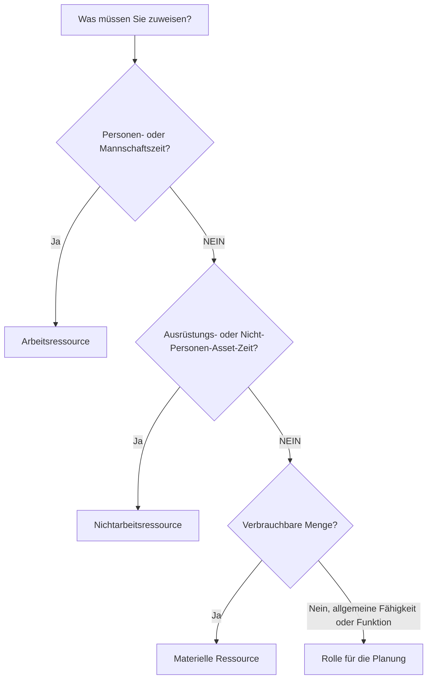

Ressourcen in Primavera P6 stellen die Personen, Geräte und Materialien dar, die zur Ausführung der Arbeit erforderlich sind. Sie verknüpfen den Zeitplan mit Kapazität, Produktivität, Kosten und Ressourcenbedarf im Laufe der Zeit.

Ein Zeitplan kann ohne Ressourcen existieren, aber ein ressourcenbeladener Zeitplan gibt dem Projektteam einen tieferen Einblick. Es kann Arbeitshistogramme, Ausrüstungsbedarf, Materialverbrauch, Kostenkurven, Ressourcenbeschränkungen und mögliche Überlastungen anzeigen. Um diese Informationen nutzbar zu machen, muss der Planer die verschiedenen in P6 verfügbaren Ressourcentypen verstehen und wissen, wann jeder einzelne verwendet werden soll.

Die wichtigsten Ressourcentypen in P6 sind:

- Arbeit.
- Nichtarbeit.
- Material.

P6 verwendet auch Rollen, die nicht genau mit Ressourcen identisch sind, aber eng miteinander verbunden und bei der Planung sehr nützlich sind.

## Warum der Ressourcentyp wichtig ist

Der Ressourcentyp beeinflusst, wie P6 mit Einheiten, Tarifen, Kosten, Kalendern und Berichten umgeht.

Eine Arbeitsressource verhält sich anders als eine materielle Ressource. Ein Kran sollte nicht wie ein Betonvolumen behandelt werden. Eine generische Ingenieurrolle ist nicht dasselbe wie eine benannte Ingenieurressource. Wenn Ressourcentypen falsch gemischt werden, können Histogramme, Kostenberichte, Produktivitätsüberprüfungen und Ertragswertausgaben irreführend werden.

Der Ressourcentyp beantwortet eine praktische Frage: Was für etwas wird der Aktivität zugewiesen?

## Arbeitsressourcen

Arbeitsressourcen repräsentieren Personen oder Mannschaften. Sie werden normalerweise in Stunden, Tagen oder anderen zeitbasierten Einheiten gemessen. Arbeitsressourcen können Tarife, Kalender, Verfügbarkeitsgrenzen und Kostenwerte haben.

Beispiele hierfür sind:

- Planer.
- Zivile Besatzung.
- Elektriker.
- Schweißteam.
- Ingenieur.
- Inspektor.
- Inbetriebnahmetechniker.

Setzen Sie Arbeitsressourcen ein, wenn im Zeitplan der menschliche Einsatz oder der Personalbedarf ausgewiesen werden muss. Arbeitsressourcen sind nützlich für Personalhistogramme, Personalpläne, Produktivitätsanalysen und Arbeitskostenprognosen.

Für eine Aktivität namens „Kabeltrasse installieren“ können beispielsweise 4 Elektriker für 5 Tage erforderlich sein. Durch die Zuweisung von Arbeitsressourcen kann der Zeitplan den Bedarf an Elektrikern in diesem Zeitraum anzeigen.

Arbeitsressourcen sind auch nützlich, wenn das Projekt geplante Arbeitsstunden mit tatsächlichen Arbeitsstunden vergleichen muss.

## Nichtarbeitsressourcen

Nichtarbeitsressourcen stellen Ausrüstung oder andere wiederverwendbare Nicht-Personen-Assets dar. Sie sind in der Regel wie Arbeitskräfte zeitbasiert, es handelt sich jedoch nicht um Humanressourcen.

Beispiele hierfür sind:

- Kran.
- Bagger.
- Schweißgerät.
- Prüfgeräte.
- Ausrüstung für das Gerüstbaupersonal.
- Spezialwerkzeugsatz.
- Generator.

Nutzen Sie nicht arbeitsbezogene Ressourcen, wenn es auf die Verfügbarkeit der Ausrüstung ankommt oder wenn die Ausrüstungskosten im Laufe der Zeit verfolgt werden sollen.

Wenn beispielsweise für einen Schwertransport zwei Tage lang ein Kran erforderlich ist, kann das Projektteam durch die Zuweisung einer nicht arbeitsbezogenen Kranressource die Krannachfrage erkennen, Konflikte vermeiden und die Ausrüstungskosten prognostizieren.

Nichtarbeitsressourcen sind wichtig, wenn die Ausrüstung knapp oder teuer ist, von mehreren Arbeitsbereichen gemeinsam genutzt wird oder den Arbeitsablauf bestimmt.

## Materielle Ressourcen

Materielle Ressourcen stellen Verbrauchsgüter dar. Sie werden normalerweise eher in Mengen als in Zeit gemessen.

Beispiele hierfür sind:

- Betonkubikmeter.
- Tonnenweise Stahl.
- Kabelmeter.
- Rohrspulen.
- Ventile.
- Beschichtungsliter.
- Panels.

Verwenden Sie Materialressourcen, wenn der Zeitplan den mengenbasierten Verbrauch oder die materialbezogenen Kosten verfolgen muss.

Materialressourcen können Materialkurven, Mengenverfolgung und Kostenbelastung unterstützen. Sie sind besonders nützlich, wenn der Zeitplan mit installierten Mengen oder einem auf Mengen basierenden Ertragswert verknüpft ist.

Beispielsweise kann eine Tätigkeit 500 Meter Kabelinstallation umfassen. Durch die Zuweisung von Kabeln als Materialressource kann das Team die geplante und tatsächlich installierte Menge im Laufe der Zeit verfolgen.

Materielle Ressourcen sollten nicht zur Darstellung von Arbeitsstunden oder Ausrüstungszeit verwendet werden. Sie dienen einem anderen Zweck.

## Rollen

Rollen sind generische Jobfunktionen oder Qualifikationskategorien. Sie sind nicht dasselbe wie Ressourcen, helfen aber bei der Planung, bevor benannte Ressourcen bekannt sind.

Beispiele hierfür sind:

- Leitender Ingenieur.
- Elektrischer Leiter.
- Zivilinspektor.
- Planer.
- Inbetriebnahmeleitung.
- Kranführer.

Rollen sind bei der frühen Planung nützlich, da das Projekt möglicherweise weiß, welche Art von Fähigkeiten erforderlich sind, ohne genau zu wissen, wer die Arbeit ausführen wird.

Beispielsweise kann eine Ingenieurtätigkeit 80 Stunden „Senior Electrical Engineer“ erfordern. Später kann diese Rolle durch eine benannte Ressource ersetzt oder ergänzt werden.

Verwenden Sie Rollen, wenn:

- Die Planung ist weiterhin auf hohem Niveau.
- Benannte Ressourcen sind nicht bestätigt.
- Der Ressourcenbedarf wird je nach Fähigkeitstyp benötigt.
- Die Organisation möchte frühzeitig Personalprognosen erstellen.

Die Rollen sollten im Laufe des Projekts überprüft werden. Wenn der Zeitplan eine detaillierte Kontrolle erfordert, müssen Rollen möglicherweise durch tatsächliche Ressourcen ersetzt werden.

## Ressourcenkalender

Ressourcen können Kalender haben. Dies ist wichtig, da die Ressourcenverfügbarkeit von der Aktivitätsverfügbarkeit abweichen kann.

Beispielsweise kann für eine Bauaktivität ein 6-tägiger Aktivitätskalender verwendet werden, der zugewiesene Lieferantenspezialist ist jedoch möglicherweise nur von Montag bis Freitag verfügbar. Wenn die Aktivität ressourcenabhängig ist oder Ressourcennivellierung verwendet wird, kann sich der Ressourcenkalender auf den Zeitplan auswirken.

Für Arbeits- und Nichtarbeitsressourcen sind häufig Kalender erforderlich, da Personen und Geräte nur zu bestimmten Zeiten verfügbar sind. Materialressourcen verhalten sich normalerweise anders, da sie Mengen und nicht Arbeitszeit darstellen.

Wenn Ressourcentermine seltsam aussehen, überprüfen Sie sowohl den Aktivitätskalender als auch den Ressourcenkalender.

## Ressourcenkosten

Ressourcen können Kostensätze tragen. Für Arbeits- und Nichtarbeitsressourcen werden häufig zeitbasierte Tarife verwendet. Für materielle Ressourcen werden häufig Einheitssätze verwendet.

Zum Beispiel:

- Elektriker: Kosten pro Stunde.
- Kran: Kosten pro Stunde oder Tag.
- Beton: Kosten pro Kubikmeter.

Wenn Ressourcen Aktivitäten zugewiesen werden, kann P6 die budgetierten, tatsächlichen, verbleibenden und Fertigstellungskosten berechnen.

Dies ist nützlich für kostenintensive Zeitpläne, Ertragswertberichte, Ressourcenprognosen und Cashflow-Analysen. Es funktioniert jedoch nur dann gut, wenn Einheiten, Tarife, Kalender und Fortschrittsaktualisierungen beibehalten werden.

## Auswahl des richtigen Ressourcentyps

Verwenden Sie Arbeit, wenn es sich bei der Ressource um eine Person, ein Team oder eine menschliche Leistung handelt.

Verwenden Sie Nichtarbeit, wenn es sich bei der Ressource um Ausrüstung oder einen wiederverwendbaren Vermögenswert handelt, bei dem es auf die Zeit ankommt.

Verwenden Sie Material, wenn es sich bei der Ressource um eine verbrauchbare Menge handelt.

Verwenden Sie Rollen, wenn Sie nach Fähigkeiten oder Funktionen planen, bevor benannte Ressourcen bekannt sind.

Die Wahl sollte widerspiegeln, wie das Projekt die Arbeit planen, messen und berichten möchte.

## Häufige Fehler

Ein häufiger Fehler besteht darin, Arbeitsressourcen für alles zu verwenden. Dies kann zunächst die Kostenbelastung erleichtern, verringert jedoch die Klarheit, wenn es auf Geräte- oder Materialmengen ankommt.

Ein weiterer Fehler besteht darin, materielle Ressourcen für Posten zu verwenden, bei denen es sich tatsächlich um Ausgaben handelt, oder um Pauschalbeträge an Subunternehmer zu vergeben. Wenn für das Projekt keine Mengenverfolgung erforderlich ist, ist eine Ausgabe möglicherweise angemessener.

Ein dritter Fehler besteht darin, Ressourcen zuzuweisen, ohne tatsächliche Einheiten zu verwalten. Ein ressourcenbelasteter Zeitplan ist nur dann sinnvoll, wenn Fortschrittsaktualisierungen die Ressourcendaten auf dem neuesten Stand halten.

Ein weiteres Problem ist die Verwirrung von Rollen und Ressourcen. Rollen eignen sich gut für die Planung, benannte Ressourcen sind jedoch besser, wenn detaillierte Zuweisungen, Kalender und Ist-Werte wichtig sind.

## Gute Praxis

Definieren Sie die Ressourcenstrategie, bevor Sie den Zeitplan laden.

Entscheiden Sie, für welche Arbeit Arbeitsressourcen verwendet werden, für welche Arbeit Nicht-Arbeitsressourcen verwendet werden, für welche Materialien eine Mengenverfolgung erforderlich ist und wo stattdessen Ausgaben verwendet werden sollen.

Verwenden Sie einheitliche Namenskonventionen und Ressourcencodes. Halten Sie das Ressourcenwörterbuch sauber. Vermeiden Sie doppelte Ressourcen mit leicht unterschiedlichen Namen.

Überprüfen Sie die Ressourcenzuweisungen während jedes Aktualisierungszyklus. Einheiten, Kosten, Kalender und Ist-Werte sollten im Einklang mit dem Projektsteuerungsprozess bleiben.

## Abschluss

Ressourcentypen in P6 helfen dabei, zu definieren, was zur Ausführung der Arbeit erforderlich ist. Arbeitsressourcen repräsentieren Personen und Besatzungen. Nichtarbeitsressourcen stellen Ausrüstung und wiederverwendbare Vermögenswerte dar. Materielle Ressourcen stellen verbrauchbare Mengen dar. Rollen unterstützen die Planung nach Fähigkeiten oder Funktionen, bevor benannte Ressourcen bekannt sind.

Die Auswahl des richtigen Ressourcentyps erleichtert die Analyse des Zeitplans. Es verbessert Arbeitshistogramme, Ausrüstungsplanung, Materialverfolgung, Kostenbelastung, Ertragswert und Prognoseberichte.

Ein guter ressourcenbelasteter Zeitplan ist nicht nur ein Zeitplan mit angehängten Ressourcen. Dabei handelt es sich um einen Zeitplan, in dem jeder Ressourcentyp gezielt genutzt und während der gesamten Projektlaufzeit beibehalten wird.
